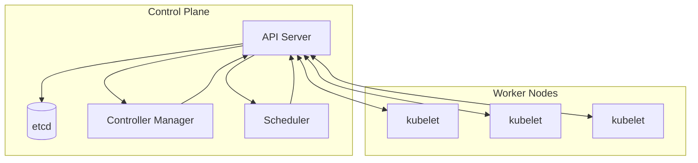
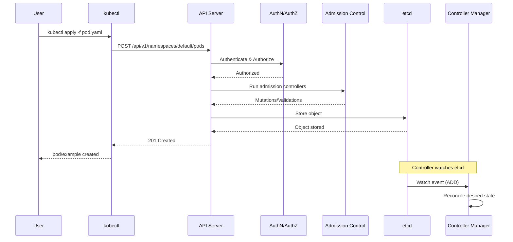
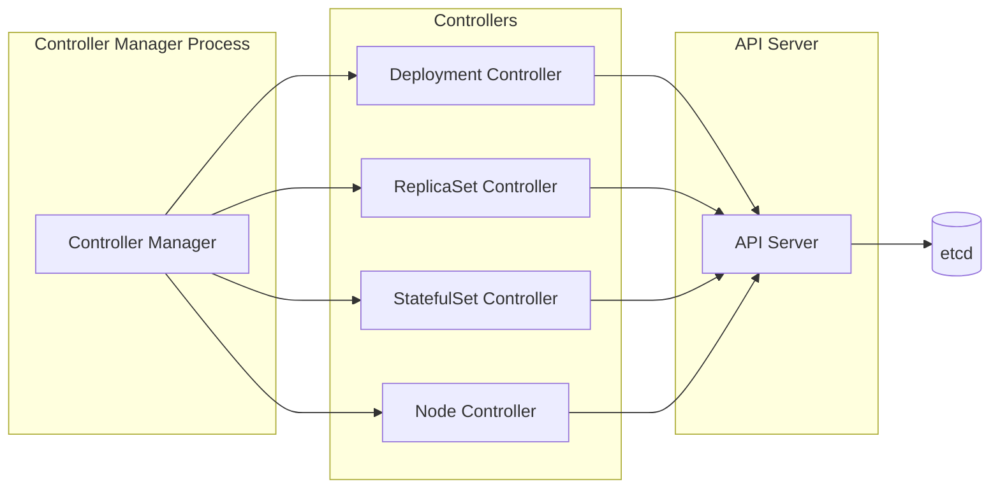

# Урок 1.1: Обзор управляющего слоя Kubernetes

**Навигация:** [Обзор модуля](../README.md) | [Следующий урок: Механизмы API →](02-api-machinery.md)

## Введение

Управляющий слой Kubernetes (control plane) — это «мозг» вашего кластера. Понимание его компонентов и того, как они взаимодействуют, критически важно для создания операторов, поскольку операторы расширяют эти же компоненты и взаимодействуют с ними.

## Теория: как устроен управляющий слой

Управляющий слой Kubernetes — это распределённая система, которая поддерживает желаемое состояние вашего кластера. В его основе лежит **декларативная модель**: вы указываете, что хотите получить (желаемое состояние), а управляющий слой приводит кластер в соответствие с этим состоянием.

### Ключевые концепции

**Декларативный подход против императивного:**
- **Декларативный**: вы описываете желаемое конечное состояние (например, «мне нужно 3 реплики»)
- **Императивный**: вы отдаёте пошаговые команды (например, «создай под, создай под, создай под»)
- Kubernetes использует декларативные API — вы объявляете, что хотите получить, а контроллеры это реализуют

**Итоговая согласованность (eventual consistency):**
- Управляющий слой работает над приведением кластера к желаемому состоянию
- Изменения могут распространяться не мгновенно
- Контроллеры непрерывно выполняют согласование, чтобы поддерживать согласованность

**Разделение ответственности (separation of concerns):**
- API Server: валидирует и хранит состояние
- etcd: обеспечивает персистентность состояния
- Контроллеры: согласовывают состояние
- Scheduler: назначает рабочие нагрузки

Понимание этих принципов помогает создавать операторы, следующие тем же паттернам.

## Компоненты управляющего слоя

Управляющий слой Kubernetes состоит из нескольких ключевых компонентов, которые совместно управляют вашим кластером:



### API Server

API Server — это центральный узел кластера Kubernetes. Всё взаимодействие проходит через него.

**Основные обязанности:**
- Валидирует и обрабатывает все запросы к API
- Служит фронтендом для etcd
- Реализует аутентификацию, авторизацию и контроль допуска (admission control)
- Обеспечивает версионирование API и обнаружение ресурсов

### etcd

etcd — это распределённое хранилище типа «ключ-значение», в котором хранится всё состояние кластера.

**Ключевые характеристики:**
- Единый источник истины о состоянии кластера
- Высокая доступность и согласованность
- Хранит все объекты Kubernetes
- Отслеживание изменений (watch) и уведомления об изменениях

### Controller Manager

Controller Manager запускает встроенные контроллеры, которые реализуют базовую функциональность Kubernetes.

**Встроенные контроллеры включают:**
- Deployment Controller
- ReplicaSet Controller
- StatefulSet Controller
- DaemonSet Controller
- Job Controller
- Namespace Controller
- Node Controller

### Scheduler

Scheduler назначает поды на узлы на основе требований к ресурсам и ограничений.

## Поток обработки запроса в API Server

Когда вы выполняете `kubectl apply`, происходит следующее:



## Архитектура Controller Manager

Controller Manager запускает несколько контроллеров, каждый из которых отслеживает определённые ресурсы:



Каждый контроллер:
1. Отслеживает определённые типы ресурсов
2. Сравнивает желаемое состояние (из spec) с фактическим состоянием
3. Предпринимает действия для устранения расхождений
4. Обновляет статус

## Практическое упражнение: исследование управляющего слоя

Давайте исследуем компоненты управляющего слоя в вашем кластере kind.

### Шаг 1: просмотр компонентов управляющего слоя

```bash
# View all pods in kube-system namespace (control plane)
kubectl get pods -n kube-system

# Get detailed information about the API server
kubectl get pods -n kube-system -l component=kube-apiserver -o yaml

# View controller manager logs
kubectl logs -n kube-system -l component=kube-controller-manager --tail=50
```

### Шаг 2: исследование API Server

```bash
# Get API server endpoints
kubectl cluster-info

# View API server configuration
kubectl get --raw /version

# Discover available API groups
kubectl api-versions
```

### Шаг 3: наблюдение за поведением контроллера

```bash
# Create a deployment
kubectl create deployment nginx --image=nginx:latest

# Watch the deployment being created
kubectl get deployment nginx -w

# In another terminal, watch ReplicaSets
kubectl get replicasets -w

# Observe how the controller creates a ReplicaSet
kubectl get replicasets -l app=nginx
```

### Шаг 4: трассировка потока запроса

```bash
# Create a pod to observe the request flow
kubectl apply -f - <<EOF
apiVersion: v1
kind: Pod
metadata:
  name: test-pod
spec:
  containers:
  - name: test
    image: nginx:latest
EOF

# Watch events to see the flow (controller actions, scheduling, etc.)
kubectl get events --sort-by='.lastTimestamp'
```

## Ключевые выводы

- **API Server** — это центральный узел взаимодействия
- **etcd** хранит всё состояние кластера
- **Controller Manager** запускает встроенные контроллеры, реализующие базовую функциональность
- **Scheduler** назначает поды на узлы
- Все компоненты взаимодействуют через API Server
- Контроллеры отслеживают ресурсы и согласовывают желаемое состояние с фактическим

## Что это значит для операторов

При создании операторов вы будете:
- Взаимодействовать с API Server для чтения/записи ресурсов
- Хранить свои пользовательские ресурсы в etcd
- Реализовывать контроллеры по тому же паттерну, что и встроенные контроллеры
- Использовать те же механизмы отслеживания (watch), что и встроенные контроллеры

## Связанная лабораторная работа

- [Лабораторная 1.1: Исследование управляющего слоя](../labs/lab-01-control-plane.md) — практические упражнения для этого урока

## Дальнейшие шаги

В следующем уроке мы глубже разберём механизмы API Kubernetes, чтобы понять, как структурированы ресурсы и как работает API.

**Навигация:** [← Обзор модуля](../README.md) | [Далее: Урок 1.2 — Механизмы API →](02-api-machinery.md)
