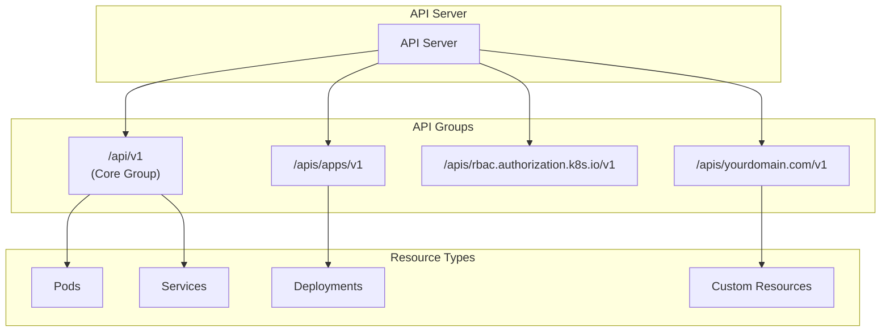
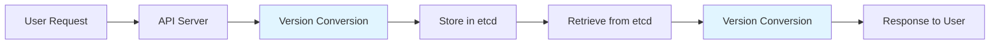
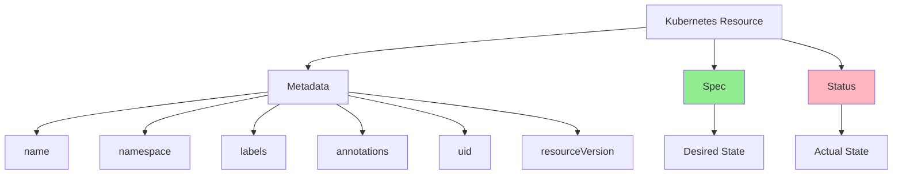
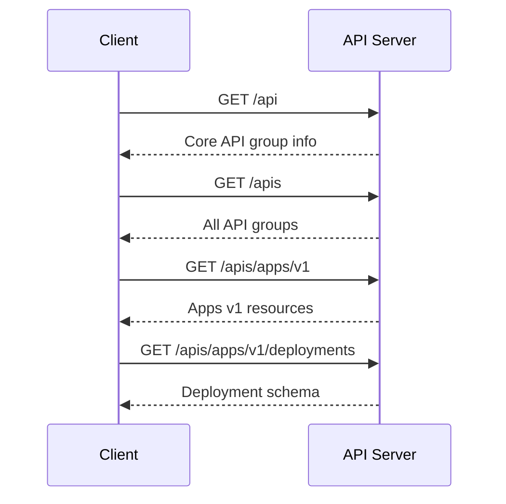
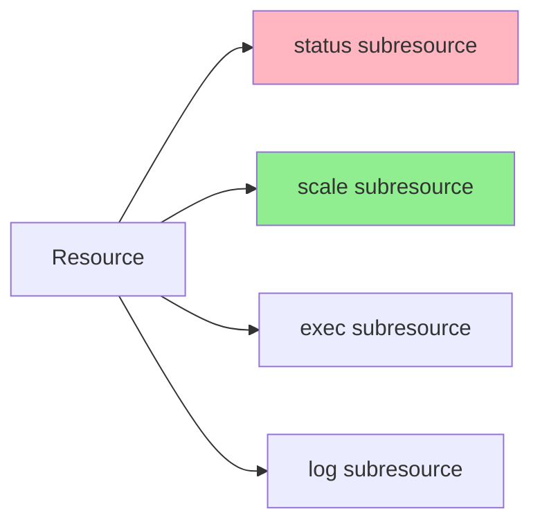
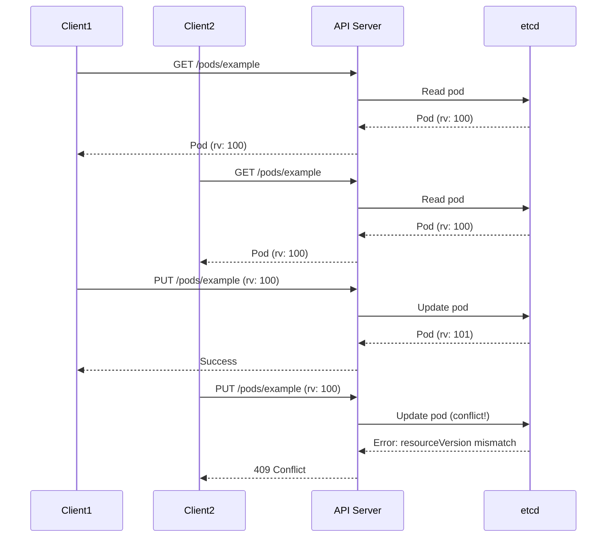

# Урок 1.2: Механизмы API Kubernetes

**Навигация:** [← Предыдущий: Управляющий слой](01-control-plane.md) | [Обзор модуля](../README.md) | [Далее: Паттерн контроллера →](03-controller-pattern.md)

## Введение

API Kubernetes построен по принципам REST и следует определённым соглашениям. Понимание этих соглашений необходимо для создания операторов, поскольку вы будете создавать ресурсы и управлять ими через этот же API.

## Теория: принципы проектирования API Kubernetes

API Kubernetes следует принципам REST, но расширяет их концепциями, специфичными для Kubernetes:

### Принципы REST
- **Ресурсы** представлены в виде URL (например, `/api/v1/namespaces/default/pods`)
- **HTTP-методы** соответствуют операциям (GET, POST, PUT, PATCH, DELETE)
- **Отсутствие состояния (stateless)** — каждый запрос содержит всю необходимую информацию
- **Единообразный интерфейс** — согласованные паттерны для всех ресурсов

### Расширения Kubernetes
- **Группы API (API Groups)** — объединяют связанные ресурсы (core, apps, rbac и т. д.)
- **Версии API (API Versions)** — поддерживают несколько версий одного ресурса
- **Подресурсы (subresources)** — status, scale, exec (расширяют поведение ресурса)
- **Watch** — долгоживущие соединения для уведомлений об изменениях
- **Селекторы полей (field selectors)** — фильтрация ресурсов по значениям полей

### Структура ресурса
Каждый ресурс Kubernetes имеет единообразную структуру:
- **apiVersion**: группа и версия API
- **kind**: тип ресурса
- **metadata**: идентификация и метки
- **spec**: желаемое состояние (задаётся пользователем)
- **status**: фактическое состояние (управляется системой)

Понимание этих принципов помогает проектировать пользовательские ресурсы (Custom Resources), которые ощущаются как «родные» для Kubernetes.

## Проектирование REST API

Kubernetes использует REST API, в котором ресурсы представлены в виде URL:

```
/api/v1/namespaces/{namespace}/pods/{name}
/api/v1/namespaces/{namespace}/services/{name}
/apps/v1/namespaces/{namespace}/deployments/{name}
```

### Структура API



## Версионирование API

Kubernetes использует три схемы версионирования:

1. **Версия API (API Version)**: версия группы API (например, `v1`, `v1beta1`)
2. **Версия ресурса (Resource Version)**: внутренняя версия для оптимистичного управления конкурентным доступом
3. **Версия объекта (Object Version)**: версия, хранящаяся в etcd



## Типы ресурсов

Ресурсы Kubernetes имеют единообразную структуру:



### Spec против Status

- **Spec**: описывает желаемое состояние (что вы хотите получить)
- **Status**: описывает фактическое состояние (что существует на самом деле)

Это разделение лежит в основе декларативной модели и паттерна согласования (reconciliation).

## Обнаружение API (API Discovery)

Kubernetes предоставляет эндпоинты для обнаружения API:



## Практическое упражнение: работа с API Kubernetes

### Шаг 1: обнаружение API

```bash
# List all API versions
kubectl api-versions

# Get API resources
kubectl api-resources

# Get detailed API resource information
kubectl api-resources -o wide

# Discover a specific API group
kubectl get --raw /apis/apps/v1
```

### Шаг 2: прямые вызовы API

```bash
# Start a proxy to access the API directly
kubectl proxy --port=8001 &

# In another terminal, make direct API calls
curl http://localhost:8001/api/v1/namespaces

# Get pods using the API
curl http://localhost:8001/api/v1/namespaces/default/pods

# Create a pod using the API
cat <<EOF | curl -X POST \
  -H "Content-Type: application/json" \
  -d @- \
  http://localhost:8001/api/v1/namespaces/default/pods
{
  "apiVersion": "v1",
  "kind": "Pod",
  "metadata": {
    "name": "api-pod",
    "namespace": "default"
  },
  "spec": {
    "containers": [{
      "name": "nginx",
      "image": "nginx:latest"
    }]
  }
}
EOF

# Verify the pod was created
kubectl get pod api-pod

# Stop the proxy
pkill -f "kubectl proxy"
```

### Шаг 3: понимание структуры ресурса

```bash
# Get a pod and examine its structure
kubectl get pod api-pod -o yaml

# Notice the structure:
# - apiVersion
# - kind
# - metadata (name, namespace, labels, etc.)
# - spec (desired state)
# - status (actual state)

# Get only the spec
kubectl get pod api-pod -o jsonpath='{.spec}'

# Get only the status
kubectl get pod api-pod -o jsonpath='{.status}'
```

### Шаг 4: группы и версии API

```bash
# See which API groups are available
kubectl get --raw /apis | jq '.groups[].name'

# Explore a specific API group
kubectl get --raw /apis/apps/v1 | jq '.'

# See what resources are in the apps/v1 group
kubectl get --raw /apis/apps/v1 | jq '.resources[].name'
```

### Шаг 5: подресурсы



У некоторых ресурсов есть подресурсы:

```bash
# create nginx deployment
kubectl create deployment nginx --image=nginx

# Scale a deployment (uses scale subresource)
kubectl scale deployment nginx --replicas=3

# Get status subresource
kubectl get deployment nginx -o jsonpath='{.status}'

# Execute into a pod (uses exec subresource)
kubectl exec -it api-pod -- /bin/sh
```

## Версия ресурса и оптимистичное управление конкурентным доступом

У каждого ресурса есть `resourceVersion`, который меняется при каждом обновлении:



Это предотвращает потерю обновлений и обеспечивает согласованность.

## Практика: версия ресурса

```bash
# Get a resource and note its resourceVersion
kubectl get pod api-pod -o jsonpath='{.metadata.resourceVersion}'

# Update the resource
kubectl label pod api-pod test=value

# Check the resourceVersion again (it changed!)
kubectl get pod api-pod -o jsonpath='{.metadata.resourceVersion}'
```

## Ключевые выводы

- API Kubernetes построен по принципам REST с единообразными шаблонами URL
- Ресурсы организованы в группы и версии API
- Каждый ресурс имеет: apiVersion, kind, metadata, spec, status
- **Spec** = желаемое состояние, **Status** = фактическое состояние
- `resourceVersion` обеспечивает оптимистичное управление конкурентным доступом
- Подресурсы расширяют функциональность ресурса (status, scale, exec и т. д.)

## Что это значит для операторов

При создании операторов:
- Ваши CRD будут следовать той же структуре API
- Вы будете использовать тот же паттерн spec/status
- Версии ресурсов помогают предотвращать конфликты
- Обнаружение API помогает клиентам понимать ваши ресурсы
- Подресурсы (например, status) полезны для ваших пользовательских ресурсов

## Связанная лабораторная работа

- [Лабораторная 1.2: Работа с API Kubernetes](../labs/lab-02-api-machinery.md) — практические упражнения для этого урока

## Источники

### Официальная документация
- [Обзор API Kubernetes](https://kubernetes.io/docs/reference/using-api/)
- [Концепции API](https://kubernetes.io/docs/reference/using-api/api-concepts/)
- [Версионирование API](https://kubernetes.io/docs/reference/using-api/api-concepts/#versioning)
- [Пользовательские ресурсы](https://kubernetes.io/docs/concepts/extend-kubernetes/api-extension/custom-resources/)

### Дополнительное чтение
- **Kubernetes in Action**, Marko Lukša — глава 3: Understanding Kubernetes API
- **Programming Kubernetes**, Michael Hausenblas и Stefan Schimanski — глубокое погружение в механизмы API
- [Справочник API Kubernetes](https://kubernetes.io/docs/reference/kubernetes-api/)

### Смежные темы
- [Версионирование ресурсов и конкурентный доступ](https://kubernetes.io/docs/reference/using-api/api-concepts/#resource-versions)
- [Селекторы полей](https://kubernetes.io/docs/concepts/overview/working-with-objects/field-selectors/)
- [Обнаружение API](https://kubernetes.io/docs/reference/using-api/api-concepts/#api-discovery)

## Дальнейшие шаги

В следующем уроке мы разберём паттерн контроллера — основу того, как работают операторы.

**Навигация:** [← Предыдущий: Управляющий слой](01-control-plane.md) | [Обзор модуля](../README.md) | [Далее: Паттерн контроллера →](03-controller-pattern.md)
