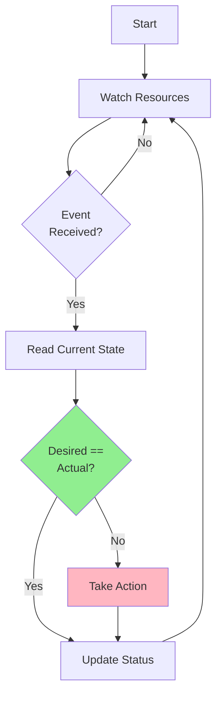
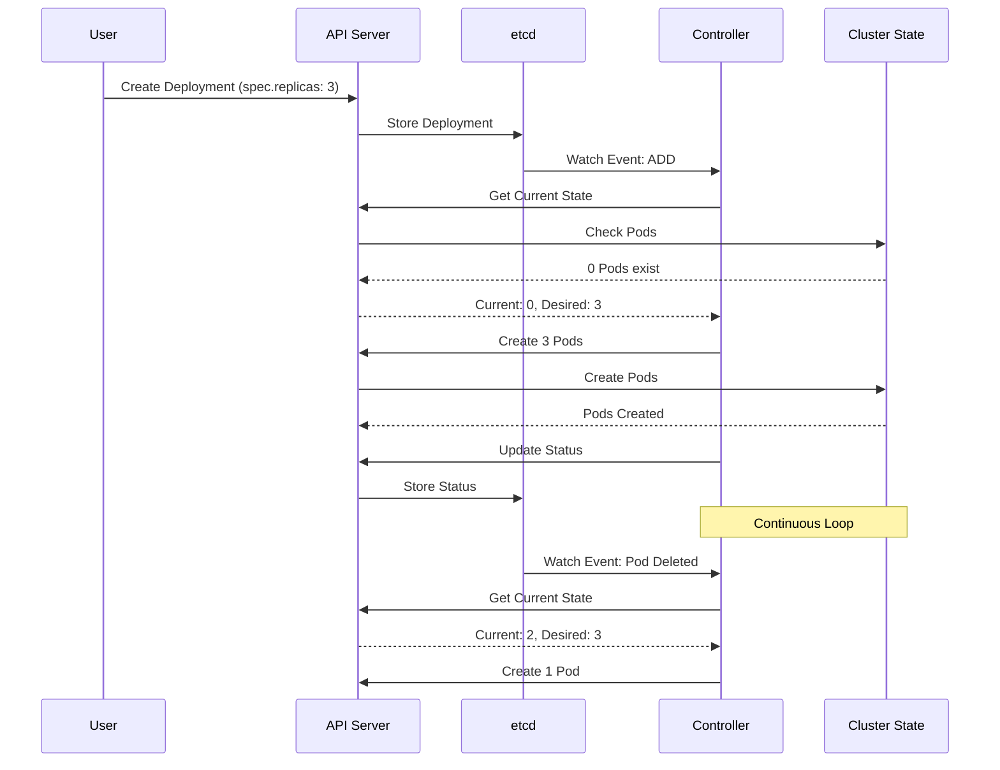
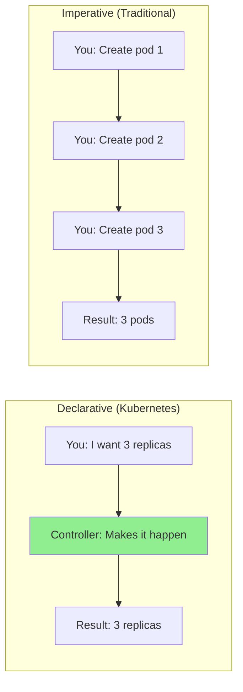
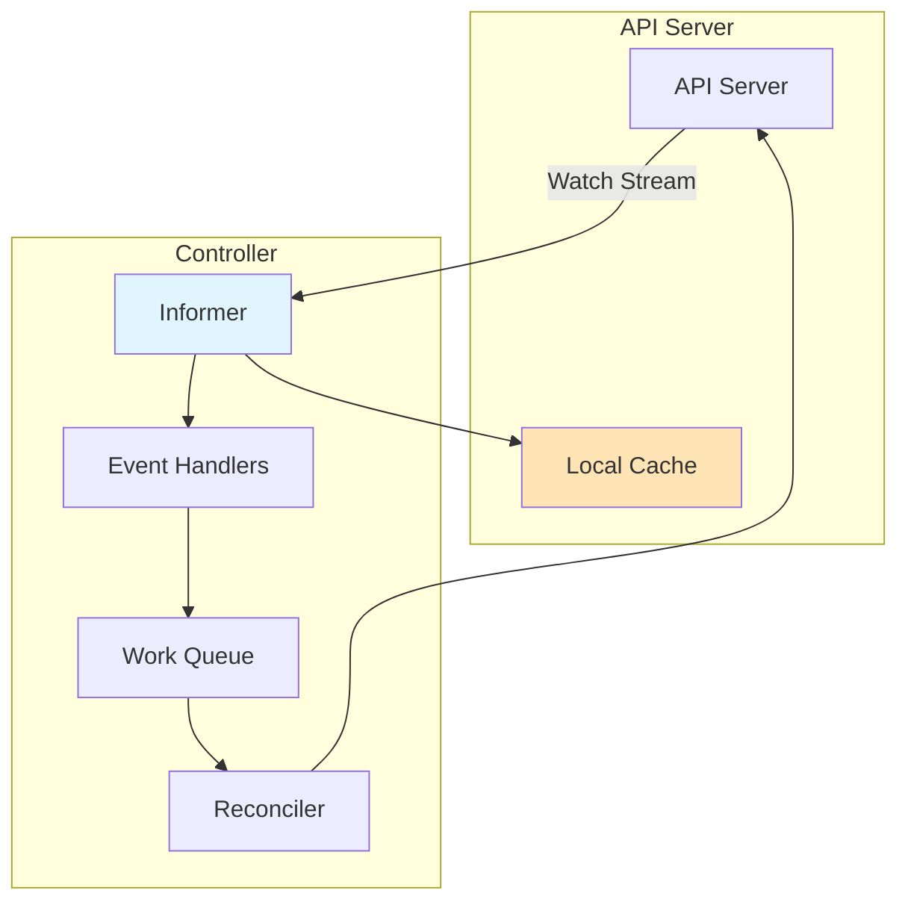
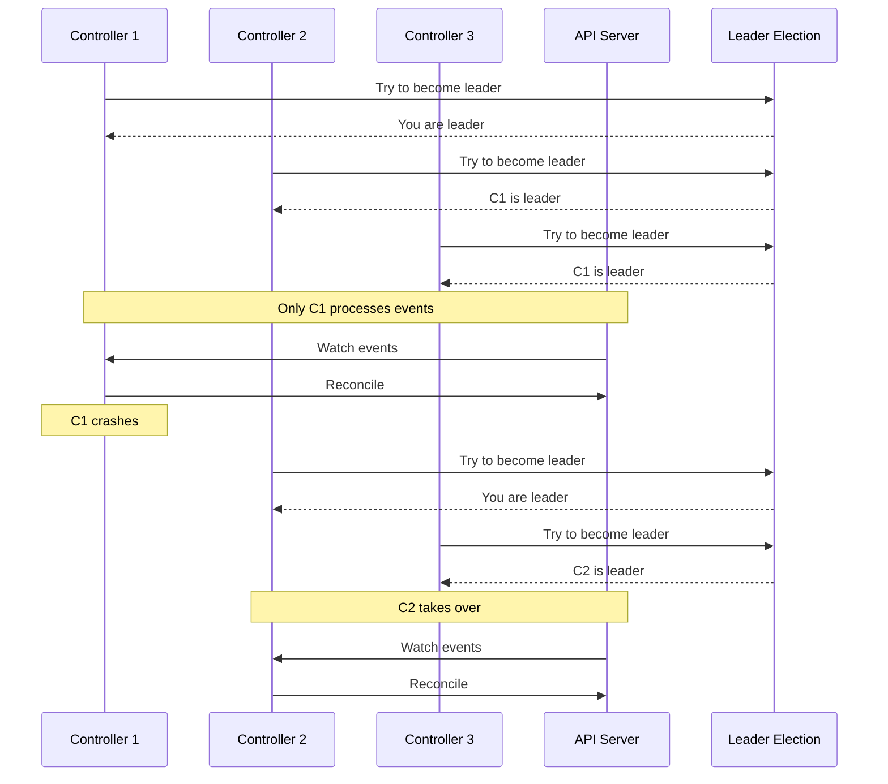
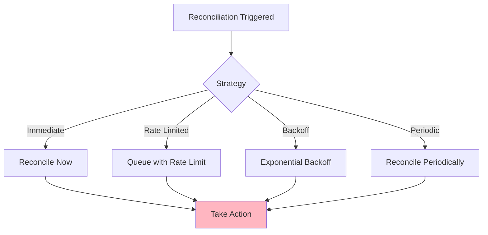
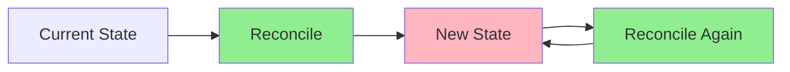

# Урок 1.3: Паттерн контроллера

**Навигация:** [← Предыдущий: Механизмы API](02-api-machinery.md) | [Обзор модуля](../README.md) | [Далее: Пользовательские ресурсы →](04-custom-resources.md)

## Введение

Паттерн контроллера — это основа Kubernetes и операторов. Понимание того, как работают контроллеры, необходимо для создания эффективных операторов. Контроллеры непрерывно отслеживают ресурсы и согласовывают желаемое состояние с фактическим.

## Теория: паттерн контроллера

Паттерн контроллера — это **реактивная модель программирования**, которая поддерживает желаемое состояние через непрерывное согласование (reconciliation).

### Основные концепции

**Цикл согласования (reconciliation loop):**
- Контроллеры непрерывно сравнивают желаемое состояние (spec) с фактическим
- При расхождении контроллеры предпринимают корректирующие действия
- Это происходит в цикле, обеспечивая итоговую согласованность

**Декларативное управление:**
- Пользователи объявляют желаемое состояние, а не способ его достижения
- Контроллеры сами определяют «как»
- Это разделяет ответственность: пользователи указывают «что», контроллеры отвечают за «как»

**Идемпотентность:**
- Контроллеры должны быть идемпотентными (безопасными для многократного запуска)
- То же желаемое состояние + то же фактическое состояние = действий не требуется
- Это обеспечивает безопасные повторы и восстановление после сбоев

**Механизм отслеживания (watch):**
- Контроллеры отслеживают ресурсы на предмет изменений
- Изменения запускают согласование
- Это эффективнее, чем опрос (polling)

### Почему этот паттерн работает

1. **Отказоустойчивость**: если контроллер падает, он возобновляет работу и выполняет согласование
2. **Масштабируемость**: контроллеры эффективно обрабатывают множество ресурсов
3. **Согласованность**: непрерывное согласование гарантирует соответствие состояния желаемому
4. **Расширяемость**: вы можете добавлять новые контроллеры для новых ресурсов

Понимание этого паттерна критично для создания операторов, поскольку операторы — это контроллеры, управляющие пользовательскими ресурсами (Custom Resources).

## Что такое контроллер?

Контроллер — это цикл управления (control loop), который:
1. Отслеживает ресурсы
2. Сравнивает желаемое состояние (spec) с фактическим
3. Предпринимает действия, чтобы фактическое состояние соответствовало желаемому
4. Обновляет статус



## Цикл управления и согласование

Цикл согласования — это сердце контроллера:



## Декларативный подход против императивного

Kubernetes использует **декларативную** модель:



**Декларативный**: вы описываете, что хотите получить, а система сама определяет, как этого достичь.  
**Императивный**: вы точно указываете, какие действия предпринять.

## Механизмы отслеживания и информеры (informers)

Контроллеры используют **отслеживание (watch)**, чтобы получать уведомления об изменениях:



### Как работает отслеживание

1. **Начальный список (List)**: контроллер получает список всех ресурсов
2. **Поток изменений (Watch Stream)**: API Server передаёт события изменений
3. **Локальный кеш**: контроллер поддерживает локальный кеш
4. **Обработчики событий**: обрабатывают события и ставят работу в очередь
5. **Согласование**: обработка элементов из очереди

## Выбор лидера (Leader Election)

В конфигурациях с высокой доступностью запускается несколько реплик контроллера, но активна только одна:



## Практическое упражнение: наблюдение за контроллерами в действии

### Шаг 1: создайте Deployment и понаблюдайте

```bash
# Create a deployment
kubectl create deployment nginx --image=nginx:latest --replicas=3

# Immediately watch what happens
kubectl get deployment nginx -w

# In another terminal, watch ReplicaSets
kubectl get replicasets -w

# In another terminal, watch Pods
kubectl get pods -w
```

**Что вы увидите:**
1. Создаётся Deployment
2. Deployment controller создаёт ReplicaSet
3. ReplicaSet controller создаёт поды
4. Статус обновляется по мере создания ресурсов

### Шаг 2: наблюдайте за согласованием

```bash
# Delete a pod manually
kubectl delete pod -l app=nginx

# Watch the ReplicaSet controller recreate it
kubectl get pods -w

# The controller noticed the discrepancy and fixed it!
```

### Шаг 3: измените желаемое состояние

```bash
# Scale the deployment
kubectl scale deployment nginx --replicas=5

# Watch the controller create new pods
kubectl get pods -w

# The controller reconciled: desired (5) vs actual (3) → created 2 more
```

### Шаг 4: просмотрите логи контроллера

```bash
# View controller manager logs to see reconciliation
kubectl logs -n kube-system -l component=kube-controller-manager --tail=100 | grep nginx
```

### Шаг 5: разберитесь в цикле управления

```bash
# Get the deployment
kubectl get deployment nginx -o yaml

# Notice:
# - spec.replicas: 5 (desired state)
# - status.replicas: 5 (actual state)
# - status.readyReplicas: 5 (ready pods)

# The controller continuously ensures these match
```

## Стратегии согласования

Контроллеры используют разные стратегии согласования:



### Стратегии повторной постановки в очередь (requeue)

Когда согласование нужно выполнить снова:

- **Немедленно (Immediate)**: повторить сразу (при ошибках)
- **Через интервал (After Duration)**: повторить после задержки (для повторных попыток)
- **Никогда (Never)**: не повторять (успех)

## Идемпотентность

Контроллеры должны быть **идемпотентными** — многократный запуск одного и того же согласования должен давать один и тот же результат:



**Пример**: если под уже существует, повторное его создание должно быть no-op (без действий), а не создавать дубликат.

## Практика: проверка идемпотентности

```bash
# Apply the same deployment multiple times
kubectl apply -f - <<EOF
apiVersion: apps/v1
kind: Deployment
metadata:
  name: test-deployment
spec:
  replicas: 2
  selector:
    matchLabels:
      app: test
  template:
    metadata:
      labels:
        app: test
    spec:
      containers:
      - name: nginx
        image: nginx:latest
EOF

# Apply it again (should be idempotent)
kubectl apply -f - <<EOF
apiVersion: apps/v1
kind: Deployment
metadata:
  name: test-deployment
spec:
  replicas: 2
  selector:
    matchLabels:
      app: test
  template:
    metadata:
      labels:
        app: test
    spec:
      containers:
      - name: nginx
        image: nginx:latest
EOF

# Check - should still have 2 replicas, not 4
kubectl get deployment test-deployment
kubectl get pods -l app=test
```

## Ключевые выводы

- Контроллеры реализуют **циклы управления (control loops)**, которые непрерывно согласовывают состояние
- **Согласование** = приведение фактического состояния в соответствие с желаемым
- Контроллеры используют **отслеживание/информеры (watches/informers)** для получения уведомлений об изменениях
- **Декларативная модель**: описывайте, что вы хотите, а не как это сделать
- Контроллеры должны быть **идемпотентными**
- **Выбор лидера (leader election)** гарантирует, что активен только один экземпляр контроллера
- Контроллеры обновляют **статус**, отражая фактическое состояние

## Что это значит для операторов

При создании операторов:
- Вы реализуете тот же паттерн контроллера
- Ваш реконсайлер будет сравнивать spec и status
- Вы будете использовать информеры для отслеживания своих пользовательских ресурсов
- Вам нужно будет обеспечивать идемпотентность
- Вы реализуете выбор лидера для высокой доступности (HA)
- Вы будете обновлять статус, отражая прогресс

## Связанная лабораторная работа

- [Лабораторная 1.3: Наблюдение за контроллерами в действии](../labs/lab-03-controller-pattern.md) — практические упражнения для этого урока

## Источники

### Официальная документация
- [Контроллеры Kubernetes](https://kubernetes.io/docs/concepts/architecture/controller/)
- [Клиентские библиотеки](https://kubernetes.io/docs/reference/using-api/client-libraries/)
- [Паттерн информера](https://github.com/kubernetes/client-go/blob/master/examples/workqueue/main.go)

### Дополнительное чтение
- **Kubernetes: Up and Running**, Kelsey Hightower, Brendan Burns и Joe Beda — глава 4: Common kubectl Commands (концепции контроллеров)
- **Programming Kubernetes**, Michael Hausenblas и Stefan Schimanski — глава 2: The Kubernetes API
- [Паттерн контроллера Kubernetes](https://kubernetes.io/docs/concepts/architecture/controller/)

### Смежные темы
- [Согласование в Kubernetes](https://kubernetes.io/docs/concepts/architecture/controller/#reconciliation)
- [Механизм отслеживания (Watch)](https://kubernetes.io/docs/reference/using-api/api-concepts/#efficient-detection-of-changes)
- [Паттерн Informer и Workqueue](https://github.com/kubernetes/community/blob/master/contributors/devel/sig-api-machinery/controllers.md)

## Дальнейшие шаги

В следующем уроке мы изучим пользовательские ресурсы (Custom Resources) и CRD — основу для создания операторов.

**Навигация:** [← Предыдущий: Механизмы API](02-api-machinery.md) | [Обзор модуля](../README.md) | [Далее: Пользовательские ресурсы →](04-custom-resources.md)
