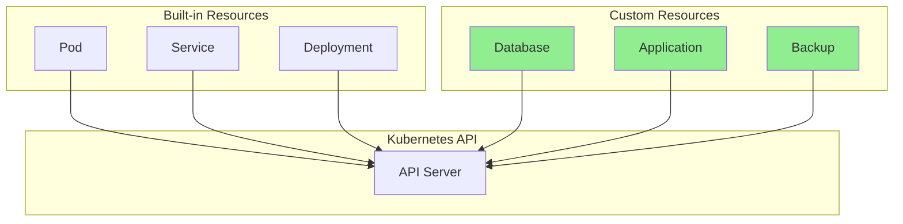
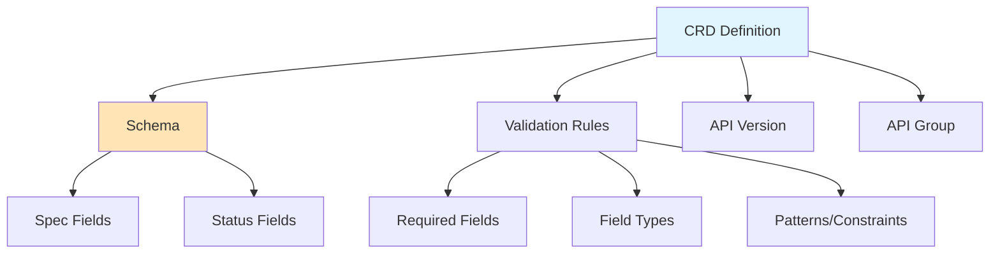
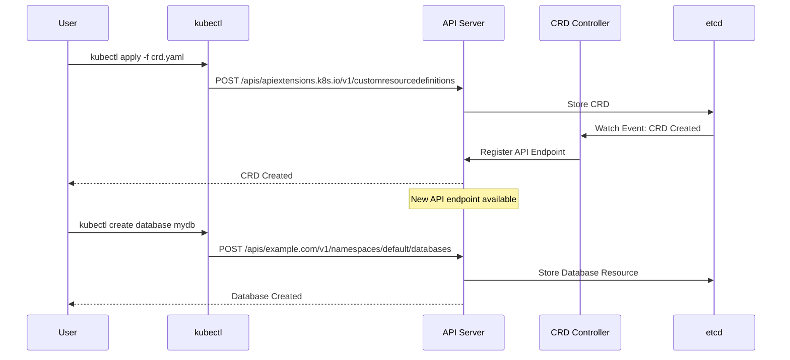
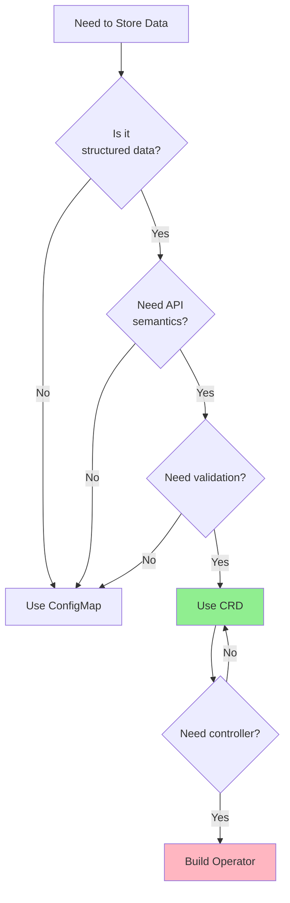
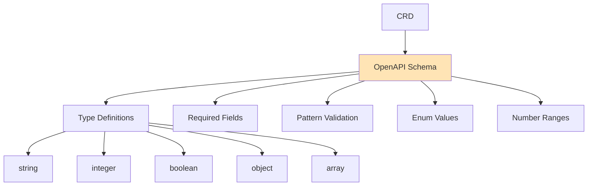
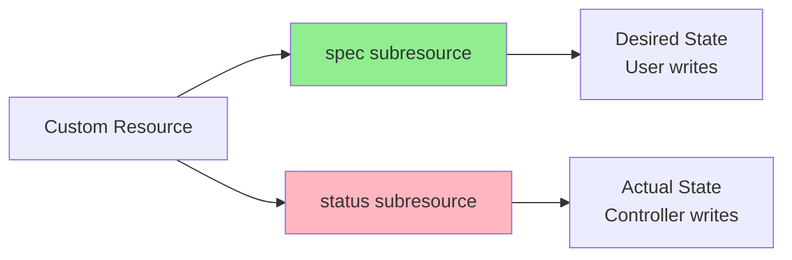
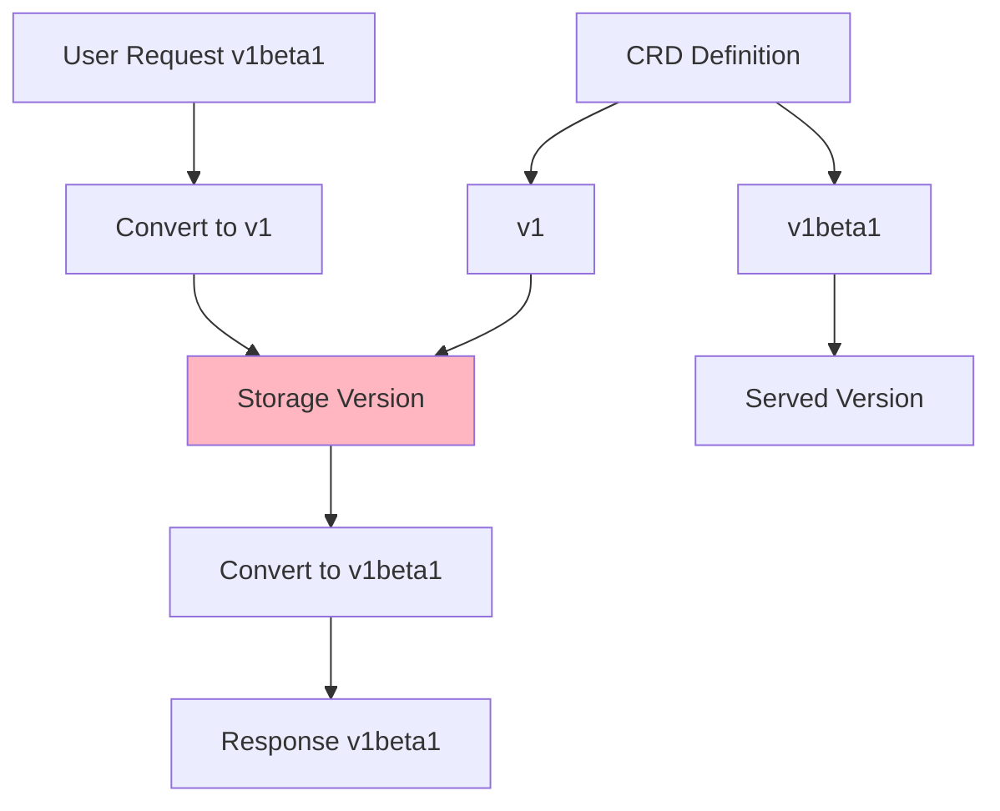

# Урок 1.4: Пользовательские ресурсы

**Навигация:** [← Предыдущий: Паттерн контроллера](03-controller-pattern.md) | [Обзор модуля](../README.md)

## Введение

Пользовательские ресурсы (Custom Resources) расширяют Kubernetes объектами, специфичными для предметной области. Определения пользовательских ресурсов (CRD) задают схему для этих ресурсов. Понимание CRD необходимо для создания операторов, поскольку операторы управляют пользовательскими ресурсами.

## Теория: пользовательские ресурсы и расширяемость

Пользовательские ресурсы расширяют Kubernetes типами, специфичными для предметной области, позволяя моделировать концепции вашего приложения как полноценные объекты Kubernetes.

### Основные концепции

**Определение пользовательского ресурса (Custom Resource Definition, CRD):**
- Определяет новый тип ресурса в Kubernetes
- Похоже на «схему» для вашего пользовательского ресурса
- Регистрируется в API-сервере
- Обеспечивает валидацию и значения по умолчанию

**Пользовательский ресурс (Custom Resource, CR):**
- Экземпляр CRD
- Хранится в etcd, как и встроенные ресурсы
- Может иметь spec и status
- Управляется контроллерами (операторами)

**Почему CRD важны:**
- **Моделирование предметной области**: естественное представление концепций приложения
- **Согласованность API**: используются те же паттерны, что и для встроенных ресурсов
- **Совместимость с инструментами**: работает с kubectl, дашбордами и т. д.
- **Интеграция с контроллерами**: обеспечивает паттерн оператора

### Когда использовать CRD

**Используйте CRD, когда:**
- Нужно смоделировать концепции, специфичные для предметной области
- Нужны Kubernetes-нативные API
- Требуется управление жизненным циклом
- Хотите задействовать инструментарий Kubernetes

**Не используйте CRD, когда:**
- Простая конфигурация (используйте ConfigMap)
- Временные данные (используйте аннотации)
- Управление жизненным циклом не нужно (используйте метки/аннотации)

Понимание CRD необходимо для создания операторов, поскольку операторы управляют пользовательскими ресурсами.

## Что такое пользовательские ресурсы?

Пользовательские ресурсы — это расширения API Kubernetes, которые хранят структурированные данные. Они следуют тем же паттернам, что и встроенные ресурсы, но определяются вами.



## Определения пользовательских ресурсов (CRD)

CRD определяет:
- Имя ресурса и группу API
- Схему (структуру) ресурса
- Правила валидации
- Подресурсы (например, status)



## Структура CRD

CRD имеет определённую структуру:

```yaml
apiVersion: apiextensions.k8s.io/v1
kind: CustomResourceDefinition
metadata:
  name: databases.example.com
spec:
  group: example.com
  versions:
  - name: v1
    served: true
    storage: true
    schema:
      openAPIV3Schema:
        type: object
        properties:
          spec:
            type: object
            properties:
              image:
                type: string
              replicas:
                type: integer
          status:
            type: object
  scope: Namespaced
  names:
    plural: databases
    singular: database
    kind: Database
```

## Процесс регистрации CRD

Когда вы создаёте CRD, происходит следующее:



## Когда использовать CRD, а когда ConfigMap



**Используйте ConfigMap, когда:**
- Простые данные «ключ-значение»
- Валидация не нужна
- Семантика API не требуется

**Используйте CRD, когда:**
- Структурированные данные со схемой
- Требуется валидация
- Нужна семантика API
- Вы создаёте оператор

## Схема CRD и валидация

CRD используют схему OpenAPI v3 для валидации:



## Подресурс status

CRD могут иметь подресурс status, разделяющий spec (желаемое состояние) и status (фактическое):



Преимущества:
- Пользователи не могут случайно изменить status
- Обновления status не запускают валидацию spec
- Чёткое разделение ответственности

## Практическое упражнение: создание вашего первого CRD

### Шаг 1: создайте простой CRD

```bash
# Create a CRD for a simple "Website" resource
cat <<EOF | kubectl apply -f -
apiVersion: apiextensions.k8s.io/v1
kind: CustomResourceDefinition
metadata:
  name: websites.example.com
spec:
  group: example.com
  versions:
  - name: v1
    served: true
    storage: true
    schema:
      openAPIV3Schema:
        type: object
        properties:
          spec:
            type: object
            properties:
              url:
                type: string
                pattern: '^https?://'
              replicas:
                type: integer
                minimum: 1
                maximum: 10
            required:
            - url
            - replicas
          status:
            type: object
            properties:
              phase:
                type: string
                enum: [Pending, Running, Failed]
              readyReplicas:
                type: integer
  scope: Namespaced
  names:
    plural: websites
    singular: website
    kind: Website
    shortNames:
    - ws
EOF

# Verify the CRD was created
kubectl get crd websites.example.com

# Check the API endpoint is available
kubectl api-resources | grep websites
```

### Шаг 2: создайте пользовательский ресурс

```bash
# Create a Website resource
cat <<EOF | kubectl apply -f -
apiVersion: example.com/v1
kind: Website
metadata:
  name: my-website
spec:
  url: https://example.com
  replicas: 3
EOF

# Verify it was created
kubectl get websites
kubectl get website my-website
kubectl get ws my-website  # Using short name

# View the full resource
kubectl get website my-website -o yaml
```

### Шаг 3: проверьте валидацию

```bash
# Try to create an invalid resource (missing required field)
cat <<EOF | kubectl apply -f -
apiVersion: example.com/v1
kind: Website
metadata:
  name: invalid-website
spec:
  url: https://example.com
  # Missing replicas field
EOF

# You should see a validation error

# Try invalid URL pattern
cat <<EOF | kubectl apply -f -
apiVersion: example.com/v1
kind: Website
metadata:
  name: invalid-url
spec:
  url: not-a-url
  replicas: 2
EOF

# You should see a validation error about the URL pattern

# Try invalid replica count
cat <<EOF | kubectl apply -f -
apiVersion: example.com/v1
kind: Website
metadata:
  name: invalid-replicas
spec:
  url: https://example.com
  replicas: 20  # Exceeds maximum
EOF

# You should see a validation error
```

### Шаг 4: обновите status

```bash
# Update the status (if status subresource is enabled)
# Note: This requires a controller, but we can see the structure
kubectl get website my-website -o yaml

# The status field exists but is empty
# In a real operator, the controller would update this
```

### Шаг 5: исследуйте детали CRD

```bash
# Get detailed CRD information
kubectl get crd websites.example.com -o yaml

# See the schema
kubectl get crd websites.example.com -o jsonpath='{.spec.versions[0].schema}'

# Check API discovery
kubectl get --raw /apis/example.com/v1
```

### Шаг 6: очистка

```bash
# Delete the custom resources
kubectl delete website my-website

# Delete the CRD (this will also delete all resources of this type)
kubectl delete crd websites.example.com
```

## Версионирование CRD

CRD поддерживают несколько версий с конвертацией:



## Ключевые выводы

- **Пользовательские ресурсы** расширяют Kubernetes объектами, специфичными для предметной области
- **CRD** определяют схему и валидацию для пользовательских ресурсов
- CRD используют **схему OpenAPI v3** для валидации
- **Подресурс status** отделяет желаемое состояние (spec) от фактического (status)
- CRD предоставляют **семантику API** (GET, POST, PUT, DELETE, WATCH)
- Используйте CRD, когда нужны структурированные данные с валидацией
- CRD — это основа для создания операторов

## Что это значит для операторов

При создании операторов:
- Вы будете создавать CRD для объектов вашей предметной области
- Ваш оператор будет отслеживать и согласовывать пользовательские ресурсы
- Вы будете использовать spec для желаемого состояния, status — для фактического
- Валидация в схеме CRD предотвращает создание некорректных ресурсов
- CRD обеспечивают декларативное управление вашими приложениями

## Связанная лабораторная работа

- [Лабораторная 1.4: Создание вашего первого CRD](../labs/lab-04-custom-resources.md) — практические упражнения для этого урока

## Источники

### Официальная документация
- [Пользовательские ресурсы](https://kubernetes.io/docs/concepts/extend-kubernetes/api-extension/custom-resources/)
- [Определения пользовательских ресурсов](https://kubernetes.io/docs/tasks/extend-kubernetes/custom-resources/custom-resource-definitions/)
- [Паттерны расширения API](https://kubernetes.io/docs/concepts/extend-kubernetes/api-extension/)

### Дополнительное чтение
- **Kubernetes: Up and Running**, Kelsey Hightower, Brendan Burns и Joe Beda — глава 15: Extending Kubernetes
- **Programming Kubernetes**, Michael Hausenblas и Stefan Schimanski — глава 3: Custom Resources
- [Руководство по расширению API Kubernetes](https://kubernetes.io/docs/concepts/extend-kubernetes/)

### Смежные темы
- [Лучшие практики CRD](https://kubernetes.io/docs/tasks/extend-kubernetes/custom-resources/custom-resource-definitions/#best-practices)
- [Версионирование API](https://kubernetes.io/docs/concepts/extend-kubernetes/api-extension/custom-resources/#api-versioning)
- [Схема OpenAPI](https://kubernetes.io/docs/tasks/extend-kubernetes/custom-resources/custom-resource-definitions/#specifying-a-structural-schema)

## Дальнейшие шаги

Поздравляем! Вы завершили Модуль 1. Теперь вы понимаете:
- Архитектуру управляющего слоя Kubernetes
- Механизмы API и структуру ресурсов
- Паттерн контроллера и согласование
- Пользовательские ресурсы и CRD

В [Модуле 2](../../module-02/README.md) вы создадите свой первый оператор с помощью Kubebuilder!

**Навигация:** [← Предыдущий: Паттерн контроллера](03-controller-pattern.md) | [Обзор модуля](../README.md) | [Далее: Модуль 2 →](../../module-02/README.md)
