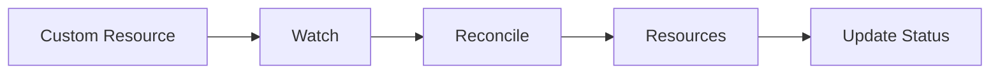
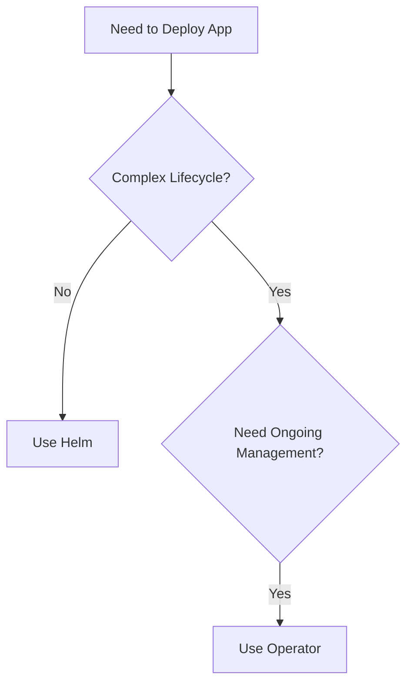

# Лабораторная 2.1: Исследование существующих операторов

**Связанный урок:** [Урок 2.1: Паттерн оператора](../lessons/01-operator-pattern.md)  
**Навигация:** [Обзор модуля](../README.md) | [Следующая лабораторная: Основы Kubebuilder →](lab-02-kubebuilder-fundamentals.md)

## Цели

- Исследовать существующие операторы в экосистеме Kubernetes
- Понять структуру и поведение оператора
- Сравнить развёртывание через оператор и через Helm
- Определить сценарии использования операторов

## Предварительные требования

- Запущенный кластер kind
- Настроенный kubectl
- Понимание CRD из [Модуля 1](../module-01/README.md)

## Упражнение 1: изучение OperatorHub

### Задача 1.1: просмотрите OperatorHub

1. Зайдите на [OperatorHub.io](https://operatorhub.io/)
2. Просмотрите доступные операторы
3. Найдите знакомые вам операторы (Prometheus, PostgreSQL и т. д.)

**Вопросы для ответа:**
1. Какие категории операторов существуют?
2. Какие популярные операторы есть?
3. Какие проблемы они решают?

### Задача 1.2: изучите структуру оператора

Выберите оператор (например, Prometheus Operator) и изучите:

```bash
# Search for operator documentation
# Look at:
# - CRD definitions
# - Operator capabilities
# - Use cases
```

## Упражнение 2: установка и исследование оператора

### Задача 2.1: установите Prometheus Operator (опционально)

Если вы хотите исследовать реальный оператор:

```bash
# Install using Helm (for exploration)
helm repo add prometheus-community https://prometheus-community.github.io/helm-charts
helm repo update

# Install Prometheus Operator
helm install prometheus prometheus-community/kube-prometheus-stack
```

**Примечание:** это только для ознакомления. Собственные операторы мы будем создавать в этом курсе.

### Задача 2.2: изучите ресурсы оператора

```bash
# List CRDs created by operator
kubectl get crds | grep prometheus

# Examine a CRD
kubectl get crd prometheuses.monitoring.coreos.com -o yaml | head -50

# See operator deployment
kubectl get deployments -n default | grep prometheus
```

## Упражнение 3: сравнение оператора и Helm

### Задача 3.1: разберитесь в различии

**Развёртывание через Helm:**
```bash
# Helm installs once
helm install my-app ./chart
# No ongoing management
```

**Развёртывание через оператор:**
```bash
# Operator continuously manages
kubectl apply -f custom-resource.yaml
# Operator reconciles continuously
```

### Задача 3.2: определите сценарии использования

Для каждого сценария решите: оператор или Helm?

1. **Развёртывание простого веб-приложения**
   - Ответ: Helm (разовая настройка)

2. **База данных PostgreSQL с резервным копированием**
   - Ответ: оператор (сложный жизненный цикл)

3. **Кластер кеша Redis**
   - Ответ: оператор (stateful, требует управления)

4. **Статический сайт**
   - Ответ: Helm (простое развёртывание)

## Упражнение 4: анализ паттернов операторов

### Задача 4.1: компоненты оператора

На основе изученного в [Модуле 1](../module-01/README.md), операторы имеют:

1. **CRD** — определение пользовательского ресурса
2. **Контроллер** — логика согласования
3. **RBAC** — разрешения

```bash
# If you installed an operator, examine these:
kubectl get crds
kubectl get deployments
kubectl get clusterroles | grep <operator-name>
```

### Задача 4.2: паттерн согласования

Операторы следуют тому же паттерну, который вы изучили:



Это тот же паттерн из [Урока 1.3](../../module-01/lessons/03-controller-pattern.md)!

## Упражнение 5: уровни зрелости операторов

### Задача 5.1: определите уровни зрелости

Для каждого исследованного оператора определите его уровень зрелости:

- **Уровень 1**: базовая установка
- **Уровень 2**: бесшовные обновления
- **Уровень 3**: полный жизненный цикл
- **Уровень 4**: глубокая аналитика
- **Уровень 5**: автопилот

### Задача 5.2: задокументируйте выводы

Составьте простое сравнение:

| Оператор | Уровень зрелости | Ключевые возможности |
|----------|-----------------|--------------|
| Example  | Уровень 3       | Резервное копирование, восстановление |

## Упражнение 6: когда создавать оператор

### Задача 6.1: дерево решений

Используйте дерево решений из урока:



### Задача 6.2: ваши сценарии использования

Подумайте о приложениях, которыми вы управляете. Какие из них выиграли бы от операторов?

**Примеры:**
- База данных с автоматическим резервным копированием → оператор
- Простой API-сервис → Helm
- Кластер очереди сообщений → оператор

## Очистка

Если вы устанавливали операторы для ознакомления:

```bash
# Remove Helm releases
helm list
helm uninstall <release-name>

# Remove CRDs
kubectl delete crd --all
```

## Итоги лабораторной

В этой лабораторной вы:
- Исследовали существующие операторы в экосистеме
- Разобрались в структуре и компонентах оператора
- Сравнили операторы и Helm-чарты
- Определили, когда использовать операторы
- Проанализировали уровни зрелости операторов

## Ключевые уроки

1. Операторы — это контроллеры, которые управляют пользовательскими ресурсами
2. Операторы кодируют знания предметной области для управления приложениями
3. Используйте операторы для сложных stateful-приложений
4. Операторы следуют тому же паттерну согласования, что и встроенные контроллеры
5. Операторы обеспечивают непрерывное управление, а не разовое развёртывание

## Дальнейшие шаги

Теперь, когда вы понимаете, что такое операторы, давайте изучим Kubebuilder — инструмент, который мы будем использовать для их создания!

**Навигация:** [← Обзор модуля](../README.md) | [Связанный урок](../lessons/01-operator-pattern.md) | [Следующая лабораторная: Основы Kubebuilder →](lab-02-kubebuilder-fundamentals.md)
