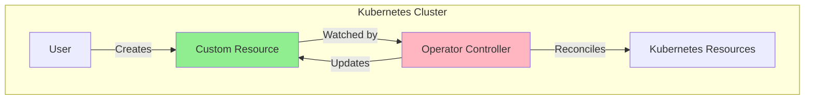
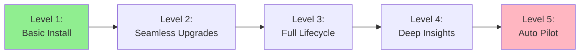
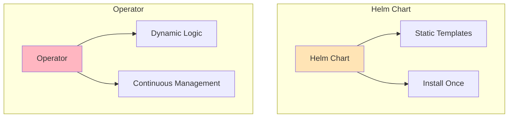
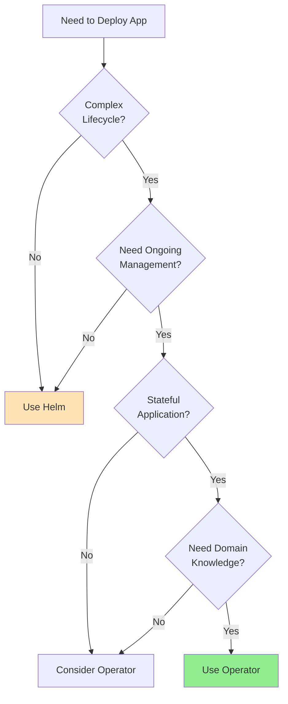
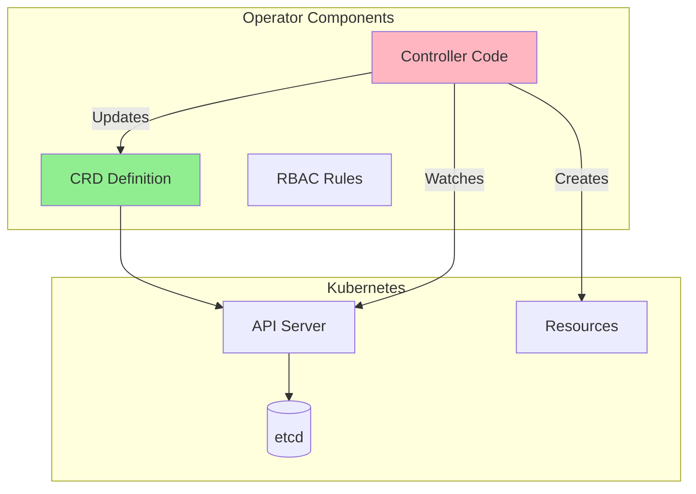
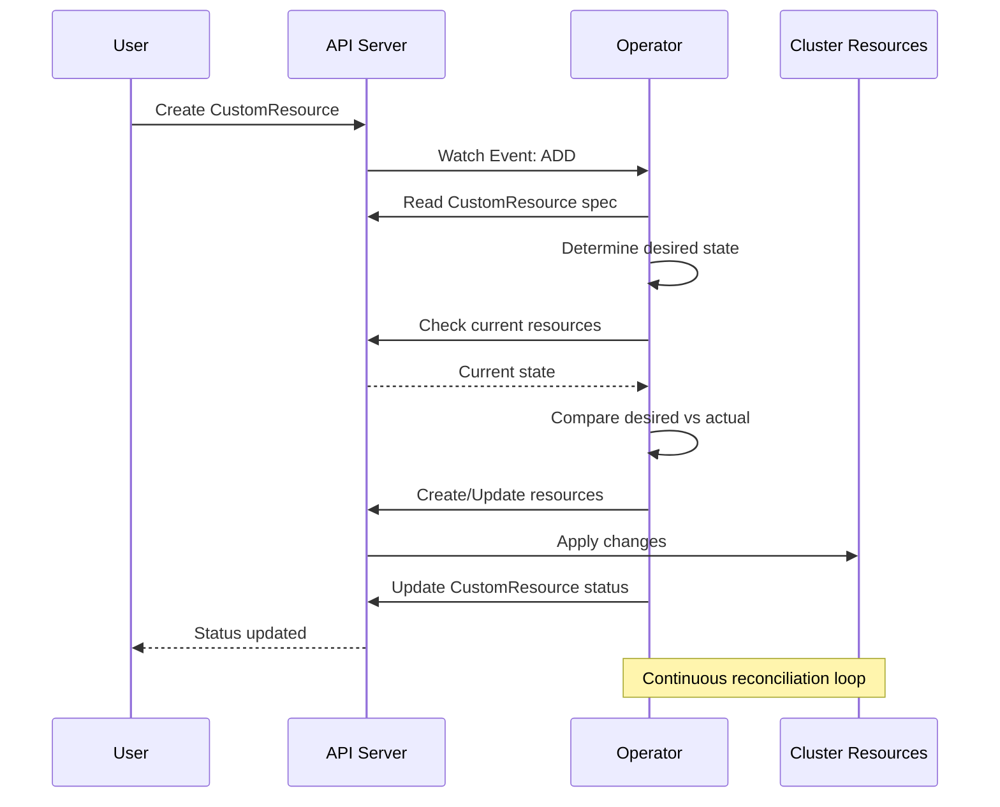

# Урок 2.1: Паттерн оператора

**Навигация:** [Обзор модуля](../README.md) | [Следующий урок: Основы Kubebuilder →](02-kubebuilder-fundamentals.md)

## Введение

В [Модуле 1](../module-01/README.md) вы изучили контроллеры Kubernetes, пользовательские ресурсы (Custom Resources) и паттерн согласования (reconciliation). Операторы — это контроллеры, которые управляют пользовательскими ресурсами, используя знания предметной области. Этот урок объясняет, что такое операторы, когда их использовать и чем они отличаются от других инструментов Kubernetes.

## Теория: паттерн оператора

Операторы — это паттерн для упаковки, развёртывания и управления приложениями Kubernetes с помощью пользовательских ресурсов и контроллеров. Они расширяют Kubernetes, кодируя **операционные знания** в программное обеспечение, и следуют паттерну контроллера, добавляя при этом интеллект, специфичный для предметной области.

### Основная философия

**Операционные знания как код:**
- Операторы кодируют, как развёртывать, конфигурировать приложения и управлять ими
- Эти знания фиксируются в коде, а не в документации
- Делают операции повторяемыми и согласованными
- Знания предметной области встроены в логику контроллера

**Самообслуживание через автоматизацию:**
- Пользователи объявляют, что им нужно (пользовательский ресурс)
- Оператор берёт на себя сложность (развёртывание, масштабирование, резервное копирование и т. д.)
- Снижает операционную нагрузку на пользователей
- Следует декларативной модели Kubernetes

**Kubernetes-нативность:**
- Операторы используют API и паттерны Kubernetes
- Ощущаются как встроенные возможности Kubernetes
- Интегрируются с существующим инструментарием (kubectl, Helm и т. д.)

### Почему операторы важны

- **Автоматизация**: сокращает ручные операционные задачи
- **Согласованность**: обеспечивает корректное состояние приложения
- **Экспертиза**: кодирует лучшие практики
- **Управление жизненным циклом**: обрабатывает полный жизненный цикл приложения (установка, обновления, резервное копирование, масштабирование)

### Уровни зрелости операторов (Capability Levels)

Модель зрелости операторов (Operator Capability Model, уровни 1–5) помогает понять степень их развитости:
- **Уровни 1–2**: базовое развёртывание и обновления
- **Уровень 3**: полное управление жизненным циклом
- **Уровни 4–5**: продвинутая автоматизация и самовосстановление

Большинство продакшен-операторов стремятся к уровню 3+, обеспечивая комплексное управление жизненным циклом.

### Когда использовать операторы

**Хорошие сценарии использования:**
- Сложные stateful-приложения (базы данных, очереди сообщений)
- Приложения, требующие знаний предметной области
- Приложения, которым нужно управление жизненным циклом (резервное копирование, восстановление, обновление)
- Приложения, требующие координации нескольких ресурсов
- Потребность в непрерывном управлении и мониторинге

**Не идеальны для:**
- Простых stateless-приложений (используйте Deployment)
- Одноразовых задач (используйте Job)
- Простой конфигурации (используйте ConfigMap)
- Статического контента (используйте Deployment + ConfigMap)

### Оператор против других инструментов

**Операторы против Helm:**
- Helm: менеджер пакетов, шаблонизация, установка
- Операторы: управление жизненным циклом, автоматизация, интеллект
- Часто используются вместе: Helm устанавливает, оператор управляет

**Операторы против ConfigMap:**
- ConfigMap: статическая конфигурация
- Операторы: динамическое, интеллектуальное управление

Понимание того, когда использовать операторы, помогает принимать правильные архитектурные решения.

## Что такое оператор?

Оператор — это контроллер Kubernetes, который:
- Управляет определёнными вами пользовательскими ресурсами (CRD)
- Кодирует операционные знания (как развёртывать, масштабировать, делать резервные копии и т. д.)
- Автоматизирует сложные задачи управления приложениями
- Расширяет Kubernetes поведением, специфичным для предметной области

## Философия операторов

Операторы следуют тому же паттерну, который вы изучили в [Уроке 1.3](../../module-01/lessons/03-controller-pattern.md):

1. **Отслеживают (Watch)** пользовательские ресурсы
2. **Сравнивают (Compare)** желаемое состояние (spec) с фактическим
3. **Согласовывают (Reconcile)**, создавая/обновляя ресурсы Kubernetes
4. **Обновляют (Update)** статус, отражая фактическое состояние

Отличие: операторы кодируют **знания предметной области** о том, как управлять конкретными приложениями.

## Уровни зрелости операторов

Операторы могут иметь разную степень развитости:

### Уровень 1: базовая установка
- Развёртывает приложение
- Базовая конфигурация

### Уровень 2: бесшовные обновления
- Обрабатывает обновление версий
- Скользящие обновления (rolling updates)

### Уровень 3: полный жизненный цикл
- Резервное копирование и восстановление
- Аварийное восстановление (disaster recovery)

### Уровень 4: глубокая аналитика
- Метрики и мониторинг
- Настройка производительности

### Уровень 5: автопилот
- Самовосстановление
- Автоматическая оптимизация

## Операторы против других инструментов

### Операторы против Helm-чартов

**Helm-чарты:**
- Развёртывание на основе шаблонов
- «Установил и забыл»
- Нет постоянного управления
- Подходят для: простых приложений, разовой настройки

**Операторы:**
- Логика на основе кода
- Непрерывное согласование
- Постоянное управление
- Подходят для: сложных приложений, stateful-сервисов, баз данных

### Когда использовать операторы

**Используйте операторы, когда:**
- У приложения сложный жизненный цикл (резервное копирование, восстановление, масштабирование)
- Нужны непрерывное управление и мониторинг
- Stateful-приложения (базы данных, очереди сообщений)
- Требуются знания предметной области
- Нужно декларативное управление операционными задачами

**Используйте Helm, когда:**
- Простое развёртывание приложения
- Достаточно разовой настройки
- Нет постоянной операционной сложности

## Примеры реальных операторов

### Prometheus Operator

Управляет стеком мониторинга Prometheus:
- Развёртывает серверы Prometheus
- Настраивает обнаружение сервисов
- Управляет правилами оповещений
- Обрабатывает хранилище

### PostgreSQL Operator

Управляет базами данных PostgreSQL:
- Создаёт кластеры баз данных
- Обрабатывает резервное копирование
- Управляет репликацией
- Выполняет обновления

### Elasticsearch Operator

Управляет кластерами Elasticsearch:
- Развёртывает узлы кластера
- Управляет шардированием
- Обрабатывает масштабирование
- Управляет индексами

## Архитектура оператора

Оператор состоит из:

1. **CRD**: определяет ваш пользовательский ресурс (из [Урока 1.4](../../module-01/lessons/04-custom-resources.md))
2. **Контроллер**: логика согласования (из [Урока 1.3](../../module-01/lessons/03-controller-pattern.md))
3. **RBAC**: разрешения для оператора

## Рабочий процесс оператора

Вот как работает оператор:

Это тот же паттерн согласования из [Урока 1.3](../../module-01/lessons/03-controller-pattern.md), но применённый к вашим пользовательским ресурсам!

## Ключевые выводы

- **Операторы** — это контроллеры, которые управляют пользовательскими ресурсами
- Операторы кодируют **знания предметной области** об управлении приложениями
- Следуют тому же **паттерну согласования**, что и встроенные контроллеры
- Используйте операторы для **сложных stateful-приложений**, которым нужно постоянное управление
- Операторы обеспечивают **декларативное управление** операционными задачами

## Что нужно понимать для создания операторов

При создании операторов:
- Вы будете создавать CRD (как в [Уроке 1.4](../../module-01/lessons/04-custom-resources.md))
- Вы будете реализовывать контроллеры (по паттерну из [Урока 1.3](../../module-01/lessons/03-controller-pattern.md))
- Вы будете кодировать операционные знания в коде
- Вы будете непрерывно согласовывать желаемое и фактическое состояние

## Связанная лабораторная работа

- [Лабораторная 2.1: Исследование существующих операторов](../labs/lab-01-operator-pattern.md) — практические упражнения для этого урока

## Источники

### Официальная документация
- [Операторы Kubernetes](https://kubernetes.io/docs/concepts/extend-kubernetes/operator/)
- [Паттерн оператора](https://kubernetes.io/docs/concepts/extend-kubernetes/operator/)
- [Уровни зрелости операторов](https://operatorframework.io/operator-capabilities/)

### Дополнительное чтение
- **Kubernetes Operators**, Jason Dobies и Joshua Wood — полное руководство по операторам
- **Kubernetes: Up and Running**, Kelsey Hightower, Brendan Burns и Joe Beda — глава 16: Operators
- [Operator Framework](https://operatorframework.io/) — инструменты и лучшие практики

### Смежные темы
- [Лучшие практики операторов](https://operatorframework.io/operator-capabilities/)
- [Operator SDK](https://sdk.operatorframework.io/) — альтернатива Kubebuilder
- [OLM (Operator Lifecycle Manager)](https://olm.operatorframework.io/) — распространение операторов

## Дальнейшие шаги

Теперь, когда вы понимаете, что такое операторы, давайте изучим Kubebuilder — фреймворк, который упрощает создание операторов.

**Навигация:** [← Обзор модуля](../README.md) | [Далее: Основы Kubebuilder →](02-kubebuilder-fundamentals.md)
