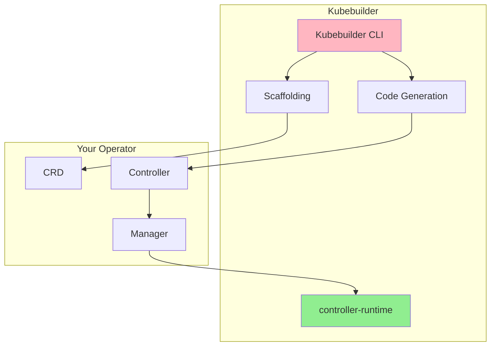
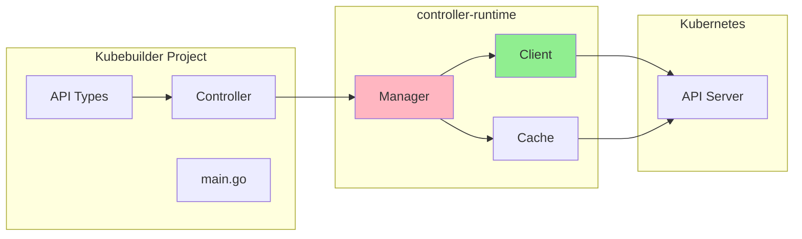
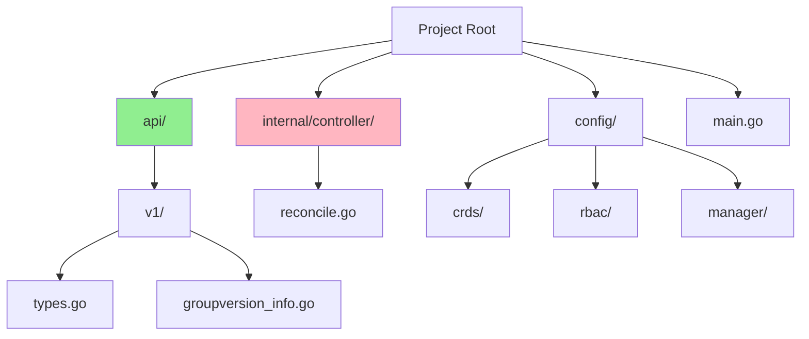
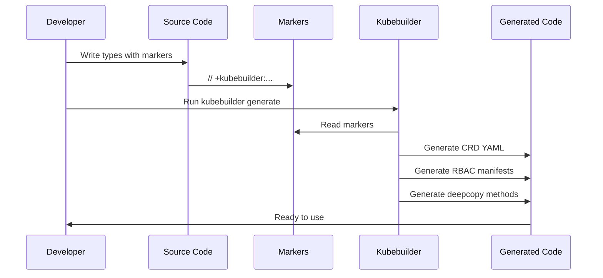
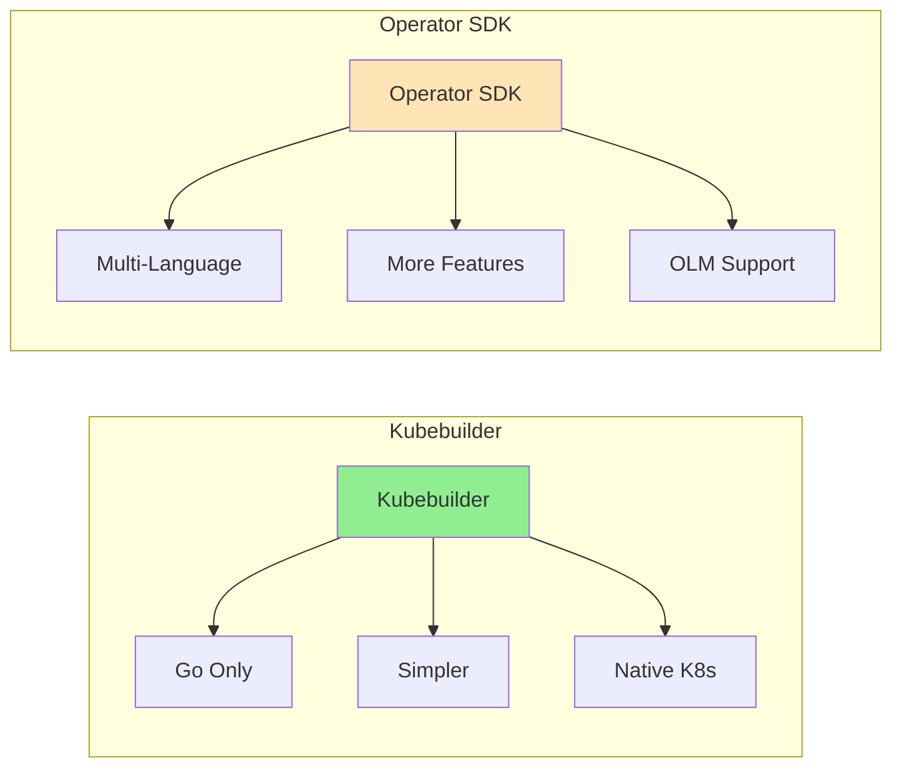

# Урок 2.2: Основы Kubebuilder

**Навигация:** [← Предыдущий: Паттерн оператора](01-operator-pattern.md) | [Обзор модуля](../README.md) | [Далее: Среда разработки →](03-dev-environment.md)

## Введение

Kubebuilder — это фреймворк для создания операторов Kubernetes на основе библиотеки controller-runtime. Он предоставляет генерацию каркаса кода, кодогенерацию и лучшие практики, упрощающие разработку операторов. В этом уроке вы узнаете, как работает Kubebuilder и его архитектуру.

## Теория: фреймворк Kubebuilder

Kubebuilder — это SDK и фреймворк, который упрощает разработку операторов за счёт кодогенерации, создания каркаса проекта и лучших практик.

### Основные концепции

**Кодогенерация:**
- Генерирует шаблонный код (CRD, контроллеры, RBAC)
- Сокращает ручное написание кода и ошибки
- Обеспечивает согласованность с паттернами Kubernetes

**Структура проекта:**
- Стандартизированная компоновка для проектов операторов
- Отделяет определения API от логики контроллера
- Делает проекты сопровождаемыми и масштабируемыми

**Интеграция с controller-runtime:**
- Построен на controller-runtime (той же библиотеке, что использует Kubernetes)
- Предоставляет абстракции Manager, Reconciler, Client
- Обрабатывает кеширование, отслеживание (watching) и выбор лидера

**Почему Kubebuilder:**
- **Продуктивность**: генерирует шаблонный код, позволяя сосредоточиться на бизнес-логике
- **Лучшие практики**: обеспечивает соблюдение паттернов Kubernetes
- **Сообщество**: широко используется, хорошо документирован
- **Инструментарий**: богатый CLI для типовых задач

Понимание Kubebuilder помогает создавать операторы эффективно и правильно.

## Что такое Kubebuilder?

Kubebuilder — это:
- **SDK** для создания операторов на Go
- **Инструмент генерации каркаса**, создающий структуру проекта
- **Генератор кода** для CRD и контроллеров
- Построен на **controller-runtime** (библиотеке, которую использует сам Kubernetes)

## Архитектура Kubebuilder

Kubebuilder использует controller-runtime — ту же библиотеку, что лежит в основе контроллеров Kubernetes:

## Структура проекта Kubebuilder

Когда вы создаёте каркас проекта, Kubebuilder создаёт следующую структуру:

### Ключевые каталоги

- **`api/`**: ваши определения API (типы CRD)
- **`internal/controller/`**: логика вашего контроллера
- **`config/`**: манифесты Kubernetes (CRD, RBAC и т. д.)
- **`main.go`**: точка входа, настраивающая менеджер (manager)

## Процесс кодогенерации

Kubebuilder использует маркеры (комментарии) для генерации кода:

### Распространённые маркеры

- `// +kubebuilder:object:root=true` — помечает корневой тип
- `// +kubebuilder:subresource:status` — включает подресурс status
- `// +kubebuilder:resource:path=...` — определяет путь ресурса
- `// +kubebuilder:validation:...` — добавляет правила валидации

## Команды CLI Kubebuilder

Kubebuilder предоставляет несколько команд:

### `kubebuilder init`

Инициализирует новый проект:
- Создаёт структуру проекта
- Настраивает Go-модули
- Конфигурирует Makefile
- Настраивает controller-runtime

### `kubebuilder create api`

Создаёт новый API (CRD):
- Генерирует типы API
- Создаёт каркас контроллера
- Генерирует манифесты CRD
- Настраивает RBAC

### `kubebuilder create webhook`

Создаёт вебхуки:
- Валидирующие вебхуки
- Мутирующие вебхуки
- Управление сертификатами

### `make generate`

Генерирует код:
- Манифесты CRD
- Методы глубокого копирования (deep copy)
- Код клиента

### `make manifests`

Генерирует манифесты:
- YAML-файлы CRD
- Манифесты RBAC
- Конфигурации вебхуков

## Kubebuilder против Operator SDK

**Kubebuilder:**
- Только Go
- Проще, более сфокусирован
- Нативные паттерны Kubernetes
- Используется самим проектом Kubernetes
- Лучше для обучения

**Operator SDK:**
- Несколько языков (Go, Ansible, Helm)
- Больше возможностей (OLM, scorecard)
- Более крупная экосистема
- Более сложный

**Для этого курса:** мы используем Kubebuilder, потому что он проще, тесно следует паттернам Kubernetes и отлично подходит для обучения.

## Понимание сгенерированного кода

Когда Kubebuilder генерирует код, он создаёт:

1. **Типы API** (`api/v1/`):
   - Go-структуры вашего пользовательского ресурса
   - Определения Spec и Status
   - Методы глубокого копирования

2. **Контроллер** (`internal/controller/`):
   - Структуру Reconciler
   - Каркас функции Reconcile
   - Настройку с менеджером

3. **Манифесты** (`config/`):
   - YAML-файлы CRD
   - Правила RBAC
   - Развёртывание менеджера

## Ключевые выводы

- **Kubebuilder** — это фреймворк для создания операторов на Go
- Использует **controller-runtime** (как и Kubernetes)
- Предоставляет **генерацию каркаса** и **кодогенерацию**
- Структура проекта **стандартизирована** и **организована**
- Использует **маркеры** (комментарии) для генерации кода
- Проще, чем Operator SDK, лучше для обучения

## Что нужно понимать для создания операторов

При использовании Kubebuilder:
- Вы будете определять типы API с маркерами
- Kubebuilder автоматически генерирует CRD
- Вы будете реализовывать функцию Reconcile
- Kubebuilder берёт на себя шаблонный код
- Вы фокусируетесь на бизнес-логике

## Связанная лабораторная работа

- [Лабораторная 2.2: CLI Kubebuilder и структура проекта](../labs/lab-02-kubebuilder-fundamentals.md) — практические упражнения для этого урока

## Источники

### Официальная документация
- [Документация Kubebuilder](https://book.kubebuilder.io/)
- [Быстрый старт Kubebuilder](https://book.kubebuilder.io/quick-start.html)
- [Controller Runtime](https://pkg.go.dev/sigs.k8s.io/controller-runtime)

### Дополнительное чтение
- **Kubebuilder Book** — официальное исчерпывающее руководство
- **Programming Kubernetes**, Michael Hausenblas и Stefan Schimanski — глава 4: Working with Client Libraries
- [Kubebuilder на GitHub](https://github.com/kubernetes-sigs/kubebuilder) — исходный код и примеры

### Смежные темы
- [Kubebuilder против Operator SDK](https://book.kubebuilder.io/faq.html#kubebuilder-vs-operator-sdk)
- [Компоновка проекта](https://book.kubebuilder.io/migration/manually_migration_guide_v1_to_v2.html#project-layout)
- [Кодогенерация](https://book.kubebuilder.io/reference/generating-crd.html)

## Дальнейшие шаги

Теперь, когда вы понимаете Kubebuilder, давайте настроим вашу среду разработки и создадим ваш первый оператор!

**Навигация:** [← Предыдущий: Паттерн оператора](01-operator-pattern.md) | [Обзор модуля](../README.md) | [Далее: Среда разработки →](03-dev-environment.md)
