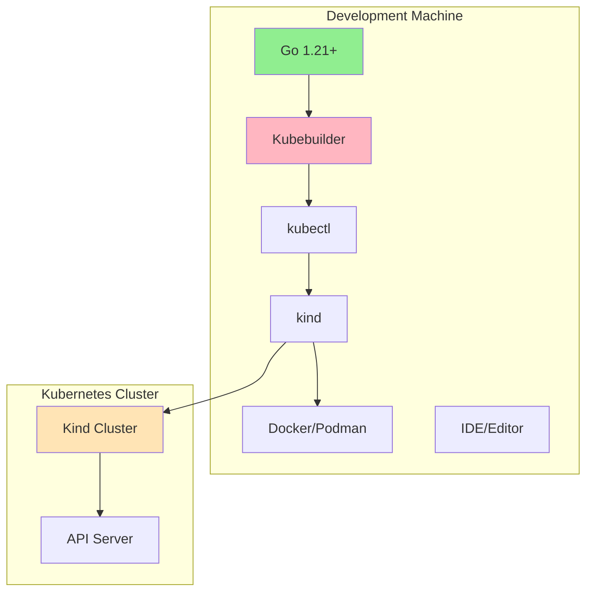
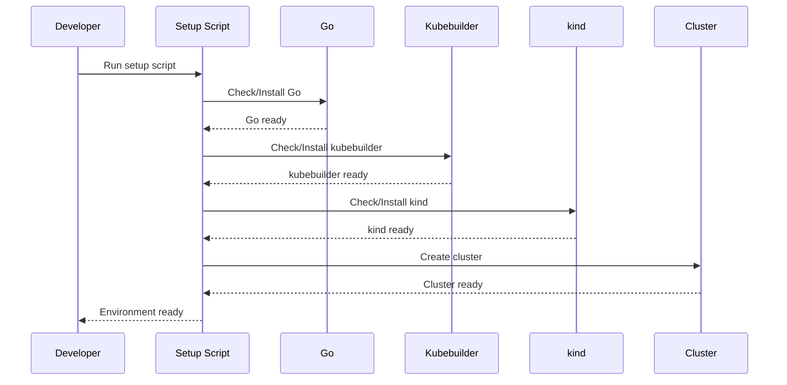
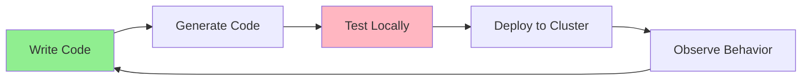
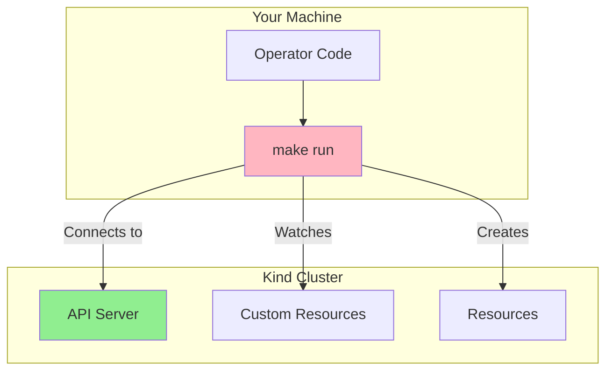

# Урок 2.3: Настройка среды разработки

**Навигация:** [← Предыдущий: Основы Kubebuilder](02-kubebuilder-fundamentals.md) | [Обзор модуля](../README.md) | [Далее: Первый оператор →](04-first-operator.md)

## Введение

Прежде чем создавать свой первый оператор, вам нужна полноценная среда разработки. Этот урок охватывает настройку всего необходимого: Go, kubebuilder, кластера kind и вашей IDE. Мы проверим, что всё работает вместе.

## Теория: настройка среды разработки

Правильная среда разработки критически важна для эффективной разработки и тестирования операторов.

### Основные концепции

**Локальная разработка:**
- Запуск операторов локально (вне кластера)
- Подключение к удалённому или локальному кластеру Kubernetes
- Более быстрые итерации, чем сборка/развёртывание образов
- Более простая отладка

**Кластер kind:**
- Kubernetes в Docker
- Идеален для локальной разработки и тестирования
- Не требует облачных ресурсов
- Быстрое создание/удаление кластера

**Рабочий процесс разработки:**
1. Пишете код локально
2. Запускаете оператор локально (go run)
3. Тестируете на кластере kind
4. Быстро итерируете
5. Собираете образ, когда готовы

**Почему это важно:**
- **Скорость**: локальная разработка быстрее сборки контейнеров
- **Отладка**: локальные процессы проще отлаживать
- **Стоимость**: облачные ресурсы для разработки не нужны
- **Изоляция**: тестирование без влияния на продакшен

Настройка хорошей среды разработки ускоряет создание операторов.

## Компоненты среды разработки

Ваша среда разработки операторов состоит из:



## Процесс настройки

Настройка следует такому процессу:



## Необходимые инструменты

### 1. Go 1.21+

Go — это язык программирования для операторов kubebuilder.

**Установка:**
- Скачайте с [golang.org](https://go.dev/dl/)
- Или используйте менеджер пакетов: `brew install go` (macOS)

**Проверка:**
```bash
go version
# Should show: go version go1.21.x or higher
```

### 2. Kubebuilder

CLI Kubebuilder для генерации каркаса и кодогенерации.

**Установка:**
```bash
# macOS/Linux
curl -L -o kubebuilder https://go.kubebuilder.io/dl/latest/$(go env GOOS)/$(go env GOARCH)
chmod +x kubebuilder
sudo mv kubebuilder /usr/local/bin/
```

**Проверка:**
```bash
kubebuilder version
```

### 3. kubectl

Инструмент командной строки Kubernetes.

**Установка:**
- Уже рассмотрена в настройке Модуля 1
- Проверьте: `kubectl version --client`

### 4. kind

Kubernetes в Docker для локальных кластеров.

**Установка:**
```bash
go install sigs.k8s.io/kind@latest
```

**Проверка:**
```bash
kind version
```

### 5. Docker или Podman

Среда выполнения контейнеров для kind.

**Установка:**
- Docker: [docker.com](https://www.docker.com/)
- Podman: [podman.io](https://podman.io/)

**Проверка:**
```bash
docker --version
# or
podman --version
```

## Использование скрипта настройки

Мы предоставляем скрипт настройки, который проверяет и устанавливает всё необходимое:

```bash
# Run the setup script
./scripts/setup-dev-environment.sh
```

Скрипт:
1. Проверяет каждый инструмент
2. Устанавливает недостающие инструменты
3. Проверяет установки
4. Сообщает о статусе

## Настройка кластера kind

После настройки инструментов создайте кластер kind:

```bash
# Use the provided script
./scripts/setup-kind-cluster.sh
```

Или вручную:
```bash
kind create cluster --name k8s-operators-course
kubectl cluster-info --context kind-k8s-operators-course
```

## Рабочий процесс разработки

Вот как вы будете разрабатывать операторы:



1. **Пишете код**: определяете типы API, реализуете контроллер
2. **Генерируете код**: запускаете `make generate` и `make manifests`
3. **Тестируете локально**: запускаете оператор через `make run`
4. **Развёртываете в кластер**: применяете CRD, создаёте пользовательские ресурсы
5. **Наблюдаете**: смотрите логи, проверяете ресурсы, подтверждаете поведение

## Настройка локальной разработки

Для локальной разработки вы будете запускать оператор на своей машине:



Оператор запускается локально, но подключается к вашему кластеру kind.

## Настройка IDE

### VS Code

Рекомендуемые расширения:
- Расширение Go
- Расширение Kubernetes
- Расширение YAML

### GoLand

Встроенная поддержка:
- Разработки на Go
- Ресурсов Kubernetes
- Отладки

## Чек-лист проверки среды

Перед началом Модуля 2 убедитесь:

- [ ] Go 1.21+ установлен и работает
- [ ] kubebuilder установлен и находится в PATH
- [ ] kubectl настроен и работает
- [ ] kind установлен
- [ ] Docker/Podman запущен
- [ ] Кластер kind создан и доступен
- [ ] Контекст kubectl указывает на кластер kind

## Устранение неполадок

### kubebuilder не найден
```bash
# Add to PATH
export PATH=$PATH:/usr/local/bin
# Or reinstall
```

### Проблемы с кластером kind
```bash
# Delete and recreate
kind delete cluster --name k8s-operators-course
./scripts/setup-kind-cluster.sh
```

### Проблемы с Go-модулями
```bash
# Enable Go modules
export GO111MODULE=on
```

## Ключевые выводы

- Полноценная среда разработки включает: Go, kubebuilder, kubectl, kind, Docker/Podman
- Используйте предоставленные скрипты настройки для простой установки
- Кластер kind предоставляет локальный Kubernetes для тестирования
- Локальная разработка: оператор запускается на вашей машине и подключается к кластеру
- Проверьте все инструменты перед началом разработки операторов

## Связанная лабораторная работа

- [Лабораторная 2.3: Настройка вашей среды](../labs/lab-03-dev-environment.md) — практические упражнения для этого урока

## Источники

### Официальная документация
- [Документация kind](https://kind.sigs.k8s.io/)
- [Установка Kubebuilder](https://book.kubebuilder.io/quick-start.html#installation)
- [Установка Go](https://go.dev/doc/install)

### Дополнительное чтение
- **Kubernetes: Up and Running**, Kelsey Hightower, Brendan Burns и Joe Beda — глава 1: Introduction
- [Быстрый старт kind](https://kind.sigs.k8s.io/docs/user/quick-start/)
- [Установка kubectl](https://kubernetes.io/docs/tasks/tools/)

### Смежные темы
- [Docker Desktop](https://www.docker.com/products/docker-desktop) — для запуска kind
- [Расширение Go для VS Code](https://marketplace.visualstudio.com/items?itemName=golang.Go) — разработка на Go
- [Инструменты разработки Kubernetes](https://kubernetes.io/docs/tasks/tools/)

## Дальнейшие шаги

Теперь, когда ваша среда готова, давайте создадим ваш первый оператор!

**Навигация:** [← Предыдущий: Основы Kubebuilder](02-kubebuilder-fundamentals.md) | [Обзор модуля](../README.md) | [Далее: Первый оператор →](04-first-operator.md)
