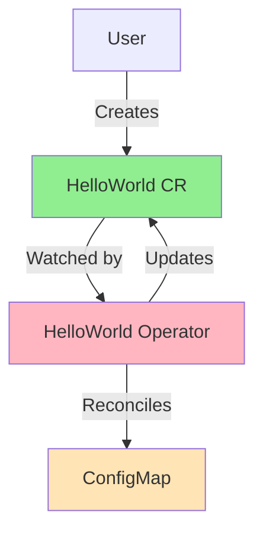

# Урок 2.4: Ваш первый оператор

**Навигация:** [← Предыдущий: Среда разработки](03-dev-environment.md) | [Обзор модуля](../README.md)

## Введение

Теперь вы готовы создать свой первый оператор! Мы создадим оператор «Hello World», который управляет простым пользовательским ресурсом. Этот оператор продемонстрирует все концепции из [Модуля 1](../../module-01/README.md): CRD, контроллеры и согласование.

## Теория: ваш первый оператор

Создание первого оператора помогает понять полный жизненный цикл и структуру оператора.

### Основные концепции

**Компоненты оператора:**
- **CRD**: определяет ваш пользовательский ресурс
- **Контроллер**: логика согласования
- **Менеджер (Manager)**: координирует контроллеры и клиентов
- **RBAC**: разрешения для оператора

**Структура сгенерированного кода:**
- Типы API (spec/status)
- Логика согласования контроллера
- Настройка менеджера
- Манифесты RBAC

**Жизненный цикл оператора:**
1. Пользователь создаёт пользовательский ресурс
2. Контроллер отслеживает и согласовывает
3. Контроллер создаёт ресурсы Kubernetes и управляет ими
4. Контроллер обновляет статус
5. Непрерывный цикл согласования

**Почему начинать с простого:**
- Понять основы до перехода к сложности
- Изучить структуру сгенерированного кода
- Обрести уверенность на рабочем примере
- Заложить основу для более сложных операторов

Начало с простого оператора помогает понять паттерн до создания сложных.

## Что мы создадим

Простой оператор, который:
- Определяет пользовательский ресурс `HelloWorld`
- Отслеживает ресурсы HelloWorld
- Создаёт ConfigMap при создании HelloWorld
- Обновляет статус, отражая текущее состояние



## Шаг 1: инициализация проекта

Создайте новый каталог и инициализируйте проект kubebuilder:

```bash
# Create project directory
mkdir hello-world-operator
cd hello-world-operator

# Initialize kubebuilder project
kubebuilder init --domain example.com --repo github.com/example/hello-world-operator
```

Это создаёт базовую структуру проекта, о которой вы узнали в [Уроке 2.2](02-kubebuilder-fundamentals.md).

## Шаг 2: создание API

Создайте API HelloWorld (CRD):

```bash
# Create API with kubebuilder
kubebuilder create api --group hello --version v1 --kind HelloWorld
```

При запросах:
- Create Resource [y/n]: **y**
- Create Controller [y/n]: **y**

Это генерирует:
- Типы API в `api/v1/`
- Контроллер в `internal/controller/`
- Манифесты CRD в `config/crd/`

## Шаг 3: определение типов API

Отредактируйте `api/v1/helloworld_types.go`:

```go
package v1

import (
    metav1 "k8s.io/apimachinery/pkg/apis/meta/v1"
)

// HelloWorldSpec defines the desired state of HelloWorld
type HelloWorldSpec struct {
    // Message is the message to display
    Message string `json:"message,omitempty"`
    
    // Count is the number of times to display the message
    Count int32 `json:"count,omitempty"`
}

// HelloWorldStatus defines the observed state of HelloWorld
type HelloWorldStatus struct {
    // Phase represents the current phase
    Phase string `json:"phase,omitempty"`
    
    // ConfigMapCreated indicates if the ConfigMap was created
    ConfigMapCreated bool `json:"configMapCreated,omitempty"`
}

// +kubebuilder:object:root=true
// +kubebuilder:subresource:status

// HelloWorld is the Schema for the helloworlds API
type HelloWorld struct {
    metav1.TypeMeta   `json:",inline"`
    metav1.ObjectMeta `json:"metadata,omitempty"`

    Spec   HelloWorldSpec   `json:"spec,omitempty"`
    Status HelloWorldStatus `json:"status,omitempty"`
}

// +kubebuilder:object:root=true

// HelloWorldList contains a list of HelloWorld
type HelloWorldList struct {
    metav1.TypeMeta `json:",inline"`
    metav1.ListMeta `json:"metadata,omitempty"`
    Items           []HelloWorld `json:"items"`
}

func init() {
    SchemeBuilder.Register(&HelloWorld{}, &HelloWorldList{})
}
```

## Шаг 4: генерация кода

Сгенерируйте манифесты CRD и методы глубокого копирования:

```bash
# Generate code
make generate

# Generate manifests
make manifests
```

Это создаёт:
- YAML CRD в `config/crd/bases/`
- Манифесты RBAC в `config/rbac/`

## Шаг 5: реализация контроллера

Отредактируйте `internal/controller/helloworld_controller.go`:

```go
package controller

import (
    "context"
    "fmt"
    
    "k8s.io/apimachinery/pkg/api/errors"
    "k8s.io/apimachinery/pkg/runtime"
    ctrl "sigs.k8s.io/controller-runtime"
    "sigs.k8s.io/controller-runtime/pkg/client"
    "sigs.k8s.io/controller-runtime/pkg/log"
    
    hellov1 "github.com/example/hello-world-operator/api/v1"
    corev1 "k8s.io/api/core/v1"
    metav1 "k8s.io/apimachinery/pkg/apis/meta/v1"
)

// HelloWorldReconciler reconciles a HelloWorld object
type HelloWorldReconciler struct {
    client.Client
    Scheme *runtime.Scheme
}

// +kubebuilder:rbac:groups=hello.example.com,resources=helloworlds,verbs=get;list;watch;create;update;patch;delete
// +kubebuilder:rbac:groups=hello.example.com,resources=helloworlds/status,verbs=get;update;patch
// +kubebuilder:rbac:groups=hello.example.com,resources=helloworlds/finalizers,verbs=update
// +kubebuilder:rbac:groups=core,resources=configmaps,verbs=get;list;watch;create;update;patch;delete

// Reconcile is part of the main kubernetes reconciliation loop
func (r *HelloWorldReconciler) Reconcile(ctx context.Context, req ctrl.Request) (ctrl.Result, error) {
    log := log.FromContext(ctx)
    
    // Fetch the HelloWorld instance
    helloWorld := &hellov1.HelloWorld{}
    if err := r.Get(ctx, req.NamespacedName, helloWorld); err != nil {
        if errors.IsNotFound(err) {
            // Object not found, return
            return ctrl.Result{}, nil
        }
        // Error reading the object
        return ctrl.Result{}, err
    }
    
    // Define the ConfigMap
    configMap := &corev1.ConfigMap{
        ObjectMeta: metav1.ObjectMeta{
            Name:      helloWorld.Name + "-config",
            Namespace: helloWorld.Namespace,
        },
        Data: map[string]string{
            "message": helloWorld.Spec.Message,
            "count":   fmt.Sprintf("%d", helloWorld.Spec.Count),
        },
    }
    
    // Set owner reference (from Lesson 1.3)
    if err := ctrl.SetControllerReference(helloWorld, configMap, r.Scheme); err != nil {
        return ctrl.Result{}, err
    }
    
    // Check if ConfigMap already exists
    existingConfigMap := &corev1.ConfigMap{}
    err := r.Get(ctx, client.ObjectKey{
        Name:      configMap.Name,
        Namespace: configMap.Namespace,
    }, existingConfigMap)
    
    if err != nil && errors.IsNotFound(err) {
        // ConfigMap doesn't exist, create it
        log.Info("Creating ConfigMap", "name", configMap.Name)
        if err := r.Create(ctx, configMap); err != nil {
            return ctrl.Result{}, err
        }
    } else if err != nil {
        return ctrl.Result{}, err
    } else {
        // ConfigMap exists, update it
        log.Info("Updating ConfigMap", "name", configMap.Name)
        existingConfigMap.Data = configMap.Data
        if err := r.Update(ctx, existingConfigMap); err != nil {
            return ctrl.Result{}, err
        }
    }
    
    // Update status
    helloWorld.Status.Phase = "Ready"
    helloWorld.Status.ConfigMapCreated = true
    if err := r.Status().Update(ctx, helloWorld); err != nil {
        return ctrl.Result{}, err
    }
    
    return ctrl.Result{}, nil
}

// SetupWithManager sets up the controller with the Manager.
func (r *HelloWorldReconciler) SetupWithManager(mgr ctrl.Manager) error {
    return ctrl.NewControllerManagedBy(mgr).
        For(&hellov1.HelloWorld{}).
        Complete(r)
}
```

## Шаг 6: установка CRD

Установите CRD в ваш кластер:

```bash
# Install CRD
make install

# Verify CRD was created
kubectl get crd helloworlds.hello.example.com
```

## Шаг 7: локальный запуск оператора

Запустите оператор на своей машине (он подключается к кластеру kind):

```bash
# Run operator
make run
```

Оператор теперь запущен и отслеживает ресурсы HelloWorld!

## Шаг 8: создание ресурса HelloWorld

В другом терминале создайте пользовательский ресурс HelloWorld:

```bash
# Create HelloWorld resource
cat <<EOF | kubectl apply -f -
apiVersion: hello.example.com/v1
kind: HelloWorld
metadata:
  name: hello-example
spec:
  message: "Hello from my first operator!"
  count: 5
EOF
```

## Шаг 9: наблюдение за согласованием

Посмотрите, что происходит:

```bash
# Check HelloWorld resource
kubectl get helloworld hello-example -o yaml

# Check ConfigMap was created
kubectl get configmap hello-example-config -o yaml

# Watch operator logs (in the terminal running make run)
# You should see reconciliation logs
```

## Понимание кода

### Функция Reconcile

Функция `Reconcile` реализует паттерн из [Урока 1.3](../../module-01/lessons/03-controller-pattern.md):

1. **Читает (Read)** пользовательский ресурс
2. **Сравнивает (Compare)** желаемое и фактическое состояние
3. **Предпринимает действие (Take action)** (создаёт/обновляет ConfigMap)
4. **Обновляет статус (Update status)**

### Ссылки-владельцы (Owner References)

Мы устанавливаем ссылку-владельца (из [Урока 1.3](../../module-01/lessons/03-controller-pattern.md)), чтобы ConfigMap автоматически удалялся при удалении HelloWorld.

### Обновления статуса

Мы обновляем подресурс status (из [Урока 1.4](../../module-01/lessons/04-custom-resources.md)), чтобы отразить текущее состояние.

## Структура проекта

Ваш проект теперь выглядит так:

```
hello-world-operator/
├── api/
│   └── v1/
│       ├── helloworld_types.go
│       └── groupversion_info.go
├── internal/controller/
│   └── helloworld_controller.go
├── config/
│   ├── crd/
│   ├── rbac/
│   └── manager/
├── main.go
├── Makefile
└── go.mod
```

## Ключевые выводы

- Kubebuilder генерирует каркас структуры проекта
- Вы определяете типы API (spec и status)
- Вы реализуете функцию Reconcile
- Оператор следует паттерну согласования из Модуля 1
- Ссылки-владельцы управляют жизненным циклом ресурсов
- Обновления статуса отражают фактическое состояние

## Что вы изучили

Вы создали оператор, который:
- ✅ Определяет пользовательский ресурс (CRD)
- ✅ Отслеживает пользовательские ресурсы
- ✅ Согласовывает желаемое и фактическое состояние
- ✅ Создаёт ресурсы Kubernetes
- ✅ Обновляет статус
- ✅ Использует ссылки-владельцы

Это основа для всех операторов!

## Связанная лабораторная работа

- [Лабораторная 2.4: Создание оператора Hello World](../labs/lab-04-first-operator.md) — полное пошаговое руководство

## Источники

### Официальная документация
- [Туториал Kubebuilder](https://book.kubebuilder.io/quick-start)
- [Создание нового проекта](https://book.kubebuilder.io/quick-start.html#create-a-project)
- [Реализация контроллера](https://book.kubebuilder.io/cronjob-tutorial/controller-implementation.html)

### Дополнительное чтение
- **Kubebuilder Book** — полный туториал и справочник
- **Kubernetes Operators**, Jason Dobies и Joshua Wood — глава 3: Your First Operator
- [Примеры Kubebuilder](https://github.com/kubernetes-sigs/kubebuilder/tree/master/docs/book/src/cronjob-tutorial/testdata)

### Смежные темы
- [Паттерны Controller Runtime](https://pkg.go.dev/sigs.k8s.io/controller-runtime/pkg)
- [Лучшие практики согласования](https://book.kubebuilder.io/reference/good-practices)
- [Объяснение сгенерированного кода](https://book.kubebuilder.io/cronjob-tutorial/basic-project)

## Дальнейшие шаги

Поздравляем! Вы создали свой первый оператор. В [Модуле 3](../../module-03/README.md) вы научитесь создавать более совершенные контроллеры с продвинутыми паттернами.

**Навигация:** [← Предыдущий: Среда разработки](03-dev-environment.md) | [Обзор модуля](../README.md) | [Далее: Модуль 3 →](../../module-03/README.md)
