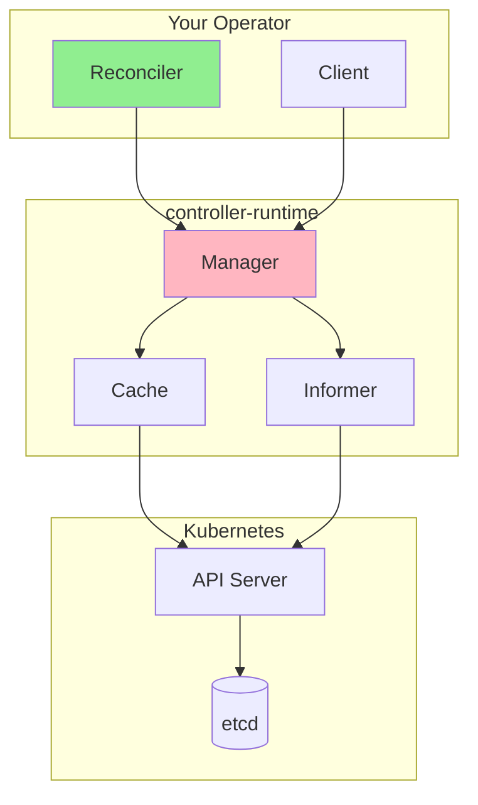
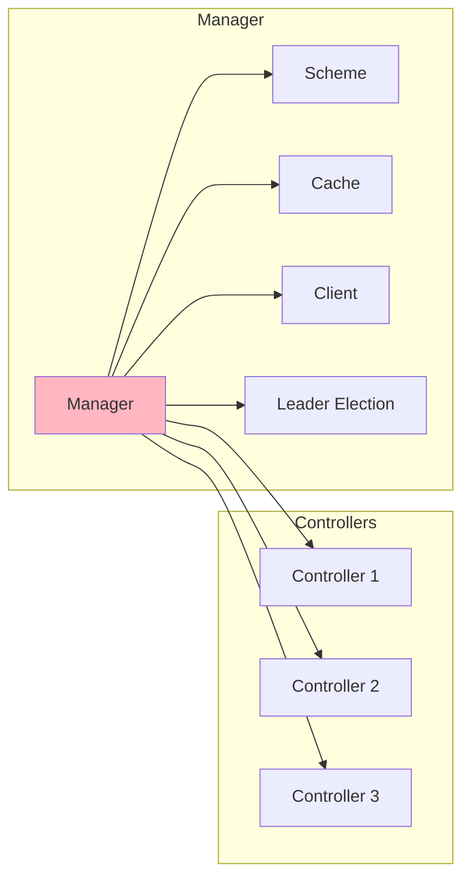
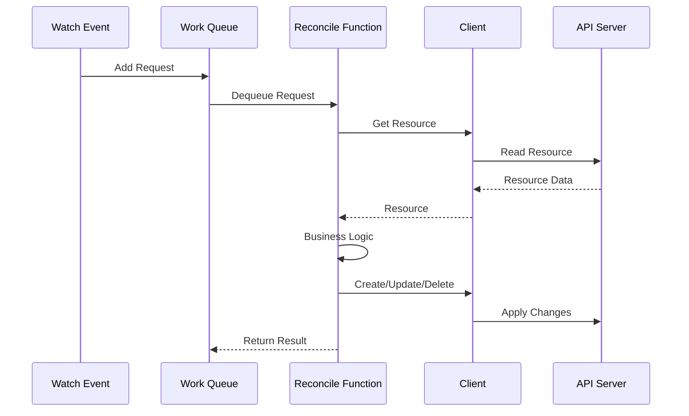
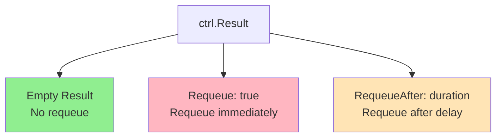
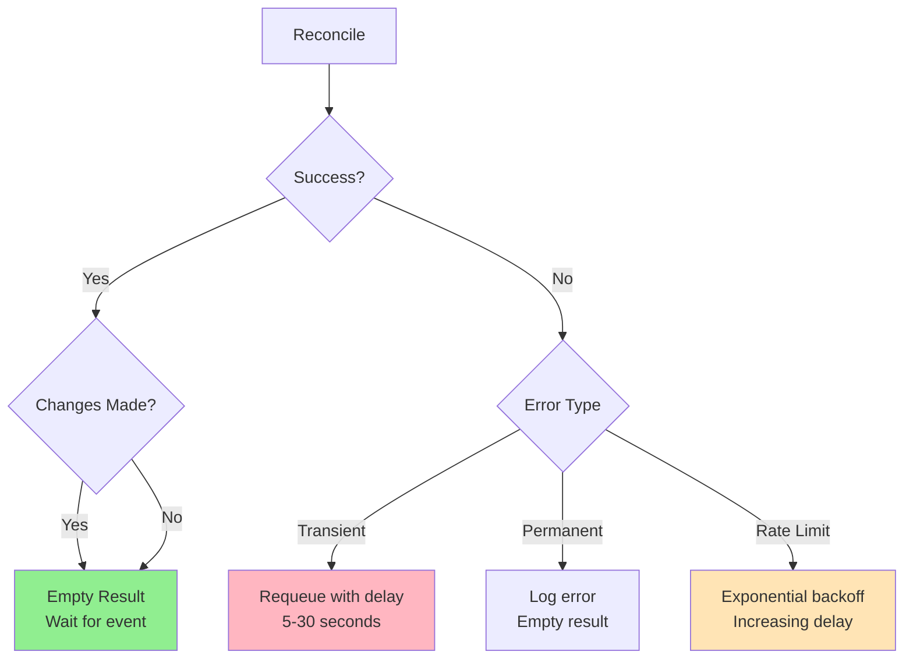
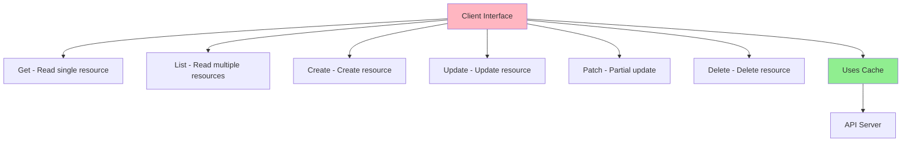

# Урок 3.1: Глубокое погружение в Controller Runtime

**Навигация:** [Обзор модуля](../README.md) | [Следующий урок: Проектирование вашего API →](02-designing-api.md)

## Введение

В [Модуле 2](../../module-02/README.md) вы создали свой первый оператор с помощью kubebuilder. Оператор использовал controller-runtime под капотом, но вам не нужно было вникать в детали. Теперь, чтобы создавать более совершенные операторы, нужно понимать, как работает controller-runtime — та же библиотека, что лежит в основе самого Kubernetes.

## Теория: глубокое погружение в Controller-Runtime

Controller-runtime — это фундаментальная библиотека, которая реализует паттерн контроллера в Kubernetes. Её понимание необходимо для создания совершенных операторов.

### Основные концепции

**Manager:**
- Координирует несколько контроллеров
- Управляет соединениями клиентов и кешированием
- Обрабатывает выбор лидера
- Предоставляет единую точку входа

**Reconciler:**
- Реализует логику согласования
- Получает запросы на согласование
- Возвращает результаты согласования
- Должен быть идемпотентным

**Client:**
- Типизированный клиент для ресурсов Kubernetes
- Использует информеры для кеширования
- Обрабатывает оптимистичный конкурентный доступ
- Предоставляет CRUD-операции

**Почему Controller-Runtime:**
- **Стандартизация**: та же библиотека, что использует Kubernetes
- **Эффективность**: встроенное кеширование и отслеживание
- **Надёжность**: проверенные в бою паттерны
- **Абстракция**: скрывает сложность прямых вызовов API

Понимание controller-runtime помогает создавать эффективные и надёжные операторы.

## Что такое Controller-Runtime?

Controller-runtime — это:
- **Библиотека**, которая реализует паттерн контроллера
- Используется **самим Kubernetes** для встроенных контроллеров
- **Основа** для kubebuilder
- Предоставляет абстракции **Manager**, **Reconciler** и **Client**



## Архитектура Manager

Manager — это центральный компонент, который координирует всё:



### Обязанности Manager

1. **Управляет контроллерами**: регистрирует и запускает контроллеры
2. **Управляет кешем**: поддерживает локальный кеш ресурсов
3. **Управляет клиентом**: предоставляет клиент для доступа к API
4. **Управляет схемой (Scheme)**: обрабатывает регистрацию типов API
5. **Выбор лидера**: гарантирует, что работает только один экземпляр

## Глубокое погружение в функцию Reconcile

Функция Reconcile — это сердце вашего контроллера. Разберёмся в ней лучше:



### Сигнатура функции Reconcile

```go
func (r *MyReconciler) Reconcile(ctx context.Context, req ctrl.Request) (ctrl.Result, error)
```

**Параметры:**
- `ctx`: контекст для отмены и таймаутов
- `req`: запрос, содержащий пространство имён и имя

**Возвращает:**
- `ctrl.Result`: что делать дальше (повторить, отложить и т. д.)
- `error`: ошибку, если согласование не удалось

## Обработка результата и ошибок

### Варианты ctrl.Result



**Пустой результат (`ctrl.Result{}`):**
- Согласование прошло успешно
- Повтор не нужен
- Контроллер будет ждать следующего события

**Requeue (`ctrl.Result{Requeue: true}`):**
- Согласование нужно выполнить снова
- Повторяет немедленно
- Используйте, когда нужно повторить попытку

**RequeueAfter (`ctrl.Result{RequeueAfter: time.Duration}`):**
- Повтор после задержки
- Полезно для ограничения частоты (rate limiting)
- Пример: `ctrl.Result{RequeueAfter: 30 * time.Second}`

### Обработка ошибок

```go
// Return error to requeue
if err != nil {
    return ctrl.Result{}, err  // Will be requeued
}

// Return error with result
if err != nil {
    return ctrl.Result{RequeueAfter: 5 * time.Second}, err
}

// Success - no requeue
return ctrl.Result{}, nil
```

## Стратегии повторной постановки в очередь (requeue)

Разные сценарии требуют разных стратегий повтора:



### Распространённые паттерны

**Паттерн 1: успех с изменениями**
```go
// Created/updated resources successfully
return ctrl.Result{}, nil
```

**Паттерн 2: временная ошибка**
```go
// Temporary failure, retry soon
return ctrl.Result{RequeueAfter: 10 * time.Second}, err
```

**Паттерн 3: ограничение частоты**
```go
// External API rate limit, back off
return ctrl.Result{RequeueAfter: 30 * time.Second}, nil
```

**Паттерн 4: зависимость не готова**
```go
// Waiting for dependency, check again soon
return ctrl.Result{RequeueAfter: 5 * time.Second}, nil
```

## Архитектура клиента (Client)

Client предоставляет доступ к ресурсам Kubernetes:



### Client против прямых вызовов API

**Client (controller-runtime):**
- Использует локальный кеш (быстрее)
- Обрабатывает события отслеживания (watch)
- Автоматические повторы
- Типобезопасность

**Прямые вызовы API:**
- Всегда обращаются к API-серверу
- Без кеширования
- Ручная логика повторов
- Больше контроля

## Настройка Manager

Вот как Manager настраивается в вашем операторе:

```go
func main() {
    // Create manager
    mgr, err := ctrl.NewManager(ctrl.GetConfigOrDie(), ctrl.Options{
        Scheme:                 scheme,
        MetricsBindAddress:     metricsAddr,
        Port:                   9443,
        HealthProbeBindAddress: probeAddr,
        LeaderElection:          enableLeaderElection,
    })
    
    // Setup reconciler
    if err := (&controllers.MyReconciler{
        Client: mgr.GetClient(),
        Scheme: mgr.GetScheme(),
    }).SetupWithManager(mgr); err != nil {
        // Handle error
    }
    
    // Start manager
    mgr.Start(ctrl.SetupSignalHandler())
}
```

## Ключевые выводы

- **Manager** координирует контроллеры, кеш и клиент
- **Функция Reconcile** вызывается для каждого ресурса
- **ctrl.Result** управляет тем, когда выполнять повтор
- **Client** предоставляет типобезопасный доступ к ресурсам
- **Кеш** повышает производительность, сокращая число вызовов API
- **Обработка ошибок** определяет стратегию повтора

## Что нужно понимать для создания операторов

При создании операторов:
- Manager берёт на себя инфраструктуру
- Вы реализуете функцию Reconcile
- Выбирайте подходящие стратегии повтора
- Используйте Client для всех операций с ресурсами
- Задействуйте кеш для производительности
- Обрабатывайте ошибки надлежащим образом

## Связанная лабораторная работа

- [Лабораторная 3.1: Исследование Controller Runtime](../labs/lab-01-controller-runtime.md) — практические упражнения для этого урока

## Источники

### Официальная документация
- [Controller Runtime](https://pkg.go.dev/sigs.k8s.io/controller-runtime)
- [Пакет Manager](https://pkg.go.dev/sigs.k8s.io/controller-runtime/pkg/manager)
- [Пакет Client](https://pkg.go.dev/sigs.k8s.io/controller-runtime/pkg/client)

### Дополнительное чтение
- **Programming Kubernetes**, Michael Hausenblas и Stefan Schimanski — глава 2: The Kubernetes API
- [Исходный код Controller Runtime](https://github.com/kubernetes-sigs/controller-runtime)
- [Kubebuilder Book — Controller Runtime](https://book.kubebuilder.io/architecture.html)

### Смежные темы
- [Паттерн информера](https://github.com/kubernetes/client-go/blob/master/examples/workqueue/main.go)
- [Выбор лидера (Leader Election)](https://pkg.go.dev/sigs.k8s.io/controller-runtime/pkg/leaderelection)
- [Кеш и информеры](https://pkg.go.dev/sigs.k8s.io/controller-runtime/pkg/cache)

## Дальнейшие шаги

Теперь, когда вы понимаете controller-runtime, давайте спроектируем корректный API для более сложного оператора.

**Навигация:** [← Обзор модуля](../README.md) | [Далее: Проектирование вашего API →](02-designing-api.md)
