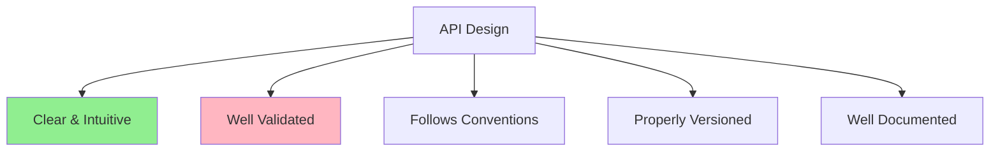
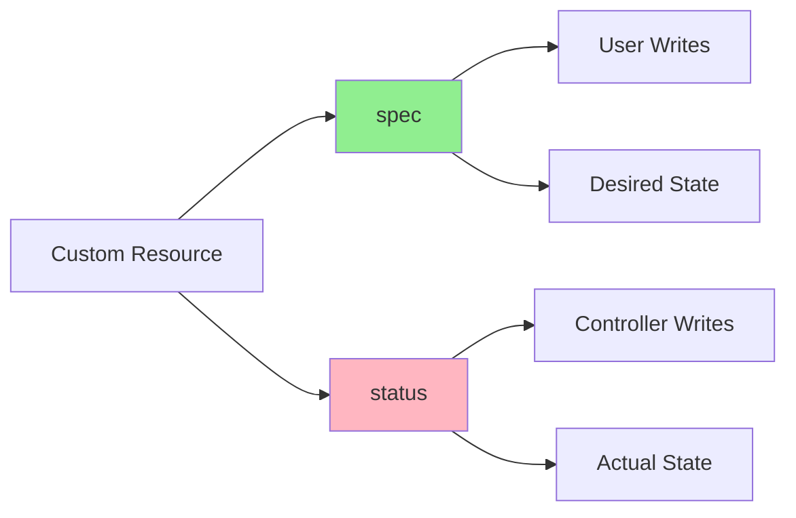
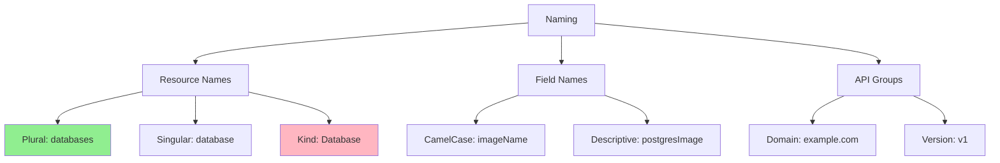
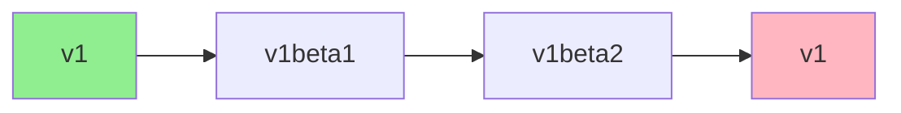
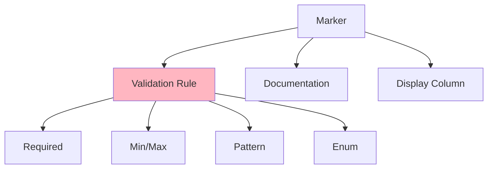
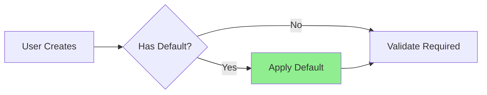
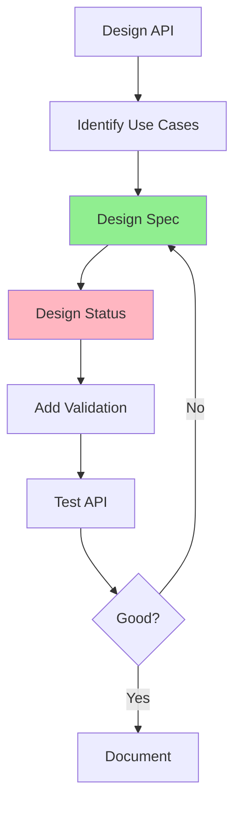

# Урок 3.2: Проектирование вашего API

**Навигация:** [← Предыдущий: Controller Runtime](01-controller-runtime.md) | [Обзор модуля](../README.md) | [Далее: Логика согласования →](03-reconciliation-logic.md)

## Введение

Хорошо спроектированный API критически важен для качественного оператора. API вашего пользовательского ресурса — это то, с чем взаимодействуют пользователи; он должен быть интуитивным, валидируемым и следовать соглашениям Kubernetes. В этом уроке вы научитесь проектировать API, которые одновременно мощны и удобны для пользователя.

## Теория: принципы проектирования API

Хороший дизайн API делает операторы интуитивно понятными в использовании и сопровождении. Следование соглашениям Kubernetes обеспечивает согласованность и совместимость с инструментами.

### Основные концепции

**Разделение Spec и Status:**
- **Spec**: желаемое состояние, задаваемое пользователем (неизменяемое после создания)
- **Status**: фактическое состояние, управляемое системой (только для чтения для пользователей)
- Чёткое разделение предотвращает конфликты и путаницу

**Версионирование API:**
- Одновременная поддержка нескольких версий API
- Обеспечение плавных миграций
- Следование соглашениям Kubernetes о версионировании

**Валидация:**
- Валидация на уровне API (схема CRD)
- Понятные сообщения об ошибках
- Раннее предотвращение некорректных состояний

**Почему хороший дизайн API важен:**
- **Удобство использования**: интуитивные API проще в использовании
- **Сопровождаемость**: хорошо спроектированные API легче развивать
- **Совместимость**: следование соглашениям обеспечивает совместимость с инструментами
- **Надёжность**: валидация предотвращает ошибки во время выполнения

Хороший дизайн API — это основа успешного оператора.

## Принципы проектирования API

Хороший дизайн API следует этим принципам:



## Разделение Spec и Status

Вспомните из [Модуля 1](../../module-01/lessons/04-custom-resources.md) и [Модуля 2](../../module-02/lessons/04-first-operator.md): **Spec** — это желаемое состояние, **Status** — фактическое.



### Рекомендации по Spec

**Что помещается в Spec:**
- Настраиваемые пользователем параметры
- Желаемая конфигурация
- Требования к ресурсам
- Настройки развёртывания

**Пример:**
```go
type DatabaseSpec struct {
    // Image is the PostgreSQL image to use
    Image string `json:"image"`
    
    // Replicas is the number of database replicas
    Replicas int32 `json:"replicas"`
    
    // Storage is the storage configuration
    Storage StorageSpec `json:"storage"`
}
```

### Рекомендации по Status

**Что помещается в Status:**
- Информация о текущем состоянии
- Индикаторы прогресса
- Условия (conditions)
- Наблюдаемое поколение (observed generation)

**Пример:**
```go
type DatabaseStatus struct {
    // Phase is the current phase
    Phase string `json:"phase,omitempty"`
    
    // Ready indicates if the database is ready
    Ready bool `json:"ready,omitempty"`
    
    // Conditions represent the latest observations
    Conditions []Condition `json:"conditions,omitempty"`
}
```

## Соглашения об именовании

Следуйте соглашениям Kubernetes об именовании:



### Именование ресурсов

- **Множественное число (Plural)**: `databases` (в нижнем регистре, множественное число)
- **Единственное число (Singular)**: `database` (в нижнем регистре, единственное число)
- **Kind**: `Database` (PascalCase, единственное число)
- **Короткое имя (Short name)**: `db` (опционально, в нижнем регистре)

### Именование полей

- Используйте **camelCase**: `imageName`, `replicaCount`
- Будьте **описательны**: `postgresImage`, а не `img`
- Используйте **единообразное** именование для всех ресурсов

## Версионирование API

API должны версионироваться правильно:



### Стратегия версий

- **v1**: стабильная, готова к продакшену
- **v1beta1**: бета, может меняться
- **v1alpha1**: альфа, экспериментальная

### Правила версионирования

1. Начинайте с `v1alpha1` для новых API
2. Повышайте до `v1beta1`, когда API стабилен
3. Повышайте до `v1`, когда API готов к продакшену
4. Поддерживайте несколько версий во время перехода

## Валидация с помощью маркеров

Маркеры kubebuilder обеспечивают валидацию:



### Распространённые маркеры валидации

**Обязательные поля:**
```go
// +kubebuilder:validation:Required
Message string `json:"message"`
```

**Числовые диапазоны:**
```go
// +kubebuilder:validation:Minimum=1
// +kubebuilder:validation:Maximum=10
Replicas int32 `json:"replicas"`
```

**Шаблоны строк:**
```go
// +kubebuilder:validation:Pattern=`^[a-z0-9]([-a-z0-9]*[a-z0-9])?$`
Name string `json:"name"`
```

**Перечисления (Enums):**
```go
// +kubebuilder:validation:Enum=small;medium;large
Size string `json:"size"`
```

## Значения по умолчанию

Предоставляйте разумные значения по умолчанию:



### Установка значений по умолчанию

**В коде Go:**
```go
// Set defaults in webhook (Module 5)
func (r *Database) Default() {
    if r.Spec.Image == "" {
        r.Spec.Image = "postgres:14"
    }
    if r.Spec.Replicas == 0 {
        r.Spec.Replicas = 1
    }
}
```

**С помощью маркеров:**
```go
// +kubebuilder:default="postgres:14"
Image string `json:"image,omitempty"`
```

## Пример: проектирование API базы данных

Спроектируем API для оператора PostgreSQL:

```go
// DatabaseSpec defines the desired state of Database
type DatabaseSpec struct {
    // Image is the PostgreSQL image to use
    // +kubebuilder:validation:Required
    // +kubebuilder:default="postgres:14"
    Image string `json:"image"`
    
    // Replicas is the number of database replicas
    // +kubebuilder:validation:Minimum=1
    // +kubebuilder:validation:Maximum=10
    // +kubebuilder:default=1
    Replicas int32 `json:"replicas,omitempty"`
    
    // Storage is the storage configuration
    Storage StorageSpec `json:"storage"`
    
    // Resources are the resource requirements
    Resources corev1.ResourceRequirements `json:"resources,omitempty"`
}

// StorageSpec defines storage configuration
type StorageSpec struct {
    // Size is the storage size
    // +kubebuilder:validation:Required
    Size string `json:"size"`
    
    // StorageClass is the storage class to use
    StorageClass string `json:"storageClass,omitempty"`
}

// DatabaseStatus defines the observed state of Database
type DatabaseStatus struct {
    // Phase is the current phase
    // +kubebuilder:validation:Enum=Pending;Creating;Ready;Failed
    Phase string `json:"phase,omitempty"`
    
    // Ready indicates if the database is ready
    Ready bool `json:"ready,omitempty"`
    
    // Conditions represent the latest observations
    Conditions []metav1.Condition `json:"conditions,omitempty"`
    
    // Endpoint is the database endpoint
    Endpoint string `json:"endpoint,omitempty"`
}
```

## Столбцы вывода (Print Columns)

Добавьте столбцы вывода для более информативного результата `kubectl get`:

```go
// +kubebuilder:printcolumn:name="Phase",type="string",JSONPath=".status.phase"
// +kubebuilder:printcolumn:name="Replicas",type="integer",JSONPath=".spec.replicas"
// +kubebuilder:printcolumn:name="Ready",type="boolean",JSONPath=".status.ready"
// +kubebuilder:printcolumn:name="Age",type="date",JSONPath=".metadata.creationTimestamp"
type Database struct {
    // ...
}
```

Это заставит `kubectl get databases` показывать полезные столбцы!

## Процесс проектирования API



## Ключевые выводы

- **Spec** = желаемое состояние (пишет пользователь)
- **Status** = фактическое состояние (пишет контроллер)
- Следуйте **соглашениям Kubernetes об именовании**
- Используйте **правильное версионирование** (v1alpha1 → v1beta1 → v1)
- Добавляйте **маркеры валидации** для безопасности
- Предоставляйте **разумные значения по умолчанию**
- Добавляйте **столбцы вывода** для лучшего UX
- **Документируйте** свой API как следует

## Что нужно понимать для создания операторов

При проектировании API:
- Думайте об опыте пользователя
- Валидируйте всё, что возможно
- Чётко разделяйте spec и status
- Правильно версионируйте свои API
- Следуйте соглашениям Kubernetes
- Делайте API интуитивным

## Связанная лабораторная работа

- [Лабораторная 3.2: Проектирование API для оператора базы данных](../labs/lab-02-designing-api.md) — практические упражнения для этого урока

## Источники

### Официальная документация
- [Соглашения об API](https://github.com/kubernetes/community/blob/master/contributors/devel/sig-architecture/api-conventions.md)
- [Лучшие практики CRD](https://kubernetes.io/docs/tasks/extend-kubernetes/custom-resources/custom-resource-definitions/#best-practices)
- [Версионирование API](https://kubernetes.io/docs/reference/using-api/api-concepts/#versioning)

### Дополнительное чтение
- **Programming Kubernetes**, Michael Hausenblas и Stefan Schimanski — глава 3: Custom Resources
- **Kubernetes: Up and Running**, Kelsey Hightower, Brendan Burns и Joe Beda — глава 15: Extending Kubernetes
- [Принципы проектирования API Kubernetes](https://github.com/kubernetes/community/blob/master/contributors/devel/sig-architecture/api-conventions.md)

### Смежные темы
- [Схема OpenAPI](https://kubernetes.io/docs/tasks/extend-kubernetes/custom-resources/custom-resource-definitions/#specifying-a-structural-schema)
- [Значения по умолчанию](https://kubernetes.io/docs/tasks/extend-kubernetes/custom-resources/custom-resource-definitions/#defaulting)
- [Правила валидации](https://kubernetes.io/docs/tasks/extend-kubernetes/custom-resources/custom-resource-definitions/#validation-rules)

## Дальнейшие шаги

Теперь, когда вы знаете, как проектировать API, давайте реализуем логику согласования, которая их использует.

**Навигация:** [← Предыдущий: Controller Runtime](01-controller-runtime.md) | [Обзор модуля](../README.md) | [Далее: Логика согласования →](03-reconciliation-logic.md)
