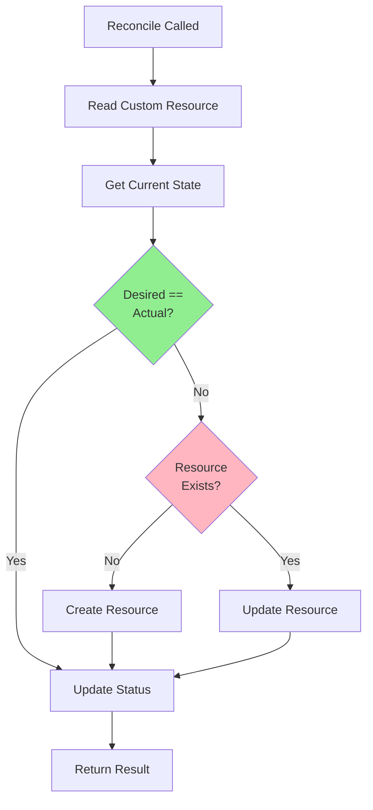
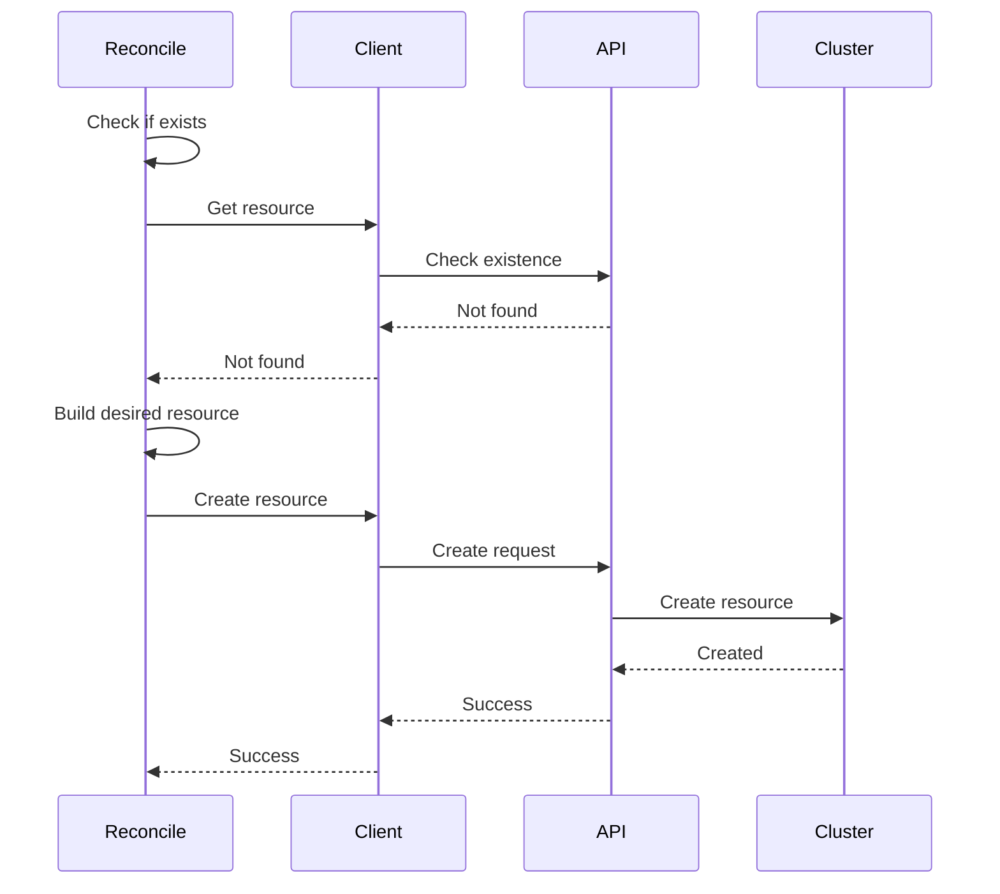
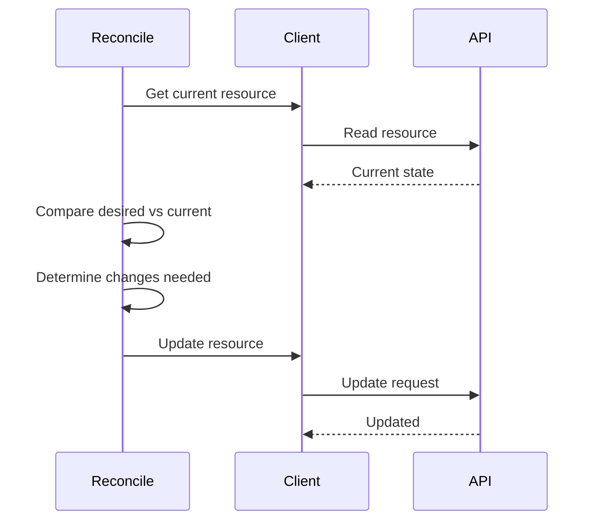
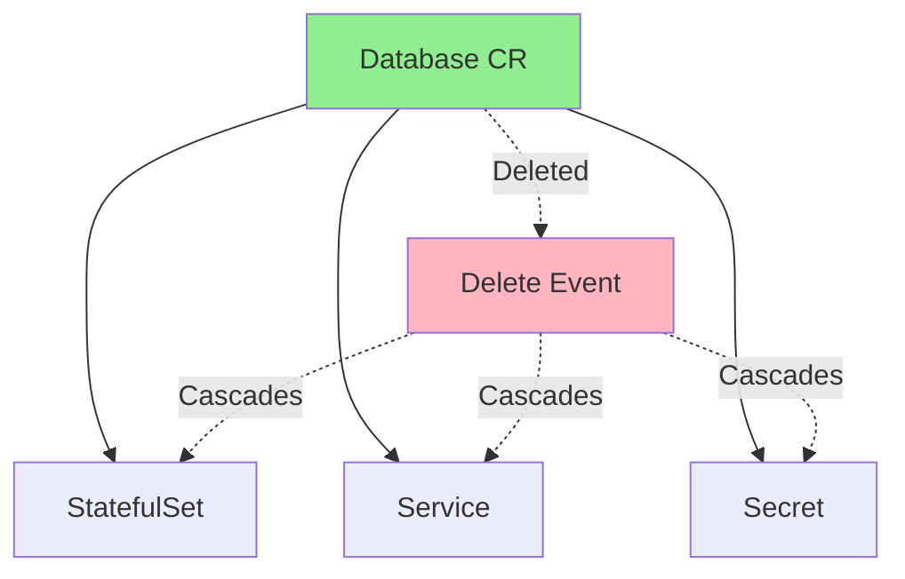
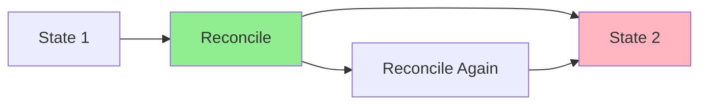

# Урок 3.3: Реализация логики согласования

**Навигация:** [← Предыдущий: Проектирование вашего API](02-designing-api.md) | [Обзор модуля](../README.md) | [Далее: Работа с Client-Go →](04-client-go.md)

## Введение

Теперь, когда вы понимаете controller-runtime ([Урок 3.1](01-controller-runtime.md)) и проектирование API ([Урок 3.2](02-designing-api.md)), пришло время реализовать надёжную логику согласования. Именно здесь живёт бизнес-логика вашего оператора — код, который приводит фактическое состояние в соответствие с желаемым.

## Теория: логика согласования

Согласование (reconciliation) — это процесс непрерывного обеспечения соответствия фактического состояния желаемому. Это сердце каждого контроллера и оператора.

### Основные концепции

**Цикл согласования:**
- Непрерывно сравнивает желаемое и фактическое состояние
- Предпринимает корректирующие действия при расхождении
- Обновляет статус, отражая текущее состояние
- Работает, пока желаемое не станет равно фактическому

**Идемпотентность:**
- Тот же вход → тот же выход
- Безопасно запускать многократно
- Обеспечивает повторы и восстановление
- Критична для надёжности

**Ссылки-владельцы (Owner References):**
- Связывают дочерние ресурсы с родительским
- Обеспечивают сборку мусора (garbage collection)
- Отслеживают связи между ресурсами
- Поддерживают иерархию ресурсов

**Почему согласование важно:**
- **Надёжность**: обрабатывает сбои и повторы
- **Согласованность**: обеспечивает соответствие состояния желаемому
- **Отказоустойчивость**: восстанавливается после частичных сбоев
- **Простота**: единый паттерн для всех операций

Понимание согласования помогает создавать надёжные и устойчивые операторы.

## Жизненный цикл цикла согласования

Цикл согласования следует такому жизненному циклу:



## Чтение состояния кластера

Сначала нужно прочитать текущее состояние:

```go
func (r *DatabaseReconciler) Reconcile(ctx context.Context, req ctrl.Request) (ctrl.Result, error) {
    // 1. Read the Custom Resource
    db := &databasev1.Database{}
    if err := r.Get(ctx, req.NamespacedName, db); err != nil {
        if errors.IsNotFound(err) {
            // Resource was deleted
            return ctrl.Result{}, nil
        }
        return ctrl.Result{}, err
    }
    
    // 2. Read dependent resources
    statefulSet := &appsv1.StatefulSet{}
    err := r.Get(ctx, client.ObjectKey{
        Name:      db.Name,
        Namespace: db.Namespace,
    }, statefulSet)
    
    // Handle not found
    if errors.IsNotFound(err) {
        // Need to create
    }
}
```

## Создание ресурсов

Когда ресурсов не существует, создайте их:



### Паттерн создания

```go
// Check if StatefulSet exists
statefulSet := &appsv1.StatefulSet{}
err := r.Get(ctx, client.ObjectKey{
    Name:      db.Name,
    Namespace: db.Namespace,
}, statefulSet)

if errors.IsNotFound(err) {
    // Build desired StatefulSet
    desiredStatefulSet := r.buildStatefulSet(db)
    
    // Set owner reference
    if err := ctrl.SetControllerReference(db, desiredStatefulSet, r.Scheme); err != nil {
        return ctrl.Result{}, err
    }
    
    // Create it
    if err := r.Create(ctx, desiredStatefulSet); err != nil {
        return ctrl.Result{}, err
    }
    
    // Created successfully
    return ctrl.Result{Requeue: true}, nil
}
```

## Обновление ресурсов

Когда ресурсы существуют, но отличаются, обновите их:



### Паттерн обновления

```go
// Get current StatefulSet
currentStatefulSet := &appsv1.StatefulSet{}
if err := r.Get(ctx, client.ObjectKey{
    Name:      db.Name,
    Namespace: db.Namespace,
}, currentStatefulSet); err != nil {
    return ctrl.Result{}, err
}

// Build desired StatefulSet
desiredStatefulSet := r.buildStatefulSet(db)

// Compare and update if needed
if !reflect.DeepEqual(currentStatefulSet.Spec, desiredStatefulSet.Spec) {
    currentStatefulSet.Spec = desiredStatefulSet.Spec
    if err := r.Update(ctx, currentStatefulSet); err != nil {
        return ctrl.Result{}, err
    }
    // Updated, requeue to verify
    return ctrl.Result{Requeue: true}, nil
}
```

## Ссылки-владельцы (Owner References)

Ссылки-владельцы гарантируют, что ресурсы удаляются при удалении родителя:



### Установка ссылок-владельцев

```go
// Set owner reference on child resource
if err := ctrl.SetControllerReference(db, statefulSet, r.Scheme); err != nil {
    return ctrl.Result{}, err
}

// Now when Database is deleted, StatefulSet is automatically deleted
```

## Идемпотентность

Согласование должно быть **идемпотентным** — многократный запуск должен давать один и тот же результат:



### Обеспечение идемпотентности

```go
// Always check current state before acting
current := &appsv1.StatefulSet{}
err := r.Get(ctx, key, current)

if errors.IsNotFound(err) {
    // Create only if doesn't exist
    r.Create(ctx, desired)
} else {
    // Update only if different
    if !reflect.DeepEqual(current.Spec, desired.Spec) {
        r.Update(ctx, desired)
    }
}
```

## Полный пример согласования

Вот полная функция согласования для оператора Database:

```go
func (r *DatabaseReconciler) Reconcile(ctx context.Context, req ctrl.Request) (ctrl.Result, error) {
    log := log.FromContext(ctx)
    
    // 1. Read the Database Custom Resource
    db := &databasev1.Database{}
    if err := r.Get(ctx, req.NamespacedName, db); err != nil {
        if errors.IsNotFound(err) {
            // Resource was deleted, nothing to do
            return ctrl.Result{}, nil
        }
        return ctrl.Result{}, err
    }
    
    // 2. Reconcile StatefulSet
    if err := r.reconcileStatefulSet(ctx, db); err != nil {
        return ctrl.Result{}, err
    }
    
    // 3. Reconcile Service
    if err := r.reconcileService(ctx, db); err != nil {
        return ctrl.Result{}, err
    }
    
    // 4. Reconcile Secret
    if err := r.reconcileSecret(ctx, db); err != nil {
        return ctrl.Result{}, err
    }
    
    // 5. Update status
    if err := r.updateStatus(ctx, db); err != nil {
        return ctrl.Result{}, err
    }
    
    return ctrl.Result{}, nil
}

func (r *DatabaseReconciler) reconcileStatefulSet(ctx context.Context, db *databasev1.Database) error {
    // Get current StatefulSet
    statefulSet := &appsv1.StatefulSet{}
    err := r.Get(ctx, client.ObjectKey{
        Name:      db.Name,
        Namespace: db.Namespace,
    }, statefulSet)
    
    desiredStatefulSet := r.buildStatefulSet(db)
    
    if errors.IsNotFound(err) {
        // Create
        if err := ctrl.SetControllerReference(db, desiredStatefulSet, r.Scheme); err != nil {
            return err
        }
        return r.Create(ctx, desiredStatefulSet)
    } else if err != nil {
        return err
    }
    
    // Update if needed
    if !reflect.DeepEqual(statefulSet.Spec, desiredStatefulSet.Spec) {
        statefulSet.Spec = desiredStatefulSet.Spec
        return r.Update(ctx, statefulSet)
    }
    
    return nil
}
```

## Обработка ошибок

Обрабатывайте ошибки надлежащим образом:

```go
// Transient error - retry
if isTransientError(err) {
    return ctrl.Result{RequeueAfter: 10 * time.Second}, err
}

// Permanent error - log and don't retry
if isPermanentError(err) {
    log.Error(err, "Permanent error, not retrying")
    return ctrl.Result{}, nil
}

// Unknown error - retry with backoff
return ctrl.Result{RequeueAfter: 5 * time.Second}, err
```

## Ключевые выводы

- **Читайте** текущее состояние перед действиями
- **Сравнивайте** желаемое и фактическое
- **Создавайте**, если отсутствует
- **Обновляйте**, если отличается
- Используйте **ссылки-владельцы** для управления жизненным циклом
- Обеспечивайте **идемпотентность**
- Обрабатывайте **ошибки** надлежащим образом
- **Обновляйте статус**, отражая состояние

## Что нужно понимать для создания операторов

При реализации согласования:
- Всегда сначала проверяйте текущее состояние
- Стройте желаемое состояние из spec
- Сравнивайте перед обновлением
- Устанавливайте ссылки-владельцы
- Делайте согласование идемпотентным
- Аккуратно обрабатывайте ошибки
- Обновляйте статус

## Связанная лабораторная работа

- [Лабораторная 3.3: Создание оператора PostgreSQL](../labs/lab-03-reconciliation-logic.md) — практические упражнения для этого урока

## Источники

### Официальная документация
- [Паттерн контроллера](https://kubernetes.io/docs/concepts/architecture/controller/)
- [Ссылки-владельцы](https://kubernetes.io/docs/concepts/overview/working-with-objects/owners-dependents/)
- [Сборка мусора](https://kubernetes.io/docs/concepts/architecture/garbage-collection/)

### Дополнительное чтение
- **Kubernetes: Up and Running**, Kelsey Hightower, Brendan Burns и Joe Beda — глава 4: Common kubectl Commands
- **Programming Kubernetes**, Michael Hausenblas и Stefan Schimanski — глава 2: The Kubernetes API
- [Согласование в Kubernetes](https://kubernetes.io/docs/concepts/architecture/controller/#reconciliation)

### Смежные темы
- [Паттерны идемпотентности](https://kubernetes.io/docs/concepts/architecture/controller/#reconciliation)
- [Жизненный цикл ресурсов](https://kubernetes.io/docs/concepts/overview/working-with-objects/)
- [Финализаторы](https://kubernetes.io/docs/concepts/overview/working-with-objects/finalizers/)

## Дальнейшие шаги

Теперь, когда вы понимаете логику согласования, давайте изучим продвинутые операции клиента для более совершенных контроллеров.

**Навигация:** [← Предыдущий: Проектирование вашего API](02-designing-api.md) | [Обзор модуля](../README.md) | [Далее: Работа с Client-Go →](04-client-go.md)
