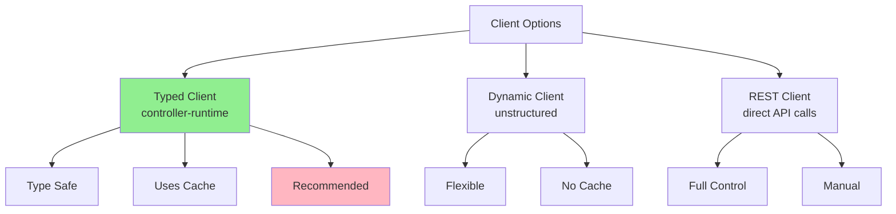
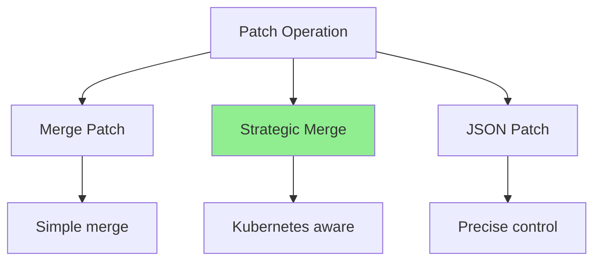
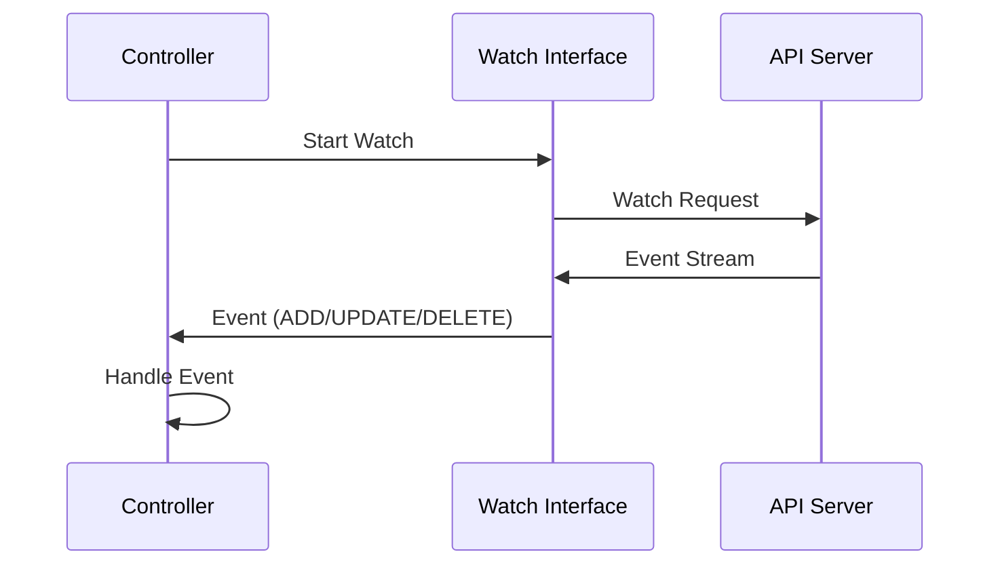
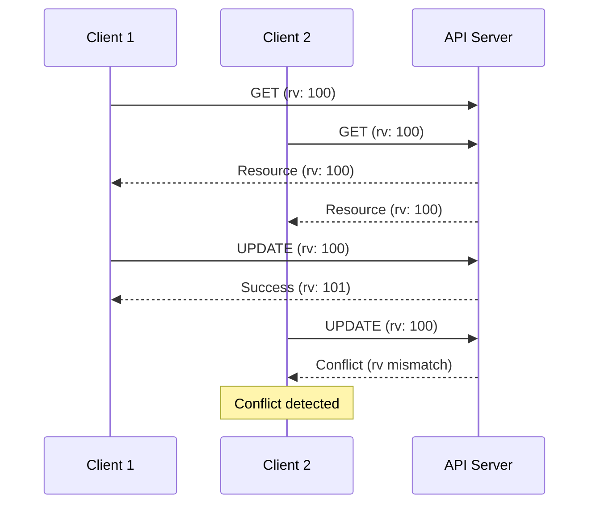

# Урок 3.4: Работа с Client-Go

**Навигация:** [← Предыдущий: Логика согласования](03-reconciliation-logic.md) | [Обзор модуля](../README.md)

## Введение

Клиент Kubernetes — это ваш интерфейс к API-серверу. Умение эффективно его использовать критически важно для создания производительных операторов. В этом уроке вы изучите продвинутые операции клиента, стратегии патчинга и способы обработки конкурентного доступа.

## Теория: работа с Client-Go

Client-go предоставляет низкоуровневый доступ к API Kubernetes, а controller-runtime строит на нём абстракции более высокого уровня.

### Основные концепции

**Типизированные и динамические клиенты:**
- **Типизированный (Typed)**: типобезопасность, проверка на этапе компиляции, лучшая производительность
- **Динамический (Dynamic)**: проверка типов во время выполнения, гибкость, медленнее
- Выбирайте в зависимости от сценария использования

**Механизм отслеживания (Watch):**
- Долгоживущие соединения для уведомлений об изменениях
- Эффективнее опроса (polling)
- Автоматически обрабатывает переподключение
- Используется информерами и контроллерами

**Операции патчинга (Patch):**
- Strategic merge patch: слияние с учётом особенностей Kubernetes
- JSON merge patch: стандартный патчинг JSON
- JSON patch: точечное обновление полей
- Выбирайте в зависимости от потребностей обновления

**Почему Client-Go важен:**
- **Производительность**: эффективное взаимодействие с API
- **Контроль**: тонкий контроль над операциями
- **Совместимость**: работает со всеми версиями Kubernetes
- **Основа**: controller-runtime построен на нём

Понимание client-go помогает оптимизировать производительность оператора и обрабатывать граничные случаи.

## Типы клиентов

Существуют разные способы взаимодействия с API Kubernetes:



## Типизированный клиент (рекомендуется)

Типизированный клиент из controller-runtime — это то, что вы уже использовали:

```go
type DatabaseReconciler struct {
    client.Client  // Typed client
    Scheme *runtime.Scheme
}
```

**Преимущества:**
- Типобезопасность
- Использует кеш (быстрее)
- Обрабатывает события отслеживания (watch)
- Автоматические повторы

## Чтение ресурсов

### Получение одного ресурса (Get)

```go
// Get a specific resource
statefulSet := &appsv1.StatefulSet{}
err := r.Get(ctx, client.ObjectKey{
    Name:      "my-db",
    Namespace: "default",
}, statefulSet)

if errors.IsNotFound(err) {
    // Resource doesn't exist
}
```

### Получение списка ресурсов (List)

```go
// List all StatefulSets in namespace
statefulSetList := &appsv1.StatefulSetList{}
err := r.List(ctx, statefulSetList, client.InNamespace("default"))

// Filter by labels
err := r.List(ctx, statefulSetList, 
    client.InNamespace("default"),
    client.MatchingLabels{"app": "database"})
```

## Создание ресурсов

```go
// Create a resource
statefulSet := &appsv1.StatefulSet{
    ObjectMeta: metav1.ObjectMeta{
        Name:      "my-db",
        Namespace: "default",
    },
    Spec: appsv1.StatefulSetSpec{
        // ... spec
    },
}

err := r.Create(ctx, statefulSet)
```

## Обновление ресурсов

### Полное обновление

```go
// Update entire resource
statefulSet.Spec.Replicas = &replicas
err := r.Update(ctx, statefulSet)
```

### Обновление статуса

```go
// Update only status (uses status subresource)
db.Status.Phase = "Ready"
err := r.Status().Update(ctx, db)
```

## Стратегии патчинга

Иногда нужно обновить только определённые поля. Используйте патчи:



### Strategic Merge Patch

```go
// Patch specific fields
patch := client.MergeFrom(statefulSet.DeepCopy())
statefulSet.Spec.Replicas = &newReplicas

err := r.Patch(ctx, statefulSet, patch)
```

### JSON Patch

```go
// More precise control
patch := []byte(`[
    {"op": "replace", "path": "/spec/replicas", "value": 3}
]`)

err := r.Patch(ctx, statefulSet, client.RawPatch(types.JSONPatchType, patch))
```

## Отслеживание ресурсов

Отслеживайте изменения ресурсов:



### Настройка отслеживания

```go
func (r *DatabaseReconciler) SetupWithManager(mgr ctrl.Manager) error {
    return ctrl.NewControllerManagedBy(mgr).
        For(&databasev1.Database{}).
        Owns(&appsv1.StatefulSet{}).  // Watch owned StatefulSets
        Watches(
            &source.Kind{Type: &corev1.Secret{}},
            &handler.EnqueueRequestForObject{},
        ).
        Complete(r)
}
```

## Оптимистичное управление конкурентным доступом

Kubernetes использует версии ресурсов для предотвращения конфликтов:



### Обработка конфликтов

```go
// Retry on conflict
for retries := 0; retries < 3; retries++ {
    err := r.Get(ctx, key, resource)
    if err != nil {
        return err
    }
    
    // Modify resource
    resource.Spec.Replicas = &newReplicas
    
    err = r.Update(ctx, resource)
    if err == nil {
        return nil  // Success
    }
    
    if !errors.IsConflict(err) {
        return err  // Non-conflict error
    }
    
    // Conflict - retry
    time.Sleep(100 * time.Millisecond)
}
```

## Фильтрация и поиск

### По пространству имён

```go
// List resources in namespace
r.List(ctx, list, client.InNamespace("production"))
```

### По меткам

```go
// Match labels
r.List(ctx, list, client.MatchingLabels{
    "app": "database",
    "env": "prod",
})

// Match label selector
selector := labels.SelectorFromSet(labels.Set{"app": "database"})
r.List(ctx, list, client.MatchingLabelsSelector{Selector: selector})
```

### По полям

```go
// Match specific field
r.List(ctx, list, client.MatchingFields{
    "metadata.name": "my-db",
})
```

## Селекторы полей (Field Selectors)

Используйте селекторы полей для эффективных запросов:

```go
// Find StatefulSets owned by Database
r.List(ctx, &appsv1.StatefulSetList{},
    client.InNamespace("default"),
    client.MatchingFields{
        ".metadata.ownerReferences[0].kind": "Database",
        ".metadata.ownerReferences[0].name": db.Name,
    })
```

## Лучшие практики

### 1. Используйте типизированный клиент

```go
// Good: Type-safe
r.Get(ctx, key, &appsv1.StatefulSet{})

// Avoid: Dynamic client unless necessary
```

### 2. Задействуйте кеш

```go
// Client uses cache automatically
// No need to worry about it
r.Get(ctx, key, resource)  // Uses cache
```

### 3. Правильно обрабатывайте ошибки

```go
if errors.IsNotFound(err) {
    // Handle not found
} else if errors.IsConflict(err) {
    // Handle conflict
} else {
    // Handle other errors
}
```

### 4. Используйте контекст

```go
// Always use context for cancellation
ctx, cancel := context.WithTimeout(context.Background(), 30*time.Second)
defer cancel()

r.Get(ctx, key, resource)
```

## Ключевые выводы

- **Типизированный клиент** рекомендуется (типобезопасный, кешируется)
- **Get** для одиночных ресурсов, **List** для нескольких
- Используйте **Patch** для частичных обновлений
- **Watch** для обновлений в реальном времени
- Обрабатывайте **конфликты** через повторы
- Используйте **фильтры** для эффективных запросов
- Всегда используйте **контекст** для отмены

## Что нужно понимать для создания операторов

При работе с клиентами:
- Предпочитайте типизированный клиент динамическому
- Используйте List с фильтрами для эффективности
- Аккуратно обрабатывайте конфликты
- Используйте патчи для частичных обновлений
- Настраивайте отслеживание зависимых ресурсов
- Всегда правильно обрабатывайте ошибки

## Связанная лабораторная работа

- [Лабораторная 3.4: Продвинутые операции клиента](../labs/lab-04-client-go.md) — практические упражнения для этого урока

## Источники

### Официальная документация
- [Client-Go](https://github.com/kubernetes/client-go)
- [Примеры Client-Go](https://github.com/kubernetes/client-go/tree/master/examples)
- [Клиентские библиотеки API](https://kubernetes.io/docs/reference/using-api/client-libraries/)

### Дополнительное чтение
- **Programming Kubernetes**, Michael Hausenblas и Stefan Schimanski — глава 4: Working with Client Libraries
- [Документация Client-Go](https://pkg.go.dev/k8s.io/client-go)
- [Паттерн информера](https://github.com/kubernetes/client-go/blob/master/examples/workqueue/main.go)

### Смежные темы
- [Механизм отслеживания (Watch)](https://kubernetes.io/docs/reference/using-api/api-concepts/#efficient-detection-of-changes)
- [Стратегии патчинга](https://kubernetes.io/docs/tasks/manage-kubernetes-objects/update-api-object-kubectl-patch/)
- [Оптимистичный конкурентный доступ](https://kubernetes.io/docs/reference/using-api/api-concepts/#resource-versions)

## Дальнейшие шаги

Поздравляем! Вы завершили Модуль 3. Теперь вы понимаете:
- Архитектуру controller-runtime
- Принципы проектирования API
- Логику согласования
- Продвинутые операции клиента

В [Модуле 4](../../module-04/README.md) вы изучите продвинутые паттерны согласования, такие как условия (conditions), финализаторы и многофазное согласование.

**Навигация:** [← Предыдущий: Логика согласования](03-reconciliation-logic.md) | [Обзор модуля](../README.md) | [Далее: Модуль 4 →](../../module-04/README.md)
