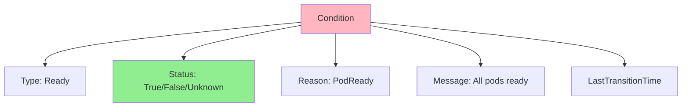
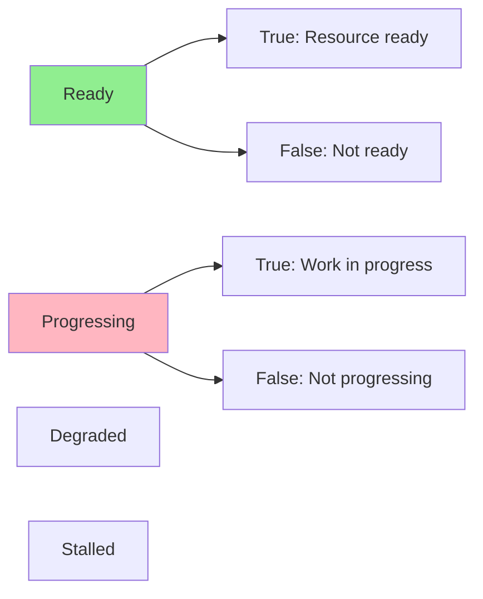
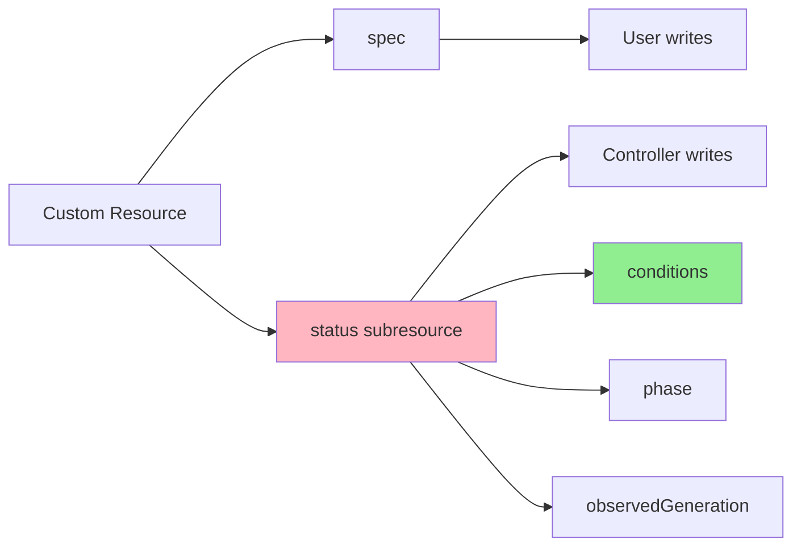
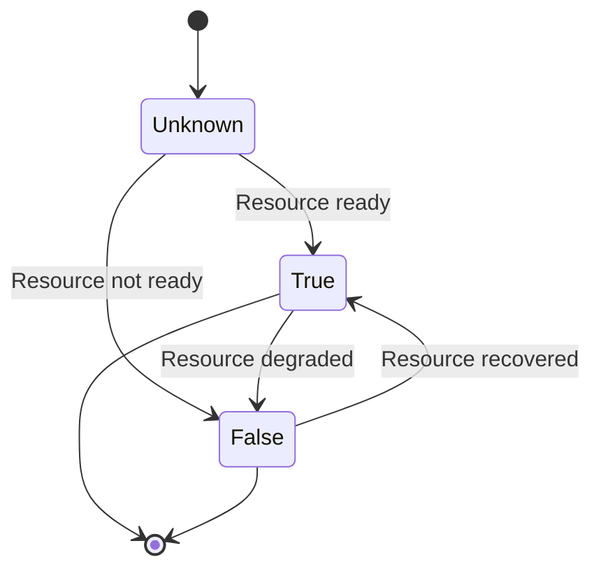
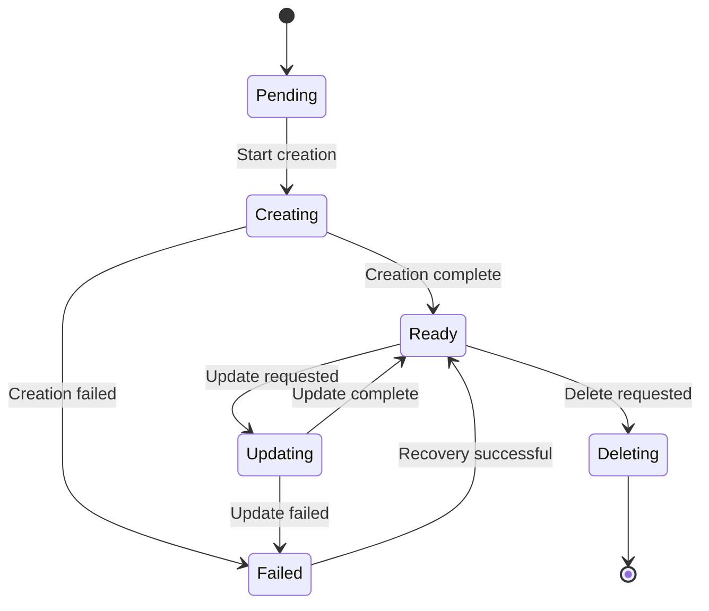

# Урок 4.1: Условия и управление статусом

**Навигация:** [Обзор модуля](../README.md) | [Следующий урок: Финализаторы и очистка →](02-finalizers-cleanup.md)

## Введение

В [Модуле 3](../../module-03/README.md) вы изучили базовые обновления статуса. Теперь реализуем корректное управление статусом с помощью **условий (conditions)** — стандартного для Kubernetes способа сообщать о состоянии ресурса. Условия предоставляют структурированный, машиночитаемый статус, понятный как людям, так и автоматике.

## Что такое условия (conditions)?

Условия — это структурированная информация о статусе, следующая стандартному паттерну:



### Структура условия

```go
type Condition struct {
    Type               string    // e.g., "Ready", "Progressing"
    Status             string    // "True", "False", "Unknown"
    Reason             string    // Short reason code
    Message            string    // Human-readable message
    LastTransitionTime time.Time // When status changed
    ObservedGeneration int64     // Generation this applies to
}
```

## Распространённые типы условий

Kubernetes определяет стандартные типы условий:



- **Ready**: ресурс готов обслуживать трафик/нагрузку
- **Progressing**: работа активно выполняется
- **Degraded**: ресурс работает, но в ухудшенном состоянии
- **Stalled**: прогресс остановился

## Подресурс status

Вспомните из [Модуля 1](../../module-01/lessons/04-custom-resources.md) и [Модуля 3](../../module-03/lessons/02-designing-api.md): status — это подресурс.



## Жизненный цикл условия

Условия переходят между состояниями:



## Реализация условий

### Шаг 1: добавьте условия в status

```go
// DatabaseStatus defines the observed state of Database
type DatabaseStatus struct {
    // Conditions represent the latest observations
    Conditions []metav1.Condition `json:"conditions,omitempty"`
    
    // Phase is a simple status indicator
    Phase string `json:"phase,omitempty"`
    
    // ObservedGeneration tracks the generation this status applies to
    ObservedGeneration int64 `json:"observedGeneration,omitempty"`
}
```

### Шаг 2: вспомогательные функции

```go
import (
    "k8s.io/apimachinery/pkg/api/meta"
    metav1 "k8s.io/apimachinery/pkg/apis/meta/v1"
)

// setCondition sets a condition on the Database
func (r *DatabaseReconciler) setCondition(db *databasev1.Database, conditionType string, status metav1.ConditionStatus, reason, message string) {
    condition := metav1.Condition{
        Type:               conditionType,
        Status:             status,
        Reason:             reason,
        Message:            message,
        LastTransitionTime: metav1.Now(),
        ObservedGeneration: db.Generation,
    }
    
    meta.SetStatusCondition(&db.Status.Conditions, condition)
}

// getCondition gets a condition by type
func (r *DatabaseReconciler) getCondition(db *databasev1.Database, conditionType string) *metav1.Condition {
    return meta.FindStatusCondition(db.Status.Conditions, conditionType)
}
```

### Шаг 3: обновляйте условия в Reconcile

```go
func (r *DatabaseReconciler) Reconcile(ctx context.Context, req ctrl.Request) (ctrl.Result, error) {
    // ... read Database ...
    
    // Check StatefulSet status
    statefulSet := &appsv1.StatefulSet{}
    err := r.Get(ctx, client.ObjectKey{
        Name:      db.Name,
        Namespace: db.Namespace,
    }, statefulSet)
    
    if errors.IsNotFound(err) {
        r.setCondition(db, "Ready", metav1.ConditionFalse, "StatefulSetNotFound", "StatefulSet not found")
        r.setCondition(db, "Progressing", metav1.ConditionTrue, "Creating", "Creating StatefulSet")
        return ctrl.Result{}, r.Status().Update(ctx, db)
    }
    
    // Check if ready
    if statefulSet.Status.ReadyReplicas == *statefulSet.Spec.Replicas {
        r.setCondition(db, "Ready", metav1.ConditionTrue, "AllReplicasReady", "All replicas are ready")
        r.setCondition(db, "Progressing", metav1.ConditionFalse, "ReconciliationComplete", "Reconciliation complete")
    } else {
        r.setCondition(db, "Ready", metav1.ConditionFalse, "ReplicasNotReady", 
            fmt.Sprintf("%d/%d replicas ready", statefulSet.Status.ReadyReplicas, *statefulSet.Spec.Replicas))
        r.setCondition(db, "Progressing", metav1.ConditionTrue, "Scaling", "Waiting for replicas to be ready")
    }
    
    // Update status
    db.Status.ObservedGeneration = db.Generation
    return ctrl.Result{}, r.Status().Update(ctx, db)
}
```

## Стратегии обновления статуса

### Стратегия 1: обновление при каждом согласовании

```go
// Update status every time
return ctrl.Result{}, r.Status().Update(ctx, db)
```

**Плюсы:** всегда актуально  
**Минусы:** может вызывать конфликты при частых обновлениях

### Стратегия 2: обновление только при изменениях

```go
// Only update if conditions changed
if conditionsChanged {
    return ctrl.Result{}, r.Status().Update(ctx, db)
}
```

**Плюсы:** снижает число конфликтов  
**Минусы:** более сложная логика

### Стратегия 3: периодические обновления

```go
// Update status periodically
if time.Since(lastStatusUpdate) > 30*time.Second {
    return ctrl.Result{}, r.Status().Update(ctx, db)
}
```

**Плюсы:** сокращает число вызовов API  
**Минусы:** статус может быть слегка устаревшим

## Конечный автомат условий

Для сложных ресурсов используйте конечный автомат (state machine):



## Сообщение о прогрессе

Используйте условие Progressing, чтобы показывать прогресс:

```go
// During creation
r.setCondition(db, "Progressing", metav1.ConditionTrue, "CreatingStatefulSet", "Creating StatefulSet")

// After StatefulSet created
r.setCondition(db, "Progressing", metav1.ConditionTrue, "WaitingForPods", "Waiting for pods to be ready")

// When complete
r.setCondition(db, "Progressing", metav1.ConditionFalse, "ReconciliationComplete", "Reconciliation complete")
```

## Сообщение об ошибках

Сообщайте об ошибках с помощью условий:

```go
if err != nil {
    r.setCondition(db, "Ready", metav1.ConditionFalse, "Error", err.Error())
    r.setCondition(db, "Progressing", metav1.ConditionFalse, "Error", "Reconciliation failed")
    return ctrl.Result{}, r.Status().Update(ctx, db)
}
```

## Ключевые выводы

- **Условия** предоставляют структурированное, стандартное сообщение о статусе
- Используйте **стандартные типы условий** (Ready, Progressing и т. д.)
- **LastTransitionTime** отслеживает, когда изменился статус
- **ObservedGeneration** отслеживает, к какому поколению spec относится статус
- Обновляйте условия на основе **фактического состояния ресурса**
- Используйте **конечные автоматы** для сложных рабочих процессов
- **Сообщайте о прогрессе** с помощью условия Progressing
- **Чётко сообщайте об ошибках** с помощью условий

## Что нужно понимать для создания операторов

При реализации условий:
- Используйте `meta.SetStatusCondition` для обновлений
- Отслеживайте наблюдаемое поколение (observed generation)
- Обновляйте при изменениях состояния
- Используйте стандартные типы условий
- Указывайте понятные причины и сообщения
- Аккуратно обрабатывайте конфликты

## Связанная лабораторная работа

- [Лабораторная 4.1: Реализация условий статуса](../labs/lab-01-conditions-status.md) — практические упражнения для этого урока

## Источники

### Официальная документация
- [Статус ресурса](https://kubernetes.io/docs/concepts/architecture/controller/#status)
- [Условия](https://github.com/kubernetes/community/blob/master/contributors/devel/sig-architecture/api-conventions.md#typical-status-properties)
- [Подресурс status](https://kubernetes.io/docs/tasks/extend-kubernetes/custom-resources/custom-resource-definitions/#status-subresource)

### Дополнительное чтение
- **Kubernetes Operators**, Jason Dobies и Joshua Wood — глава 5: Status and Conditions
- **Programming Kubernetes**, Michael Hausenblas и Stefan Schimanski — глава 6: Status Management
- [Соглашения об API Kubernetes — Status](https://github.com/kubernetes/community/blob/master/contributors/devel/sig-architecture/api-conventions.md#spec-and-status)

### Смежные темы
- [Типы условий](https://github.com/kubernetes/community/blob/master/contributors/devel/sig-architecture/api-conventions.md#typical-status-properties)
- [Лучшие практики Status](https://sdk.operatorframework.io/docs/best-practices/best-practices/#status)
- [Паттерн Observed Generation](https://github.com/kubernetes/community/blob/master/contributors/devel/sig-architecture/api-conventions.md#generation-and-observedgeneration)

## Дальнейшие шаги

Теперь, когда вы понимаете управление статусом, давайте изучим финализаторы для аккуратной очистки.

**Навигация:** [← Обзор модуля](../README.md) | [Далее: Финализаторы и очистка →](02-finalizers-cleanup.md)
