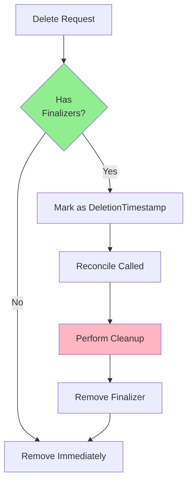
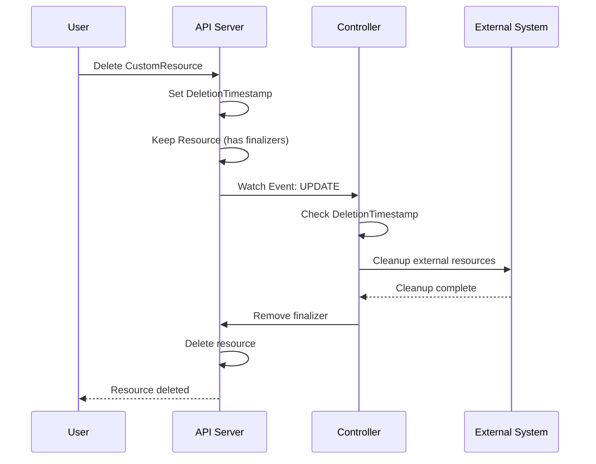
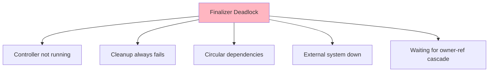

# Урок 4.2: Финализаторы и очистка

**Навигация:** [← Предыдущий: Условия и статус](01-conditions-status.md) | [Обзор модуля](../README.md) | [Далее: Отслеживание и индексирование →](03-watching-indexing.md)

## Введение

Когда пользователь удаляет пользовательский ресурс, часто требуется выполнить очистку до того, как ресурс будет фактически удалён. **Финализаторы (finalizers)** позволяют перехватить удаление и выполнить необходимые операции очистки, такие как удаление внешних ресурсов, резервное копирование данных или уведомление внешних систем.

## Что такое финализаторы?

Финализаторы — это ключи в `metadata.finalizers`, которые предотвращают удаление ресурса, пока не будут удалены:



## Процесс удаления с финализаторами

Вот что происходит при удалении ресурса с финализаторами:



## Реализация финализаторов

### Шаг 1: добавьте финализатор при создании

```go
func (r *DatabaseReconciler) Reconcile(ctx context.Context, req ctrl.Request) (ctrl.Result, error) {
    db := &databasev1.Database{}
    if err := r.Get(ctx, req.NamespacedName, db); err != nil {
        return ctrl.Result{}, err
    }
    
    // Add finalizer if not present
    finalizerName := "database.example.com/finalizer"
    if !controllerutil.ContainsFinalizer(db, finalizerName) {
        controllerutil.AddFinalizer(db, finalizerName)
        if err := r.Update(ctx, db); err != nil {
            return ctrl.Result{}, err
        }
    }
    
    // ... rest of reconciliation ...
}
```

### Шаг 2: обработайте удаление

```go
// Check if resource is being deleted
if !db.DeletionTimestamp.IsZero() {
    // Resource is being deleted
    return r.handleDeletion(ctx, db)
}

// Normal reconciliation
// ...
```

### Шаг 3: реализуйте очистку

```go
func (r *DatabaseReconciler) handleDeletion(ctx context.Context, db *databasev1.Database) (ctrl.Result, error) {
    logger := log.FromContext(ctx)
    finalizerName := "database.example.com/finalizer"
    
    // Check if finalizer exists
    if !controllerutil.ContainsFinalizer(db, finalizerName) {
        // Finalizer already removed, nothing to do
        return ctrl.Result{}, nil
    }
    
    logger.Info("Handling deletion", "name", db.Name)
    
    // Perform cleanup operations
    if err := r.cleanupExternalResources(ctx, db); err != nil {
        logger.Error(err, "Failed to cleanup external resources")
        // Return error to retry
        return ctrl.Result{RequeueAfter: 10 * time.Second}, err
    }
    
    // Cleanup successful, remove finalizer
    controllerutil.RemoveFinalizer(db, finalizerName)
    if err := r.Update(ctx, db); err != nil {
        return ctrl.Result{}, err
    }
    
    logger.Info("Finalizer removed, resource will be deleted")
    return ctrl.Result{}, nil
}
```

## Паттерны очистки

### Паттерн 1: удаление подчинённых ресурсов

```go
func (r *DatabaseReconciler) cleanupExternalResources(ctx context.Context, db *databasev1.Database) error {
    // Owner references handle most cleanup automatically
    // But you might need to delete external resources
    
    // Delete backup in external system
    if err := r.deleteBackup(ctx, db); err != nil {
        return err
    }
    
    return nil
}
```

### Паттерн 2: явное удаление дочерних ресурсов

> **Критически важно:** при использовании финализаторов вы должны **явно удалять** дочерние ресурсы. Ссылки-владельцы каскадно удаляют ресурсы только при удалении родителя, но финализаторы не дают удалить родителя, пока не завершится очистка, — это создаёт взаимоблокировку (deadlock), если вы просто ждёте исчезновения ресурсов.

```go
func (r *DatabaseReconciler) cleanupExternalResources(ctx context.Context, db *databasev1.Database) error {
    log := log.FromContext(ctx)
    
    // Delete StatefulSet if it exists
    statefulSet := &appsv1.StatefulSet{}
    err := r.Get(ctx, client.ObjectKey{
        Name:      db.Name,
        Namespace: db.Namespace,
    }, statefulSet)
    
    if err == nil {
        // StatefulSet exists, delete it explicitly
        log.Info("Deleting StatefulSet", "name", statefulSet.Name)
        if err := r.Delete(ctx, statefulSet); err != nil && !errors.IsNotFound(err) {
            return fmt.Errorf("failed to delete StatefulSet: %w", err)
        }
        // Requeue to wait for deletion to complete
        return fmt.Errorf("waiting for StatefulSet to be deleted")
    } else if !errors.IsNotFound(err) {
        return fmt.Errorf("failed to get StatefulSet: %w", err)
    }
    
    // StatefulSet deleted, continue cleanup
    return nil
}
```

### Паттерн 3: очистка через внешний API

```go
func (r *DatabaseReconciler) cleanupExternalResources(ctx context.Context, db *databasev1.Database) error {
    // Call external API to delete resource
    if err := r.externalAPIClient.DeleteDatabase(db.Name); err != nil {
        return err
    }
    
    return nil
}
```

## Как избежать взаимоблокировок финализаторов

Взаимоблокировки финализаторов могут возникать, когда:



### Распространённая ловушка: взаимоблокировка ссылка-владелец + финализатор

Очень частая взаимоблокировка возникает, когда:
1. У родительского ресурса есть финализатор
2. Код очистки ждёт удаления дочерних ресурсов через ссылки-владельцы
3. Каскадное удаление по ссылке-владельцу работает только при удалении родителя
4. Родитель не может быть удалён, потому что финализатор ждёт исчезновения дочерних ресурсов

**Решение:** всегда явно удаляйте дочерние ресурсы во время очистки — не полагайтесь на каскад ссылок-владельцев.

### Стратегии предотвращения

1. **Явное удаление**: удаляйте дочерние ресурсы явно, не ждите каскада ссылок-владельцев
2. **Идемпотентная очистка**: очистку должно быть безопасно повторять
3. **Таймаут**: задайте максимальное время для очистки
4. **Принудительное удаление**: разрешите ручное удаление финализатора в аварийных ситуациях
5. **Проверки здоровья**: убедитесь, что контроллер работает, перед очисткой

### Пример: защита таймаутом

```go
func (r *DatabaseReconciler) handleDeletion(ctx context.Context, db *databasev1.Database) (ctrl.Result, error) {
    // Check if deletion is taking too long
    if time.Since(db.DeletionTimestamp.Time) > 5*time.Minute {
        log.Info("Deletion timeout, forcing cleanup")
        // Force cleanup or remove finalizer
    }
    
    // ... cleanup ...
}
```

## Несколько финализаторов

У ресурсов может быть несколько финализаторов:

```go
// Add multiple finalizers
controllerutil.AddFinalizer(db, "database.example.com/finalizer")
controllerutil.AddFinalizer(db, "backup.example.com/finalizer")

// Each controller removes its own finalizer
// Resource is deleted when all finalizers are removed
```

## Ключевые выводы

- **Финализаторы** предотвращают удаление, пока не завершится очистка
- Добавляйте финализатор при **создании ресурса**
- Проверяйте **DeletionTimestamp**, чтобы обнаружить удаление
- **Явно удаляйте дочерние ресурсы** — не полагайтесь на каскад ссылок-владельцев (вызывает взаимоблокировку)
- Выполняйте **операции очистки** до удаления финализатора
- Удаляйте финализатор **только после успешной очистки**
- Делайте очистку **идемпотентной** (безопасной для повтора)
- Избегайте **взаимоблокировок финализаторов** с помощью таймаутов и проверок здоровья

## Что нужно понимать для создания операторов

При реализации финализаторов:
- Добавляйте финализатор в начале согласования
- Проверяйте DeletionTimestamp для обнаружения удаления
- Выполняйте всю очистку до удаления финализатора
- Аккуратно обрабатывайте сбои очистки
- Делайте очистку идемпотентной
- Устанавливайте таймауты для предотвращения взаимоблокировок

## Связанная лабораторная работа

- [Лабораторная 4.2: Реализация финализаторов](../labs/lab-02-finalizers-cleanup.md) — практические упражнения для этого урока

## Источники

### Официальная документация
- [Финализаторы](https://kubernetes.io/docs/concepts/overview/working-with-objects/finalizers/)
- [Сборка мусора](https://kubernetes.io/docs/concepts/architecture/garbage-collection/)
- [Ссылки-владельцы](https://kubernetes.io/docs/concepts/overview/working-with-objects/owners-dependents/)

### Дополнительное чтение
- **Kubernetes Operators**, Jason Dobies и Joshua Wood — глава 6: Finalizers and Cleanup
- **Programming Kubernetes**, Michael Hausenblas и Stefan Schimanski — глава 7: Resource Lifecycle
- [Объяснение финализаторов Kubernetes](https://kubernetes.io/docs/concepts/overview/working-with-objects/finalizers/)

### Смежные темы
- [Паттерн ссылок-владельцев](https://kubernetes.io/docs/concepts/overview/working-with-objects/owners-dependents/)
- [Сборка мусора](https://kubernetes.io/docs/concepts/architecture/garbage-collection/)
- [Распространение удаления](https://kubernetes.io/docs/concepts/overview/working-with-objects/owners-dependents/#controlling-how-the-garbage-collector-deletes-dependents)

## Дальнейшие шаги

Теперь, когда вы понимаете финализаторы, давайте изучим отслеживание и индексирование для эффективных контроллеров.

**Навигация:** [← Предыдущий: Условия и статус](01-conditions-status.md) | [Обзор модуля](../README.md) | [Далее: Отслеживание и индексирование →](03-watching-indexing.md)
