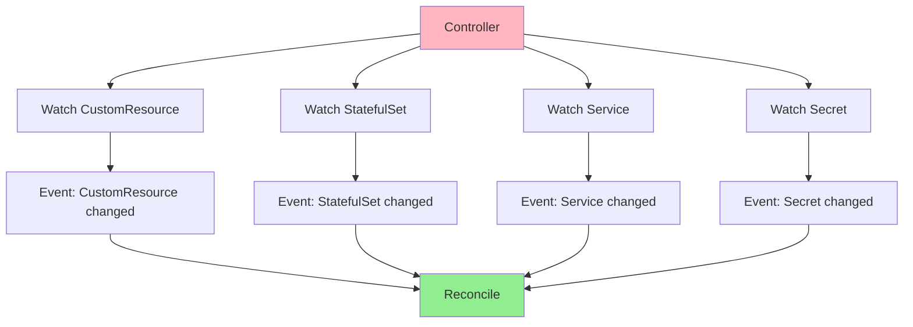
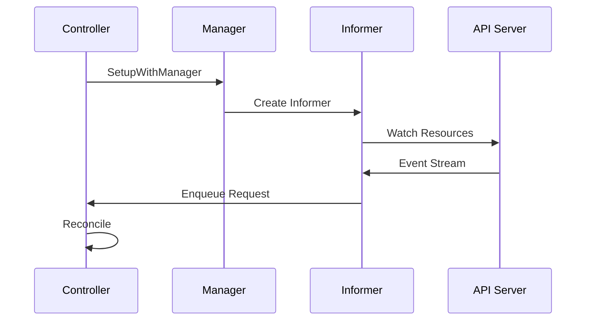
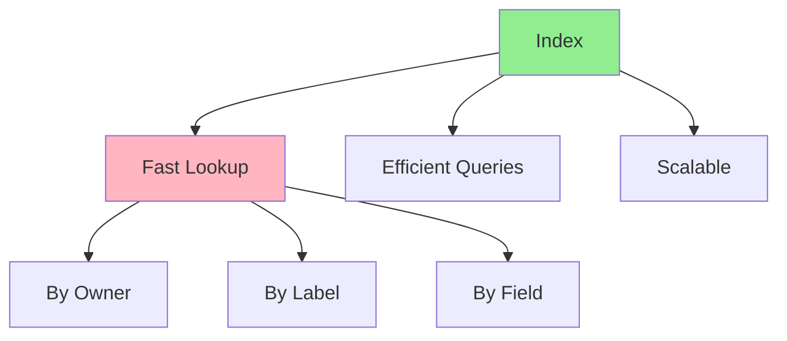
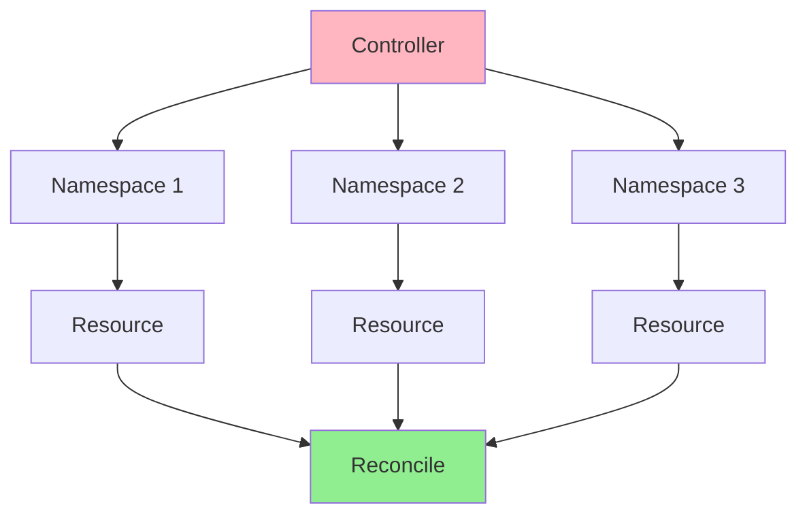
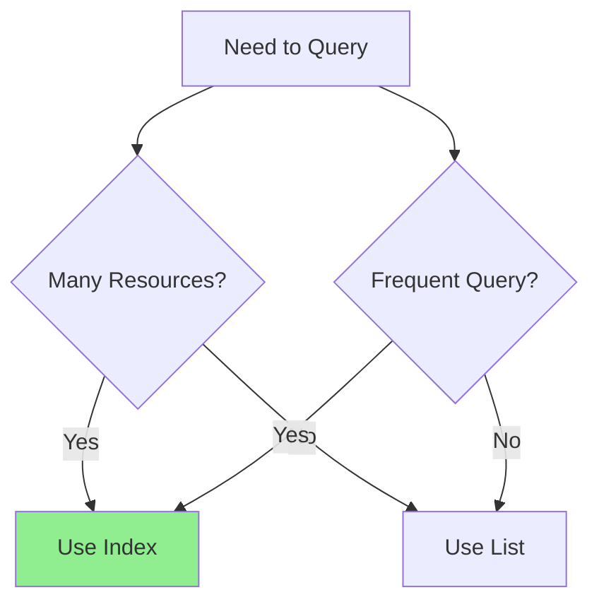

# Урок 4.3: Отслеживание и индексирование

**Навигация:** [← Предыдущий: Финализаторы и очистка](02-finalizers-cleanup.md) | [Обзор модуля](../README.md) | [Далее: Продвинутые паттерны →](04-advanced-patterns.md)

## Введение

В [Модуле 3](../../module-03/README.md) вы изучили базовое согласование. Теперь оптимизируем контроллеры, отслеживая зависимые ресурсы и используя индексы для эффективного поиска. Это делает контроллеры более реактивными и производительными.

## Отслеживание зависимых ресурсов

Контроллеры могут отслеживать ресурсы, которыми они не владеют:



## Процесс настройки отслеживания

Вот как настраивается отслеживание:



## Настройка отслеживания

### Отслеживание подчинённых ресурсов

```go
func (r *DatabaseReconciler) SetupWithManager(mgr ctrl.Manager) error {
    return ctrl.NewControllerManagedBy(mgr).
        For(&databasev1.Database{}).
        Owns(&appsv1.StatefulSet{}).  // Watch owned StatefulSets
        Owns(&corev1.Service{}).      // Watch owned Services
        Complete(r)
}
```

Когда подчинённые ресурсы меняются, владелец согласовывается автоматически.

### Отслеживание неподчинённых ресурсов

```go
func (r *DatabaseReconciler) SetupWithManager(mgr ctrl.Manager) error {
    return ctrl.NewControllerManagedBy(mgr).
        For(&databasev1.Database{}).
        Watches(
            &corev1.Secret{},
            handler.EnqueueRequestsFromMapFunc(r.findDatabasesForSecret),
        ).
        Complete(r)
}

// secretName returns the generated Secret name for a Database
func (r *DatabaseReconciler) secretName(db *databasev1.Database) string {
    return fmt.Sprintf("%s-credentials", db.Name)
}

func (r *DatabaseReconciler) findDatabasesForSecret(ctx context.Context, secret client.Object) []reconcile.Request {
    // Find all Databases that use this Secret
    // Secret name is derived from Database name: {db-name}-credentials
    databases := &databasev1.DatabaseList{}
    r.List(ctx, databases)
    
    var requests []reconcile.Request
    for _, db := range databases.Items {
        if r.secretName(&db) == secret.GetName() &&
            db.Namespace == secret.GetNamespace() {
            requests = append(requests, reconcile.Request{
                NamespacedName: types.NamespacedName{
                    Name:      db.Name,
                    Namespace: db.Namespace,
                },
            })
        }
    }
    return requests
}
```

## Индексы для эффективного поиска

Индексы позволяют быстро искать без перечисления всех ресурсов:



## Настройка индексов

Индексы позволяют эффективно искать по значениям полей без сканирования всех объектов.

### Шаг 1: определите функцию индекса

```go
// Index function: extract the image field from Database objects
func indexDatabaseImage(obj client.Object) []string {
    db, ok := obj.(*databasev1.Database)
    if !ok {
        return nil
    }
    
    if db.Spec.Image != "" {
        return []string{db.Spec.Image}
    }
    return nil
}
```

### Шаг 2: зарегистрируйте индекс

```go
func (r *DatabaseReconciler) SetupWithManager(mgr ctrl.Manager) error {
    // Create index for image field - find all Databases by PostgreSQL version
    if err := mgr.GetFieldIndexer().IndexField(
        context.Background(),
        &databasev1.Database{},
        "spec.image",
        indexDatabaseImage,
    ); err != nil {
        return err
    }
    
    return ctrl.NewControllerManagedBy(mgr).
        For(&databasev1.Database{}).
        Complete(r)
}
```

### Шаг 3: используйте индекс в запросах

```go
// Find all Databases using a specific PostgreSQL image
databases := &databasev1.DatabaseList{}
err := r.List(ctx, databases, client.MatchingFields{
    "spec.image": "postgres:14",
})
// This query is O(1) with index vs O(n) without
```

## Отслеживание между пространствами имён

Отслеживайте ресурсы в разных пространствах имён:



### Отслеживание в масштабе кластера

```go
func (r *DatabaseReconciler) SetupWithManager(mgr ctrl.Manager) error {
    return ctrl.NewControllerManagedBy(mgr).
        For(&databasev1.Database{}).
        Watches(
            &corev1.Namespace{},
            handler.EnqueueRequestsFromMapFunc(r.findDatabasesForNamespace),
        ).
        Complete(r)
}

func (r *DatabaseReconciler) findDatabasesForNamespace(ctx context.Context, namespace client.Object) []reconcile.Request {
    // Reconcile all Databases in this namespace
    databases := &databasev1.DatabaseList{}
    r.List(ctx, databases, client.InNamespace(namespace.GetName()))
    
    var requests []reconcile.Request
    for _, db := range databases.Items {
        requests = append(requests, reconcile.Request{
            NamespacedName: types.NamespacedName{
                Name:      db.Name,
                Namespace: db.Namespace,
            },
        })
    }
    return requests
}
```

## Обработка событий

Обрабатывайте разные типы событий с помощью предикатов (predicates), чтобы фильтровать, какие события запускают согласование:

> **Важно:** при фильтрации обновлений StatefulSet включайте как изменения spec (Generation), ТАК И изменения status (ReadyReplicas). Иначе ваш контроллер не отреагирует на готовность подов!

```go
func (r *DatabaseReconciler) SetupWithManager(mgr ctrl.Manager) error {
    return ctrl.NewControllerManagedBy(mgr).
        For(&databasev1.Database{}).
        Owns(&appsv1.StatefulSet{}, builder.WithPredicates(predicate.Funcs{
            UpdateFunc: func(e event.UpdateEvent) bool {
                oldSS := e.ObjectOld.(*appsv1.StatefulSet)
                newSS := e.ObjectNew.(*appsv1.StatefulSet)
                // Reconcile on spec changes OR status changes
                return oldSS.Generation != newSS.Generation ||
                    oldSS.Status.ReadyReplicas != newSS.Status.ReadyReplicas
            },
            CreateFunc: func(e event.CreateEvent) bool {
                return true
            },
            DeleteFunc: func(e event.DeleteEvent) bool {
                return true
            },
        })).
        Complete(r)
}
```

## Соображения производительности

### Когда использовать индексы



**Используйте индексы, когда:**
- Часто запрашиваете много ресурсов
- Нужен быстрый поиск
- Ресурсы масштабируются до сотен/тысяч

**Используйте List, когда:**
- Ресурсов немного
- Запросы нечастые
- Простая фильтрация

## Ключевые выводы

- **Отслеживайте подчинённые ресурсы** с помощью `Owns()`
- **Отслеживайте неподчинённые ресурсы** с помощью `Watches()`
- **Индексы** обеспечивают быстрый поиск
- **Отслеживание между пространствами имён** для контроллеров в масштабе кластера
- **Предикаты событий** фильтруют, какие события запускают согласование
- **Производительность** улучшается при правильном отслеживании и индексировании

## Что нужно понимать для создания операторов

При настройке отслеживания:
- Отслеживайте ресурсы, влияющие на ваш пользовательский ресурс
- Используйте индексы для частых запросов
- Фильтруйте события с помощью предикатов
- При необходимости отслеживайте между пространствами имён
- Балансируйте производительность и сложность

## Связанная лабораторная работа

- [Лабораторная 4.3: Настройка отслеживания и индексов](../labs/lab-03-watching-indexing.md) — практические упражнения для этого урока

## Источники

### Официальная документация
- [Информеры](https://github.com/kubernetes/client-go/blob/master/tools/cache/shared_informer.go)
- [Селекторы полей](https://kubernetes.io/docs/concepts/overview/working-with-objects/field-selectors/)
- [Индексаторы](https://pkg.go.dev/k8s.io/client-go/tools/cache#Indexer)

### Дополнительное чтение
- **Programming Kubernetes**, Michael Hausenblas и Stefan Schimanski — глава 4: Working with Client Libraries
- **Kubernetes Operators**, Jason Dobies и Joshua Wood — глава 7: Advanced Patterns
- [Информеры client-go](https://github.com/kubernetes/client-go/tree/master/examples/workqueue)

### Смежные темы
- [Паттерн информера](https://github.com/kubernetes/community/blob/master/contributors/devel/sig-api-machinery/controllers.md)
- [Паттерн Workqueue](https://github.com/kubernetes/client-go/blob/master/util/workqueue/)
- [Производительность контроллера](https://kubernetes.io/docs/concepts/architecture/controller/#controller-performance)

## Дальнейшие шаги

Теперь, когда вы понимаете отслеживание и индексирование, давайте изучим продвинутые паттерны, такие как многофазное согласование и конечные автоматы.

**Навигация:** [← Предыдущий: Финализаторы и очистка](02-finalizers-cleanup.md) | [Обзор модуля](../README.md) | [Далее: Продвинутые паттерны →](04-advanced-patterns.md)
