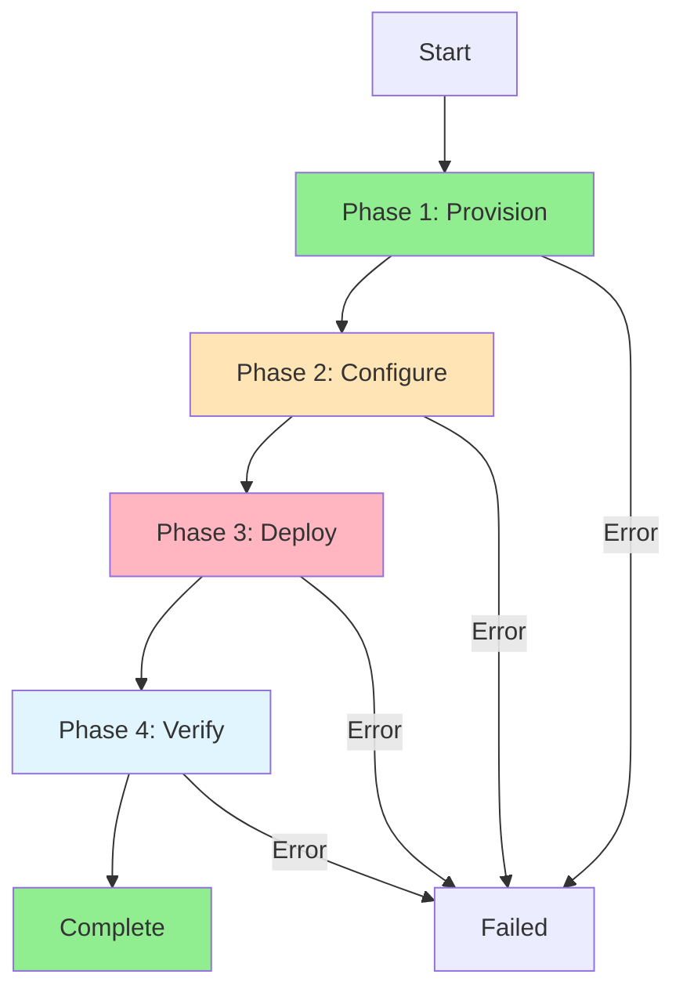
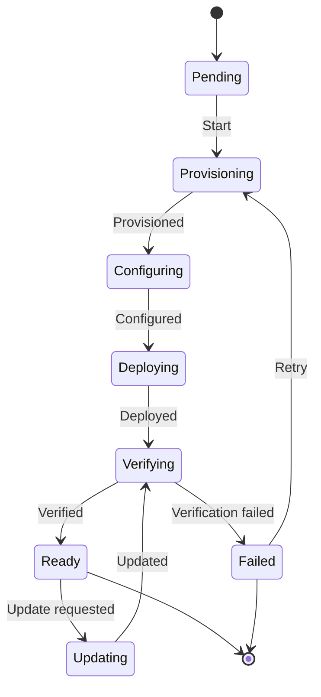
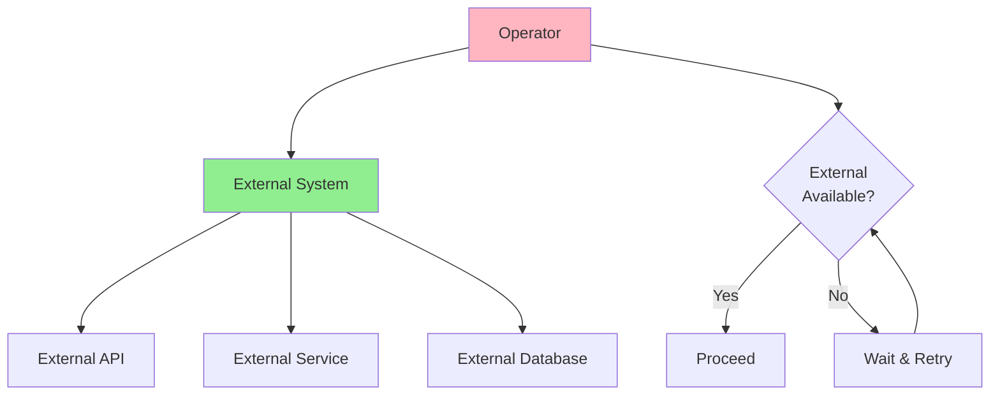
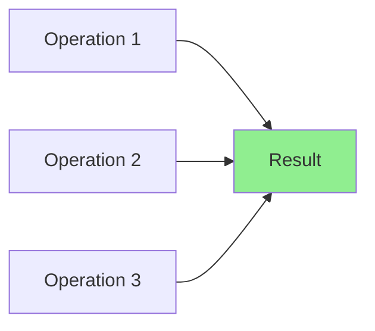
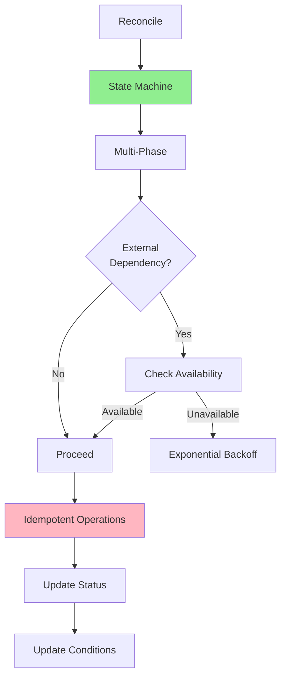

# Урок 4.4: Продвинутые паттерны

**Навигация:** [← Предыдущий: Отслеживание и индексирование](03-watching-indexing.md) | [Обзор модуля](../README.md)

## Введение

Реальным операторам часто приходится обрабатывать сложные сценарии: многофазные развёртывания, конечные автоматы, внешние зависимости и обеспечение идемпотентности. Этот урок охватывает продвинутые паттерны, которые делают операторы надёжными и готовыми к продакшену.

## Многофазное согласование

Сложным ресурсам часто нужно несколько фаз:



### Реализация многофазности

```go
func (r *DatabaseReconciler) Reconcile(ctx context.Context, req ctrl.Request) (ctrl.Result, error) {
    db := &databasev1.Database{}
    if err := r.Get(ctx, req.NamespacedName, db); err != nil {
        return ctrl.Result{}, err
    }
    
    // Determine current phase
    phase := r.getCurrentPhase(db)
    
    switch phase {
    case "Provisioning":
        return r.reconcileProvisioning(ctx, db)
    case "Configuring":
        return r.reconcileConfiguring(ctx, db)
    case "Deploying":
        return r.reconcileDeploying(ctx, db)
    case "Verifying":
        return r.reconcileVerifying(ctx, db)
    case "Ready":
        return r.reconcileReady(ctx, db)
    default:
        return ctrl.Result{}, nil
    }
}

func (r *DatabaseReconciler) getCurrentPhase(db *databasev1.Database) string {
    // Check conditions to determine phase
    ready := meta.FindStatusCondition(db.Status.Conditions, "Ready")
    if ready != nil && ready.Status == metav1.ConditionTrue {
        return "Ready"
    }
    
    // Check resource states to determine phase
    // ...
    
    return "Provisioning"
}
```

## Конечные автоматы (State Machines)

Конечные автоматы обеспечивают структурированные переходы между состояниями:



### Реализация конечного автомата

```go
type DatabaseState string

const (
    StatePending     DatabaseState = "Pending"
    StateProvisioning DatabaseState = "Provisioning"
    StateConfiguring  DatabaseState = "Configuring"
    StateDeploying    DatabaseState = "Deploying"
    StateVerifying    DatabaseState = "Verifying"
    StateReady        DatabaseState = "Ready"
    StateFailed       DatabaseState = "Failed"
)

func (r *DatabaseReconciler) reconcileWithStateMachine(ctx context.Context, db *databasev1.Database) (ctrl.Result, error) {
    currentState := DatabaseState(db.Status.Phase)
    if currentState == "" {
        currentState = StatePending
    }
    
    // State machine transitions
    switch currentState {
    case StatePending:
        return r.transitionToProvisioning(ctx, db)
    case StateProvisioning:
        return r.handleProvisioning(ctx, db)
    case StateConfiguring:
        return r.handleConfiguring(ctx, db)
    case StateDeploying:
        return r.handleDeploying(ctx, db)
    case StateVerifying:
        return r.handleVerifying(ctx, db)
    case StateReady:
        return r.handleReady(ctx, db)
    case StateFailed:
        return r.handleFailed(ctx, db)
    default:
        return ctrl.Result{}, nil
    }
}
```

## Обработка внешних зависимостей

Операторы часто зависят от внешних систем:



### Паттерн внешней зависимости

```go
func (r *DatabaseReconciler) checkExternalDependency(ctx context.Context, db *databasev1.Database) error {
    // Check if external system is available
    if err := r.externalClient.HealthCheck(ctx); err != nil {
        r.setCondition(db, "Ready", metav1.ConditionFalse, "ExternalSystemUnavailable", 
            "External system is not available")
        return err
    }
    
    return nil
}

func (r *DatabaseReconciler) Reconcile(ctx context.Context, req ctrl.Request) (ctrl.Result, error) {
    // ... read Database ...
    
    // Check external dependency
    if err := r.checkExternalDependency(ctx, db); err != nil {
        // Retry after delay
        return ctrl.Result{RequeueAfter: 30 * time.Second}, nil
    }
    
    // Proceed with reconciliation
    // ...
}
```

## Гарантии идемпотентности

Операции должны быть идемпотентными — безопасными для повтора:



### Обеспечение идемпотентности

```go
// Bad: Not idempotent
func (r *DatabaseReconciler) createSecret(ctx context.Context, db *databasev1.Database) error {
    secret := &corev1.Secret{
        // ... create secret ...
    }
    return r.Create(ctx, secret)  // Will fail if exists
}

// Good: Idempotent
func (r *DatabaseReconciler) ensureSecret(ctx context.Context, db *databasev1.Database) error {
    secret := &corev1.Secret{}
    err := r.Get(ctx, client.ObjectKey{
        Name:      db.Name + "-secret",
        Namespace: db.Namespace,
    }, secret)
    
    if errors.IsNotFound(err) {
        // Create if doesn't exist
        secret = r.buildSecret(db)
        return r.Create(ctx, secret)
    } else if err != nil {
        return err
    }
    
    // Already exists, check if update needed
    desiredSecret := r.buildSecret(db)
    if !reflect.DeepEqual(secret.Data, desiredSecret.Data) {
        secret.Data = desiredSecret.Data
        return r.Update(ctx, secret)
    }
    
    // Already in desired state
    return nil
}
```

## Паттерны стабильности

### Паттерн 1: ограничение частоты (Rate Limiting)

```go
func (r *DatabaseReconciler) Reconcile(ctx context.Context, req ctrl.Request) (ctrl.Result, error) {
    // ... reconciliation ...
    
    // Rate limit external API calls
    if time.Since(r.lastAPICall) < 1*time.Second {
        return ctrl.Result{RequeueAfter: 1 * time.Second}, nil
    }
    
    r.lastAPICall = time.Now()
    // Make API call
    // ...
}
```

### Паттерн 2: экспоненциальная задержка (Exponential Backoff)

```go
func (r *DatabaseReconciler) handleError(ctx context.Context, db *databasev1.Database, err error) (ctrl.Result, error) {
    // Get retry count from annotation
    retryCount := getRetryCount(db)
    
    // Exponential backoff: 5s, 10s, 20s, 40s, max 5min
    backoff := time.Duration(math.Min(float64(5*time.Second*math.Pow(2, float64(retryCount))), 
        float64(5*time.Minute)))
    
    // Increment retry count
    setRetryCount(db, retryCount+1)
    r.Update(ctx, db)
    
    return ctrl.Result{RequeueAfter: backoff}, err
}
```

### Паттерн 3: размыкатель цепи (Circuit Breaker)

```go
type CircuitBreaker struct {
    failures     int
    lastFailure time.Time
    state       string // "closed", "open", "half-open"
}

func (cb *CircuitBreaker) Call(fn func() error) error {
    if cb.state == "open" {
        if time.Since(cb.lastFailure) > 1*time.Minute {
            cb.state = "half-open"
        } else {
            return fmt.Errorf("circuit breaker open")
        }
    }
    
    err := fn()
    if err != nil {
        cb.failures++
        cb.lastFailure = time.Now()
        if cb.failures > 5 {
            cb.state = "open"
        }
        return err
    }
    
    // Success
    cb.failures = 0
    cb.state = "closed"
    return nil
}
```

## Комбинирование паттернов

Реальные операторы комбинируют несколько паттернов:



## Ключевые выводы

- **Многофазное согласование** обрабатывает сложные развёртывания
- **Конечные автоматы** обеспечивают структурированные переходы между состояниями
- **Внешние зависимости** требуют проверок доступности и повторов
- **Идемпотентность** критически важна — операции должны быть безопасны для повтора
- **Ограничение частоты** предотвращает перегрузку внешних систем
- **Экспоненциальная задержка** обрабатывает временные сбои
- **Размыкатели цепи (circuit breakers)** защищают от каскадных сбоев
- **Комбинируйте паттерны** для надёжных операторов

## Что нужно понимать для создания операторов

При реализации продвинутых паттернов:
- Используйте конечные автоматы для сложных рабочих процессов
- Разбивайте сложные операции на фазы
- Всегда проверяйте внешние зависимости
- Обеспечивайте идемпотентность всех операций
- Реализуйте ограничение частоты и задержку
- Используйте размыкатели цепи для устойчивости
- Комбинируйте паттерны по необходимости

## Связанная лабораторная работа

- [Лабораторная 4.4: Многофазное согласование](../labs/lab-04-advanced-patterns.md) — практические упражнения для этого урока

## Источники

### Официальная документация
- [Концепции контроллеров Kubernetes](https://kubernetes.io/docs/concepts/architecture/controller/)
- [Kubebuilder: проектирование API](https://book.kubebuilder.io/cronjob-tutorial/api-design)
- [Controller Runtime: интерфейс Reconciler](https://pkg.go.dev/sigs.k8s.io/controller-runtime/pkg/reconcile)

### Дополнительное чтение
- **Kubernetes Operators**, Jason Dobies и Joshua Wood — глава 8: Advanced Patterns
- **Programming Kubernetes**, Michael Hausenblas и Stefan Schimanski — глава 8: Advanced Controller Patterns
- [Паттерны проектирования контроллеров](https://github.com/kubernetes/community/blob/master/contributors/devel/sig-api-machinery/controllers.md)

### Смежные темы
- [Паттерн конечного автомата](https://en.wikipedia.org/wiki/Finite-state_machine)
- [Идемпотентность в распределённых системах](https://en.wikipedia.org/wiki/Idempotence)
- [Паттерн Circuit Breaker](https://en.wikipedia.org/wiki/Circuit_breaker_design_pattern)

## Дальнейшие шаги

Поздравляем! Вы завершили Модуль 4. Теперь вы понимаете:
- Управление статусом с помощью условий
- Финализаторы для очистки
- Отслеживание и индексирование
- Продвинутые паттерны согласования

В [Модуле 5](../../module-05/README.md) вы изучите вебхуки для валидации и мутации.

**Навигация:** [← Предыдущий: Отслеживание и индексирование](03-watching-indexing.md) | [Обзор модуля](../README.md) | [Далее: Модуль 5 →](../../module-05/README.md)
