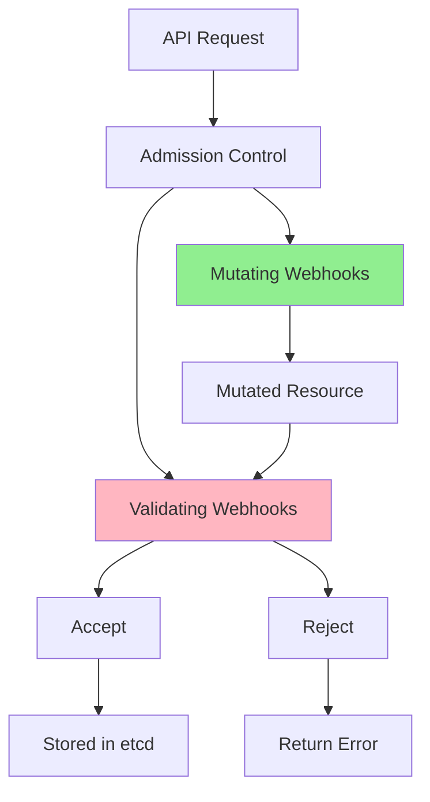
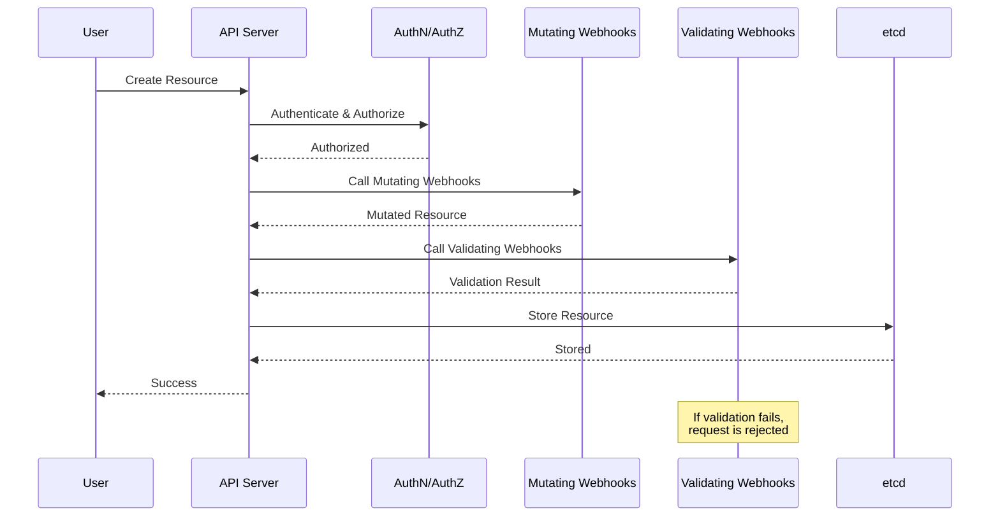
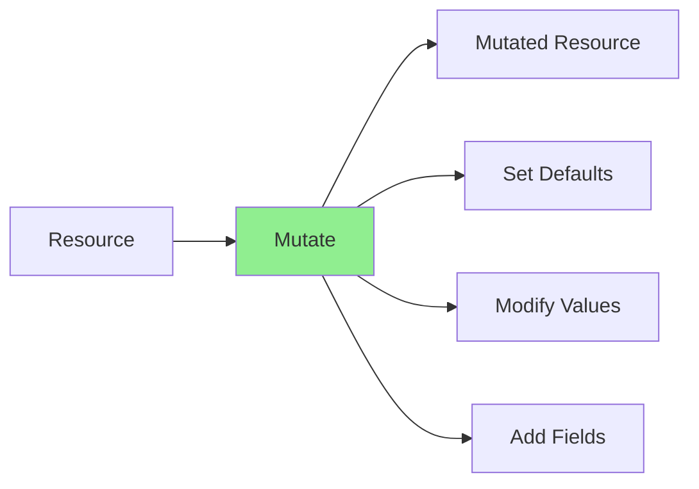
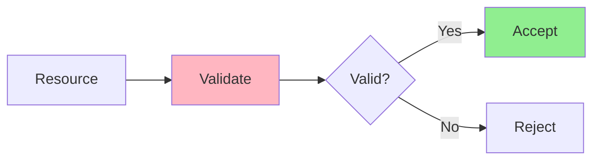
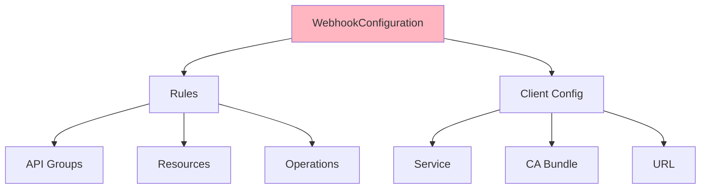
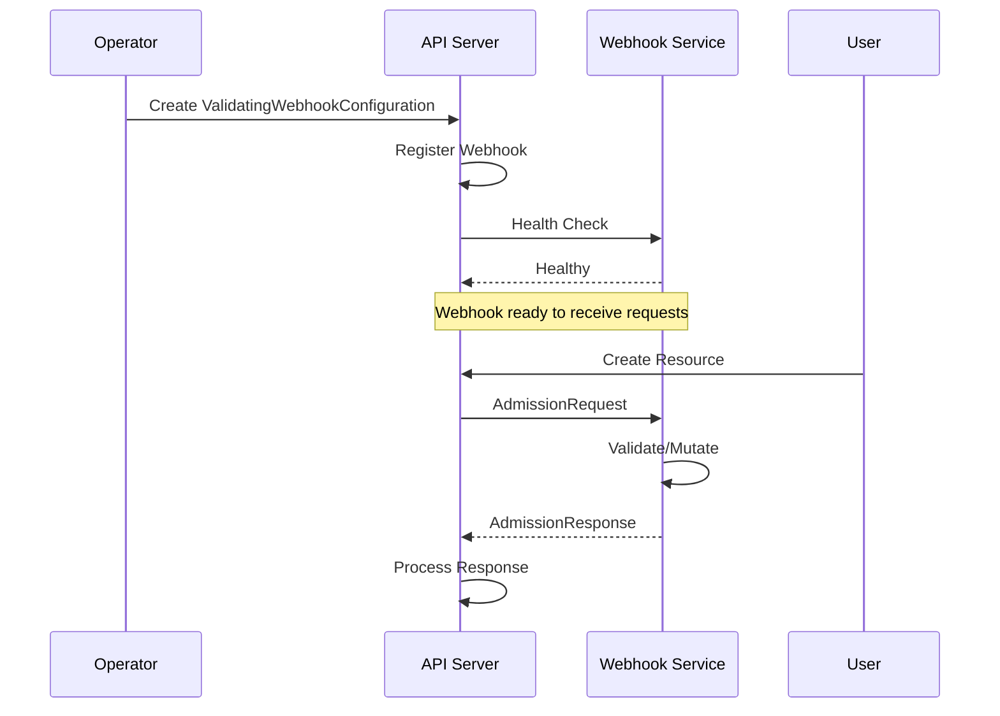
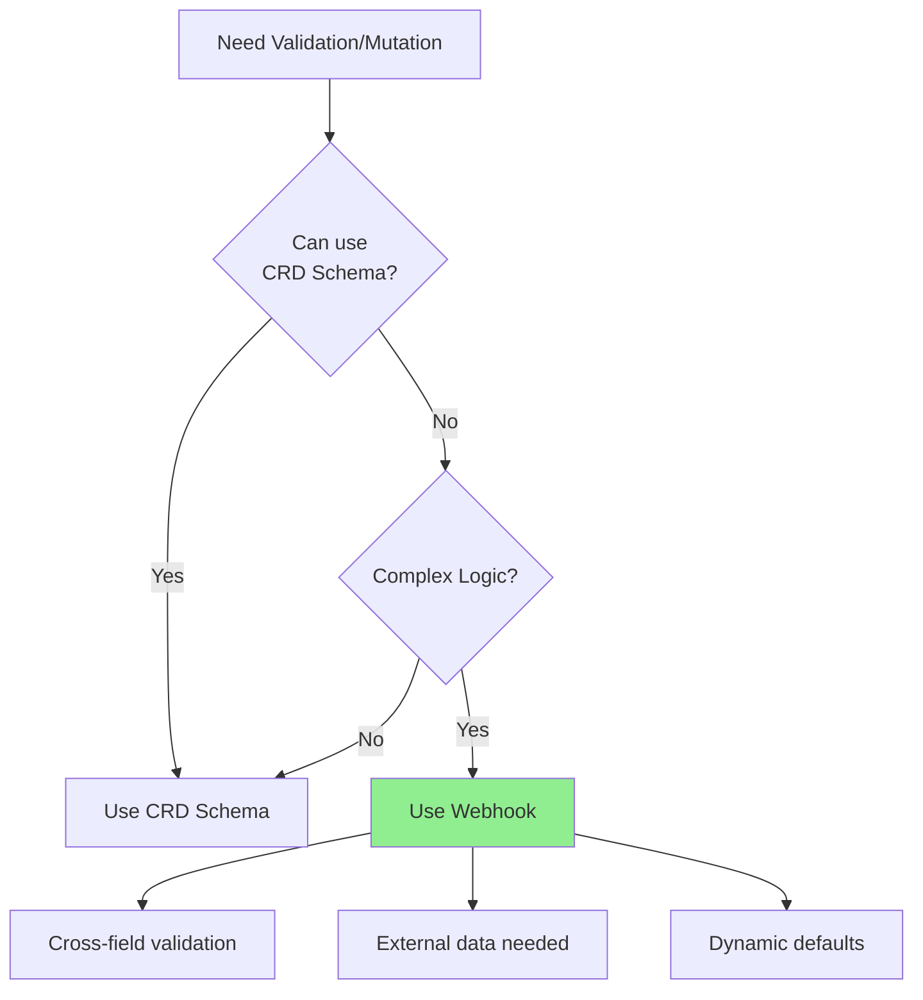

# Урок 5.1: Контроль допуска в Kubernetes

**Навигация:** [Обзор модуля](../README.md) | [Следующий урок: Валидирующие вебхуки →](02-validating-webhooks.md)

## Введение

В [Модуле 1](../../module-01/lessons/04-custom-resources.md) и [Модуле 3](../../module-03/lessons/02-designing-api.md) вы изучили валидацию схемы CRD. Но иногда нужна более сложная валидация или требуется динамически устанавливать значения по умолчанию. **Вебхуки контроля допуска (admission webhooks)** позволяют перехватывать создание/обновление ресурсов и валидировать или мутировать их до сохранения.

## Что такое контроль допуска (admission control)?

Контроль допуска — это возможность Kubernetes перехватывать запросы к API-серверу:



## Процесс контроля допуска

Вот полный процесс при создании ресурса:



## Мутирующие против валидирующих вебхуков

### Мутирующие вебхуки

**Назначение:** изменять ресурсы до валидации



**Сценарии использования:**
- Установка значений по умолчанию
- Добавление обязательных полей
- Изменение структуры ресурса
- Внедрение sidecar-контейнеров

**Порядок:** запускаются **до** валидирующих вебхуков

### Валидирующие вебхуки

**Назначение:** валидировать ресурсы и принимать/отклонять



**Сценарии использования:**
- Сложные правила валидации
- Валидация между полями
- Валидация бизнес-логики
- Обеспечение политик

**Порядок:** запускаются **после** мутирующих вебхуков

## Конфигурация вебхуков

Вебхуки настраиваются через `ValidatingWebhookConfiguration` или `MutatingWebhookConfiguration`:



### Правила вебхука

Правила определяют, когда вызываются вебхуки:

```yaml
rules:
- apiGroups: ["database.example.com"]
  apiVersions: ["v1"]
  resources: ["databases"]
  operations: ["CREATE", "UPDATE"]
```

### Конфигурация клиента

Определяет, как достучаться до вебхука:

```yaml
clientConfig:
  service:
    name: database-webhook-service
    namespace: default
    path: "/validate-database"
  caBundle: <base64-encoded-ca-cert>
```

## Запрос/ответ допуска (Admission Request/Response)

### Структура запроса

```go
type AdmissionRequest struct {
    UID      string
    Kind     metav1.GroupVersionKind
    Resource metav1.GroupVersionResource
    Object   runtime.RawExtension  // The resource being created/updated
    OldObject runtime.RawExtension // Previous version (for updates)
    Operation string               // CREATE, UPDATE, DELETE
    UserInfo  authenticationv1.UserInfo
}
```

### Структура ответа

```go
type AdmissionResponse struct {
    UID     string
    Allowed bool
    Result  *metav1.Status  // Error details if not allowed
    Patch   []byte          // JSON patch for mutations
    PatchType *PatchType    // JSONPatch or StrategicMergePatch
}
```

## Процесс регистрации вебхука

Вот как регистрируются вебхуки:



## Когда использовать вебхуки

### Используйте вебхуки, когда:



**Используйте вебхуки для:**
- Валидации между полями (поле A зависит от поля B)
- Валидации по внешним данным (проверка через внешний API)
- Сложных бизнес-правил
- Динамических значений по умолчанию на основе контекста
- Обеспечения политик

**Используйте схему CRD для:**
- Простой валидации полей
- Проверки типов
- Обязательных полей
- Сопоставления с шаблоном
- Значений перечислений (enum)

## Ключевые выводы

- **Контроль допуска** перехватывает запросы к API
- **Мутирующие вебхуки** изменяют ресурсы (запускаются первыми)
- **Валидирующие вебхуки** валидируют ресурсы (запускаются после мутации)
- **Конфигурация вебхука** определяет, когда и как вызываются вебхуки
- **Структуры запроса/ответа допуска** определяют интерфейс
- Используйте вебхуки для **сложной валидации**, с которой не справляется схема CRD
- Используйте схему CRD для **простой валидации**

## Что нужно понимать для создания операторов

При реализации вебхуков:
- Мутирующие вебхуки запускаются до валидирующих
- Оба могут отклонять запросы
- Мутирующие вебхуки возвращают патчи
- Валидирующие вебхуки возвращают разрешить/отклонить
- Вебхукам нужны сертификаты для TLS
- Вебхуки должны быть быстрыми (влияют на задержку API)

## Связанная лабораторная работа

- [Лабораторная 5.1: Исследование контроля допуска](../labs/lab-01-admission-control.md) — практические упражнения для этого урока

## Источники

### Официальная документация
- [Динамический контроль допуска](https://kubernetes.io/docs/reference/access-authn-authz/extensible-admission-controllers/)
- [Контроллеры допуска](https://kubernetes.io/docs/reference/access-authn-authz/admission-controllers/)
- [Конфигурация вебхука](https://kubernetes.io/docs/reference/access-authn-authz/extensible-admission-controllers/#webhook-configuration)

### Дополнительное чтение
- **Kubernetes Operators**, Jason Dobies и Joshua Wood — глава 9: Webhooks
- **Programming Kubernetes**, Michael Hausenblas и Stefan Schimanski — глава 9: Admission Control
- [Руководство по контролю допуска Kubernetes](https://kubernetes.io/docs/reference/access-authn-authz/extensible-admission-controllers/)

### Смежные темы
- [Валидирующие вебхуки допуска](https://kubernetes.io/docs/reference/access-authn-authz/admission-controllers/#validatingadmissionwebhook)
- [Мутирующие вебхуки допуска](https://kubernetes.io/docs/reference/access-authn-authz/admission-controllers/#validatingadmissionwebhook)
- [Лучшие практики вебхуков](https://kubernetes.io/docs/concepts/cluster-administration/admission-webhooks-good-practices/)

## Дальнейшие шаги

Теперь, когда вы понимаете контроль допуска, давайте реализуем валидирующий вебхук для вашего оператора.

**Навигация:** [← Обзор модуля](../README.md) | [Далее: Валидирующие вебхуки →](02-validating-webhooks.md)
