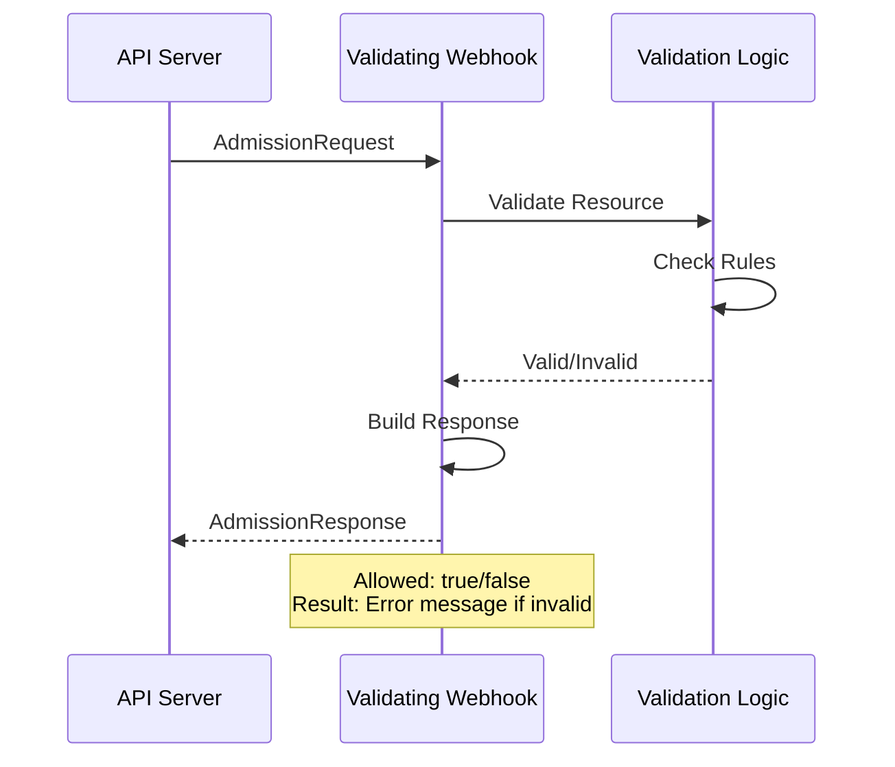
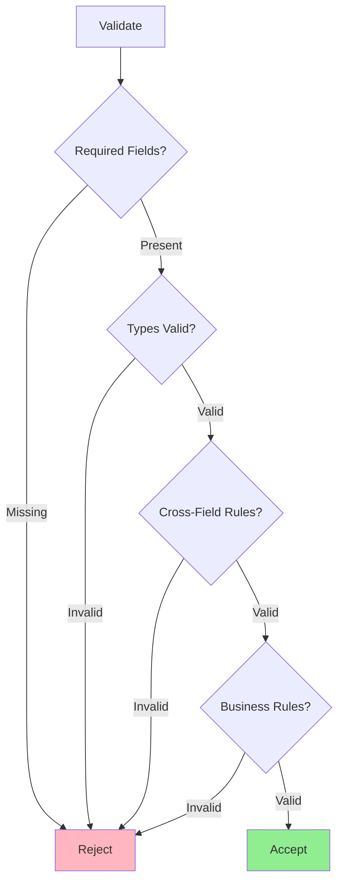
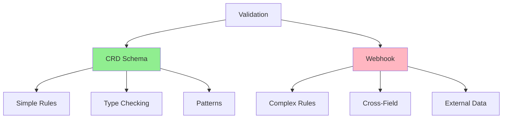
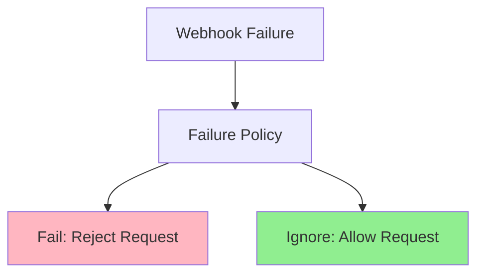

# Урок 5.2: Реализация валидирующих вебхуков

**Навигация:** [← Предыдущий: Контроль допуска](01-admission-control.md) | [Обзор модуля](../README.md) | [Далее: Мутирующие вебхуки →](03-mutating-webhooks.md)

## Введение

Валидирующие вебхуки позволяют реализовать пользовательскую логику валидации, выходящую за рамки валидации схемы CRD. Вы можете проверять взаимосвязи между полями, сверяться с внешними системами и обеспечивать сложные бизнес-правила. В этом уроке вы научитесь реализовывать валидирующие вебхуки с помощью kubebuilder.

## Процесс работы валидирующего вебхука

Вот как работает валидирующий вебхук:



## Создание валидирующего вебхука с помощью Kubebuilder

Kubebuilder упрощает генерацию каркаса вебхуков:

```bash
# Create validating webhook
kubebuilder create webhook --group database --version v1 --kind Database --programmatic-validation
```

Это генерирует:
- Код обработчика вебхука
- Манифесты конфигурации вебхука
- Настройку сертификатов

## Структура обработчика вебхука

Сгенерированный обработчик вебхука в `internal/webhook/v1/database_webhook.go` выглядит так:

```go
package v1

import (
    "context"
    "fmt"

    "k8s.io/apimachinery/pkg/runtime"
    ctrl "sigs.k8s.io/controller-runtime"
    logf "sigs.k8s.io/controller-runtime/pkg/log"
    "sigs.k8s.io/controller-runtime/pkg/webhook"
    "sigs.k8s.io/controller-runtime/pkg/webhook/admission"

    databasev1 "github.com/example/postgres-operator/api/v1"
)

var databaselog = logf.Log.WithName("database-resource")

// SetupDatabaseWebhookWithManager registers the webhook for Database in the manager.
func SetupDatabaseWebhookWithManager(mgr ctrl.Manager) error {
    return ctrl.NewWebhookManagedBy(mgr).For(&databasev1.Database{}).
        WithValidator(&DatabaseCustomValidator{}).
        Complete()
}

// +kubebuilder:webhook:path=/validate-database-example-com-v1-database,mutating=false,failurePolicy=fail,sideEffects=None,groups=database.example.com,resources=databases,verbs=create;update,versions=v1,name=vdatabase-v1.kb.io,admissionReviewVersions=v1

// DatabaseCustomValidator struct is responsible for validating the Database resource
// when it is created, updated, or deleted.
type DatabaseCustomValidator struct {
    // Add more fields as needed for validation
}

var _ webhook.CustomValidator = &DatabaseCustomValidator{}

// ValidateCreate implements webhook.CustomValidator so a webhook will be registered for the type Database.
func (v *DatabaseCustomValidator) ValidateCreate(ctx context.Context, obj runtime.Object) (admission.Warnings, error) {
    database, ok := obj.(*databasev1.Database)
    if !ok {
        return nil, fmt.Errorf("expected a Database object but got %T", obj)
    }
    databaselog.Info("Validation for Database upon creation", "name", database.GetName())

    // Validation logic for CREATE
    return nil, nil
}

// ValidateUpdate implements webhook.CustomValidator so a webhook will be registered for the type Database.
func (v *DatabaseCustomValidator) ValidateUpdate(ctx context.Context, oldObj, newObj runtime.Object) (admission.Warnings, error) {
    database, ok := newObj.(*databasev1.Database)
    if !ok {
        return nil, fmt.Errorf("expected a Database object for the newObj but got %T", newObj)
    }
    databaselog.Info("Validation for Database upon update", "name", database.GetName())

    // Validation logic for UPDATE
    return nil, nil
}

// ValidateDelete implements webhook.CustomValidator so a webhook will be registered for the type Database.
func (v *DatabaseCustomValidator) ValidateDelete(ctx context.Context, obj runtime.Object) (admission.Warnings, error) {
    database, ok := obj.(*databasev1.Database)
    if !ok {
        return nil, fmt.Errorf("expected a Database object but got %T", obj)
    }
    databaselog.Info("Validation for Database upon deletion", "name", database.GetName())

    // Validation logic for DELETE
    return nil, nil
}
```

**Ключевые моменты о структуре:**
- Код вебхука находится в каталоге `internal/webhook/v1/`, а не в `api/v1/`
- Используется отдельная структура `DatabaseCustomValidator` (а не методы типа Database)
- Реализует интерфейс `webhook.CustomValidator`
- Все методы получают `context.Context` первым параметром
- `ValidateUpdate` получает и `oldObj`, и `newObj` как `runtime.Object`
- Объекты нужно приводить по типу (type-assert) к фактическому типу Database

## Реализация логики валидации

### Пример: валидация между полями

```go
func (v *DatabaseCustomValidator) ValidateCreate(ctx context.Context, obj runtime.Object) (admission.Warnings, error) {
    database, ok := obj.(*databasev1.Database)
    if !ok {
        return nil, fmt.Errorf("expected a Database object but got %T", obj)
    }
    databaselog.Info("Validation for Database upon creation", "name", database.GetName())

    // Example: Validate that replicas match storage size
    if database.Spec.Replicas != nil && *database.Spec.Replicas > 5 {
        if database.Spec.Storage.Size == "10Gi" {
            return nil, fmt.Errorf("replicas > 5 requires storage >= 50Gi, got %s", database.Spec.Storage.Size)
        }
    }
    
    // Example: Validate image version
    if !strings.Contains(database.Spec.Image, "postgres") {
        return nil, fmt.Errorf("image must be a PostgreSQL image, got %s", database.Spec.Image)
    }
    
    return nil, nil
}
```

### Пример: валидация обновления

```go
func (v *DatabaseCustomValidator) ValidateUpdate(ctx context.Context, oldObj, newObj runtime.Object) (admission.Warnings, error) {
    database, ok := newObj.(*databasev1.Database)
    if !ok {
        return nil, fmt.Errorf("expected a Database object for the newObj but got %T", newObj)
    }
    oldDB, ok := oldObj.(*databasev1.Database)
    if !ok {
        return nil, fmt.Errorf("expected a Database object for the oldObj but got %T", oldObj)
    }
    databaselog.Info("Validation for Database upon update", "name", database.GetName())
    
    // Prevent downgrading image version
    oldVersion := extractVersion(oldDB.Spec.Image)
    newVersion := extractVersion(database.Spec.Image)
    
    if compareVersions(oldVersion, newVersion) < 0 {
        return nil, fmt.Errorf("cannot downgrade from %s to %s", oldDB.Spec.Image, database.Spec.Image)
    }
    
    // Prevent reducing storage size
    oldSize := parseSize(oldDB.Spec.Storage.Size)
    newSize := parseSize(database.Spec.Storage.Size)
    
    if newSize < oldSize {
        return nil, fmt.Errorf("cannot reduce storage from %s to %s", oldDB.Spec.Storage.Size, database.Spec.Storage.Size)
    }
    
    return nil, nil
}
```

## Дерево решений валидации



## Сообщения об ошибках

Предоставляйте понятные, применимые сообщения об ошибках:

```go
func (v *DatabaseCustomValidator) ValidateCreate(ctx context.Context, obj runtime.Object) (admission.Warnings, error) {
    database, ok := obj.(*databasev1.Database)
    if !ok {
        return nil, fmt.Errorf("expected a Database object but got %T", obj)
    }

    // Bad: Generic error
    // return nil, fmt.Errorf("invalid")
    
    // Good: Specific error with context
    if database.Spec.Replicas != nil && *database.Spec.Replicas < 1 {
        return nil, fmt.Errorf("spec.replicas must be >= 1, got %d", *database.Spec.Replicas)
    }
    
    // Good: Error with field path
    if database.Spec.DatabaseName == "" {
        return nil, fmt.Errorf("spec.databaseName is required")
    }
    
    return nil, nil
}
```

## Валидация схемы против валидации вебхуком



**Схема CRD:**
- Быстрая (без сетевого вызова)
- Простая валидация
- Проверка типов
- Сопоставление с шаблоном

**Вебхук:**
- Более гибкий
- Сложная логика
- Внешние данные
- Валидация между полями

**Лучшая практика:** используйте схему для простой валидации, вебхук — для сложной.

## Маркеры вебхука

Kubebuilder использует маркеры для настройки вебхуков:

```go
// +kubebuilder:webhook:path=/validate-database-example-com-v1-database,mutating=false,failurePolicy=fail,sideEffects=None,groups=database.example.com,resources=databases,verbs=create;update,versions=v1,name=vdatabase-v1.kb.io,admissionReviewVersions=v1
```

**Параметры:**
- `path`: путь эндпоинта вебхука
- `mutating`: false для валидирующего вебхука
- `failurePolicy`: fail или ignore
- `sideEffects`: None, NoneOnDryRun или Some
- `groups`, `resources`, `verbs`, `versions`: что валидировать
- `name`: уникальное имя вебхука (формат: `vdatabase-v1.kb.io`)
- `admissionReviewVersions`: версии API для admission review (например, `v1`)

## Политики при сбое (Failure Policies)



**Политика Fail:**
- Если вебхук завершается сбоем, запрос отклоняется
- Безопаснее, но может блокировать операции, если вебхук недоступен

**Политика Ignore:**
- Если вебхук завершается сбоем, запрос разрешается
- Менее безопасно, но более устойчиво

## Ключевые выводы

- **Валидирующие вебхуки** проверяют ресурсы и принимают/отклоняют
- Используйте kubebuilder для лёгкой **генерации каркаса вебхуков**
- Реализуйте интерфейс `webhook.CustomValidator` с отдельной структурой-валидатором
- Методы получают `context.Context` первым параметром
- `ValidateUpdate` получает и старый, и новый объект как `runtime.Object`
- Приводите по типу `runtime.Object` к фактическому типу вашего ресурса
- Предоставляйте **понятные сообщения об ошибках** для пользователей
- Используйте для **сложной валидации** за рамками схемы CRD
- Выбирайте подходящую **политику при сбое** (fail или ignore)
- **Валидация схемы** запускается первой, затем валидация вебхуком

## Что нужно понимать для создания операторов

При реализации валидирующих вебхуков:
- Используйте отдельную структуру-валидатор, реализующую `webhook.CustomValidator`
- Код вебхука размещается в каталоге `internal/webhook/v1/`
- Приводите по типу параметры `runtime.Object` к фактическому типу вашего ресурса
- Используйте для сложной логики валидации
- Предоставляйте понятные, применимые сообщения об ошибках
- Обрабатывайте все операции (create, update, delete)
- Тщательно выбирайте политику при сбое
- Держите валидацию быстрой (влияет на задержку API)
- Тщательно тестируйте на корректных и некорректных ресурсах

## Связанная лабораторная работа

- [Лабораторная 5.2: Создание валидирующего вебхука](../labs/lab-02-validating-webhooks.md) — практические упражнения для этого урока

## Источники

### Официальная документация
- [Валидирующие вебхуки допуска](https://kubernetes.io/docs/reference/access-authn-authz/admission-controllers/#validatingadmissionwebhook)
- [API AdmissionReview](https://kubernetes.io/docs/reference/access-authn-authz/extensible-admission-controllers/#webhook-request-and-response)
- [Конфигурация вебхука](https://kubernetes.io/docs/reference/access-authn-authz/extensible-admission-controllers/#webhook-configuration)

### Дополнительное чтение
- **Kubernetes Operators**, Jason Dobies и Joshua Wood — глава 9: Webhooks
- **Programming Kubernetes**, Michael Hausenblas и Stefan Schimanski — глава 9: Admission Control
- [Вебхуки Kubebuilder](https://book.kubebuilder.io/cronjob-tutorial/webhook-implementation.html)

### Смежные темы
- [Запрос/ответ AdmissionReview](https://kubernetes.io/docs/reference/access-authn-authz/extensible-admission-controllers/#webhook-request-and-response)
- [Политика при сбое вебхука](https://kubernetes.io/docs/reference/access-authn-authz/extensible-admission-controllers/#failure-policy)
- [Таймауты вебхука](https://kubernetes.io/docs/reference/access-authn-authz/extensible-admission-controllers/#timeouts)

## Дальнейшие шаги

Теперь, когда вы понимаете валидирующие вебхуки, давайте изучим мутирующие вебхуки для установки значений по умолчанию и мутации.

**Навигация:** [← Предыдущий: Контроль допуска](01-admission-control.md) | [Обзор модуля](../README.md) | [Далее: Мутирующие вебхуки →](03-mutating-webhooks.md)
