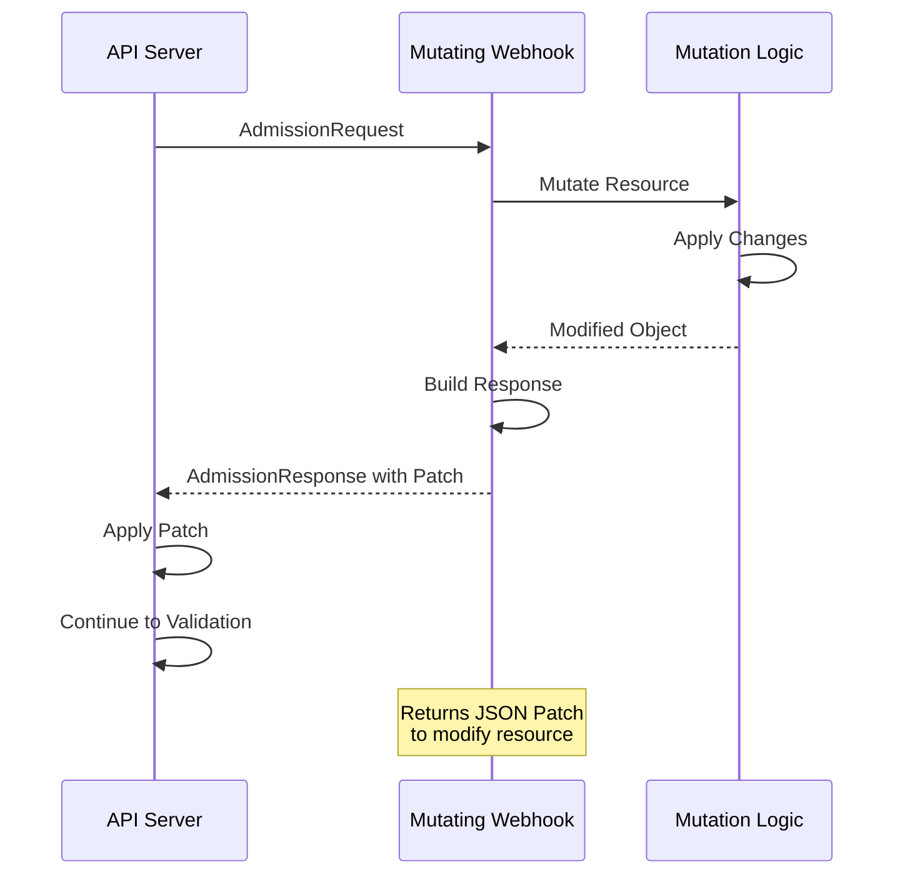
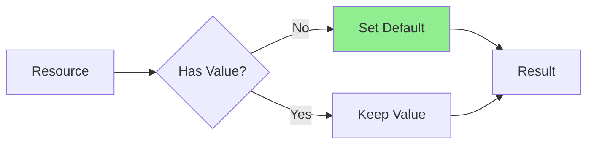
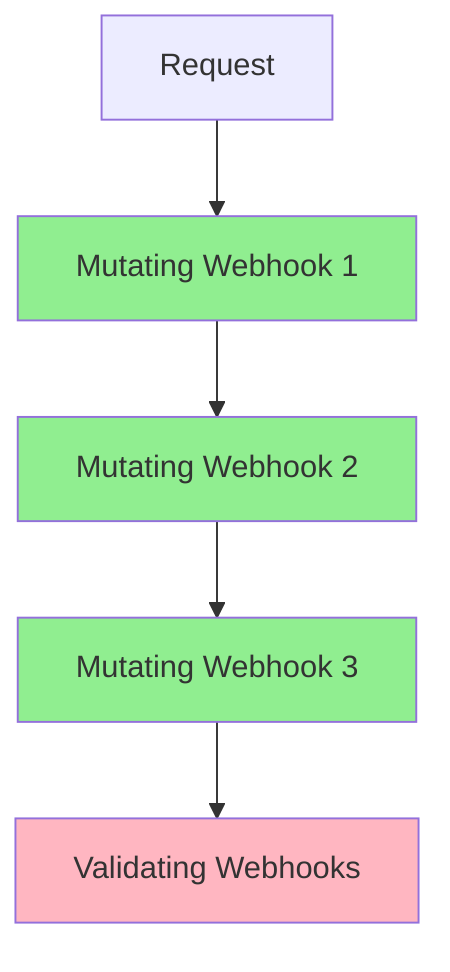
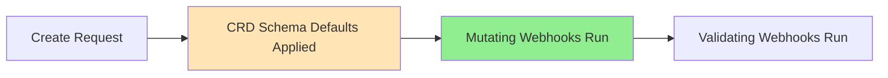

# Урок 5.3: Реализация мутирующих вебхуков

**Навигация:** [← Предыдущий: Валидирующие вебхуки](02-validating-webhooks.md) | [Обзор модуля](../README.md) | [Далее: Развёртывание вебхуков →](04-webhook-deployment.md)

## Введение

Мутирующие вебхуки позволяют изменять ресурсы до их валидации и сохранения. Это идеально подходит для установки значений по умолчанию, добавления обязательных полей или изменения структуры ресурса. Мутирующие вебхуки запускаются до валидирующих, поэтому они могут подготавливать ресурсы к валидации.

## Процесс работы мутирующего вебхука

Вот как работает мутирующий вебхук:



## Создание мутирующего вебхука

Если начинаете с нуля, создайте мутирующий вебхук с помощью kubebuilder:

```bash
# Create mutating webhook
kubebuilder create webhook --group database --version v1 --kind Database --defaulting
```

Если у вас уже есть валидирующий вебхук (из Лабораторной 5.2), добавьте дефолтер (defaulter) в существующий файл вебхука вручную.

## Структура обработчика вебхука

Сгенерированный мутирующий вебхук в `internal/webhook/v1/database_webhook.go` использует интерфейс `CustomDefaulter`:

```go
package v1

import (
    "context"
    "fmt"

    "k8s.io/apimachinery/pkg/runtime"
    ctrl "sigs.k8s.io/controller-runtime"
    logf "sigs.k8s.io/controller-runtime/pkg/log"
    "sigs.k8s.io/controller-runtime/pkg/webhook"

    databasev1 "github.com/example/postgres-operator/api/v1"
)

var databaselog = logf.Log.WithName("database-resource")

// SetupDatabaseWebhookWithManager registers the webhook for Database in the manager.
func SetupDatabaseWebhookWithManager(mgr ctrl.Manager) error {
    return ctrl.NewWebhookManagedBy(mgr).For(&databasev1.Database{}).
        WithValidator(&DatabaseCustomValidator{}).
        WithDefaulter(&DatabaseCustomDefaulter{}).
        Complete()
}

// +kubebuilder:webhook:path=/mutate-database-example-com-v1-database,mutating=true,failurePolicy=fail,sideEffects=None,groups=database.example.com,resources=databases,verbs=create;update,versions=v1,name=mdatabase-v1.kb.io,admissionReviewVersions=v1

// DatabaseCustomDefaulter struct is responsible for setting default values.
type DatabaseCustomDefaulter struct {}

var _ webhook.CustomDefaulter = &DatabaseCustomDefaulter{}

// Default implements webhook.CustomDefaulter so a webhook will be registered for the type Database.
func (d *DatabaseCustomDefaulter) Default(ctx context.Context, obj runtime.Object) error {
    database, ok := obj.(*databasev1.Database)
    if !ok {
        return fmt.Errorf("expected a Database object but got %T", obj)
    }
    databaselog.Info("Defaulting for Database", "name", database.GetName())

    // Defaulting logic here
    return nil
}
```

**Ключевые моменты:**
- Использует интерфейс `webhook.CustomDefaulter` с отдельной структурой
- Метод `Default` получает `context.Context` и `runtime.Object`
- Приводите по типу `runtime.Object` к фактическому типу вашего ресурса
- Регистрируется через `.WithDefaulter(&DatabaseCustomDefaulter{})`

## Реализация установки значений по умолчанию

### Пример: установка значений по умолчанию

```go
func (d *DatabaseCustomDefaulter) Default(ctx context.Context, obj runtime.Object) error {
    database, ok := obj.(*databasev1.Database)
    if !ok {
        return fmt.Errorf("expected a Database object but got %T", obj)
    }
    databaselog.Info("Defaulting for Database", "name", database.GetName())

    // Set default image if not specified
    if database.Spec.Image == "" {
        database.Spec.Image = "postgres:14"
    }

    // Set default replicas if not specified
    if database.Spec.Replicas == nil {
        replicas := int32(1)
        database.Spec.Replicas = &replicas
    }

    // Set default storage class if not specified
    if database.Spec.Storage.StorageClass == "" {
        database.Spec.Storage.StorageClass = "standard"
    }

    return nil
}
```

### Пример: значения по умолчанию с учётом контекста

```go
func (d *DatabaseCustomDefaulter) Default(ctx context.Context, obj runtime.Object) error {
    database, ok := obj.(*databasev1.Database)
    if !ok {
        return fmt.Errorf("expected a Database object but got %T", obj)
    }

    // Set defaults based on namespace
    if database.Namespace == "production" {
        if database.Spec.Replicas == nil {
            replicas := int32(3)  // More replicas in production
            database.Spec.Replicas = &replicas
        }
    } else {
        if database.Spec.Replicas == nil {
            replicas := int32(1)  // Single replica in dev
            database.Spec.Replicas = &replicas
        }
    }

    // Set image based on environment
    if database.Spec.Image == "" {
        if database.Namespace == "production" {
            database.Spec.Image = "postgres:14"  // Stable version
        } else {
            database.Spec.Image = "postgres:latest"  // Latest in dev
        }
    }

    return nil
}
```

## Распространённые паттерны мутации

### Паттерн 1: установка значений по умолчанию



### Паттерн 2: добавление обязательных полей

```go
func (d *DatabaseCustomDefaulter) Default(ctx context.Context, obj runtime.Object) error {
    database, ok := obj.(*databasev1.Database)
    if !ok {
        return fmt.Errorf("expected a Database object but got %T", obj)
    }

    // Add labels if missing
    if database.Labels == nil {
        database.Labels = make(map[string]string)
    }
    if _, exists := database.Labels["managed-by"]; !exists {
        database.Labels["managed-by"] = "database-operator"
    }

    // Add annotations
    if database.Annotations == nil {
        database.Annotations = make(map[string]string)
    }
    if _, exists := database.Annotations["database.example.com/version"]; !exists {
        database.Annotations["database.example.com/version"] = "v1"
    }

    return nil
}
```

## Порядок мутаций

Мутирующие вебхуки запускаются в определённом порядке:



**Важно:** мутации применяются последовательно, поэтому порядок имеет значение!

## Идемпотентные мутации

Мутации должны быть **идемпотентными** — их многократное применение должно давать один и тот же результат:

```go
func (d *DatabaseCustomDefaulter) Default(ctx context.Context, obj runtime.Object) error {
    database, ok := obj.(*databasev1.Database)
    if !ok {
        return fmt.Errorf("expected a Database object but got %T", obj)
    }

    // Idempotent: Safe to call multiple times
    if database.Spec.Image == "" {
        database.Spec.Image = "postgres:14"
    }
    // If already set, doesn't change

    // NOT idempotent: Would keep appending
    // database.Spec.Tags = append(database.Spec.Tags, "default")  // BAD!

    // Idempotent: Check before adding
    if !contains(database.Spec.Tags, "default") {
        database.Spec.Tags = append(database.Spec.Tags, "default")
    }

    return nil
}
```

## Значения по умолчанию схемы CRD против вебхука

Важное соображение при реализации установки значений по умолчанию:



**Значения по умолчанию схемы CRD** (через маркеры `+kubebuilder:default`) применяются **до** мутирующих вебхуков:

```go
// In api/v1/database_types.go
// +kubebuilder:default=1
Replicas *int32 `json:"replicas,omitempty"`
```

Это означает, что когда ваш вебхук запускается, `Replicas` уже равно `1`, а не `nil`. Чтобы переопределить:

```go
// Check for the default value, not just nil
if database.Namespace == "production" {
    if database.Spec.Replicas == nil || *database.Spec.Replicas < 3 {
        replicas := int32(3)
        database.Spec.Replicas = &replicas
    }
}
```

**Лучшая практика:** используйте значения по умолчанию схемы CRD для простых статических значений, вебхуки — для значений с учётом контекста.

## Ключевые выводы

- **Мутирующие вебхуки** изменяют ресурсы до валидации
- Запускаются **до** валидирующих вебхуков, но **после** значений по умолчанию схемы CRD
- Используйте интерфейс `webhook.CustomDefaulter` с отдельной структурой
- Метод `Default` получает `context.Context` и `runtime.Object`
- Регистрируется через `.WithDefaulter(&DatabaseCustomDefaulter{})`
- Мутации должны быть **идемпотентными**
- Предоставляйте **разумные значения по умолчанию** на основе контекста
- Проверяйте значения по умолчанию, а не только `nil`, при переопределении значений по умолчанию схемы CRD

## Что нужно понимать для создания операторов

При реализации мутирующих вебхуков:
- Добавляйте в существующий файл вебхука в `internal/webhook/v1/`
- Используйте отдельную структуру `CustomDefaulter`
- Устанавливайте значения по умолчанию для необязательных полей
- Автоматически добавляйте обязательные поля
- Делайте мутации идемпотентными
- Учитывайте контекст (пространство имён, метки и т. д.)
- Держите мутации простыми и предсказуемыми

## Связанная лабораторная работа

- [Лабораторная 5.3: Создание мутирующего вебхука](../labs/lab-03-mutating-webhooks.md) — практические упражнения для этого урока

## Источники

### Официальная документация
- [Мутирующие вебхуки допуска](https://kubernetes.io/docs/reference/access-authn-authz/admission-controllers/#mutatingadmissionwebhook)
- [JSON Patch](https://datatracker.ietf.org/doc/html/rfc6902)
- [API AdmissionReview](https://kubernetes.io/docs/reference/access-authn-authz/extensible-admission-controllers/#webhook-request-and-response)

### Дополнительное чтение
- **Kubernetes Operators**, Jason Dobies и Joshua Wood — глава 9: Webhooks
- **Programming Kubernetes**, Michael Hausenblas и Stefan Schimanski — глава 9: Admission Control
- [Дефолтинг-вебхуки Kubebuilder](https://book.kubebuilder.io/cronjob-tutorial/webhook-implementation.html#defaulting)

### Смежные темы
- [Спецификация JSON Patch](https://datatracker.ietf.org/doc/html/rfc6902)
- [Лучшие практики мутации вебхуками](https://kubernetes.io/docs/reference/access-authn-authz/extensible-admission-controllers/#best-practices-and-warnings)
- [Идемпотентные мутации](https://kubernetes.io/docs/reference/access-authn-authz/extensible-admission-controllers/#idempotency)

## Дальнейшие шаги

Теперь, когда вы понимаете мутирующие вебхуки, давайте изучим развёртывание вебхуков и управление сертификатами.

**Навигация:** [← Предыдущий: Валидирующие вебхуки](02-validating-webhooks.md) | [Обзор модуля](../README.md) | [Далее: Развёртывание вебхуков →](04-webhook-deployment.md)
