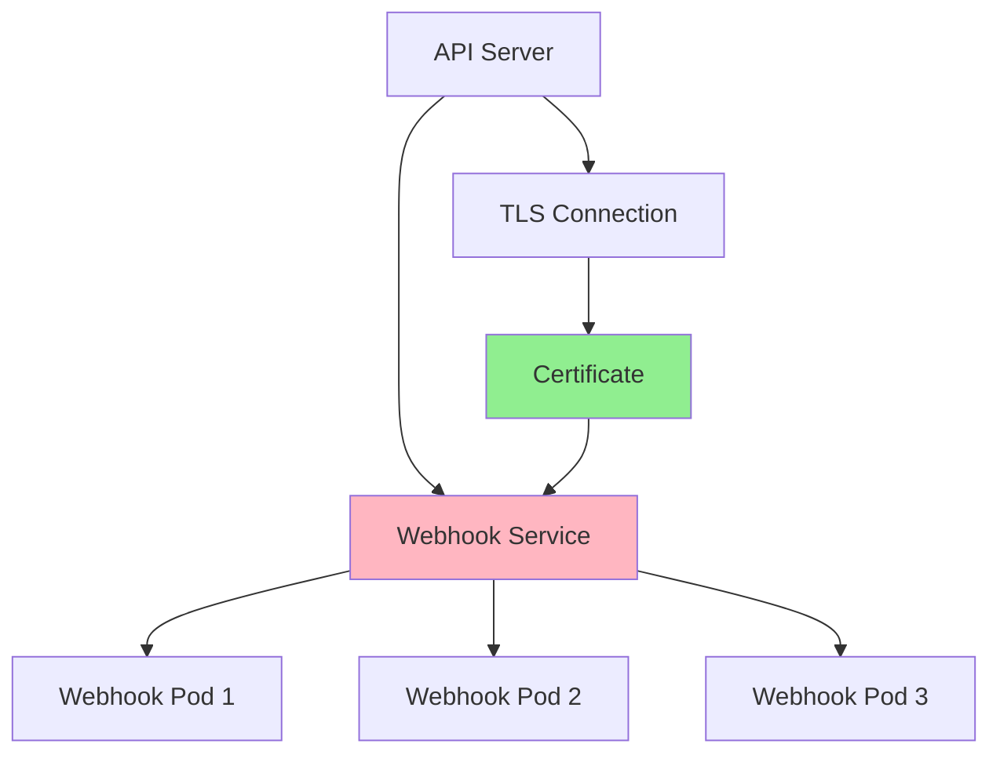
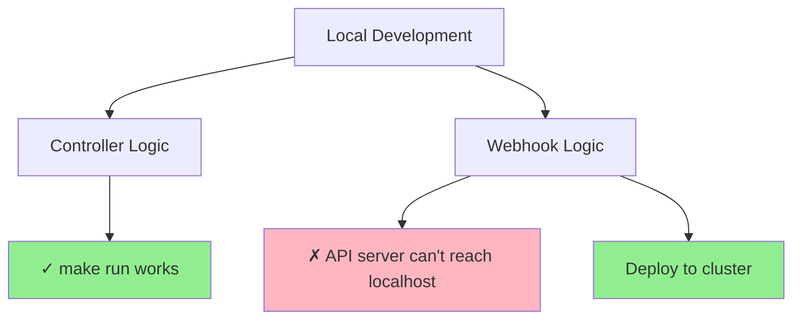
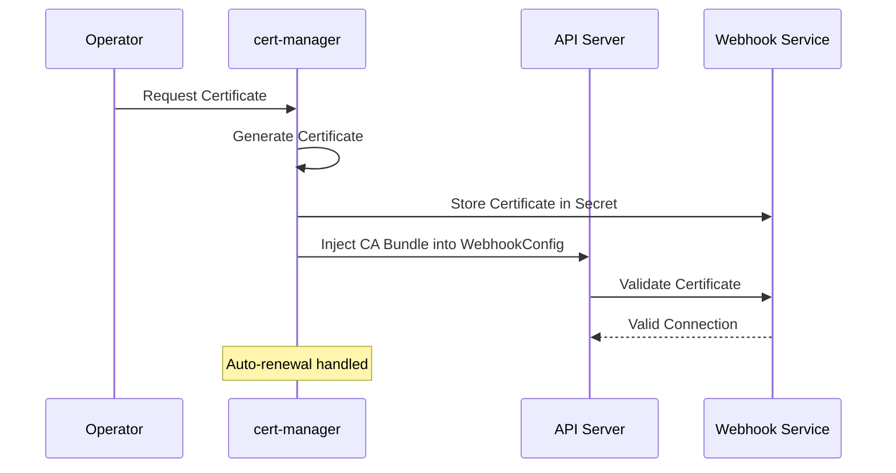
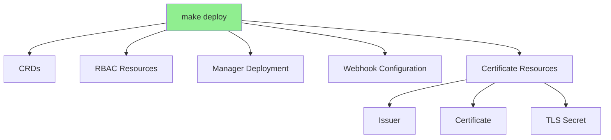
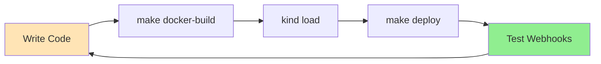
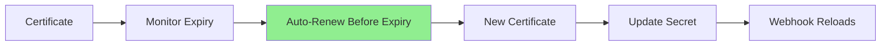

# Урок 5.4: Развёртывание вебхуков и сертификаты

**Навигация:** [← Предыдущий: Мутирующие вебхуки](03-mutating-webhooks.md) | [Обзор модуля](../README.md)

## Введение

Вебхукам нужны TLS-сертификаты для защиты связи с API-сервером. Управление этими сертификатами может быть сложным, но kubebuilder и cert-manager упрощают его. В этом уроке вы научитесь развёртывать вебхуки и управлять сертификатами.

## Архитектура сервиса вебхука

Вебхуки работают как сервисы в вашем кластере:



## Почему вебхуки требуют развёртывания в кластере

В отличие от логики контроллера, вебхуки нельзя легко запустить локально через `make run`:



**Проблема:** API-серверу Kubernetes нужно вызывать ваш вебхук по HTTPS. При локальном запуске API-сервер (внутри кластера) не может достучаться до вашего localhost.

**Решение:** разверните оператор в кластере, где API-сервер сможет до него достучаться.

## Управление сертификатами с cert-manager

cert-manager — рекомендуемое решение для сертификатов вебхуков:



## Настройка cert-manager

### Шаг 1: установите cert-manager

```bash
# Install cert-manager
kubectl apply -f https://github.com/cert-manager/cert-manager/releases/download/v1.14.0/cert-manager.yaml

# Wait for cert-manager to be ready
kubectl wait --for=condition=Available deployment/cert-manager -n cert-manager --timeout=120s
kubectl wait --for=condition=Available deployment/cert-manager-webhook -n cert-manager --timeout=120s
kubectl wait --for=condition=Available deployment/cert-manager-cainjector -n cert-manager --timeout=120s
```

> **Примечание:** скрипт курса `scripts/setup-kind-cluster.sh` устанавливает cert-manager автоматически.

### Шаг 2: интеграция с Kubebuilder

Проекты kubebuilder поставляются предварительно настроенными для cert-manager. Проверьте `config/default/kustomization.yaml`:

```yaml
resources:
- ../crd
- ../rbac
- ../manager
- ../webhook
- ../certmanager  # Enables cert-manager integration
```

Каталог `config/certmanager/` содержит:
- Ресурсы Certificate
- Конфигурацию Issuer
- Аннотации для инъекции CA

## Развёртывание вебхуков

### Шаг 1: соберите образ

```bash
# Build container image
make docker-build IMG=postgres-operator:latest

# For Podman:
# make docker-build IMG=postgres-operator:latest CONTAINER_TOOL=podman
```

### Шаг 2: загрузите в kind

```bash
# For Docker:
kind load docker-image postgres-operator:latest --name k8s-operators-course

# For Podman:
podman save localhost/postgres-operator:latest -o /tmp/postgres-operator.tar
kind load image-archive /tmp/postgres-operator.tar --name k8s-operators-course
rm /tmp/postgres-operator.tar
```

### Шаг 3: разверните

```bash
# Deploy to cluster
make deploy IMG=postgres-operator:latest

# For Podman:
# make deploy IMG=localhost/postgres-operator:latest
```

## Что развёртывается

Когда вы запускаете `make deploy`, kustomize создаёт:



## Проверка развёртывания

### Проверьте поды

```bash
kubectl get pods -n postgres-operator-system
```

### Проверьте вебхуки

```bash
kubectl get validatingwebhookconfigurations
kubectl get mutatingwebhookconfigurations
```

### Проверьте сертификаты

```bash
kubectl get certificate -n postgres-operator-system
kubectl get secret -n postgres-operator-system | grep tls
```

## Рабочий процесс разработки



Для быстрой итерации:

```bash
# After code changes, redeploy
make docker-build IMG=postgres-operator:latest
kind load docker-image postgres-operator:latest --name k8s-operators-course
kubectl rollout restart deployment/postgres-operator-controller-manager -n postgres-operator-system
```

## Устранение неполадок вебхуков

### Распространённые проблемы

1. **Сертификат не готов:**
   ```bash
   # Check certificate status
   kubectl get certificate -n postgres-operator-system
   kubectl describe certificate -n postgres-operator-system
   
   # Check cert-manager logs
   kubectl logs -n cert-manager deployment/cert-manager
   ```

2. **Вебхук не вызывается:**
   ```bash
   # Check webhook configuration
   kubectl get validatingwebhookconfiguration
   kubectl get mutatingwebhookconfiguration
   
   # Check if CA bundle is injected
   kubectl get validatingwebhookconfiguration -o yaml | grep caBundle
   ```

3. **Отказ в соединении (connection refused):**
   ```bash
   # Check webhook pod logs
   kubectl logs -n postgres-operator-system deployment/postgres-operator-controller-manager
   
   # Check service endpoints
   kubectl get endpoints -n postgres-operator-system
   ```

4. **Ошибки скачивания образа:**
   ```bash
   # Check pod events
   kubectl describe pod -n postgres-operator-system -l control-plane=controller-manager
   
   # Ensure imagePullPolicy is IfNotPresent for local images
   ```

## Ротация сертификатов

cert-manager обрабатывает ротацию сертификатов автоматически:



По умолчанию обновление происходит за 30 дней до истечения срока.

## Ключевые выводы

- **Вебхукам нужны TLS-сертификаты** для защищённой связи
- **Вебхуки требуют развёртывания в кластере** — `make run` для вебхуков не работает
- **cert-manager** обеспечивает автоматическое управление сертификатами
- **Проекты kubebuilder** поставляются предварительно настроенными для cert-manager
- Используйте рабочий процесс `make deploy`: сборка → загрузка → развёртывание
- **Ротация сертификатов** обрабатывается cert-manager автоматически

## Что нужно понимать для создания операторов

При развёртывании вебхуков:
- Используйте cert-manager для автоматического управления сертификатами
- Разворачивайте в кластер для тестирования вебхуков (не `make run`)
- Убедитесь, что cert-manager установлен, перед развёртыванием
- Проверяйте статус сертификата при устранении неполадок
- Используйте `kubectl rollout restart` для быстрых повторных развёртываний

## Связанная лабораторная работа

- [Лабораторная 5.4: Развёртывание вебхуков и сертификаты](../labs/lab-04-webhook-deployment.md) — практические упражнения для этого урока

## Источники

### Официальная документация
- [Конфигурация вебхука](https://kubernetes.io/docs/reference/access-authn-authz/extensible-admission-controllers/#webhook-configuration)
- [cert-manager](https://cert-manager.io/docs/)
- [TLS в Kubernetes](https://kubernetes.io/docs/tasks/tls/managing-tls-in-a-cluster/)

### Дополнительное чтение
- **Kubernetes Operators**, Jason Dobies и Joshua Wood — глава 9: Webhooks
- **Programming Kubernetes**, Michael Hausenblas и Stefan Schimanski — глава 9: Admission Control
- [Документация cert-manager](https://cert-manager.io/docs/)

### Смежные темы
- [Политика при сбое вебхука](https://kubernetes.io/docs/reference/access-authn-authz/extensible-admission-controllers/#failure-policy)
- [Таймауты вебхука](https://kubernetes.io/docs/reference/access-authn-authz/extensible-admission-controllers/#timeouts)
- [Установка cert-manager](https://cert-manager.io/docs/installation/)

## Дальнейшие шаги

Поздравляем! Вы завершили Модуль 5. Теперь вы понимаете:
- Контроль допуска и вебхуки
- Валидирующие вебхуки для пользовательской валидации
- Мутирующие вебхуки для установки значений по умолчанию
- Управление сертификатами и развёртывание

В [Модуле 6](../../module-06/README.md) вы изучите тестирование и отладку операторов.

**Навигация:** [← Предыдущий: Мутирующие вебхуки](03-mutating-webhooks.md) | [Обзор модуля](../README.md) | [Далее: Модуль 6 →](../../module-06/README.md)
