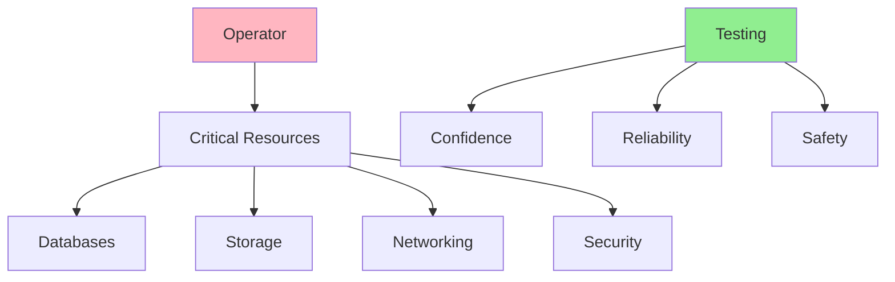
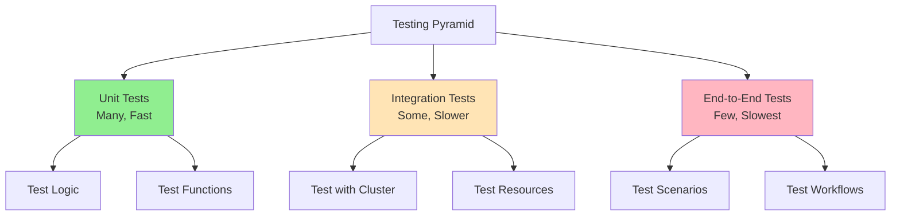
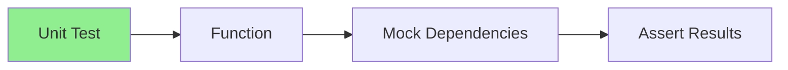
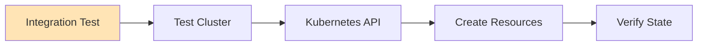
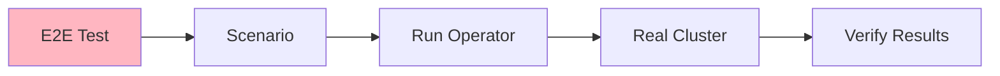
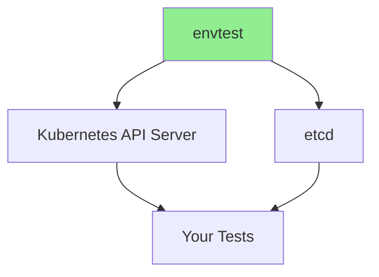
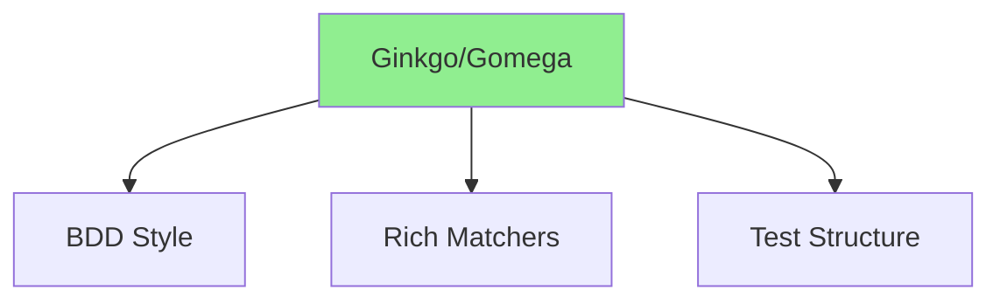
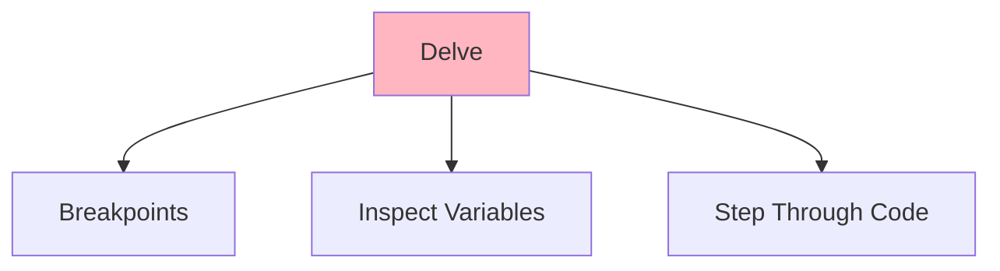
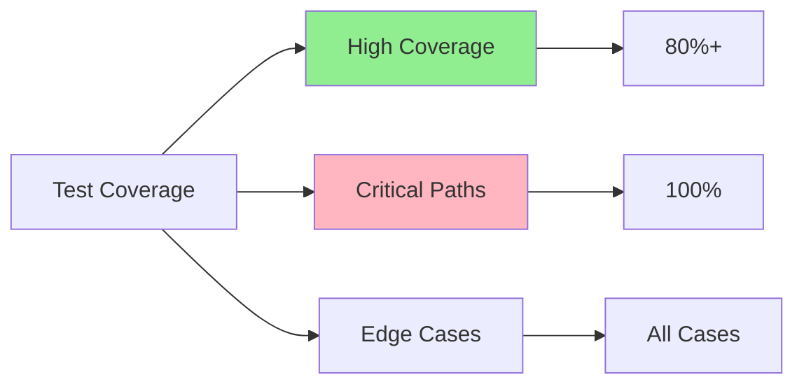

# Урок 6.1: Основы тестирования

**Навигация:** [Обзор модуля](../README.md) | [Следующий урок: Модульное тестирование с envtest →](02-unit-testing-envtest.md)

## Введение

Тестирование операторов критически важно для надёжности и уверенности в продакшене. Операторы управляют критически важной инфраструктурой, поэтому исчерпывающее тестирование необходимо. Этот урок охватывает основы тестирования, стратегии тестирования и инструменты, которые вы будете использовать для тестирования операторов Kubernetes.

## Зачем тестировать операторы?

Операторы управляют критически важными ресурсами:



**Преимущества:**
- Ловить баги до продакшена
- Обеспечивать корректность согласования
- Проверять граничные случаи
- Обеспечивать безопасный рефакторинг
- Документировать ожидаемое поведение

## Пирамида тестирования для операторов



## Стратегии тестирования

### Стратегия 1: модульное тестирование

Тестируйте отдельные функции и логику:



**Используйте для:**
- Логики согласования
- Вспомогательных функций
- Логики валидации
- Функций преобразования

### Стратегия 2: интеграционное тестирование

Тестируйте с реальным API Kubernetes:



**Используйте для:**
- Сквозных (end-to-end) рабочих процессов
- Создания/обновления ресурсов
- Поведения вебхуков
- Взаимодействия контроллеров

### Стратегия 3: сквозное тестирование (E2E)

Тестируйте полные сценарии:



**Используйте для:**
- Полных пользовательских рабочих процессов
- Сценариев, приближенных к продакшену
- Тестирования производительности
- Регрессионного тестирования

## Инструменты тестирования

### envtest

**Назначение:** легковесный API-сервер Kubernetes для модульного тестирования



**Возможности:**
- Не нужен полноценный кластер
- Быстрое выполнение тестов
- Изолированная тестовая среда
- Реальный API Kubernetes

### Ginkgo и Gomega

**Назначение:** фреймворк тестирования в стиле BDD



**Возможности:**
- Описательная структура тестов
- Богатая библиотека утверждений (assertions)
- Параллельное выполнение тестов
- Организация тестов

### Отладчик Delve

**Назначение:** Go-отладчик для операторов



**Возможности:**
- Установка точек останова (breakpoints)
- Просмотр переменных
- Пошаговое выполнение кода
- Отладка запущенных операторов

## Структура теста

### Базовая структура теста

```go
func TestReconcile(t *testing.T) {
    // Arrange: Set up test environment
    // Act: Execute the function
    // Assert: Verify results
}
```

### Тесты, управляемые таблицей (table-driven)

```go
func TestReconcile(t *testing.T) {
    tests := []struct {
        name    string
        input   *Database
        want    ctrl.Result
        wantErr bool
    }{
        {
            name: "successful reconciliation",
            input: &Database{...},
            want: ctrl.Result{},
            wantErr: false,
        },
        // More test cases...
    }
    
    for _, tt := range tests {
        t.Run(tt.name, func(t *testing.T) {
            // Test logic
        })
    }
}
```

## Цели по покрытию тестами



**Целевые показатели:**
- Общее: покрытие 80%+
- Критические пути: покрытие 100%
- Граничные случаи: все покрыты
- Пути ошибок: все протестированы

## Ключевые выводы

- **Тестирование необходимо** для надёжности оператора
- **Модульные тесты** быстрые и проверяют логику
- **Интеграционные тесты** тестируют с реальным API Kubernetes
- **E2E-тесты** тестируют полные сценарии
- **envtest** предоставляет легковесный API Kubernetes
- **Ginkgo/Gomega** обеспечивают тестирование в стиле BDD
- **Delve** позволяет отлаживать операторы
- **Тесты, управляемые таблицей**, организуют тестовые случаи
- **Стремитесь к покрытию 80%+** со 100% на критических путях

## Что нужно понимать для создания операторов

При тестировании операторов:
- Пишите модульные тесты для всей логики
- Используйте интеграционные тесты для рабочих процессов
- Тестируйте случаи ошибок и граничные случаи
- Используйте тесты, управляемые таблицей, для множества сценариев
- Стремитесь к высокому покрытию
- Тестируйте в изоляции, когда это возможно
- Используйте реальный API Kubernetes для интеграционных тестов

## Связанная лабораторная работа

- [Лабораторная 6.1: Настройка среды тестирования](../labs/lab-01-testing-fundamentals.md) — практические упражнения для этого урока

## Источники

### Официальная документация
- [Тестирование в Kubebuilder](https://book.kubebuilder.io/cronjob-tutorial/writing-tests.html)
- [envtest](https://pkg.go.dev/sigs.k8s.io/controller-runtime/pkg/envtest)
- [Фреймворк тестирования Ginkgo](https://onsi.github.io/ginkgo/)

### Дополнительное чтение
- **Kubernetes Operators**, Jason Dobies и Joshua Wood — глава 10: Testing
- **Programming Kubernetes**, Michael Hausenblas и Stefan Schimanski — глава 10: Testing
- [Лучшие практики тестирования на Go](https://golang.org/doc/effective_go#testing)

### Смежные темы
- [Разработка через тестирование (TDD)](https://en.wikipedia.org/wiki/Test-driven_development)
- [Тесты, управляемые таблицей, в Go](https://go.dev/wiki/TableDrivenTests)
- [Мокирование в Go](https://github.com/golang/mock)

## Дальнейшие шаги

Теперь, когда вы понимаете основы тестирования, давайте настроим envtest и напишем модульные тесты.

**Навигация:** [← Обзор модуля](../README.md) | [Далее: Модульное тестирование с envtest →](02-unit-testing-envtest.md)
