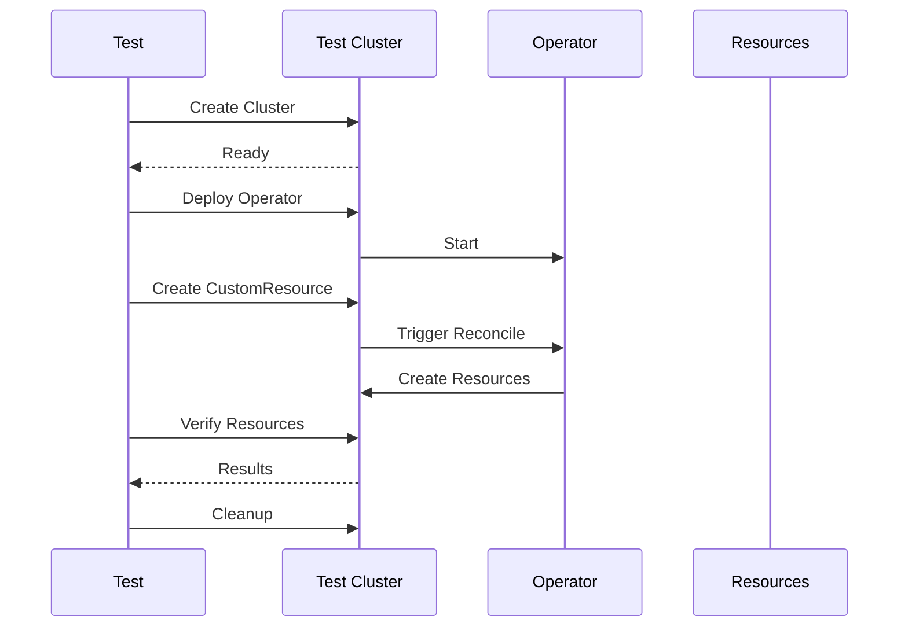

# Урок 6.3: Интеграционное тестирование

**Навигация:** [← Предыдущий: Модульное тестирование с envtest](02-unit-testing-envtest.md) | [Обзор модуля](../README.md) | [Далее: Отладка и наблюдаемость →](04-debugging-observability.md)

## Введение

Если модульные тесты проверяют логику в изоляции, то интеграционные тесты проверяют, что ваш оператор корректно работает с реальным кластером Kubernetes. Интеграционные тесты используют настоящие кластеры (например, kind) для проверки сквозных (end-to-end) рабочих процессов и гарантируют, что всё работает вместе.

## Процесс интеграционного тестирования

Вот как работают интеграционные тесты:



## Структура интеграционного теста

### Использование Ginkgo для интеграционных тестов

```go
package integration

import (
    . "github.com/onsi/ginkgo/v2"
    . "github.com/onsi/gomega"
    
    "sigs.k8s.io/controller-runtime/pkg/envtest"
)

var _ = Describe("Database Operator Integration", func() {
    var (
        cluster *kind.Cluster
        client  client.Client
    )
    
    BeforeSuite(func() {
        // Create kind cluster
        cluster = kind.NewCluster("test-cluster")
        Expect(cluster.Create()).To(Succeed())
        
        // Get kubeconfig
        kubeconfig := cluster.KubeconfigPath()
        cfg, err := clientcmd.BuildConfigFromFlags("", kubeconfig)
        Expect(err).NotTo(HaveOccurred())
        
        // Create client
        client, err = client.New(cfg, client.Options{})
        Expect(err).NotTo(HaveOccurred())
    })
    
    AfterSuite(func() {
        // Cleanup cluster
        Expect(cluster.Delete()).To(Succeed())
    })
    
    Context("Database lifecycle", func() {
        It("should create and manage a Database", func() {
            // Test implementation
        })
    })
})
```

## Тестирование сквозных рабочих процессов

### Пример: полный жизненный цикл Database

```go
Describe("Database lifecycle", func() {
    It("should create, update, and delete a Database", func() {
        // Create Database
        db := &databasev1.Database{
            ObjectMeta: metav1.ObjectMeta{
                Name:      "test-db",
                Namespace: "default",
            },
            Spec: databasev1.DatabaseSpec{
                Image:       "postgres:14",
                Replicas:    pointer.Int32(1),
                DatabaseName: "mydb",
                Username:    "admin",
                Storage: databasev1.StorageSpec{
                    Size: "10Gi",
                },
            },
        }
        Expect(k8sClient.Create(ctx, db)).To(Succeed())
        
        // Wait for StatefulSet
        Eventually(func() error {
            ss := &appsv1.StatefulSet{}
            return k8sClient.Get(ctx, types.NamespacedName{
                Name:      "test-db",
                Namespace: "default",
            }, ss)
        }, timeout, interval).Should(Succeed())
        
        // Verify StatefulSet is ready
        Eventually(func() bool {
            ss := &appsv1.StatefulSet{}
            k8sClient.Get(ctx, types.NamespacedName{
                Name:      "test-db",
                Namespace: "default",
            }, ss)
            return ss.Status.ReadyReplicas == *ss.Spec.Replicas
        }, timeout, interval).Should(BeTrue())
        
        // Update Database
        Expect(k8sClient.Get(ctx, key, db)).To(Succeed())
        db.Spec.Replicas = pointer.Int32(3)
        Expect(k8sClient.Update(ctx, db)).To(Succeed())
        
        // Wait for update
        Eventually(func() *int32 {
            ss := &appsv1.StatefulSet{}
            k8sClient.Get(ctx, key, ss)
            return ss.Spec.Replicas
        }, timeout, interval).Should(Equal(pointer.Int32(3)))
        
        // Delete Database
        Expect(k8sClient.Delete(ctx, db)).To(Succeed())
        
        // Verify cleanup
        Eventually(func() bool {
            err := k8sClient.Get(ctx, key, db)
            return errors.IsNotFound(err)
        }, timeout, interval).Should(BeTrue())
    })
})
```

## Тестирование вебхуков

### Пример: тестирование валидирующего вебхука

```go
Describe("Validating webhook", func() {
    It("should reject invalid Database", func() {
        db := &databasev1.Database{
            Spec: databasev1.DatabaseSpec{
                Image: "nginx:latest", // Invalid: not PostgreSQL
                DatabaseName: "mydb",
                Username: "admin",
                Storage: databasev1.StorageSpec{
                    Size: "10Gi",
                },
            },
        }
        
        err := k8sClient.Create(ctx, db)
        Expect(err).To(HaveOccurred())
        Expect(err.Error()).To(ContainSubstring("must be a PostgreSQL image"))
    })
    
    It("should accept valid Database", func() {
        db := &databasev1.Database{
            Spec: databasev1.DatabaseSpec{
                Image:       "postgres:14",
                DatabaseName: "mydb",
                Username:    "admin",
                Storage: databasev1.StorageSpec{
                    Size: "10Gi",
                },
            },
        }
        
        Expect(k8sClient.Create(ctx, db)).To(Succeed())
    })
})
```

## Тестирование с Eventually

`Eventually` из Gomega идеально подходит для интеграционных тестов:

```go
// Wait for resource to be created
Eventually(func() error {
    return k8sClient.Get(ctx, key, resource)
}, timeout, interval).Should(Succeed())

// Wait for condition
Eventually(func() bool {
    db := &databasev1.Database{}
    k8sClient.Get(ctx, key, db)
    return db.Status.Ready
}, timeout, interval).Should(BeTrue())

// Wait for resource count
Eventually(func() int {
    pods := &corev1.PodList{}
    k8sClient.List(ctx, pods, client.MatchingLabels{"app": "database"})
    return len(pods.Items)
}, timeout, interval).Should(Equal(3))
```

## Интеграция с CI/CD

### Пример GitHub Actions

```yaml
name: Integration Tests

on: [push, pull_request]

jobs:
  integration:
    runs-on: ubuntu-latest
    steps:
      - uses: actions/checkout@v3
      
      - name: Set up Go
        uses: actions/setup-go@v4
        with:
          go-version: '1.21'
      
      - name: Install kind
        run: |
          go install sigs.k8s.io/kind@latest
      
      - name: Create cluster
        run: kind create cluster
      
      - name: Run integration tests
        run: |
          make test-integration
      
      - name: Cleanup
        if: always()
        run: kind delete cluster
```

## Ключевые выводы

- **Интеграционные тесты** проверяют сквозные рабочие процессы
- **Используйте реальные кластеры** (kind) для интеграционных тестов
- **Ginkgo/Gomega** обеспечивают структуру и утверждения
- **Eventually** ожидает завершения асинхронных операций
- **Тестируйте полные рабочие процессы** (создание, обновление, удаление)
- **Тестируйте вебхуки** с реальными вызовами API
- **Интегрируйте с CI/CD** для автоматизированного тестирования
- **Очищайте** ресурсы после тестов

## Что нужно понимать для создания операторов

При написании интеграционных тестов:
- Используйте реальные кластеры Kubernetes
- Тестируйте полные рабочие процессы
- Используйте Eventually для асинхронных операций
- Тестируйте поведение вебхуков
- Очищайте ресурсы
- Интегрируйте с CI/CD
- Тестируйте сценарии ошибок
- Проверяйте состояния ресурсов

## Связанная лабораторная работа

- [Лабораторная 6.3: Создание интеграционных тестов](../labs/lab-03-integration-testing.md) — практические упражнения для этого урока

## Источники

### Официальная документация
- [Документация Ginkgo](https://onsi.github.io/ginkgo/)
- [Матчеры Gomega](https://onsi.github.io/gomega/)
- [Документация kind](https://kind.sigs.k8s.io/)

### Дополнительное чтение
- **Kubernetes Operators**, Jason Dobies и Joshua Wood — глава 10: Testing
- **Programming Kubernetes**, Michael Hausenblas и Stefan Schimanski — глава 10: Testing
- [BDD-тестирование с Ginkgo](https://onsi.github.io/ginkgo/)

### Смежные темы
- [Паттерны интеграционного тестирования](https://martinfowler.com/articles/practical-test-pyramid.html)
- [Test Containers](https://www.testcontainers.org/)

## Дальнейшие шаги

Теперь, когда вы понимаете интеграционное тестирование, давайте изучим отладку и наблюдаемость.

**Навигация:** [← Предыдущий: Модульное тестирование с envtest](02-unit-testing-envtest.md) | [Обзор модуля](../README.md) | [Далее: Отладка и наблюдаемость →](04-debugging-observability.md)
