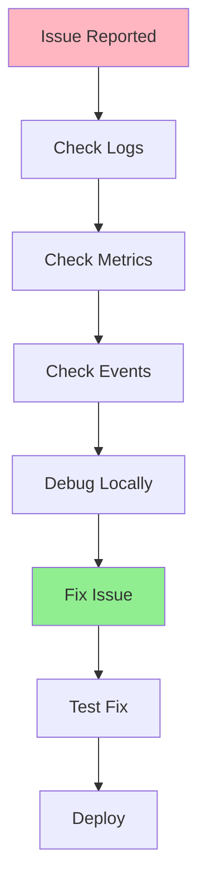
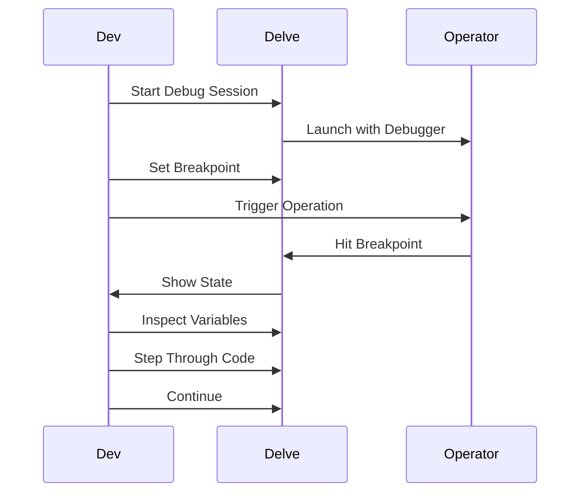
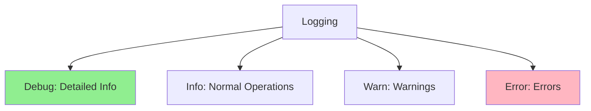
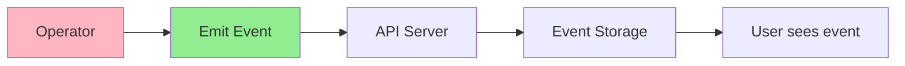
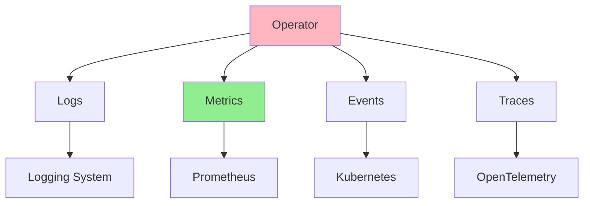

# Урок 6.4: Отладка и наблюдаемость

**Навигация:** [← Предыдущий: Интеграционное тестирование](03-integration-testing.md) | [Обзор модуля](../README.md)

## Введение

Даже при исчерпывающих тестах операторы могут давать сбои в продакшене. Отладка и наблюдаемость необходимы для понимания того, что происходит, диагностики проблем и обеспечения бесперебойной работы операторов. Этот урок охватывает приёмы отладки и добавление наблюдаемости в операторы.

## Рабочий процесс отладки

Вот типичный рабочий процесс отладки:



## Отладка с Delve

### Настройка Delve

```bash
# Install Delve
go install github.com/go-delve/delve/cmd/dlv@latest

# Run operator with Delve
dlv debug ./cmd/manager/main.go
```

### Использование Delve



### Пример: отладка Reconcile

```go
// Set breakpoint in Reconcile function
func (r *DatabaseReconciler) Reconcile(ctx context.Context, req ctrl.Request) (ctrl.Result, error) {
    log := log.FromContext(ctx)
    
    // Breakpoint here
    db := &databasev1.Database{}
    if err := r.Get(ctx, req.NamespacedName, db); err != nil {
        return ctrl.Result{}, err
    }
    
    // Inspect db here
    log.Info("Reconciling", "name", db.Name, "spec", db.Spec)
    
    // Continue debugging...
}
```

## Структурированное логирование

### Добавление структурированных логов

```go
import (
    "sigs.k8s.io/controller-runtime/pkg/log"
    "sigs.k8s.io/controller-runtime/pkg/log/zap"
)

func main() {
    // Use structured logging
    ctrl.SetLogger(zap.New(zap.UseDevMode(true)))
    
    // In controller
    log := log.FromContext(ctx)
    log.Info("Reconciling Database",
        "name", db.Name,
        "namespace", db.Namespace,
        "generation", db.Generation,
        "replicas", db.Spec.Replicas,
    )
    
    log.Error(err, "Failed to reconcile",
        "name", db.Name,
        "error", err.Error(),
    )
}
```

### Уровни логирования



## Метрики с Prometheus

### Экспонирование метрик

```go
import (
    "sigs.k8s.io/controller-runtime/pkg/metrics"
    "github.com/prometheus/client_golang/prometheus"
)

var (
    reconcileTotal = prometheus.NewCounterVec(
        prometheus.CounterOpts{
            Name: "database_reconcile_total",
            Help: "Total number of reconciliations",
        },
        []string{"result"}, // success, error
    )
    
    reconcileDuration = prometheus.NewHistogramVec(
        prometheus.HistogramOpts{
            Name: "database_reconcile_duration_seconds",
            Help: "Duration of reconciliations",
        },
        []string{"result"},
    )
)

func init() {
    metrics.Registry.MustRegister(reconcileTotal, reconcileDuration)
}

func (r *DatabaseReconciler) Reconcile(ctx context.Context, req ctrl.Request) (ctrl.Result, error) {
    start := time.Now()
    defer func() {
        duration := time.Since(start).Seconds()
        result := "success"
        if err != nil {
            result = "error"
        }
        reconcileDuration.WithLabelValues(result).Observe(duration)
        reconcileTotal.WithLabelValues(result).Inc()
    }()
    
    // Reconciliation logic...
}
```

## События Kubernetes

### Генерация событий

```go
import (
    "k8s.io/client-go/tools/record"
)

type DatabaseReconciler struct {
    client.Client
    Scheme   *runtime.Scheme
    Recorder record.EventRecorder
}

func (r *DatabaseReconciler) Reconcile(ctx context.Context, req ctrl.Request) (ctrl.Result, error) {
    // Emit event on success
    r.Recorder.Event(db, "Normal", "Reconciled", "Database reconciled successfully")
    
    // Emit event on error
    if err != nil {
        r.Recorder.Event(db, "Warning", "ReconcileFailed", err.Error())
    }
}
```

### Поток событий



## Стек наблюдаемости



## Распространённые сценарии отладки

### Сценарий 1: Reconcile не запускается

```go
// Check if controller is running
kubectl get pods -l control-plane=controller-manager

// Check logs
kubectl logs -l control-plane=controller-manager

// Check if resource exists
kubectl get database test-db

// Check events
kubectl get events --field-selector involvedObject.name=test-db
```

### Сценарий 2: ресурс не создаётся

```go
// Add detailed logging
log.Info("Creating StatefulSet",
    "name", statefulSet.Name,
    "namespace", statefulSet.Namespace,
    "spec", statefulSet.Spec,
)

// Check for errors
if err := r.Create(ctx, statefulSet); err != nil {
    log.Error(err, "Failed to create StatefulSet",
        "name", statefulSet.Name,
        "error", err.Error(),
    )
    return ctrl.Result{}, err
}
```

### Сценарий 3: статус не обновляется

```go
// Verify status update
log.Info("Updating status",
    "phase", db.Status.Phase,
    "ready", db.Status.Ready,
)

if err := r.Status().Update(ctx, db); err != nil {
    log.Error(err, "Failed to update status")
    return ctrl.Result{}, err
}

// Verify update succeeded
log.Info("Status updated successfully")
```

## Ключевые выводы

- **Delve** позволяет отлаживать операторы с точками останова
- **Структурированное логирование** обеспечивает контекст и трассируемость
- **Метрики** экспонируют операционные данные в Prometheus
- **События** сообщают пользователям об изменениях состояния
- **Стек наблюдаемости** объединяет логи, метрики, события, трассировки
- **Отлаживайте систематически**, используя логи, метрики и события
- **Добавляйте наблюдаемость** с самого начала
- **Используйте подходящие уровни логирования** (Debug, Info, Warn, Error)

## Что нужно понимать для создания операторов

При отладке и добавлении наблюдаемости:
- Используйте Delve для локальной отладки
- Добавляйте структурированное логирование повсюду
- Экспонируйте метрики для мониторинга
- Генерируйте события для обратной связи с пользователем
- Используйте подходящие уровни логирования
- Отлаживайте систематически
- Добавляйте наблюдаемость на раннем этапе
- Ведите мониторинг в продакшене

## Связанная лабораторная работа

- [Лабораторная 6.4: Добавление наблюдаемости](../labs/lab-04-debugging-observability.md) — практические упражнения для этого урока

## Источники

### Официальная документация
- [Отладчик Delve](https://github.com/go-delve/delve)
- [Метрики Prometheus](https://prometheus.io/docs/concepts/metric_types/)
- [События Kubernetes](https://kubernetes.io/docs/reference/kubernetes-api/cluster-resources/event-v1/)

### Дополнительное чтение
- **Kubernetes Operators**, Jason Dobies и Joshua Wood — глава 11: Debugging
- **Programming Kubernetes**, Michael Hausenblas и Stefan Schimanski — глава 11: Observability
- [Observability Engineering](https://www.oreilly.com/library/view/observability-engineering/9781492076438/)

### Смежные темы
- [Лучшие практики логирования](https://www.cncf.io/blog/2023/07/03/kubernetes-logging-best-practices/)
- [Лучшие практики Prometheus](https://prometheus.io/docs/practices/)
- [OpenTelemetry](https://opentelemetry.io/)

## Дальнейшие шаги

Поздравляем! Вы завершили Модуль 6. Теперь вы понимаете:
- Основы и стратегии тестирования
- Модульное тестирование с envtest
- Интеграционное тестирование с реальными кластерами
- Отладку и наблюдаемость

В [Модуле 7](../../module-07/README.md) вы изучите развёртывание в продакшене и лучшие практики.

**Навигация:** [← Предыдущий: Интеграционное тестирование](03-integration-testing.md) | [Обзор модуля](../README.md) | [Далее: Модуль 7 →](../../module-07/README.md)
