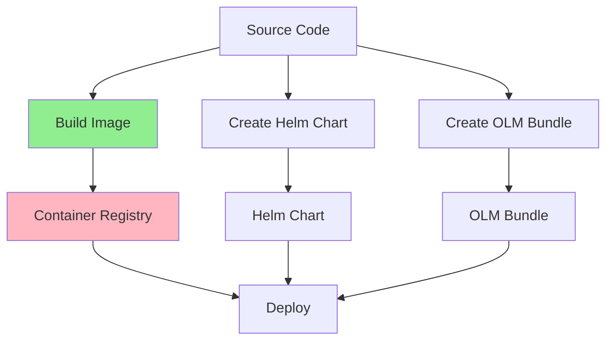
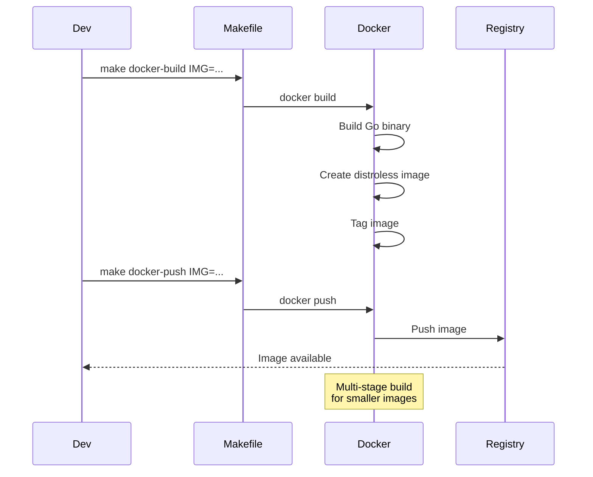
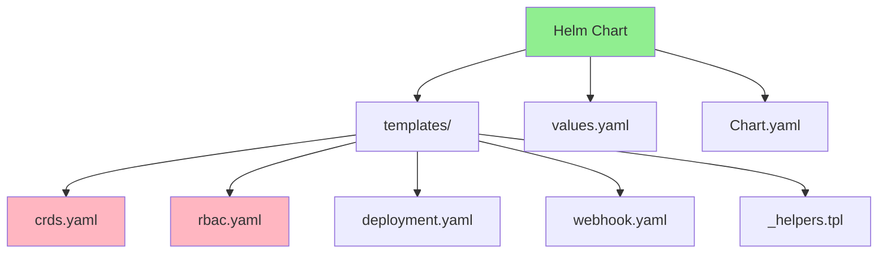
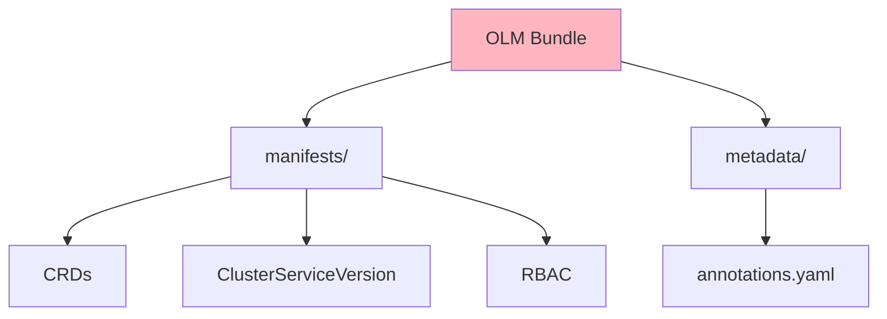
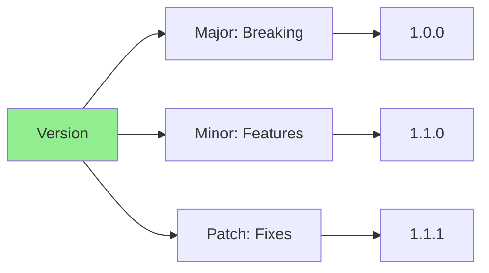
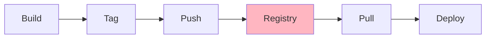
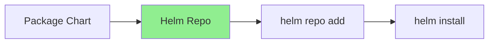
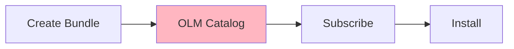
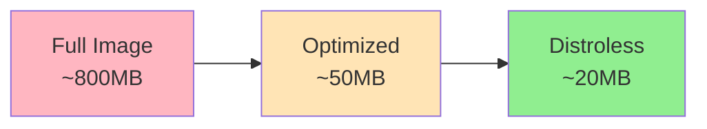

# Урок 7.1: Упаковка и распространение

**Навигация:** [Обзор модуля](../README.md) | [Следующий урок: RBAC и безопасность →](02-rbac-security.md)

## Введение

Прежде чем развёртывать операторы в продакшене, их нужно упаковать и распространить. Этот урок охватывает сборку образов контейнеров, создание Helm-чартов и упаковку операторов для распространения через OLM (Operator Lifecycle Manager).

## Теория: упаковка и распространение

Упаковка операторов обеспечивает **надёжные, повторяемые развёртывания** в разных средах.

### Почему упаковка важна

**Воспроизводимость:**
- Одна и та же версия оператора везде
- Согласованные развёртывания
- Контроль версий
- Возможность отката

**Распространение:**
- Совместное использование операторов командами
- Развёртывание в нескольких кластерах
- Возможность создания маркетплейса операторов
- Упрощение установки

**Развёртывание:**
- Стандартные методы развёртывания
- Helm-чарты для удобной установки
- OLM для маркетплейса операторов
- Образы контейнеров для переносимости

### Стратегии упаковки

**Образы контейнеров:**
- Стандартный формат
- Работают везде
- Версионируются
- Переносимы

**Helm-чарты:**
- Упаковывают оператор + зависимости
- Параметризованная конфигурация
- Простые обновления
- Стандарт сообщества

**OLM-бандлы:**
- Формат маркетплейса операторов
- Метаданные и манифесты
- Управление версиями
- Разрешение зависимостей

### Версионирование

**Семантическое версионирование:**
- Major: несовместимые изменения
- Minor: новые возможности
- Patch: исправления багов

**Теги версий:**
- `latest`: последняя версия
- `v1.2.3`: конкретная версия
- `v1.2`: последний патч минорной версии
- `stable`: стабильный релиз

Понимание упаковки помогает эффективно распространять операторы.

## Процесс упаковки оператора

Вот как операторы упаковываются и распространяются:



## Сборка образов контейнеров

Kubebuilder генерирует для вас `Dockerfile` при создании каркаса проекта. Он использует многоэтапную сборку (multi-stage build) для оптимального размера образа и безопасности.

### Dockerfile, сгенерированный Kubebuilder

Когда вы запускаете `kubebuilder init`, он создаёт Dockerfile в корне проекта:

```dockerfile
# Build stage
FROM golang:1.24 as builder
ARG TARGETOS
ARG TARGETARCH

WORKDIR /workspace
# Copy the Go Modules manifests
COPY go.mod go.mod
COPY go.sum go.sum
# Cache deps before building and copying source
RUN go mod download

# Copy the go source
COPY cmd/main.go cmd/main.go
COPY api/ api/
COPY internal/ internal/

# Build
RUN CGO_ENABLED=0 GOOS=${TARGETOS:-linux} GOARCH=${TARGETARCH:-amd64} go build -a -o manager cmd/main.go

# Runtime stage
FROM gcr.io/distroless/static:nonroot
WORKDIR /
COPY --from=builder /workspace/manager .
USER 65532:65532
ENTRYPOINT ["/manager"]
```

**Примечание:** каталог `internal/` копируется целиком, потому что содержит:
- `internal/controller/` — вашу логику согласования
- `internal/webhook/` — обработчики вебхуков (если вы создали вебхуки в Модуле 5)

### Сборка с помощью Makefile от Kubebuilder

Kubebuilder предоставляет цели Makefile для сборки образов:

```bash
# Build the container image
make docker-build IMG=<registry>/postgres-operator:v0.1.0

# Push to registry
make docker-push IMG=<registry>/postgres-operator:v0.1.0

# Build and push in one command
make docker-build docker-push IMG=<registry>/postgres-operator:v0.1.0
```

### Процесс сборки образа



### Загрузка образов в kind

Для локальной разработки с кластерами kind:

```bash
# Build the image
make docker-build IMG=postgres-operator:latest

# Load into kind cluster
kind load docker-image postgres-operator:latest --name k8s-operators-course
```

## Helm-чарты для операторов

Хотя kubebuilder по умолчанию использует Kustomize для развёртывания (каталог `config/`), вы можете создавать Helm-чарты для более широкого распространения. Манифесты, сгенерированные kubebuilder, можно использовать как основу для Helm-шаблонов.

### Что нужно Helm-чарту оператора

Полный Helm-чарт оператора должен включать **все** компоненты из каталога `config/` kubebuilder:

| Компонент | Каталог-источник | Назначение |
|-----------|-----------------|---------|
| **CRD** | `config/crd/` | Определения пользовательских ресурсов |
| **RBAC** | `config/rbac/` | ServiceAccount, ClusterRole, ClusterRoleBinding |
| **Deployment** | `config/manager/` | Под менеджера-контроллера |
| **Вебхуки** | `config/webhook/` | Валидирующие/мутирующие вебхуки (если используются) |
| **Сертификаты** | `config/certmanager/` | Сертификаты вебхуков (при использовании cert-manager) |

**Важно:** Helm-чарт только с Deployment работать не будет! Оператору нужны разрешения RBAC для работы, а CRD должны быть установлены, чтобы оператор мог управлять пользовательскими ресурсами.

### Структура чарта



### Kustomize от Kubebuilder против Helm

Kubebuilder генерирует манифесты Kustomize в `config/`:

```
config/
├── crd/                    # CRD definitions
│   └── bases/
├── default/                # Default deployment configuration
├── manager/                # Controller deployment
├── rbac/                   # RBAC rules
├── webhook/                # Webhook configuration
└── samples/                # Sample CR manifests
```

**Для развёртывания с Kustomize** (рекомендуется для разработки):
```bash
# Deploy the operator
make deploy IMG=<registry>/postgres-operator:v0.1.0

# This runs: kustomize build config/default | kubectl apply -f -
```

**Для создания Helm-чарта** (для распространения):
```bash
# Create Helm chart directory
mkdir -p charts/postgres-operator/templates

# Export kustomize output as a starting point
kustomize build config/default > charts/postgres-operator/templates/all.yaml

# Then split into separate files and add templating
```

## OLM-бандлы

### Структура OLM-бандла



### Создание бандла

Хотя kubebuilder сосредоточен на разработке контроллеров, вы можете использовать operator-sdk вместе с kubebuilder для генерации OLM-бандла:

```bash
# Initialize operator-sdk integration (if not already done)
operator-sdk init --plugins=manifests

# Generate OLM bundle from kubebuilder manifests
operator-sdk generate bundle \
  --version 0.1.0 \
  --package postgres-operator \
  --channels stable

# Creates:
# bundle/
#   manifests/
#     postgres-operator.clusterserviceversion.yaml
#     database.example.com_databases.yaml
#   metadata/
#     annotations.yaml
```

Примечание: для большинства сценариев встроенного `make deploy` с Kustomize из kubebuilder достаточно. OLM-бандлы нужны в основном при публикации в маркетплейсах операторов, таких как OperatorHub.

## Стратегия версионирования

### Семантическое версионирование



**Формат версии:** `v<major>.<minor>.<patch>`

- **Major**: несовместимые изменения API
- **Minor**: новые возможности, обратно совместимые
- **Patch**: исправления багов, обратно совместимые

## Стратегии распространения

### Стратегия 1: реестр контейнеров



### Стратегия 2: репозиторий Helm



### Стратегия 3: каталог OLM



## Оптимизация образа

### Многоэтапная сборка

```dockerfile
# Stage 1: Build
FROM golang:1.24 AS builder
# ... build steps ...

# Stage 2: Runtime
FROM gcr.io/distroless/static:nonroot
# ... copy binary only ...
```

**Преимущества:**
- Меньший итоговый образ
- Нет инструментов сборки в продакшене
- Выше безопасность (distroless)

### Сравнение размеров образов



## Автоматизация с CI/CD

### GitHub Actions для релизов

Автоматизируйте релизы с помощью GitHub Actions:

```yaml
# .github/workflows/release.yaml
name: Release
on:
  push:
    tags: ['v*']
jobs:
  release:
    runs-on: ubuntu-latest
    steps:
      - uses: actions/checkout@v4
      - name: Build and push image
        run: make docker-build docker-push IMG=ghcr.io/${{ github.repository }}:${{ github.ref_name }}
      - name: Generate and push Helm chart
        run: |
          make helm-chart helm-package
          helm push dist/*.tgz oci://ghcr.io/${{ github.repository_owner }}/charts
```

### Распространение Helm-чартов

Современный подход: публикация Helm-чартов в OCI-реестры (например, GHCR):

```bash
# Push chart to OCI registry
helm push postgres-operator-0.1.0.tgz oci://ghcr.io/myorg/charts

# Install from OCI registry
helm install my-operator oci://ghcr.io/myorg/charts/postgres-operator --version 0.1.0
```

## Ключевые выводы

- **Kubebuilder генерирует** готовый к продакшену Dockerfile
- **`make docker-build`** собирает образы контейнеров с правильной расстановкой тегов
- **Kustomize** — метод развёртывания по умолчанию в kubebuilder
- **`make helm-chart`** может генерировать Helm-чарты из Kustomize
- **OCI-реестры** могут хранить и образы, И Helm-чарты
- **GitHub Actions** автоматизируют релизы и публикацию чартов
- **Семантическое версионирование** отслеживает версии оператора
- **Многоэтапная сборка** создаёт меньшие и безопасные образы

## Что нужно понимать для создания операторов

При упаковке операторов kubebuilder:
- Используйте `make docker-build IMG=...` для сборки образов
- Используйте `make docker-push IMG=...` для публикации в реестр
- Используйте `make deploy IMG=...` для развёртывания на основе Kustomize
- Используйте `make helm-chart` для генерации Helm-чартов из Kustomize
- Настройте GitHub Actions для автоматизированных релизов
- Публикуйте Helm-чарты в OCI-реестры для распространения
- Следуйте семантическому версионированию для вашего оператора
- Используйте загрузку образов kind для локальной разработки

## Связанная лабораторная работа

- [Лабораторная 7.1: Упаковка вашего оператора](../labs/lab-01-packaging-distribution.md) — практические упражнения для этого урока

## Источники

### Официальная документация
- [Образы контейнеров](https://kubernetes.io/docs/concepts/containers/images/)
- [Документация Helm](https://helm.sh/docs/)
- [Документация OLM](https://olm.operatorframework.io/)

### Дополнительное чтение
- **Kubernetes Operators**, Jason Dobies и Joshua Wood — глава 12: Packaging
- **Docker Deep Dive**, Nigel Poulton — лучшие практики образов контейнеров
- [Лучшие практики Helm](https://helm.sh/docs/chart_best_practices/)

### Смежные темы
- [Многоэтапная сборка Docker](https://docs.docker.com/build/building/multi-stage/)
- [Семантическое версионирование](https://semver.org/)
- [Operator Lifecycle Manager](https://olm.operatorframework.io/)

## Дальнейшие шаги

Теперь, когда вы понимаете упаковку, давайте изучим RBAC и безопасность.

**Навигация:** [← Обзор модуля](../README.md) | [Далее: RBAC и безопасность →](02-rbac-security.md)
