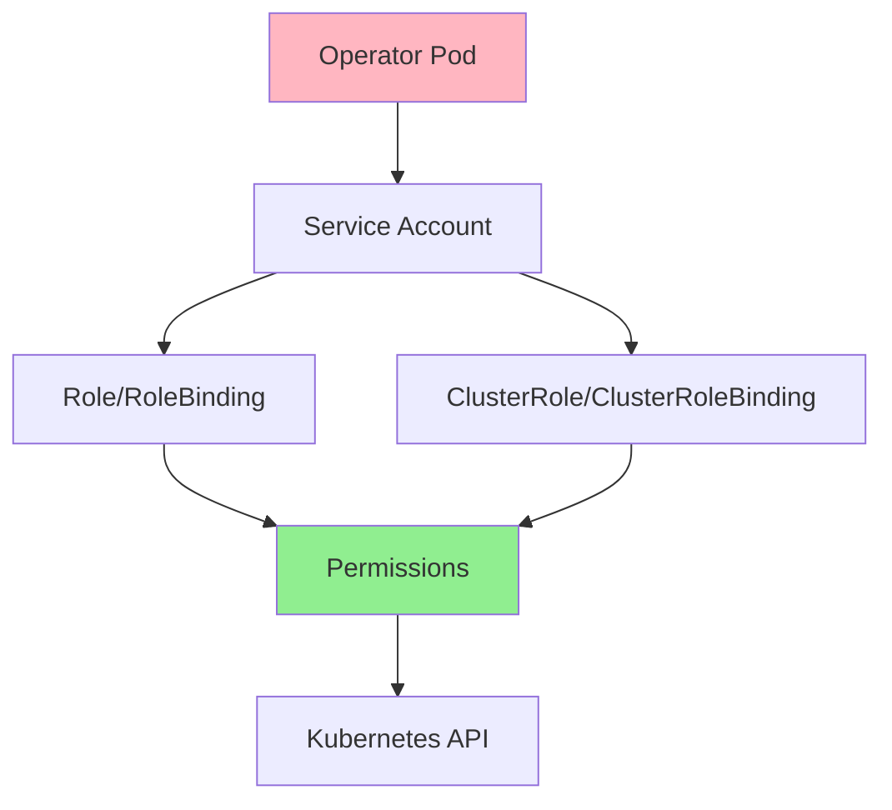
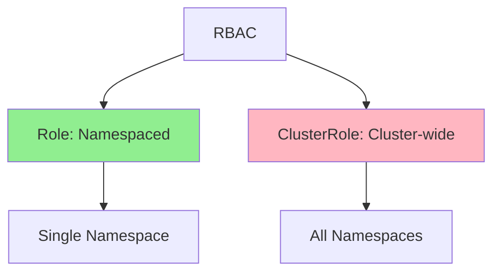
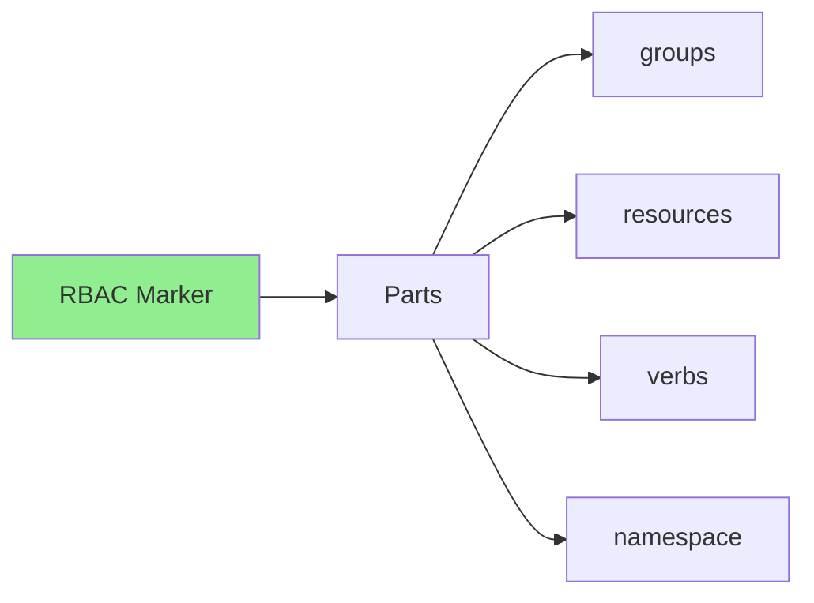
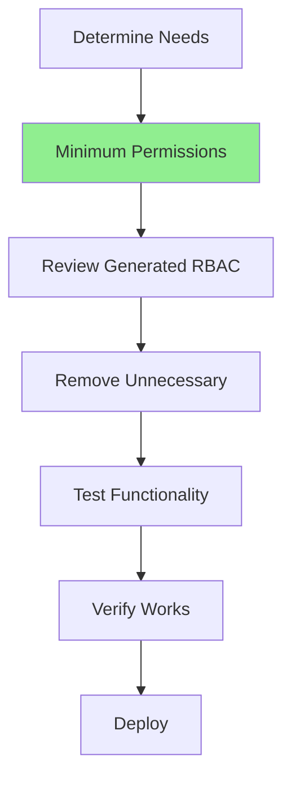
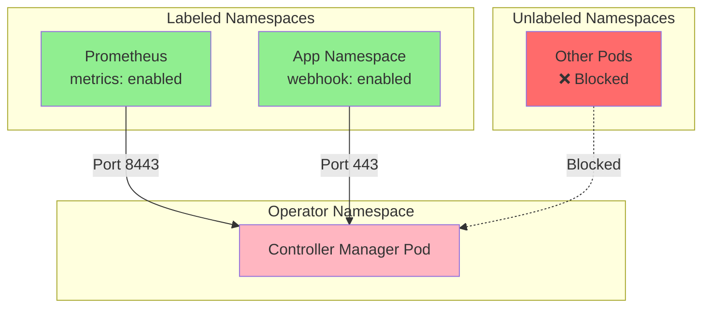
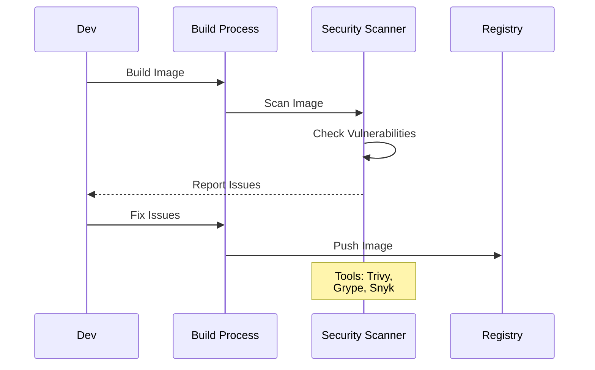

# Урок 7.2: RBAC и безопасность

**Навигация:** [← Предыдущий: Упаковка и распространение](01-packaging-distribution.md) | [Обзор модуля](../README.md) | [Далее: Высокая доступность →](03-high-availability.md)

## Введение

Операторам нужны разрешения для управления ресурсами, но они должны следовать **принципу наименьших привилегий** — запрашивать только минимально необходимые разрешения. Этот урок охватывает конфигурацию RBAC (управление доступом на основе ролей) и лучшие практики безопасности для операторов.

## Теория: RBAC и безопасность

Безопасность критически важна для продакшен-операторов — у них **значительные разрешения** в вашем кластере.

### Почему безопасность важна

**Поверхность атаки:**
- Операторы работают с повышенными привилегиями
- Скомпрометированный оператор = скомпрометированный кластер
- Нарушения безопасности могут быть катастрофическими
- Требования комплаенса

**Принцип наименьших привилегий:**
- Предоставляйте минимально необходимые разрешения
- Уменьшайте поверхность атаки
- Ограничивайте радиус поражения (blast radius)
- Следуйте лучшим практикам безопасности

**Эшелонированная защита (defense in depth):**
- Несколько уровней безопасности
- RBAC для авторизации
- Сетевые политики для изоляции
- Контексты безопасности для контейнеров

### Компоненты RBAC

**Service Account:**
- Идентичность для пода оператора
- Используется для аутентификации
- Привязан к разрешениям RBAC

**Role/ClusterRole:**
- Определяет разрешения
- Role: в рамках пространства имён
- ClusterRole: в рамках кластера

**RoleBinding/ClusterRoleBinding:**
- Привязывает роль к service account
- Предоставляет разрешения
- RoleBinding: в рамках пространства имён
- ClusterRoleBinding: в рамках кластера

### Лучшие практики безопасности

**Безопасность образов:**
- Используйте distroless-образы
- Сканируйте на уязвимости
- Держите образы обновлёнными
- Минимальные базовые образы

**Безопасность контейнеров:**
- Запуск не от root
- Файловая система root только для чтения
- Отбрасывание всех capabilities
- Использование контекстов безопасности

**Сетевая безопасность:**
- Сетевые политики
- Ограничение сетевого доступа
- Изоляция трафика оператора
- Шифрование связи

Понимание безопасности помогает создавать безопасные, готовые к продакшену операторы.

## Архитектура RBAC

Вот как работает RBAC для операторов:



## Компоненты RBAC

### Service Account

```yaml
apiVersion: v1
kind: ServiceAccount
metadata:
  name: postgres-operator
  namespace: default
```

### Role против ClusterRole



**Role**: разрешения в рамках пространства имён  
**ClusterRole**: разрешения во всех пространствах имён

## Маркеры RBAC Kubebuilder

Kubebuilder генерирует RBAC автоматически из маркеров в коде вашего контроллера. Эти маркеры размещаются прямо над функцией `Reconcile`:

```go
// +kubebuilder:rbac:groups=database.example.com,resources=databases,verbs=get;list;watch;create;update;patch;delete
// +kubebuilder:rbac:groups=database.example.com,resources=databases/status,verbs=get;update;patch
// +kubebuilder:rbac:groups=database.example.com,resources=databases/finalizers,verbs=update
// +kubebuilder:rbac:groups=apps,resources=statefulsets,verbs=get;list;watch;create;update;patch;delete
// +kubebuilder:rbac:groups=core,resources=services,verbs=get;list;watch;create;update;patch;delete
// +kubebuilder:rbac:groups=core,resources=secrets,verbs=get;list;watch;create;update;patch;delete

func (r *DatabaseReconciler) Reconcile(ctx context.Context, req ctrl.Request) (ctrl.Result, error) {
    // ... reconciliation logic
}
```

### Генерация манифестов RBAC

После обновления маркеров перегенерируйте манифесты RBAC:

```bash
# Generate RBAC from markers
make manifests

# View generated RBAC
cat config/rbac/role.yaml
```

Сгенерированные манифесты находятся в `config/rbac/`:
- `role.yaml` — ClusterRole с разрешениями
- `role_binding.yaml` — ClusterRoleBinding
- `service_account.yaml` — ServiceAccount для оператора

### Формат маркера RBAC



## Принцип наименьших привилегий



**Лучшие практики:**
- Запрашивайте только нужные разрешения
- Используйте конкретные глаголы (verbs), а не `*`
- Используйте конкретные ресурсы, а не `*`
- Проверяйте сгенерированный RBAC
- Тестируйте с минимальными разрешениями

## Лучшие практики безопасности

### Практика 1: используйте distroless-образы

```dockerfile
FROM gcr.io/distroless/static:nonroot
# No shell, no package manager, minimal attack surface
```

### Практика 2: запуск не от root

```yaml
securityContext:
  runAsNonRoot: true
  runAsUser: 65532
  allowPrivilegeEscalation: false
  capabilities:
    drop:
    - ALL
```

### Практика 3: файловая система root только для чтения

```yaml
securityContext:
  readOnlyRootFilesystem: true
volumeMounts:
- name: tmp
  mountPath: /tmp
volumes:
- name: tmp
  emptyDir: {}
```

### Практика 4: сетевые политики

Сетевые политики (Network Policies) необходимы для **эшелонированной защиты** — они контролируют сетевой трафик к вашим подам оператора и от них, ограничивая радиус поражения, если злоумышленник скомпрометирует ваш оператор.

#### Сетевые политики, сгенерированные Kubebuilder

**Хорошая новость!** Kubebuilder автоматически генерирует сетевые политики в `config/network-policy/`:

```
config/network-policy/
├── allow-metrics-traffic.yaml   # Controls metrics endpoint access
├── allow-webhook-traffic.yaml   # Controls webhook server access
└── kustomization.yaml
```

Они **отключены по умолчанию**. Чтобы включить их, раскомментируйте в `config/default/kustomization.yaml`:

```yaml
# [NETWORK POLICY] Protect the /metrics endpoint and Webhook Server
- ../network-policy  # Uncomment this line
```

#### Как работают сетевые политики Kubebuilder



**Подход Kubebuilder:**
- **Доступ к метрикам**: только пространства имён с меткой `metrics: enabled` могут собирать метрики (порт 8443)
- **Доступ к вебхукам**: только пространства имён с меткой `webhook: enabled` могут использовать вебхуки (порт 443)

#### Пример сетевой политики Kubebuilder

```yaml
# config/network-policy/allow-metrics-traffic.yaml
apiVersion: networking.k8s.io/v1
kind: NetworkPolicy
metadata:
  name: allow-metrics-traffic
  namespace: system
spec:
  podSelector:
    matchLabels:
      control-plane: controller-manager
      app.kubernetes.io/name: postgres-operator
  policyTypes:
    - Ingress
  ingress:
    - from:
      - namespaceSelector:
          matchLabels:
            metrics: enabled  # Only from labeled namespaces
      ports:
        - port: 8443
          protocol: TCP
```

#### Пометка пространств имён метками

Чтобы политики разрешали трафик, пометьте свои пространства имён:

```bash
# Allow Prometheus to scrape metrics
kubectl label namespace monitoring metrics=enabled

# Allow webhook traffic from namespaces where you create CRs
kubectl label namespace default webhook=enabled
```

#### Ключевые концепции

| Поле | Описание |
|-------|-------------|
| `podSelector` | Выбирает поды, к которым применяется политика (пусто = все поды в пространстве имён) |
| `policyTypes` | Какое направление контролировать: `Ingress`, `Egress` или оба |
| `ingress.from` | Кто может отправлять трафик К выбранным подам |
| `namespaceSelector` | Сопоставление подов в пространствах имён с определёнными метками |

**Важно:** сетевые политики требуют CNI-плагина, который их поддерживает (Calico, Cilium, Weave и т. д.). Сеть Kubernetes по умолчанию (kubenet) НЕ применяет сетевые политики!

## Сканирование безопасности

### Процесс сканирования



## Конфигурация безопасности Kubebuilder

Сгенерированное развёртывание Kubebuilder в `config/manager/manager.yaml` включает лучшие практики безопасности:

```yaml
spec:
  template:
    spec:
      securityContext:
        runAsNonRoot: true
      containers:
      - name: manager
        securityContext:
          allowPrivilegeEscalation: false
          capabilities:
            drop:
            - ALL
        # Resource limits from config/manager/manager.yaml
        resources:
          limits:
            cpu: 500m
            memory: 128Mi
          requests:
            cpu: 10m
            memory: 64Mi
```

## Ключевые выводы

- **RBAC** контролирует разрешения оператора
- **Service Accounts** идентифицируют оператор
- **Role** ограничены пространством имён, **ClusterRole** — уровнем кластера
- **Маркеры Kubebuilder** автоматически генерируют RBAC через `make manifests`
- **Принцип наименьших привилегий** минимизирует риск
- **Dockerfile от Kubebuilder** по умолчанию использует distroless-образы
- **Сканирование безопасности** находит уязвимости
- **Проверяйте `config/rbac/`**, чтобы убедиться в сгенерированных разрешениях
- **Сетевые политики** обеспечивают эшелонированную защиту, ограничивая сетевой трафик
- Операторам обычно нужен только egress к **API Kubernetes (443)** и **DNS (53)**

## Что нужно понимать для создания операторов

При настройке RBAC и безопасности с kubebuilder:
- Добавляйте маркеры RBAC над функцией Reconcile
- Запускайте `make manifests` для перегенерации RBAC
- Проверяйте `config/rbac/role.yaml` на сгенерированные разрешения
- Удаляйте ненужные маркеры для минимизации разрешений
- Используйте базовый образ distroless (уже в Dockerfile kubebuilder)
- Настраивайте контексты безопасности в `config/manager/manager.yaml`
- **Включайте сетевые политики, раскомментировав `../network-policy` в `config/default/kustomization.yaml`**
- **Помечайте пространства имён метками `metrics: enabled` и `webhook: enabled` по необходимости**
- Сканируйте образы на уязвимости перед развёртыванием
- **Тестируйте сетевые политики в кластере с поддержкой CNI (Calico, Cilium)**

## Связанная лабораторная работа

- [Лабораторная 7.2: Настройка RBAC](../labs/lab-02-rbac-security.md) — практические упражнения для этого урока

## Источники

### Официальная документация
- [Авторизация RBAC](https://kubernetes.io/docs/reference/access-authn-authz/rbac/)
- [Service Accounts](https://kubernetes.io/docs/concepts/security/service-accounts/)
- [Сетевые политики](https://kubernetes.io/docs/concepts/services-networking/network-policies/)

### Дополнительное чтение
- **Kubernetes Security**, Andrew Martin и Michael Hausenblas — лучшие практики безопасности
- **Kubernetes Operators**, Jason Dobies и Joshua Wood — глава 13: Security
- [Лучшие практики безопасности Kubernetes](https://kubernetes.io/docs/concepts/security/)

### Смежные темы
- [Стандарты безопасности подов](https://kubernetes.io/docs/concepts/security/pod-security-standards/)
- [Контексты безопасности](https://kubernetes.io/docs/tasks/configure-pod-container/security-context/)
- [Безопасность образов](https://kubernetes.io/docs/concepts/security/application-security-checklist/#image-security)

## Дальнейшие шаги

Теперь, когда вы понимаете RBAC и безопасность, давайте изучим высокую доступность.

**Навигация:** [← Предыдущий: Упаковка и распространение](01-packaging-distribution.md) | [Обзор модуля](../README.md) | [Далее: Высокая доступность →](03-high-availability.md)
