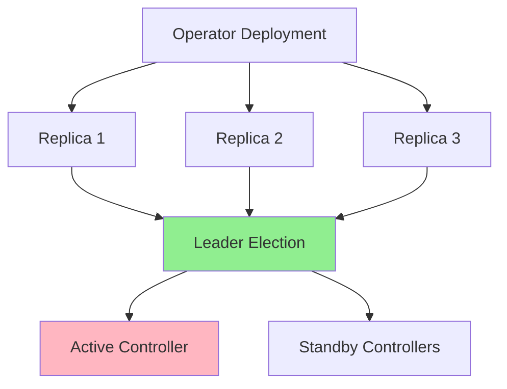
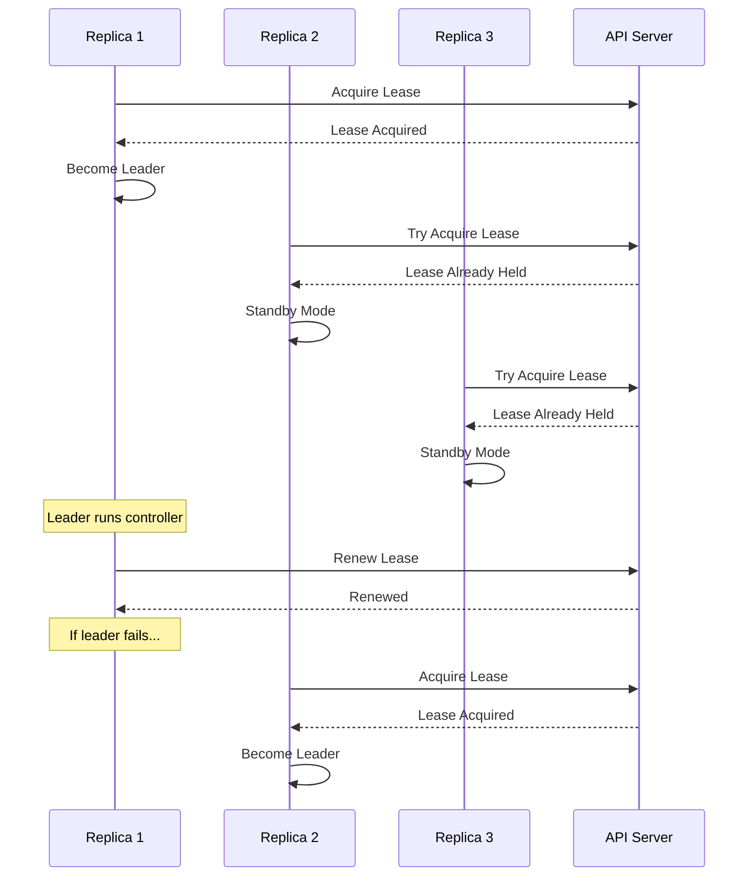
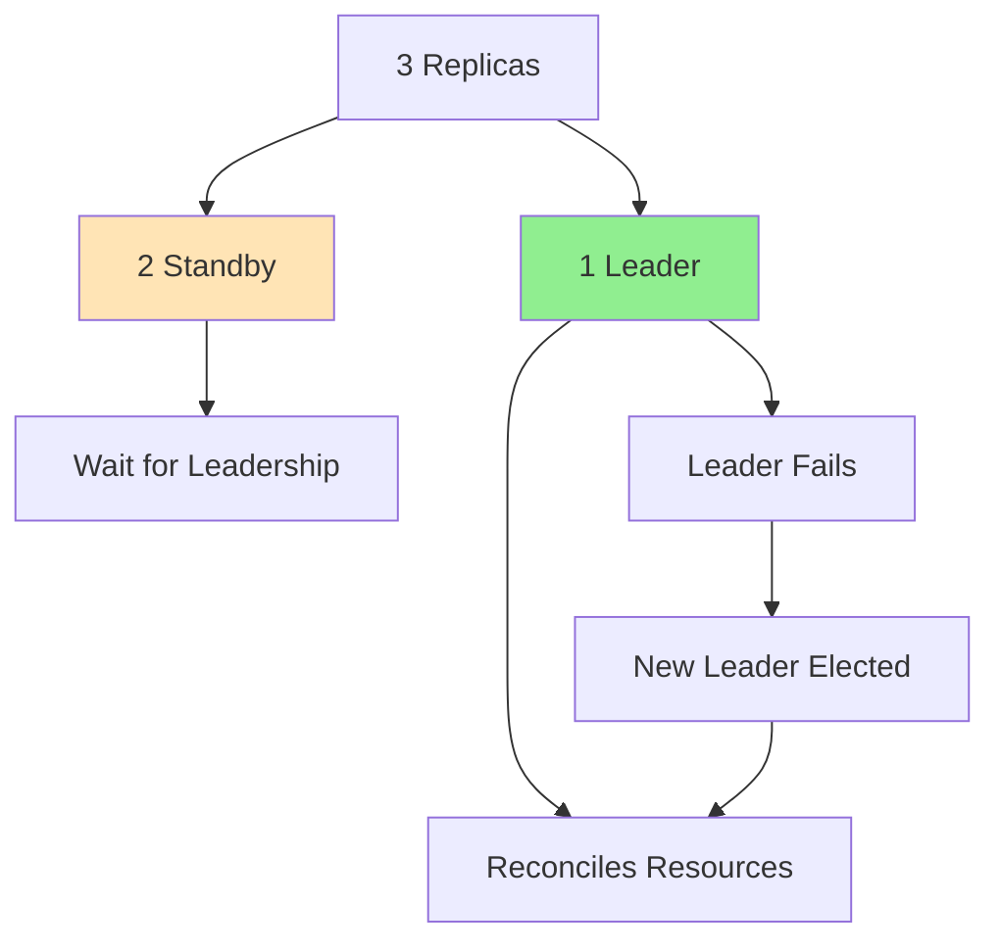
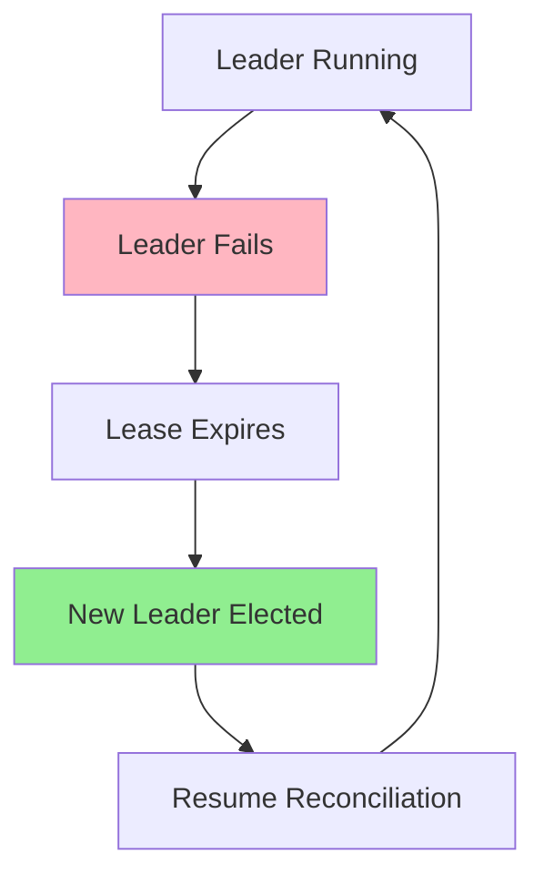
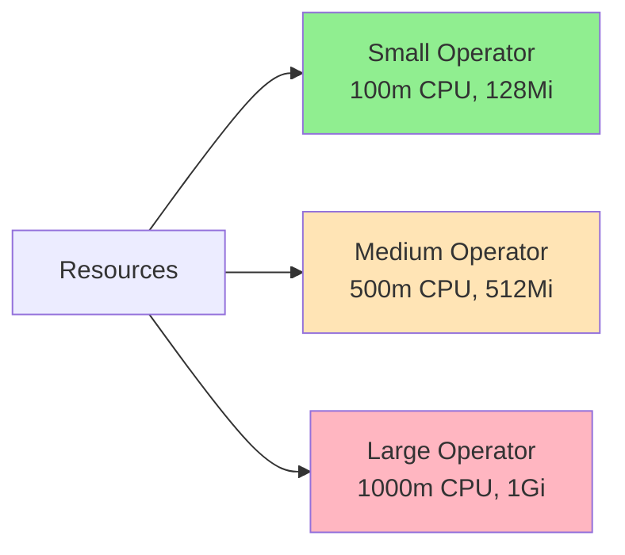
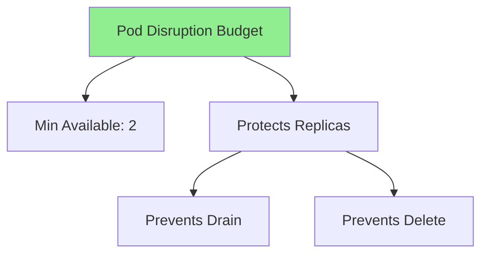

# Урок 7.3: Высокая доступность

**Навигация:** [← Предыдущий: RBAC и безопасность](02-rbac-security.md) | [Обзор модуля](../README.md) | [Далее: Производительность и масштабируемость →](04-performance-scalability.md)

## Введение

Продакшен-операторы должны быть высокодоступными — они должны продолжать работать, даже если отдельные поды выходят из строя. Этот урок охватывает выбор лидера, несколько реплик, обработку отказа (failover) и управление ресурсами для высокой доступности.

## Теория: высокая доступность

Высокая доступность гарантирует, что операторы **продолжают работать** несмотря на сбои.

### Зачем нужна высокая доступность?

**Надёжность:**
- Операторы управляют критически важными нагрузками
- Единая точка отказа недопустима
- Избыточность предотвращает простои
- Отказоустойчивость обеспечивает непрерывность

**Масштабируемость:**
- Обработка возросшей нагрузки
- Распределение работы между репликами
- Горизонтальное масштабирование
- Производительность под нагрузкой

**Устойчивость:**
- Переживание сбоев подов
- Переживание сбоев узлов
- Автоматическое восстановление
- Развёртывания без простоя

### Выбор лидера (Leader Election)

**Зачем нужен выбор лидера?**
- Контроллеры не должны конфликтовать
- Согласование должен выполнять только один за раз
- Предотвращает дублирование работы
- Обеспечивает согласованность

**Как это работает:**
- Контроллеры конкурируют за аренду (lease)
- Победитель становится лидером
- Лидер согласовывает ресурсы
- Остальные ждут в режиме ожидания (standby)

**Отказоустойчивость:**
- Лидер периодически обновляет аренду
- Если лидер выходит из строя, аренда истекает
- Другой контроллер получает аренду
- Новый лидер берёт управление на себя

### Управление ресурсами

**Запросы ресурсов (Resource Requests):**
- Гарантированные ресурсы
- Планировщик использует их для размещения
- Гарантируют, что у оператора есть ресурсы

**Лимиты ресурсов (Resource Limits):**
- Максимум ресурсов
- Предотвращают исчерпание ресурсов
- Защищают другие нагрузки
- Позволяют переподписку (overcommitment)

Понимание высокой доступности помогает создавать надёжные, готовые к продакшену операторы.

## Архитектура высокой доступности

Вот как работает HA для операторов:



## Выбор лидера

### Как работает выбор лидера



### Выбор лидера в Kubebuilder

Сгенерированный Kubebuilder `cmd/main.go` уже включает поддержку выбора лидера через флаги командной строки:

```go
// In cmd/main.go (generated by kubebuilder)
var enableLeaderElection bool
flag.BoolVar(&enableLeaderElection, "leader-elect", false,
    "Enable leader election for controller manager. "+
    "Enabling this will ensure there is only one active controller manager.")

mgr, err := ctrl.NewManager(ctrl.GetConfigOrDie(), ctrl.Options{
    Scheme:                 scheme,
    Metrics:                metricsserver.Options{BindAddress: metricsAddr},
    HealthProbeBindAddress: probeAddr,
    LeaderElection:         enableLeaderElection,
    LeaderElectionID:       "postgres-operator.example.com",
    // LeaderElectionReleaseOnCancel defines if the leader should step down
    // when the Manager ends. This requires the binary to immediately end
    // when the Manager is stopped.
    LeaderElectionReleaseOnCancel: true,
})
```

Чтобы включить выбор лидера при запуске оператора:

```bash
# Run with leader election enabled
./manager --leader-elect=true
```

Для продакшен-развёртываний обновите `config/manager/manager.yaml`:

```yaml
args:
- --leader-elect
```

## Несколько реплик

### Конфигурация развёртывания Kubebuilder

Обновите количество реплик в `config/manager/manager.yaml`:

```yaml
apiVersion: apps/v1
kind: Deployment
metadata:
  name: controller-manager
  namespace: system
  labels:
    control-plane: controller-manager
spec:
  replicas: 3  # Increase from 1 to 3 for HA
  selector:
    matchLabels:
      control-plane: controller-manager
  template:
    metadata:
      labels:
        control-plane: controller-manager
    spec:
      containers:
      - name: manager
        image: controller:latest
        args:
        - --leader-elect  # Enable leader election for HA
```

Или используйте патчи `kustomize` в `config/default/manager_config_patch.yaml`.

### Координация реплик



## Процесс отказоустойчивости

### Процесс failover



### Обработка отказа

```go
// Leader election handles failover automatically
// When leader fails:
// 1. Lease expires (after LeaseDuration)
// 2. Another replica acquires lease
// 3. New leader starts reconciling
// 4. No reconciliation is lost (idempotent operations)
```

## Управление ресурсами

### Лимиты ресурсов

```yaml
resources:
  requests:
    cpu: 100m
    memory: 128Mi
  limits:
    cpu: 500m
    memory: 512Mi
```

### Подбор размера ресурсов



## Бюджет прерывания подов (Pod Disruption Budget)

### Конфигурация PDB

```yaml
apiVersion: policy/v1
kind: PodDisruptionBudget
metadata:
  name: postgres-operator-pdb
spec:
  minAvailable: 2
  selector:
    matchLabels:
      app: postgres-operator
```

### Защита с помощью PDB



## Проверки здоровья (Health Checks)

Сгенерированный Kubebuilder `cmd/main.go` автоматически настраивает эндпоинты здоровья:

```go
// In cmd/main.go (generated by kubebuilder)
if err := mgr.AddHealthzCheck("healthz", healthz.Ping); err != nil {
    setupLog.Error(err, "unable to set up health check")
    os.Exit(1)
}
if err := mgr.AddReadyzCheck("readyz", healthz.Ping); err != nil {
    setupLog.Error(err, "unable to set up ready check")
    os.Exit(1)
}
```

### Liveness и Readiness в развёртывании

Пробы здоровья уже настроены в `config/manager/manager.yaml`:

```yaml
livenessProbe:
  httpGet:
    path: /healthz
    port: 8081
  initialDelaySeconds: 15
  periodSeconds: 20

readinessProbe:
  httpGet:
    path: /readyz
    port: 8081
  initialDelaySeconds: 5
  periodSeconds: 10
```

## Ключевые выводы

- **Выбор лидера** встроен в kubebuilder через флаг `--leader-elect`
- **Несколько реплик** обеспечивают избыточность (обновите `config/manager/manager.yaml`)
- **Отказоустойчивость** автоматическая при выборе лидера
- **Проверки здоровья** предварительно настроены kubebuilder (`/healthz`, `/readyz`)
- **Лимиты ресурсов** предотвращают исчерпание ресурсов
- **Бюджеты прерывания подов** защищают доступность
- **Идемпотентные операции** аккуратно обрабатывают отказ

## Что нужно понимать для создания операторов

При реализации высокой доступности с kubebuilder:
- Добавьте `--leader-elect` в аргументы развёртывания в `config/manager/manager.yaml`
- Увеличьте `replicas` до 3 в развёртывании
- Пробы здоровья уже настроены kubebuilder
- Установите подходящие лимиты ресурсов в развёртывании
- Добавьте бюджеты прерывания подов в `config/manager/`
- Убедитесь, что ваша логика согласования идемпотентна
- Используйте `make deploy` для развёртывания с конфигурацией HA

## Связанная лабораторная работа

- [Лабораторная 7.3: Реализация HA](../labs/lab-03-high-availability.md) — практические упражнения для этого урока

## Источники

### Официальная документация
- [Выбор лидера](https://kubernetes.io/docs/concepts/architecture/leases/)
- [Бюджеты прерывания подов](https://kubernetes.io/docs/concepts/workloads/pods/disruptions/#pod-disruption-budgets)
- [Управление ресурсами](https://kubernetes.io/docs/concepts/configuration/manage-resources-containers/)

### Дополнительное чтение
- **Kubernetes Operators**, Jason Dobies и Joshua Wood — глава 14: High Availability
- **Kubernetes: Up and Running**, Kelsey Hightower, Brendan Burns и Joe Beda — глава 12: Deploying Applications
- [Высокая доступность Kubernetes](https://kubernetes.io/docs/setup/production-environment/tools/kubeadm/high-availability/)

### Смежные темы
- [API Leases](https://kubernetes.io/docs/reference/kubernetes-api/cluster-resources/lease-v1/)
- [Проверки здоровья](https://kubernetes.io/docs/tasks/configure-pod-container/configure-liveness-readiness-startup-probes/)
- [Квоты ресурсов](https://kubernetes.io/docs/concepts/policy/resource-quotas/)

## Дальнейшие шаги

Теперь, когда вы понимаете высокую доступность, давайте изучим оптимизацию производительности.

**Навигация:** [← Предыдущий: RBAC и безопасность](02-rbac-security.md) | [Обзор модуля](../README.md) | [Далее: Производительность и масштабируемость →](04-performance-scalability.md)
