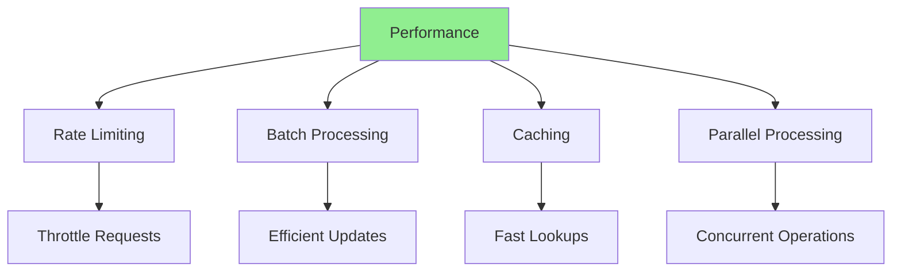
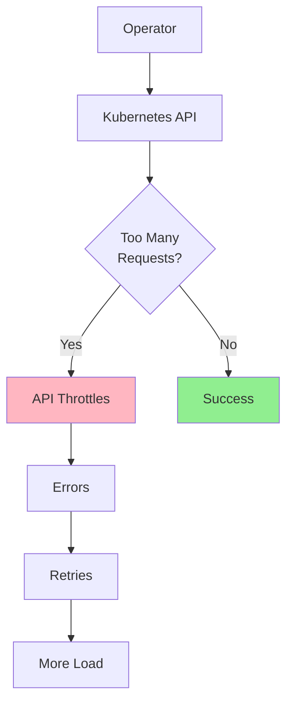
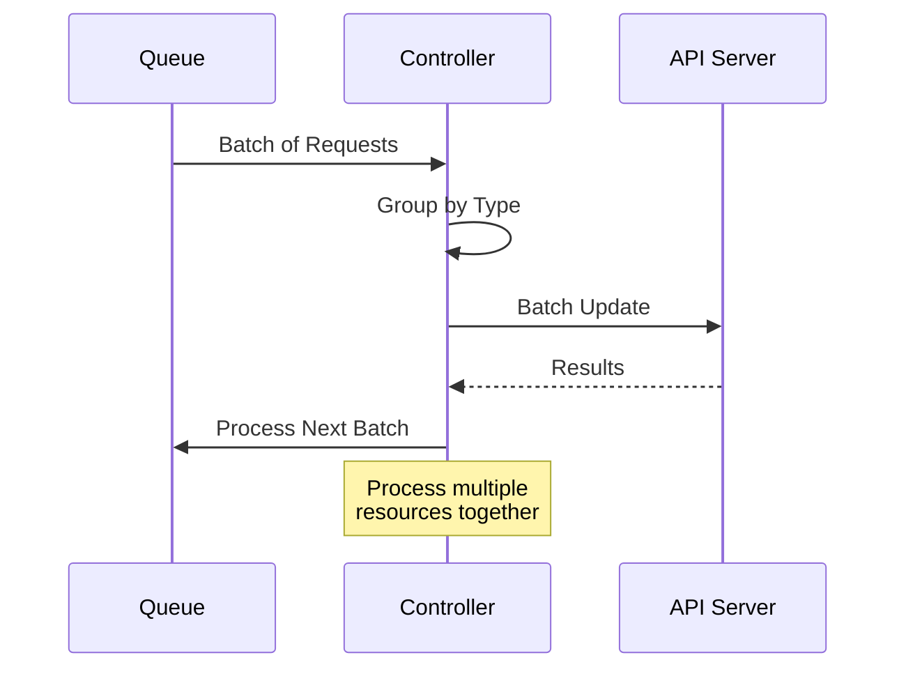
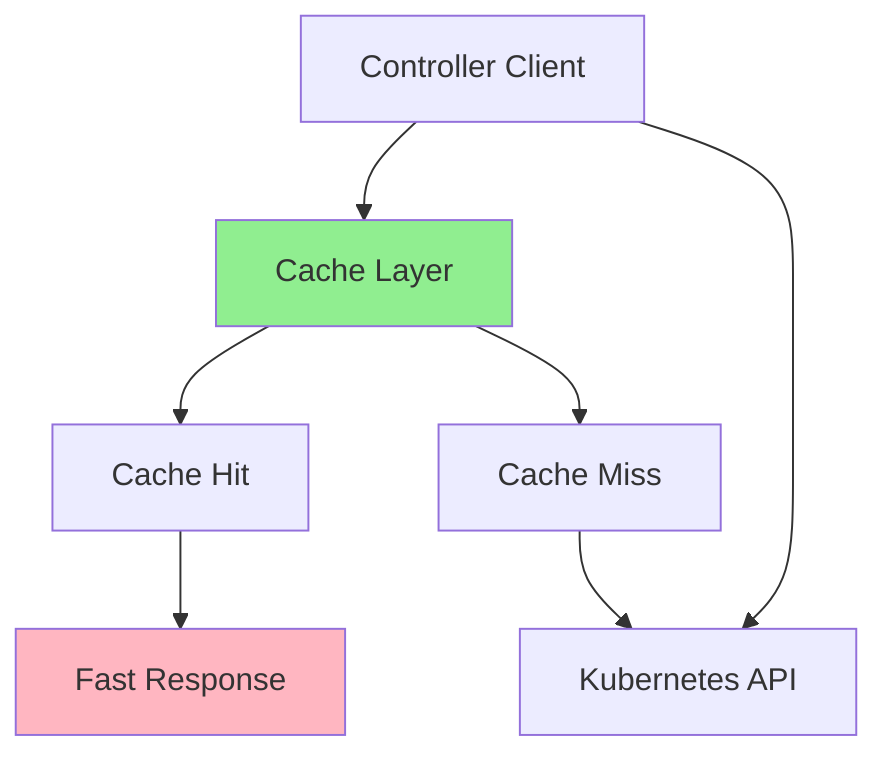
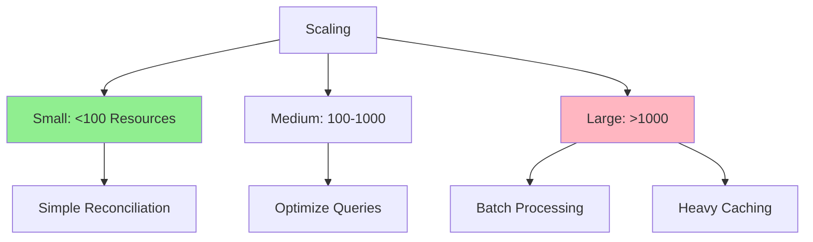
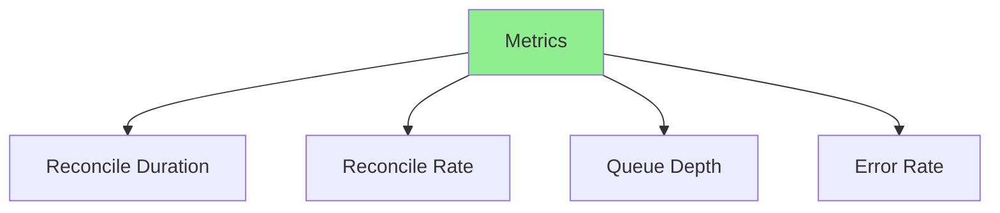

# Урок 7.4: Производительность и масштабируемость

**Навигация:** [← Предыдущий: Высокая доступность](03-high-availability.md) | [Обзор модуля](../README.md)

## Введение

По мере того как операторы управляют всё большим числом ресурсов, производительность становится критичной. Этот урок охватывает ограничение частоты (rate limiting), пакетное согласование, стратегии кеширования и приёмы эффективного управления крупномасштабными развёртываниями.

## Теория: производительность и масштабируемость

Оптимизация производительности гарантирует, что операторы **эффективно масштабируются** по мере управления бо́льшим числом ресурсов.

### Почему производительность важна

**Масштабируемость:**
- Операторы должны справляться с ростом
- Производительность деградирует с масштабом
- Оптимизация обеспечивает масштабирование
- Экономическая эффективность

**Опыт пользователя:**
- Быстрое согласование
- Отзывчивые обновления статуса
- Низкая задержка
- Лучшее использование ресурсов

**Эффективность ресурсов:**
- Меньшая нагрузка на API-сервер
- Сниженный сетевой трафик
- Меньшее использование CPU/памяти
- Экономия затрат

### Узкие места производительности

**Нагрузка на API-сервер:**
- Слишком много вызовов API
- Неэффективные запросы
- Отсутствие кеширования
- Проблемы с ограничением частоты

**Накладные расходы согласования:**
- Неэффективная логика согласования
- Ненужная работа
- Отсутствие пакетной обработки
- Последовательная обработка

**Использование памяти:**
- Большие кеши
- Утечки памяти
- Неэффективные структуры данных
- Отсутствие очистки

### Стратегии оптимизации

**Ограничение частоты:**
- Контроль частоты вызовов API
- Предотвращение перегрузки API-сервера
- Соблюдение лимитов API-сервера
- Сглаживание паттернов трафика

**Кеширование:**
- Кеширование часто используемых данных
- Сокращение вызовов API
- Более быстрый поиск
- Использование информеров

**Пакетная обработка:**
- Обработка нескольких ресурсов вместе
- Сокращение накладных расходов
- Повышение эффективности
- Лучшее использование ресурсов

**Параллельная обработка:**
- Обработка независимой работы параллельно
- Использование нескольких ядер
- Более быстрое завершение
- Осторожность с общим состоянием

Понимание производительности помогает создавать масштабируемые, эффективные операторы.

## Стратегии оптимизации производительности



## Ограничение частоты (Rate Limiting)

### Зачем ограничивать частоту?



### Использование встроенного ограничения частоты в Controller-Runtime

Controller-runtime (используемый kubebuilder) включает встроенное ограничение частоты. Настройте его при конфигурации контроллера:

```go
// In internal/controller/database_controller.go

import (
    "time"
    "k8s.io/client-go/util/workqueue"
    ctrl "sigs.k8s.io/controller-runtime"
    "sigs.k8s.io/controller-runtime/pkg/controller"
    "sigs.k8s.io/controller-runtime/pkg/reconcile"
)

func (r *DatabaseReconciler) SetupWithManager(mgr ctrl.Manager) error {
    return ctrl.NewControllerManagedBy(mgr).
        For(&databasev1.Database{}).
        Owns(&appsv1.StatefulSet{}).
        Owns(&corev1.Service{}).
        WithOptions(controller.Options{
            // MaxConcurrentReconciles limits parallel reconciliations
            MaxConcurrentReconciles: 2,
            // RateLimiter controls requeue rate (typed for controller-runtime v0.19+)
            RateLimiter: workqueue.NewTypedItemExponentialFailureRateLimiter[reconcile.Request](
                5*time.Millisecond,  // Base delay
                1000*time.Second,    // Max delay
            ),
        }).
        Complete(r)
}
```

### Пользовательское ограничение частоты для вызовов API

Для ограничения частоты внешних вызовов API внутри согласования:

```go
import (
    "golang.org/x/time/rate"
)

type DatabaseReconciler struct {
    client.Client
    Scheme      *runtime.Scheme
    apiLimiter  *rate.Limiter  // Rate limiter for external APIs
}

func NewDatabaseReconciler(mgr ctrl.Manager) *DatabaseReconciler {
    return &DatabaseReconciler{
        Client:     mgr.GetClient(),
        Scheme:     mgr.GetScheme(),
        apiLimiter: rate.NewLimiter(rate.Limit(10), 1), // 10 requests/second
    }
}

func (r *DatabaseReconciler) Reconcile(ctx context.Context, req ctrl.Request) (ctrl.Result, error) {
    // Wait for rate limiter before external API calls
    if err := r.apiLimiter.Wait(ctx); err != nil {
        return ctrl.Result{}, err
    }
    // ... reconciliation with external API calls ...
}
```

## Пакетное согласование

### Процесс пакетной обработки



### Пример пакетного согласования

```go
func (r *DatabaseReconciler) ReconcileBatch(ctx context.Context, requests []ctrl.Request) (ctrl.Result, error) {
    // Group requests by operation
    creates := []*databasev1.Database{}
    updates := []*databasev1.Database{}
    
    for _, req := range requests {
        db := &databasev1.Database{}
        if err := r.Get(ctx, req.NamespacedName, db); err != nil {
            if errors.IsNotFound(err) {
                continue
            }
            return ctrl.Result{}, err
        }
        
        if db.Status.Phase == "" {
            creates = append(creates, db)
        } else {
            updates = append(updates, db)
        }
    }
    
    // Batch create
    for _, db := range creates {
        r.reconcileDatabase(ctx, db)
    }
    
    // Batch update
    for _, db := range updates {
        r.reconcileDatabase(ctx, db)
    }
    
    return ctrl.Result{}, nil
}
```

## Стратегии кеширования

### Кеширование клиента



### Встроенное кеширование Kubebuilder

Controller-runtime (используемый kubebuilder) обеспечивает автоматическое кеширование через клиент Manager. Когда вы используете `r.Get()` или `r.List()`, чтение идёт из кеша, а не напрямую из API-сервера:

```go
// In your controller - reads from cache by default
func (r *DatabaseReconciler) Reconcile(ctx context.Context, req ctrl.Request) (ctrl.Result, error) {
    db := &databasev1.Database{}
    // This reads from cache, NOT from API server
    if err := r.Get(ctx, req.NamespacedName, db); err != nil {
        return ctrl.Result{}, client.IgnoreNotFound(err)
    }
    
    // List also uses cache
    dbList := &databasev1.DatabaseList{}
    if err := r.List(ctx, dbList, client.InNamespace(req.Namespace)); err != nil {
        return ctrl.Result{}, err
    }
    
    return ctrl.Result{}, nil
}
```

### Пользовательские индексаторы для быстрого поиска

Добавьте пользовательские индексы при настройке контроллера, чтобы обеспечить быструю фильтрацию:

```go
// In cmd/main.go or during controller setup
func SetupIndexes(mgr ctrl.Manager) error {
    // Index databases by their environment
    return mgr.GetFieldIndexer().IndexField(
        context.Background(),
        &databasev1.Database{},
        "spec.environment",
        func(obj client.Object) []string {
            db := obj.(*databasev1.Database)
            return []string{db.Spec.Environment}
        },
    )
}

// Then use in controller with MatchingFields
dbList := &databasev1.DatabaseList{}
err := r.List(ctx, dbList, client.MatchingFields{
    "spec.environment": "production",
})
```

## Параллельная обработка

### Конкурентное согласование

```go
func (r *DatabaseReconciler) ReconcileParallel(ctx context.Context, requests []ctrl.Request) error {
    var wg sync.WaitGroup
    errChan := make(chan error, len(requests))
    
    for _, req := range requests {
        wg.Add(1)
        go func(request ctrl.Request) {
            defer wg.Done()
            _, err := r.Reconcile(ctx, request)
            if err != nil {
                errChan <- err
            }
        }(req)
    }
    
    wg.Wait()
    close(errChan)
    
    // Collect errors
    var errors []error
    for err := range errChan {
        errors = append(errors, err)
    }
    
    if len(errors) > 0 {
        return fmt.Errorf("reconciliation errors: %v", errors)
    }
    
    return nil
}
```

## Управление большими кластерами

### Соображения масштабирования



### Приёмы оптимизации

1. **Используйте селекторы полей**
   ```go
   // Instead of listing all, use field selector
   databases := &databasev1.DatabaseList{}
   r.List(ctx, databases, client.MatchingFields{
       "spec.environment": "production",
   })
   ```

2. **Ограничивайте результаты List**
   ```go
   databases := &databasev1.DatabaseList{}
   r.List(ctx, databases, &client.ListOptions{
       Limit: 100,
   })
   ```

3. **Используйте индексы**
   ```go
   // Create index for frequent queries
   mgr.GetFieldIndexer().IndexField(ctx, &databasev1.Database{},
       "spec.environment", indexEnvironment)
   ```

## Мониторинг производительности

### Ключевые метрики



### Мониторинг производительности

```go
var (
    reconcileDuration = prometheus.NewHistogramVec(
        prometheus.HistogramOpts{
            Name: "database_reconcile_duration_seconds",
            Help: "Duration of reconciliations",
        },
        []string{"result"},
    )
    
    reconcileRate = prometheus.NewGauge(
        prometheus.GaugeOpts{
            Name: "database_reconcile_rate",
            Help: "Reconciliations per second",
        },
    )
)
```

## Ключевые выводы

- **Кеширование controller-runtime** автоматическое в kubebuilder
- **MaxConcurrentReconciles** контролирует параллельные согласования
- **RateLimiter** в опциях контроллера управляет частотой повторов
- **Индексы полей** обеспечивают быстрый фильтрованный поиск
- **`client.MatchingFields`** оптимизирует запросы
- **Метрики** доступны на `:8080/metrics` по умолчанию
- **Стратегии масштабирования** зависят от размера кластера

## Что нужно понимать для создания операторов

При оптимизации операторов kubebuilder:
- Используйте встроенное кеширование controller-runtime (автоматическое)
- Настраивайте `MaxConcurrentReconciles` в `SetupWithManager`
- Настраивайте пользовательские индексы полей для частого поиска
- Используйте `client.MatchingFields{}` для фильтрованных запросов
- Отслеживайте метрики на эндпоинте метрик по умолчанию
- Используйте `rate.Limiter` для внешних вызовов API
- Увеличивайте число реплик с выбором лидера для масштабирования
- Профилируйте с помощью `go tool pprof` при необходимости

## Связанная лабораторная работа

- [Лабораторная 7.4: Оптимизация производительности](../labs/lab-04-performance-scalability.md) — практические упражнения для этого урока

## Источники

### Официальная документация
- [Ограничение частоты API Kubernetes](https://kubernetes.io/docs/concepts/cluster-administration/flow-control/)
- [Производительность контроллера](https://kubernetes.io/docs/concepts/architecture/controller/#controller-performance)

### Дополнительное чтение
- **Kubernetes Operators**, Jason Dobies и Joshua Wood — глава 15: Performance
- **High Performance Go**, Ian Lance Taylor — оптимизация производительности Go

### Смежные темы
- [Приоритет и справедливость API (API Priority and Fairness)](https://kubernetes.io/docs/concepts/cluster-administration/flow-control/)
- [Профилирование Go-программ](https://go.dev/blog/pprof)
- [Стратегии кеширования](https://kubernetes.io/docs/concepts/architecture/controller/#caching)

## Дальнейшие шаги

Поздравляем! Вы завершили Модуль 7. Теперь вы понимаете:
- Упаковку и распространение
- RBAC и безопасность
- Высокую доступность
- Оптимизацию производительности

В [Модуле 8](../../module-08/README.md) вы изучите продвинутые темы и практические паттерны.

**Навигация:** [← Предыдущий: Высокая доступность](03-high-availability.md) | [Обзор модуля](../README.md) | [Далее: Модуль 8 →](../../module-08/README.md)
