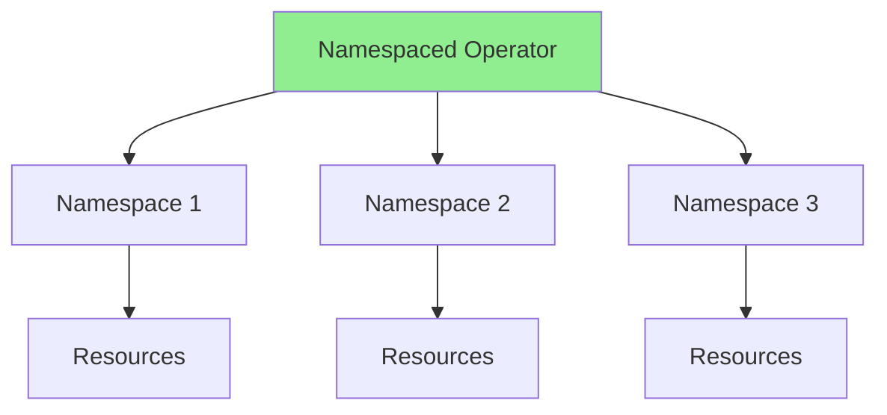
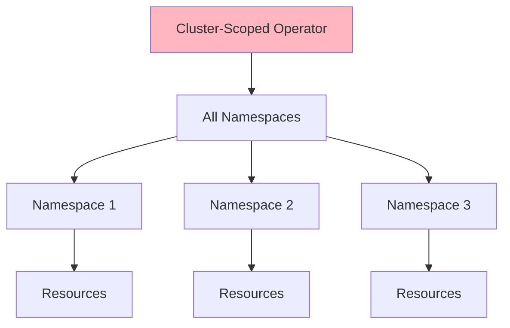
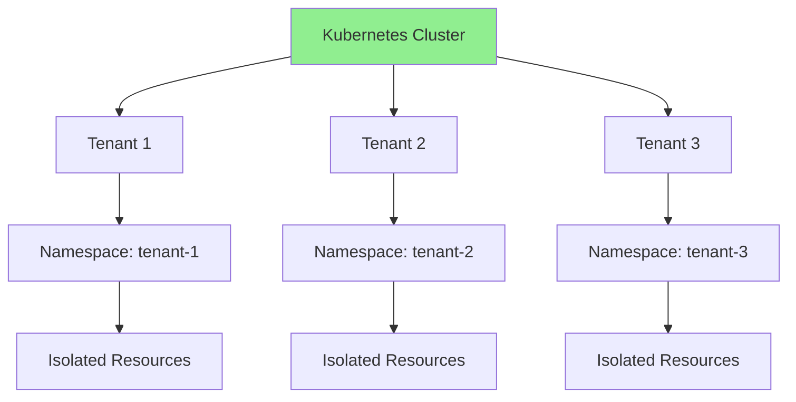
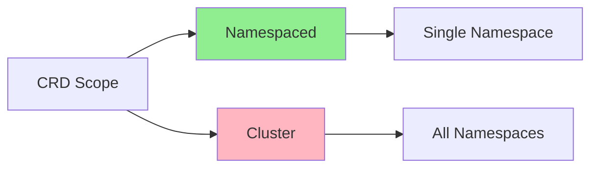
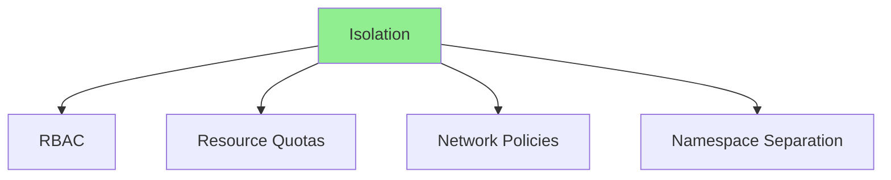

# Урок 8.1: Мультиарендность и изоляция пространств имён

**Навигация:** [Обзор модуля](../README.md) | [Следующий урок: Композиция операторов →](02-operator-composition.md)

## Введение

Продакшен-операторам часто нужно поддерживать несколько арендаторов (tenants) или работать между пространствами имён. Этот урок охватывает операторы с областью действия на весь кластер, изоляцию пространств имён, квоты ресурсов и паттерны мультиарендности, которые позволяют операторам управлять ресурсами в разных пространствах имён или для разных арендаторов.

## Теория: мультиарендность

Мультиарендность обеспечивает **изолированное управление ресурсами** для разных пользователей или команд.

### Зачем нужна мультиарендность?

**Изоляция ресурсов:**
- Разделение ресурсов арендаторов
- Предотвращение взаимного влияния
- Границы безопасности
- Требования комплаенса

**Совместное использование ресурсов:**
- Совместное использование инфраструктуры кластера
- Экономическая эффективность
- Централизованное управление
- Масштабируемость

**Контроль доступа:**
- Разные разрешения для каждого арендатора
- Обеспечение RBAC
- Сетевая изоляция
- Квоты ресурсов

### Модели арендности

**На основе пространств имён:**
- Каждый арендатор получает пространство имён
- Простая изоляция
- Легко реализовать
- Kubernetes-нативно

**На основе меток:**
- Арендаторы идентифицируются метками
- Гибкая группировка
- Арендность между пространствами имён
- Сложнее

**С областью действия на кластер:**
- Единый оператор для всех арендаторов
- Централизованное управление
- Эффективное использование ресурсов
- Требует тщательной изоляции

### Механизмы изоляции

**RBAC:**
- Управление доступом на основе ролей
- Ограничение разрешений арендаторов
- Обеспечение границ
- Предотвращение доступа между арендаторами

**Квоты ресурсов:**
- Ограничение использования ресурсов арендатором
- Предотвращение исчерпания ресурсов
- Справедливое распределение ресурсов
- Контроль затрат

**Сетевые политики:**
- Сетевая изоляция
- Контроль потока трафика
- Границы безопасности
- Изоляция арендаторов

Понимание мультиарендности помогает создавать операторы, безопасно поддерживающие нескольких пользователей.

## Операторы с областью действия на кластер против пространства имён

### Операторы с областью действия на пространство имён



**Характеристики:**
- Развёртывается в конкретном пространстве имён
- Управляет ресурсами в этом пространстве имён
- Один экземпляр на пространство имён
- Изолирован по пространствам имён

### Операторы с областью действия на кластер



**Характеристики:**
- Развёртывается один раз на весь кластер
- Управляет ресурсами во всех пространствах имён
- Единый экземпляр на весь кластер
- Может отслеживать все пространства имён

## Архитектура мультиарендности

### Мультиарендная модель



## Создание CRD с областью действия на кластер с помощью Kubebuilder

### Генерация каркаса API с областью действия на кластер

Используйте kubebuilder для создания нового API с областью действия на кластер:

```bash
# Create new cluster-scoped API
kubebuilder create api \
  --group database \
  --version v1 \
  --kind ClusterDatabase \
  --resource --controller
```

### Настройка области действия на кластер

Добавьте маркер области действия в файл типов:

```go
// +kubebuilder:object:root=true
// +kubebuilder:subresource:status
// +kubebuilder:resource:scope=Cluster

// ClusterDatabase is the Schema for the clusterdatabases API
type ClusterDatabase struct {
    metav1.TypeMeta   `json:",inline"`
    metav1.ObjectMeta `json:"metadata,omitempty"`
    Spec              ClusterDatabaseSpec   `json:"spec,omitempty"`
    Status            ClusterDatabaseStatus `json:"status,omitempty"`
}
```

Ключевой маркер — `// +kubebuilder:resource:scope=Cluster`.

### Генерация CRD

```bash
# Generate CRD manifests from markers
make manifests

# The generated CRD will have:
#   scope: Cluster
```

### Сравнение областей действия



## Проектирование API с областью действия на кластер

### Ключевое проектное соображение: целевое пространство имён

Ресурсы с областью действия на кластер не принадлежат пространству имён, но им часто нужно создавать ресурсы с областью действия на пространство имён. Включите поле `targetNamespace`:

```go
type ClusterDatabaseSpec struct {
    // TargetNamespace is where managed resources will be created
    // +kubebuilder:validation:Required
    TargetNamespace string `json:"targetNamespace"`

    // Tenant identifies which tenant owns this resource
    // +optional
    Tenant string `json:"tenant,omitempty"`

    // ... other fields
}
```

### Ограничения владения

**Важно:** ресурсы с областью действия на кластер не могут использовать `OwnerReferences`, чтобы владеть ресурсами с областью действия на пространство имён. Вместо этого используйте метки:

```go
// Cannot do this for cluster-scoped owner:
// ctrl.SetControllerReference(clusterDatabase, statefulSet, scheme)

// Instead, use labels:
statefulSet.Labels["clusterdatabase"] = clusterDatabase.Name
statefulSet.Labels["tenant"] = clusterDatabase.Spec.Tenant
```

### Очистка с помощью финализаторов

Поскольку автоматическая сборка мусора не работает между областями действия, используйте финализаторы:

```go
const clusterDatabaseFinalizer = "database.example.com/finalizer"

func (r *ClusterDatabaseReconciler) Reconcile(ctx context.Context, req ctrl.Request) (ctrl.Result, error) {
    db := &databasev1.ClusterDatabase{}
    if err := r.Get(ctx, req.NamespacedName, db); err != nil {
        return ctrl.Result{}, client.IgnoreNotFound(err)
    }

    // Handle deletion
    if !db.DeletionTimestamp.IsZero() {
        if controllerutil.ContainsFinalizer(db, clusterDatabaseFinalizer) {
            if err := r.cleanupManagedResources(ctx, db); err != nil {
                return ctrl.Result{}, err
            }
            controllerutil.RemoveFinalizer(db, clusterDatabaseFinalizer)
            return ctrl.Result{}, r.Update(ctx, db)
        }
        return ctrl.Result{}, nil
    }

    // Add finalizer
    if !controllerutil.ContainsFinalizer(db, clusterDatabaseFinalizer) {
        controllerutil.AddFinalizer(db, clusterDatabaseFinalizer)
        return ctrl.Result{}, r.Update(ctx, db)
    }

    // ... reconciliation logic
}
```

## Изоляция пространств имён

### Стратегии изоляции



### Квоты ресурсов

```yaml
apiVersion: v1
kind: ResourceQuota
metadata:
  name: tenant-quota
  namespace: tenant-1
spec:
  hard:
    requests.cpu: "4"
    requests.memory: 8Gi
    limits.cpu: "8"
    limits.memory: 16Gi
    persistentvolumeclaims: "10"
    clusterdatabases.database.example.com: "5"
```

## Паттерны мультиарендного оператора

### Паттерн 1: арендность на основе пространств имён

Используйте пространства имён как границы арендаторов с ресурсами области действия на пространство имён:

```go
func (r *DatabaseReconciler) Reconcile(ctx context.Context, req ctrl.Request) (ctrl.Result, error) {
    // Namespace from request identifies the tenant
    namespace := req.Namespace
    
    // Apply tenant-specific logic based on namespace
    if namespace == "production" {
        // Production tenant logic
    } else if namespace == "development" {
        // Development tenant logic
    }
    
    // ... reconciliation ...
}
```

### Паттерн 2: область действия на кластер с целевым пространством имён

Используйте ресурсы с областью действия на кластер, которые развёртываются в конкретные пространства имён:

```go
func (r *ClusterDatabaseReconciler) Reconcile(ctx context.Context, req ctrl.Request) (ctrl.Result, error) {
    db := &databasev1.ClusterDatabase{}
    if err := r.Get(ctx, req.NamespacedName, db); err != nil {
        return ctrl.Result{}, client.IgnoreNotFound(err)
    }

    // Deploy resources to the target namespace
    targetNamespace := db.Spec.TargetNamespace
    tenant := db.Spec.Tenant

    // Create resources in target namespace
    return r.reconcileInNamespace(ctx, db, targetNamespace, tenant)
}
```

### Паттерн 3: арендность на основе меток

Используйте метки для гибкой идентификации арендаторов:

```go
// ClusterDatabase with tenant label
db := &databasev1.ClusterDatabase{
    ObjectMeta: metav1.ObjectMeta{
        Labels: map[string]string{
            "tenant": "tenant-1",
        },
    },
    Spec: databasev1.ClusterDatabaseSpec{
        Tenant: "tenant-1",
    },
}

// Filter by tenant
databases := &databasev1.ClusterDatabaseList{}
r.List(ctx, databases, client.MatchingLabels{"tenant": "tenant-1"})
```

## Обработка квот ресурсов

### Проверка квот в контроллере

```go
func (r *ClusterDatabaseReconciler) checkQuota(ctx context.Context, namespace string) error {
    quota := &corev1.ResourceQuota{}
    err := r.Get(ctx, client.ObjectKey{
        Name:      "database-quota",
        Namespace: namespace,
    }, quota)
    
    if errors.IsNotFound(err) {
        // No quota, proceed
        return nil
    }
    if err != nil {
        return err
    }
    
    // Count ClusterDatabases targeting this namespace
    databases := &databasev1.ClusterDatabaseList{}
    if err := r.List(ctx, databases); err != nil {
        return err
    }

    var count int64
    for _, db := range databases.Items {
        if db.Spec.TargetNamespace == namespace {
            count++
        }
    }

    hard := quota.Spec.Hard["clusterdatabases.database.example.com"]
    if count >= hard.Value() {
        return fmt.Errorf("quota exceeded: %d/%d", count, hard.Value())
    }
    
    return nil
}
```

## Оба API рядом

Ваш оператор может управлять и ресурсами области действия на пространство имён, и области действия на кластер:

| API | Область действия | Сценарий использования |
|-----|-------|----------|
| `Database` | Namespaced | Управление базами данных на уровне команды |
| `ClusterDatabase` | Cluster | Мультиарендное управление на уровне платформы |

```bash
# List namespace-scoped databases
kubectl get databases -n my-namespace

# List cluster-scoped databases
kubectl get clusterdatabases
```

## Ключевые выводы

- **Используйте kubebuilder для генерации каркаса API с областью действия на кластер** — `kubebuilder create api` + маркер `scope=Cluster`
- **Операторы с областью действия на кластер** управляют ресурсами во всех пространствах имён
- **Операторы с областью действия на пространство имён** управляют ресурсами в конкретном пространстве имён
- **Ресурсам с областью действия на кластер нужен targetNamespace** для создания ресурсов области действия на пространство имён
- **Нельзя использовать OwnerReferences между областями действия** — используйте метки и финализаторы
- **Квоты ресурсов** ограничивают использование ресурсов арендатором
- **RBAC** обеспечивает изоляцию пространств имён
- **Оба типа API могут сосуществовать** в одном операторе

## Что нужно понимать для создания операторов

При реализации мультиарендности:
- Выбирайте подходящую область действия (кластер или пространство имён)
- Используйте kubebuilder для генерации каркаса новых API
- Добавляйте поле `targetNamespace` для ресурсов с областью действия на кластер
- Используйте метки вместо OwnerReferences для владения между областями действия
- Реализуйте финализаторы для очистки
- Применяйте квоты ресурсов для каждого арендатора
- Используйте RBAC для контроля доступа

## Связанная лабораторная работа

- [Лабораторная 8.1: Создание мультиарендного оператора](../labs/lab-01-multi-tenancy.md) — практические упражнения для этого урока

## Источники

### Официальная документация
- [Пространства имён](https://kubernetes.io/docs/concepts/overview/working-with-objects/namespaces/)
- [Квоты ресурсов](https://kubernetes.io/docs/concepts/policy/resource-quotas/)
- [Ресурсы с областью действия на кластер](https://kubernetes.io/docs/concepts/overview/working-with-objects/namespaces/#not-all-objects-are-in-a-namespace)
- [Маркеры Kubebuilder](https://book.kubebuilder.io/reference/markers/crd.html)

### Дополнительное чтение
- **Kubernetes: Up and Running**, Kelsey Hightower, Brendan Burns и Joe Beda — глава 13: ConfigMaps and Secrets (концепции мультиарендности)
- **Kubernetes Security**, Andrew Martin и Michael Hausenblas — паттерны мультиарендности
- [Мультиарендность Kubernetes](https://kubernetes.io/docs/concepts/security/multi-tenancy/)

### Смежные темы
- [Лучшие практики пространств имён](https://kubernetes.io/docs/concepts/overview/working-with-objects/namespaces/#working-with-namespaces)
- [Проектирование квот ресурсов](https://kubernetes.io/docs/concepts/policy/resource-quotas/#quota-scopes)
- [Сетевые политики для изоляции](https://kubernetes.io/docs/concepts/services-networking/network-policies/)

## Дальнейшие шаги

Теперь, когда вы понимаете мультиарендность, давайте изучим композицию операторов.

**Навигация:** [← Обзор модуля](../README.md) | [Далее: Композиция операторов →](02-operator-composition.md)
