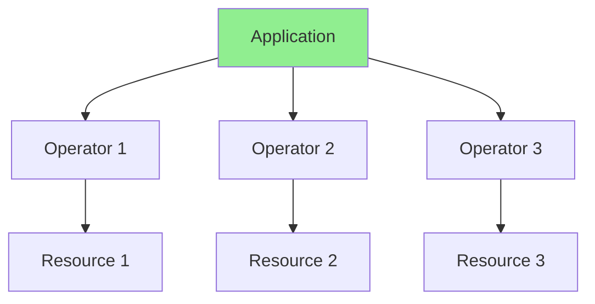
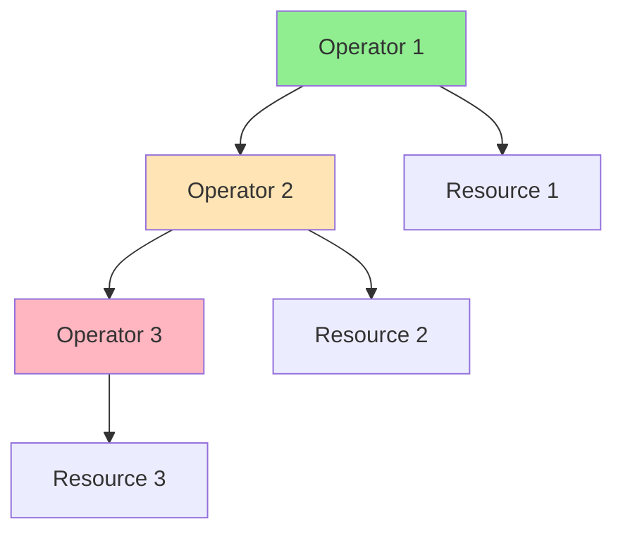
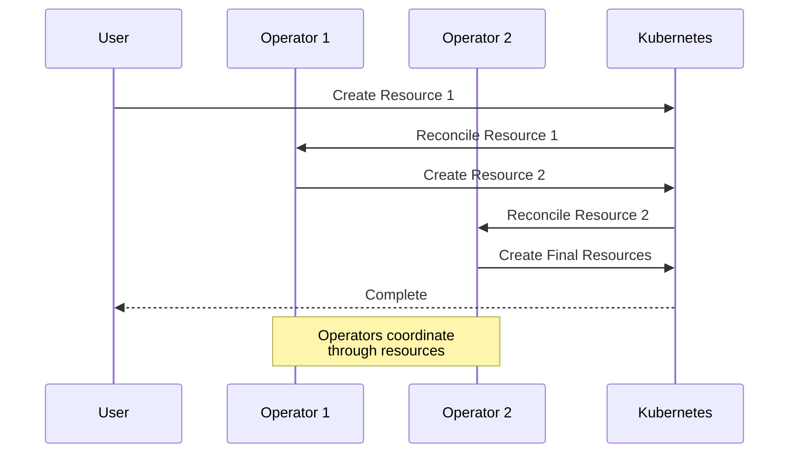
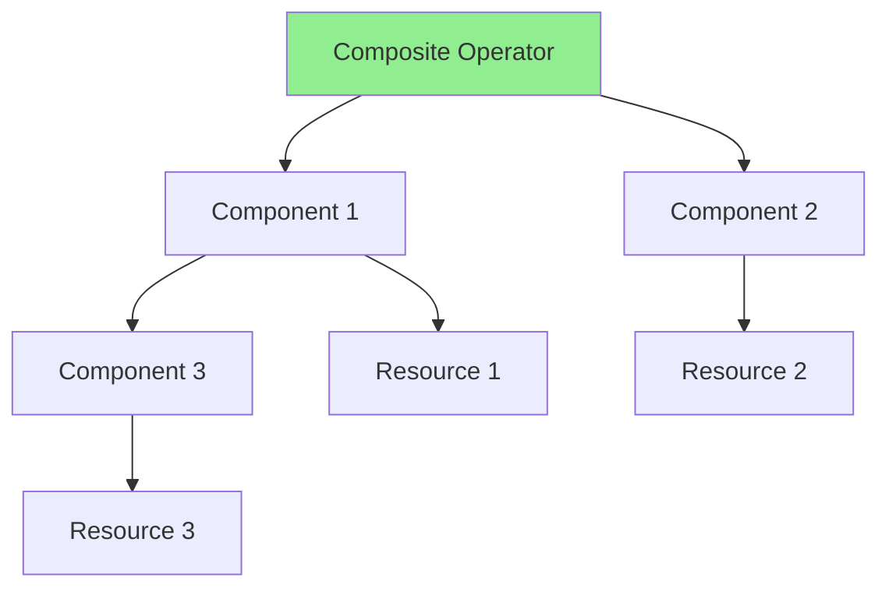

# Урок 8.2: Композиция операторов

**Навигация:** [← Предыдущий: Мультиарендность](01-multi-tenancy.md) | [Обзор модуля](../README.md) | [Далее: Stateful-приложения →](03-stateful-applications.md)

## Введение

Реальные приложения часто требуют совместной работы нескольких операторов. Этот урок охватывает паттерны композиции операторов, управление зависимостями, стратегии координации и то, как создавать операторы, которые хорошо работают с другими.

## Теория: композиция операторов

Композиция операторов позволяет создавать **сложные приложения** путём объединения нескольких операторов.

### Зачем композировать операторы?

**Разделение ответственности:**
- У каждого оператора чёткая зона ответственности
- Оператор базы данных управляет базами данных
- Оператор резервного копирования управляет резервными копиями
- Чёткие границы

**Переиспользуемость:**
- Операторы можно переиспользовать
- Оператор резервного копирования работает с любой базой данных
- Композируйте по необходимости
- Стройте сложные системы из простых частей

**Модульность:**
- Независимая разработка
- Независимое тестирование
- Независимое развёртывание
- Более простое сопровождение

### Паттерны композиции

**Независимые операторы:**
- Без зависимостей
- Работают независимо
- Простая координация
- Легко анализировать

**Зависимые операторы:**
- Один зависит от другого
- Требуют координации
- Порядок имеет значение
- Сложнее

**Составные операторы:**
- Несколько операторов в одном
- Координируются внутренне
- Единое развёртывание
- Более сильная связанность

### Механизмы координации

**Ссылки на ресурсы:**
- Операторы ссылаются на ресурсы друг друга
- Явные зависимости
- Чёткие связи
- Легко понять

**Условия статуса:**
- Операторы общаются через статус
- Проверяют условия перед действием
- Событийно-управляемая координация
- Слабая связанность

**События:**
- Генерируют события Kubernetes
- Другие операторы могут их отслеживать
- Асинхронная координация
- Развязанность (decoupled)

Понимание композиции помогает строить сложные системы из простых операторов.

## Паттерны композиции операторов

### Паттерн 1: независимые операторы



**Характеристики:**
- Операторы работают независимо
- Нет прямых зависимостей
- Каждый управляет своими ресурсами

### Паттерн 2: зависимые операторы



**Характеристики:**
- Операторы зависят друг от друга
- Порядок имеет значение
- Нужна координация

## Управление зависимостями

### Поток зависимостей



### Управление зависимостями

```go
// Operator 1 creates resource that Operator 2 watches
func (r *DatabaseReconciler) Reconcile(ctx context.Context, req ctrl.Request) (ctrl.Result, error) {
    // Create Database
    db := &databasev1.Database{...}
    r.Create(ctx, db)
    
    // Create Backup resource (watched by Backup Operator)
    backup := &backupv1.Backup{
        ObjectMeta: metav1.ObjectMeta{
            Name:      db.Name + "-backup",
            Namespace: db.Namespace,
        },
        Spec: backupv1.BackupSpec{
            DatabaseRef: db.Name,
        },
    }
    r.Create(ctx, backup)
    
    // Backup Operator will reconcile backup
}
```

## Стратегии координации

### Стратегия 1: ссылки на ресурсы

```go
// Database references Backup
type DatabaseSpec struct {
    BackupRef *corev1.LocalObjectReference `json:"backupRef,omitempty"`
}

// Operator checks if backup exists
func (r *DatabaseReconciler) checkBackup(ctx context.Context, db *databasev1.Database) error {
    if db.Spec.BackupRef == nil {
        return nil
    }
    
    backup := &backupv1.Backup{}
    err := r.Get(ctx, client.ObjectKey{
        Name:      db.Spec.BackupRef.Name,
        Namespace: db.Namespace,
    }, backup)
    
    if errors.IsNotFound(err) {
        return fmt.Errorf("backup %s not found", db.Spec.BackupRef.Name)
    }
    
    // Wait for backup to be ready
    if backup.Status.Phase != "Ready" {
        return fmt.Errorf("backup not ready")
    }
    
    return nil
}
```

### Стратегия 2: условия статуса

```go
// Operator 1 sets condition
meta.SetStatusCondition(&db.Status.Conditions, metav1.Condition{
    Type:    "BackupReady",
    Status:  metav1.ConditionTrue,
    Reason:  "BackupCompleted",
    Message: "Backup is ready",
})

// Operator 2 checks condition
backupReady := meta.FindStatusCondition(db.Status.Conditions, "BackupReady")
if backupReady == nil || backupReady.Status != metav1.ConditionTrue {
    // Wait for backup
    return ctrl.Result{RequeueAfter: 10 * time.Second}, nil
}
```

### Стратегия 3: события

```go
// Operator 1 emits event
r.Recorder.Event(db, "Normal", "BackupCreated", "Backup created successfully")

// Operator 2 watches for events
// Can react to events from other operators
```

## Паттерн составного оператора

### Поток составного оператора



### Пример: база данных с резервным копированием

```go
type DatabaseReconciler struct {
    client.Client
    Scheme *runtime.Scheme
    BackupReconciler *BackupReconciler
}

func (r *DatabaseReconciler) Reconcile(ctx context.Context, req ctrl.Request) (ctrl.Result, error) {
    // Reconcile Database
    if err := r.reconcileDatabase(ctx, req); err != nil {
        return ctrl.Result{}, err
    }
    
    // Reconcile Backup (component)
    if err := r.BackupReconciler.Reconcile(ctx, req); err != nil {
        return ctrl.Result{}, err
    }
    
    return ctrl.Result{}, nil
}
```

## Ключевые выводы

- **Композиция операторов** позволяет создавать сложные приложения
- **Независимые операторы** работают раздельно
- **Зависимые операторы** требуют координации
- **Ссылки на ресурсы** связывают операторы
- **Условия статуса** координируют состояние
- **События** обеспечивают коммуникацию
- **Составные операторы** объединяют несколько компонентов

## Что нужно понимать для создания операторов

При композиции операторов:
- По возможности проектируйте для независимости
- Используйте ссылки на ресурсы для зависимостей
- Координируйте через условия статуса
- Генерируйте события для координации
- Аккуратно обрабатывайте сбои зависимостей
- Чётко документируйте зависимости

## Связанная лабораторная работа

- [Лабораторная 8.2: Композиция операторов](../labs/lab-02-operator-composition.md) — практические упражнения для этого урока

## Источники

### Официальная документация
- [Ссылки-владельцы](https://kubernetes.io/docs/concepts/overview/working-with-objects/owners-dependents/)
- [События Kubernetes](https://kubernetes.io/docs/reference/kubernetes-api/cluster-resources/event-v1/)
- [Зависимости ресурсов](https://kubernetes.io/docs/concepts/overview/working-with-objects/owners-dependents/)

### Дополнительное чтение
- **Kubernetes Operators**, Jason Dobies и Joshua Wood — глава 16: Operator Composition
- **Designing Distributed Systems**, Brendan Burns — паттерны композиции
- [Лучшие практики операторов](https://sdk.operatorframework.io/docs/best-practices/)

### Смежные темы
- [Координация контроллеров](https://kubernetes.io/docs/concepts/architecture/controller/#controller-coordination)
- [Событийно-управляемая архитектура](https://en.wikipedia.org/wiki/Event-driven_architecture)
- [Паттерны микросервисов](https://microservices.io/patterns/)

## Дальнейшие шаги

Теперь, когда вы понимаете композицию операторов, давайте изучим управление stateful-приложениями.

**Навигация:** [← Предыдущий: Мультиарендность](01-multi-tenancy.md) | [Обзор модуля](../README.md) | [Далее: Stateful-приложения →](03-stateful-applications.md)
