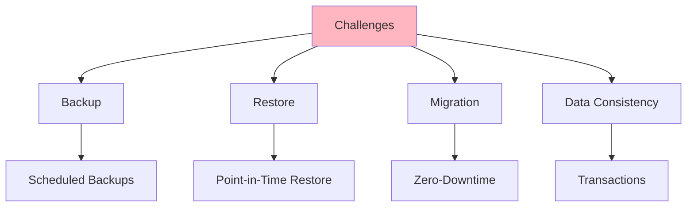
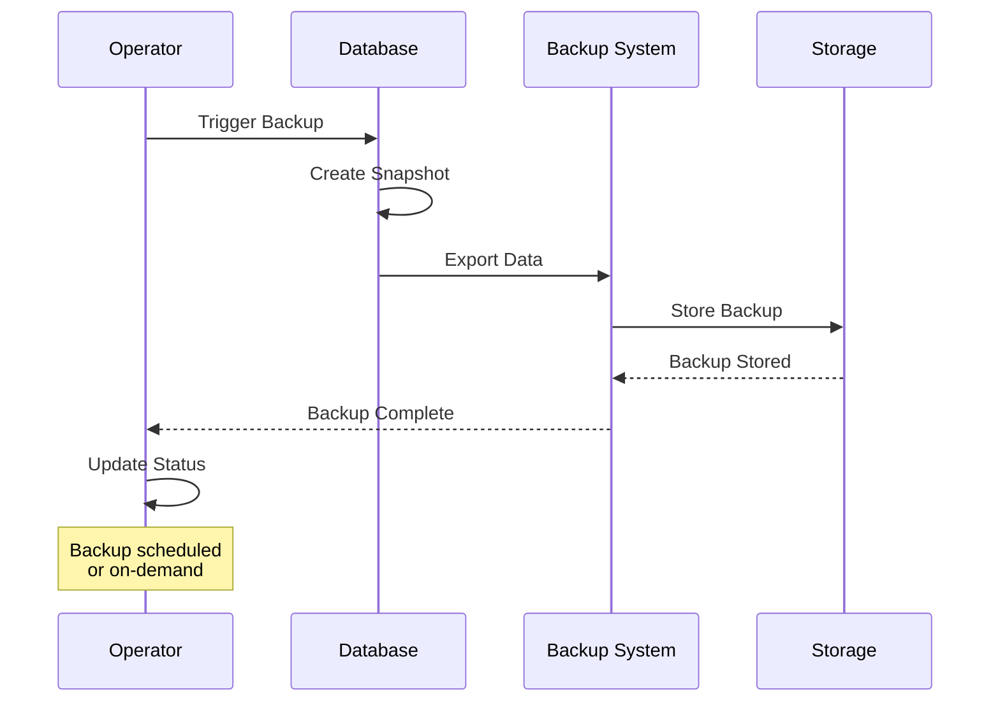
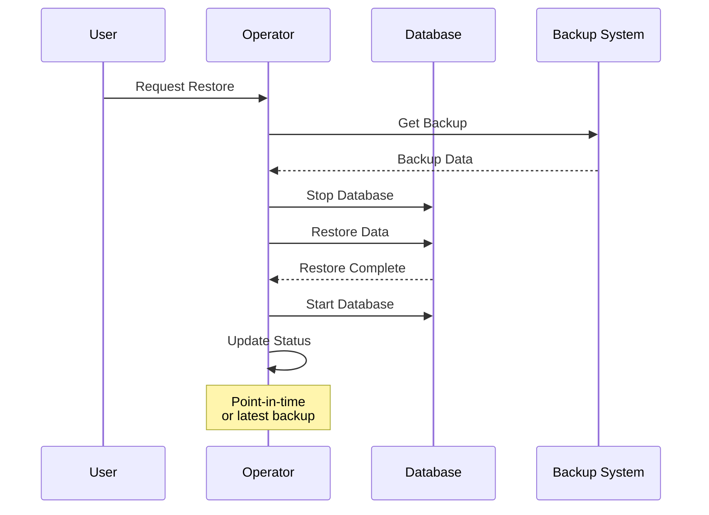
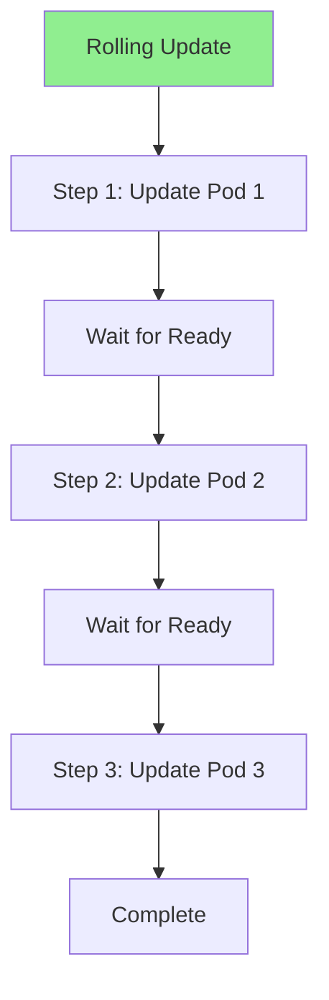
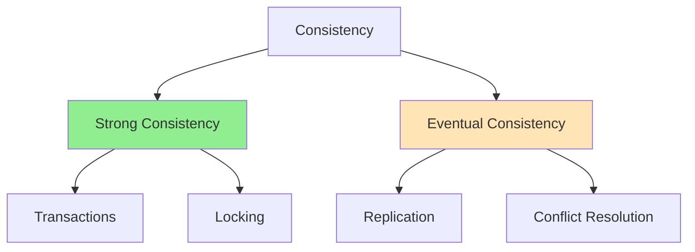

# Урок 8.3: Управление stateful-приложениями

**Навигация:** [← Предыдущий: Композиция операторов](02-operator-composition.md) | [Обзор модуля](../README.md) | [Далее: Практические паттерны →](04-real-world-patterns.md)

## Введение

Stateful-приложения требуют особого обращения: резервное копирование, восстановление, миграции и согласованность данных. Этот урок охватывает паттерны управления stateful-приложениями в операторах, включая резервное копирование/восстановление, скользящие обновления и обеспечение согласованности данных.

## Теория: управление stateful-приложениями

У stateful-приложений есть **персистентные данные**, которыми нужно управлять аккуратно.

### Почему stateful-приложения сложны

**Персистентность данных:**
- Данные должны переживать перезапуски подов
- Данные должны резервироваться
- Данные должны восстанавливаться
- Согласованность данных критична

**Управление жизненным циклом:**
- Сложные процедуры развёртывания
- Упорядоченное создание/удаление подов
- Требования StatefulSet
- Сложности скользящих обновлений

**Операции с данными:**
- Резервное копирование и восстановление
- Миграция данных
- Обновление версий
- Аварийное восстановление

### Характеристики StatefulSet

**Идентичность пода:**
- Стабильная сетевая идентичность
- Стабильное хранилище
- Упорядоченное создание/удаление
- Предсказуемое именование

**Хранилище:**
- Персистентные тома (persistent volumes)
- Хранилище для конкретного пода
- Данные переживают перезапуски подов
- Управление классами хранилищ

**Упорядоченность:**
- Поды создаются по порядку
- Поды удаляются в обратном порядке
- Обеспечивает инициализацию
- Поддерживает stateful-нагрузки

### Резервное копирование и восстановление

**Стратегия резервного копирования:**
- Регулярные резервные копии
- Резервные копии на определённый момент времени (point-in-time)
- Инкрементальные резервные копии
- Валидация резервных копий

**Стратегия восстановления:**
- Восстановление из резервной копии
- Восстановление на определённый момент времени
- Валидация данных
- Возможность отката

**Согласованность:**
- Обеспечение согласованности данных
- Транзакционные операции
- Приостановка (quiesce) перед резервным копированием
- Проверка после восстановления

Понимание stateful-приложений помогает создавать операторы, надёжно управляющие данными.

## Сложности stateful-приложений

### Ключевые сложности



## Паттерны резервного копирования и восстановления

### Процесс резервного копирования



### Реализация резервного копирования

```go
type BackupSpec struct {
    DatabaseRef corev1.LocalObjectReference `json:"databaseRef"`
    Schedule    string                      `json:"schedule,omitempty"` // Cron format
    Retention   int                         `json:"retention,omitempty"` // Days
}

type BackupStatus struct {
    Phase          string    `json:"phase,omitempty"`
    BackupTime     time.Time `json:"backupTime,omitempty"`
    BackupLocation string    `json:"backupLocation,omitempty"`
    Size           string    `json:"size,omitempty"`
}

func (r *BackupReconciler) Reconcile(ctx context.Context, req ctrl.Request) (ctrl.Result, error) {
    backup := &backupv1.Backup{}
    if err := r.Get(ctx, req.NamespacedName, backup); err != nil {
        return ctrl.Result{}, err
    }
    
    // Get Database
    db := &databasev1.Database{}
    err := r.Get(ctx, client.ObjectKey{
        Name:      backup.Spec.DatabaseRef.Name,
        Namespace: backup.Namespace,
    }, db)
    
    if err != nil {
        return ctrl.Result{}, err
    }
    
    // Perform backup
    if err := r.performBackup(ctx, db, backup); err != nil {
        backup.Status.Phase = "Failed"
        r.Status().Update(ctx, backup)
        return ctrl.Result{}, err
    }
    
    backup.Status.Phase = "Completed"
    backup.Status.BackupTime = metav1.Now()
    backup.Status.BackupLocation = r.getBackupLocation(backup)
    
    return ctrl.Result{}, r.Status().Update(ctx, backup)
}
```

## Паттерны восстановления

### Процесс восстановления



### Реализация восстановления

```go
type RestoreSpec struct {
    BackupRef corev1.LocalObjectReference `json:"backupRef"`
    DatabaseRef corev1.LocalObjectReference `json:"databaseRef"`
    PointInTime *time.Time `json:"pointInTime,omitempty"`
}

func (r *RestoreReconciler) Reconcile(ctx context.Context, req ctrl.Request) (ctrl.Result, error) {
    restore := &restorev1.Restore{}
    if err := r.Get(ctx, req.NamespacedName, restore); err != nil {
        return ctrl.Result{}, err
    }
    
    // Get Backup
    backup := &backupv1.Backup{}
    err := r.Get(ctx, client.ObjectKey{
        Name:      restore.Spec.BackupRef.Name,
        Namespace: restore.Namespace,
    }, backup)
    
    if err != nil {
        return ctrl.Result{}, err
    }
    
    // Get Database
    db := &databasev1.Database{}
    err = r.Get(ctx, client.ObjectKey{
        Name:      restore.Spec.DatabaseRef.Name,
        Namespace: restore.Namespace,
    }, db)
    
    // Perform restore
    if err := r.performRestore(ctx, db, backup, restore); err != nil {
        restore.Status.Phase = "Failed"
        r.Status().Update(ctx, restore)
        return ctrl.Result{}, err
    }
    
    restore.Status.Phase = "Completed"
    restore.Status.RestoreTime = metav1.Now()
    
    return ctrl.Result{}, r.Status().Update(ctx, restore)
}
```

## Скользящие обновления (Rolling Updates)

### Стратегия скользящего обновления



### Управление скользящими обновлениями

```go
func (r *DatabaseReconciler) updateStatefulSet(ctx context.Context, db *databasev1.Database) error {
    statefulSet := &appsv1.StatefulSet{}
    err := r.Get(ctx, client.ObjectKey{
        Name:      db.Name,
        Namespace: db.Namespace,
    }, statefulSet)
    
    if err != nil {
        return err
    }
    
    // Check if update needed
    desiredImage := db.Spec.Image
    currentImage := statefulSet.Spec.Template.Spec.Containers[0].Image
    
    if desiredImage != currentImage {
        // Update image
        statefulSet.Spec.Template.Spec.Containers[0].Image = desiredImage
        
        // StatefulSet will perform rolling update automatically
        if err := r.Update(ctx, statefulSet); err != nil {
            return err
        }
        
        // Wait for update to complete
        return r.waitForRollingUpdate(ctx, statefulSet)
    }
    
    return nil
}

func (r *DatabaseReconciler) waitForRollingUpdate(ctx context.Context, ss *appsv1.StatefulSet) error {
    // Wait for all pods to be updated
    return wait.PollImmediate(5*time.Second, 5*time.Minute, func() (bool, error) {
        err := r.Get(ctx, client.ObjectKeyFromObject(ss), ss)
        if err != nil {
            return false, err
        }
        
        // Check if update complete
        return ss.Status.UpdatedReplicas == *ss.Spec.Replicas, nil
    })
}
```

## Согласованность данных

### Гарантии согласованности



### Обеспечение согласованности

```go
func (r *DatabaseReconciler) ensureDataConsistency(ctx context.Context, db *databasev1.Database) error {
    // For StatefulSets, consistency is handled by:
    // 1. Ordered pod creation
    // 2. Persistent volumes
    // 3. Pod identity
    
    // Check if all replicas are in sync
    statefulSet := &appsv1.StatefulSet{}
    err := r.Get(ctx, client.ObjectKey{
        Name:      db.Name,
        Namespace: db.Namespace,
    }, statefulSet)
    
    if err != nil {
        return err
    }
    
    // Verify all replicas are ready and consistent
    if statefulSet.Status.ReadyReplicas != *statefulSet.Spec.Replicas {
        return fmt.Errorf("not all replicas ready")
    }
    
    // Perform consistency check
    return r.performConsistencyCheck(ctx, db)
}
```

## Ключевые выводы

- **Резервные копии** защищают данные от потери
- **Восстановление** возвращает данные из резервных копий
- **Скользящие обновления** обновляют без простоя
- **Согласованность данных** обеспечивает корректность
- **StatefulSet** предоставляют упорядоченные, стабильные поды
- **Персистентные тома** сохраняют данные
- **Восстановление на определённый момент времени** возвращает состояние на конкретный момент

## Что нужно понимать для создания операторов

При управлении stateful-приложениями:
- Реализуйте функциональность резервного копирования
- Поддерживайте операции восстановления
- Аккуратно обрабатывайте скользящие обновления
- Обеспечивайте согласованность данных
- Используйте StatefulSet для stateful-нагрузок
- Задействуйте персистентные тома
- Тестируйте сценарии резервного копирования/восстановления

## Связанная лабораторная работа

- [Лабораторная 8.3: Управление stateful-приложениями](../labs/lab-03-stateful-applications.md) — практические упражнения для этого урока

## Источники

### Официальная документация
- [StatefulSet](https://kubernetes.io/docs/concepts/workloads/controllers/statefulset/)
- [Персистентные тома](https://kubernetes.io/docs/concepts/storage/persistent-volumes/)
- [Снимки томов (Volume Snapshots)](https://kubernetes.io/docs/concepts/storage/volume-snapshots/)

### Дополнительное чтение
- **Kubernetes: Up and Running**, Kelsey Hightower, Brendan Burns и Joe Beda — глава 7: StatefulSets
- **Kubernetes Operators**, Jason Dobies и Joshua Wood — глава 17: Stateful Applications
- [Паттерны StatefulSet](https://kubernetes.io/docs/tutorials/stateful-application/)

### Смежные темы
- [Лучшие практики StatefulSet](https://kubernetes.io/docs/concepts/workloads/controllers/statefulset/#limitations)
- [Заявки на персистентные тома (PVC)](https://kubernetes.io/docs/concepts/storage/persistent-volumes/)
- [Стратегии резервного копирования данных](https://kubernetes.io/docs/concepts/storage/volume-snapshots/)

## Дальнейшие шаги

Теперь, когда вы понимаете stateful-приложения, давайте изучим практические паттерны и лучшие практики.

**Навигация:** [← Предыдущий: Композиция операторов](02-operator-composition.md) | [Обзор модуля](../README.md) | [Далее: Практические паттерны →](04-real-world-patterns.md)
