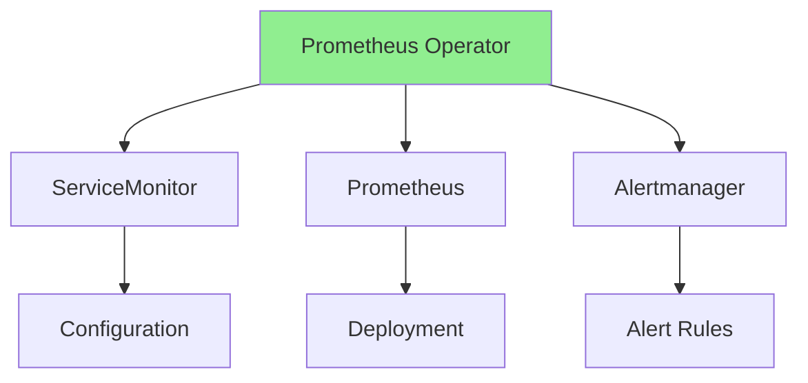
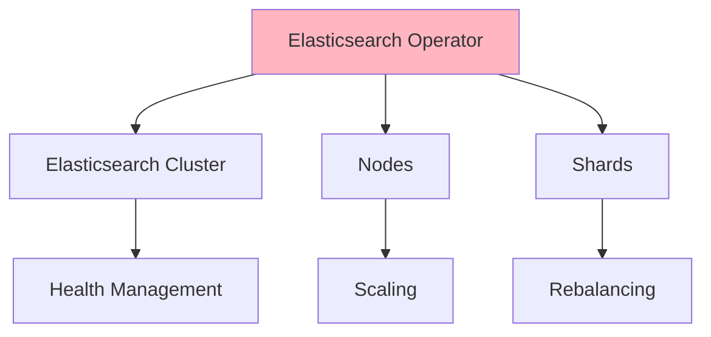
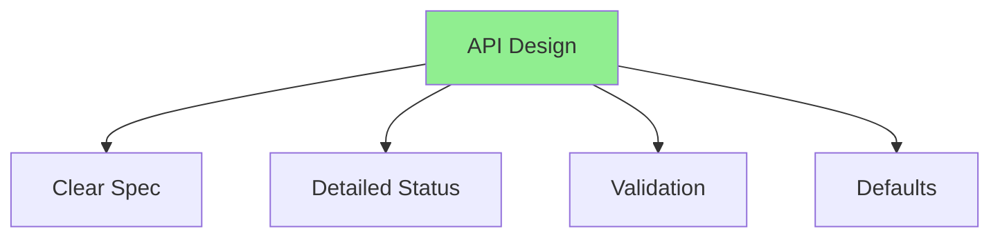
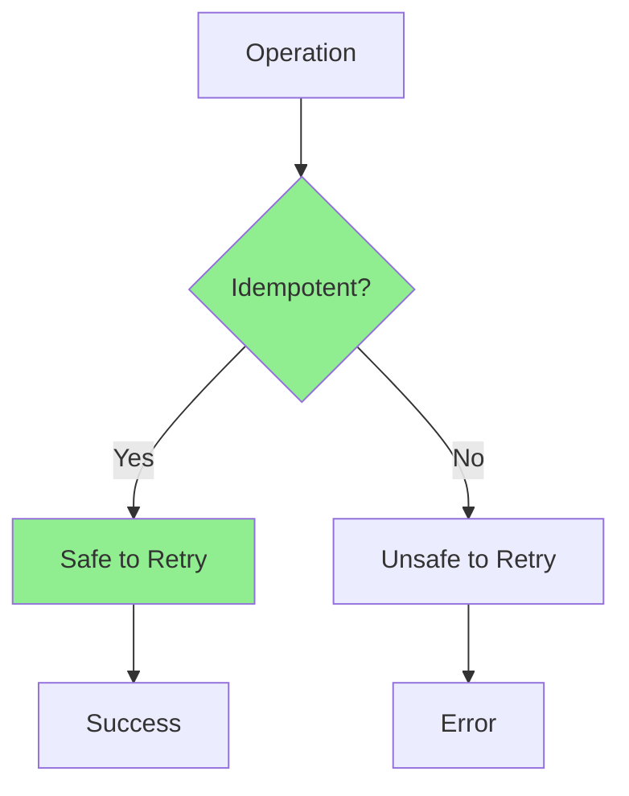
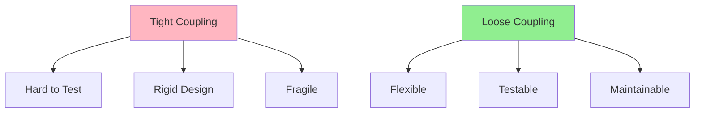
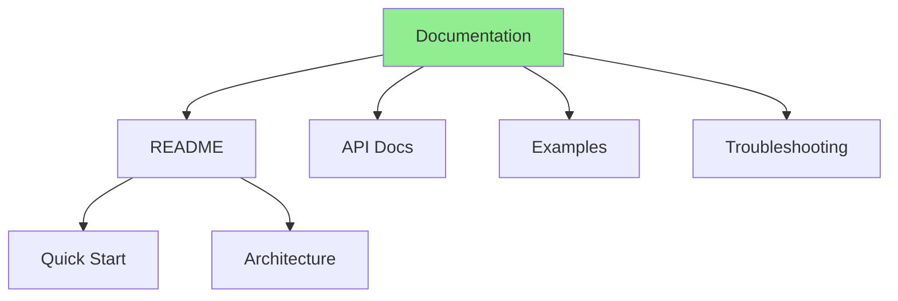
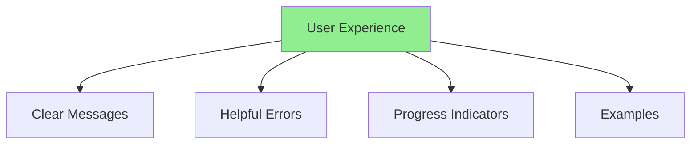

# Урок 8.4: Практические паттерны и лучшие практики

**Навигация:** [← Предыдущий: Stateful-приложения](03-stateful-applications.md) | [Обзор модуля](../README.md)

## Введение

Этот финальный урок рассматривает практические паттерны операторов, анализируя популярные операторы, выявляя лучшие практики и учась на распространённых антипаттернах. Вы поймёте, как создаются продакшен-операторы и что делает их успешными.

## Теория: практические паттерны

Обучение на **успешных операторах** помогает создавать более качественные операторы.

### Зачем изучать реальные операторы?

**Проверенные паттерны:**
- Увидеть, что работает в продакшене
- Учиться на опыте
- Избегать распространённых ошибок
- Перенимать лучшие практики

**Архитектурные инсайты:**
- Понять проектные решения
- Увидеть сложные паттерны в действии
- Изучить стратегии масштабирования
- Понять компромиссы

**Лучшие практики:**
- Отраслевые стандарты
- Консенсус сообщества
- Проверенные в бою подходы
- Готовые к продакшену паттерны

### Распространённые паттерны

**Дизайн API:**
- Понятные, интуитивные API
- Разумные значения по умолчанию
- Хорошая валидация
- Исчерпывающий статус

**Обработка ошибок:**
- Плавная деградация
- Понятные сообщения об ошибках
- Стратегии повторов
- Восстановление после сбоев

**Наблюдаемость:**
- Исчерпывающее логирование
- Богатые метрики
- Полезные события
- Хорошая документация

### Антипаттерны, которых следует избегать

**Сильная связанность (Tight Coupling):**
- Жёсткие зависимости
- Трудно тестировать
- Трудно сопровождать
- Избегайте этого

**Игнорирование ошибок:**
- Тихие сбои
- Отсутствие обработки ошибок
- Плохой пользовательский опыт
- Избегайте этого

**Блокирующие операции:**
- Синхронные ожидания
- Блокируют согласование
- Плохая производительность
- Избегайте этого

Понимание практических паттернов помогает создавать готовые к продакшену операторы.

## Паттерны популярных операторов

### Паттерн Prometheus Operator



**Ключевые паттерны:**
- Декларативная конфигурация
- Обнаружение сервисов
- Управление несколькими ресурсами
- Валидация конфигурации

### Паттерн Elasticsearch Operator



**Ключевые паттерны:**
- Управление кластером
- Жизненный цикл узлов
- Шардирование данных
- Мониторинг здоровья

## Лучшие практики

### Практика 1: понятный дизайн API



**Рекомендации:**
- Используйте понятные, описательные имена полей
- Предоставляйте разумные значения по умолчанию
- Валидируйте на уровне API
- Документируйте все поля

### Практика 2: исчерпывающий статус

```go
type DatabaseStatus struct {
    // Conditions for state tracking
    Conditions []metav1.Condition `json:"conditions,omitempty"`
    
    // Phase for simple state
    Phase string `json:"phase,omitempty"`
    
    // Detailed status
    ReadyReplicas int32  `json:"readyReplicas,omitempty"`
    TotalReplicas int32  `json:"totalReplicas,omitempty"`
    Endpoint      string `json:"endpoint,omitempty"`
    
    // Observed generation
    ObservedGeneration int64 `json:"observedGeneration,omitempty"`
}
```

### Практика 3: идемпотентные операции



**Все операции должны быть идемпотентными:**
- Создание ресурсов: сначала проверьте существование
- Обновление ресурсов: сравните перед обновлением
- Удаление ресурсов: аккуратно обрабатывайте «не найдено»

## Распространённые антипаттерны

### Антипаттерн 1: сильная связанность



**Избегайте:**
- Жёстко закодированных зависимостей
- Прямых вызовов API к внешним сервисам
- Сильной связанности между компонентами

### Антипаттерн 2: игнорирование ошибок

```go
// BAD: Ignoring errors
r.Create(ctx, resource)  // Error ignored!

// GOOD: Handle errors
if err := r.Create(ctx, resource); err != nil {
    if !errors.IsAlreadyExists(err) {
        return ctrl.Result{}, err
    }
}
```

### Антипаттерн 3: блокирующие операции

```go
// BAD: Blocking operation
time.Sleep(5 * time.Minute)

// GOOD: Requeue with delay
return ctrl.Result{RequeueAfter: 5 * time.Minute}, nil
```

## Лучшие практики документирования

### Структура документации



### Необходимая документация

1. **README.md**
   - Руководство по быстрому старту
   - Обзор архитектуры
   - Инструкции по установке

2. **Документация API**
   - Описания полей
   - Примеры ресурсов
   - Правила валидации

3. **Примеры**
   - Распространённые сценарии использования
   - Продвинутые сценарии
   - Лучшие практики

4. **Устранение неполадок**
   - Распространённые проблемы
   - Руководства по отладке
   - FAQ

## Пользовательский опыт

### Принципы UX



### Сообщения об ошибках

```go
// BAD: Generic error
return fmt.Errorf("error")

// GOOD: Specific, actionable error
return fmt.Errorf("spec.storage.size: must be >= 10Gi for replicas > 5, got %s", db.Spec.Storage.Size)
```

## Ключевые выводы

- **Изучайте популярные операторы**, чтобы освоить паттерны
- **Следуйте лучшим практикам** ради сопровождаемости
- **Избегайте антипаттернов**, вызывающих проблемы
- **Тщательно документируйте** для пользователей
- **Проектируйте с учётом UX**, с понятными сообщениями
- **Делайте операции идемпотентными** ради надёжности
- **Предоставляйте исчерпывающий статус** для наблюдаемости
- **Тщательно тестируйте** перед релизом

## Что нужно понимать для создания операторов

При создании продакшен-операторов:
- Изучайте успешные операторы
- Следуйте устоявшимся паттернам
- Избегайте распространённых антипаттернов
- Документируйте исчерпывающе
- Фокусируйтесь на пользовательском опыте
- Делайте всё идемпотентным
- Предоставляйте подробный статус
- Тестируйте все сценарии

## Связанная лабораторная работа

- [Лабораторная 8.4: Финальный проект](../labs/lab-04-final-project.md) — создайте полноценный оператор

## Источники

### Официальная документация
- [Лучшие практики Kubernetes](https://kubernetes.io/docs/concepts/)
- [Лучшие практики операторов](https://sdk.operatorframework.io/docs/best-practices/)
- [Соглашения об API](https://github.com/kubernetes/community/blob/master/contributors/devel/sig-architecture/api-conventions.md)

### Дополнительное чтение
- **Kubernetes Operators**, Jason Dobies и Joshua Wood — полный справочник
- **Programming Kubernetes**, Michael Hausenblas и Stefan Schimanski — продвинутые паттерны
- [Prometheus Operator](https://github.com/prometheus-operator/prometheus-operator) — пример оператора
- [Elasticsearch Operator](https://github.com/elastic/cloud-on-k8s) — пример оператора

### Смежные темы
- [Operator Framework](https://operatorframework.io/)
- [OperatorHub](https://operatorhub.io/) — операторы сообщества
- [Рабочая группа CNCF по операторам](https://github.com/cncf/tag-app-delivery/blob/main/operator-wg/README.md)

## Дальнейшие шаги

Поздравляем! Вы завершили весь курс! Теперь у вас есть знания и навыки для создания готовых к продакшену операторов Kubernetes.

**Навигация:** [← Предыдущий: Stateful-приложения](03-stateful-applications.md) | [Обзор модуля](../README.md) | [Обзор курса](../../README.md)
