# Модули курса
{: .fs-9 }

Курс состоит из 8 модулей, каждый из которых опирается на предыдущий.
{: .fs-6 .fw-300 }

---

## Обзор модулей

| Модуль | Тема | Продолжительность |
|:-------|:------|:---------|
| [Модуль 1]({{ site.baseurl }}/module-01/) | Глубокое погружение в архитектуру Kubernetes | 5–6 часов |
| [Модуль 2]({{ site.baseurl }}/module-02/) | Введение в операторы | 5–6 часов |
| [Модуль 3]({{ site.baseurl }}/module-03/) | Создание кастомных контроллеров | 6–7 часов |
| [Модуль 4]({{ site.baseurl }}/module-04/) | Продвинутые паттерны согласования | 6–7 часов |
| [Модуль 5]({{ site.baseurl }}/module-05/) | Вебхуки и контроль допуска | 5–6 часов |
| [Модуль 6]({{ site.baseurl }}/module-06/) | Тестирование и отладка | 5–6 часов |
| [Модуль 7]({{ site.baseurl }}/module-07/) | Подготовка к продакшену | 5–6 часов |
| [Модуль 8]({{ site.baseurl }}/module-08/) | Продвинутые темы и практические паттерны | 5–6 часов |

---

## Траектория обучения

```mermaid
graph LR
    M1[Module 1<br/>Architecture] --> M2[Module 2<br/>Operators Intro]
    M2 --> M3[Module 3<br/>Controllers]
    M3 --> M4[Module 4<br/>Advanced Patterns]
    M4 --> M5[Module 5<br/>Webhooks]
    M5 --> M6[Module 6<br/>Testing]
    M6 --> M7[Module 7<br/>Production]
    M7 --> M8[Module 8<br/>Advanced Topics]
    
    style M1 fill:#dbeafe,stroke:#2563eb,color:#1e40af
    style M2 fill:#dbeafe,stroke:#2563eb,color:#1e40af
    style M3 fill:#dbeafe,stroke:#2563eb,color:#1e40af
    style M4 fill:#dbeafe,stroke:#2563eb,color:#1e40af
    style M5 fill:#dbeafe,stroke:#2563eb,color:#1e40af
    style M6 fill:#dbeafe,stroke:#2563eb,color:#1e40af
    style M7 fill:#dbeafe,stroke:#2563eb,color:#1e40af
    style M8 fill:#dbeafe,stroke:#2563eb,color:#1e40af
```

---

## Подробнее о модулях

### [Модуль 1: Глубокое погружение в архитектуру Kubernetes]({{ site.baseurl }}/module-01/)

Разберитесь, как Kubernetes устроен изнутри.

- Компоненты управляющего слоя (control plane) и их взаимодействие
- Механизмы API (API machinery) и принципы их работы
- Паттерн контроллера и циклы согласования (reconciliation loops)
- Определения пользовательских ресурсов (CRD)

---

### [Модуль 2: Введение в операторы]({{ site.baseurl }}/module-02/)

Изучите паттерн оператора и создайте свой первый оператор.

- Что такое операторы и когда их использовать
- Основы Kubebuilder
- Настройка среды разработки
- Создание вашего первого оператора

---

### [Модуль 3: Создание кастомных контроллеров]({{ site.baseurl }}/module-03/)

Освойте библиотеку controller-runtime.

- Глубокое погружение в controller-runtime
- Проектирование вашего API
- Логика согласования (reconciliation)
- Операции client-go

---

### [Модуль 4: Продвинутые паттерны согласования]({{ site.baseurl }}/module-04/)

Обрабатывайте сложные сценарии с помощью продвинутых паттернов.

- Условия (conditions) и управление статусом
- Финализаторы и очистка
- Отслеживание и индексирование
- Конечные автоматы и продвинутые паттерны

---

### [Модуль 5: Вебхуки и контроль допуска]({{ site.baseurl }}/module-05/)

Реализуйте вебхуки контроля допуска (admission webhooks).

- Основы контроля допуска (admission control)
- Валидирующие вебхуки
- Мутирующие вебхуки
- Развёртывание вебхуков

---

### [Модуль 6: Тестирование и отладка]({{ site.baseurl }}/module-06/)

Тестируйте и отлаживайте свои операторы.

- Основы тестирования
- Модульное тестирование с envtest
- Интеграционное тестирование
- Отладка и наблюдаемость

---

### [Модуль 7: Подготовка к продакшену]({{ site.baseurl }}/module-07/)

Подготовьте свой оператор к продакшену.

- Упаковка и распространение
- RBAC и безопасность
- Высокая доступность
- Производительность и масштабируемость

---

### [Модуль 8: Продвинутые темы и практические паттерны]({{ site.baseurl }}/module-08/)

Освойте продвинутые паттерны операторов.

- Мультиарендность и изоляция пространств имён
- Композиция операторов
- Управление stateful-приложениями
- Практические паттерны и лучшие практики

---

{: .note }
Каждый модуль включает уроки, практические лабораторные работы и полные решения.
